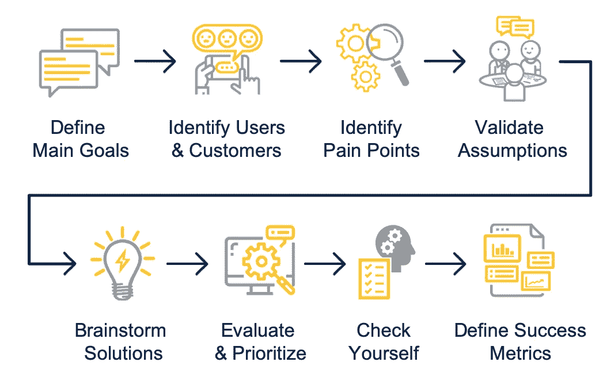
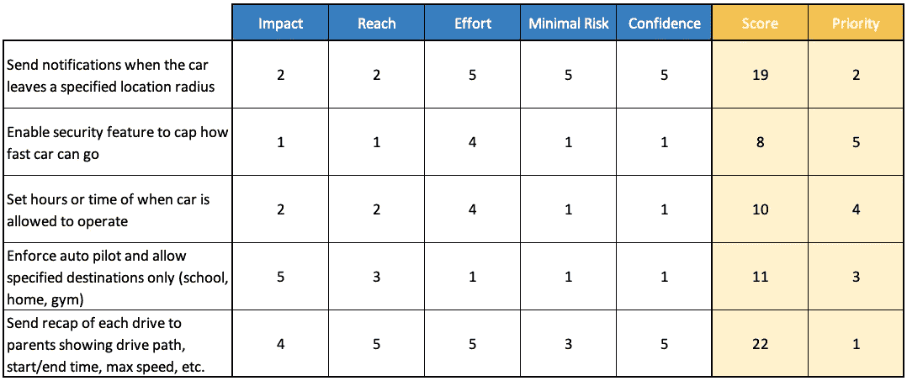

# 产品管理 101:设计更好产品的 8 个步骤

> 原文：<https://medium.com/walmartglobaltech/product-management-101-8-steps-to-design-better-products-b3a4436da27b?source=collection_archive---------0----------------------->

## 学习设计产品的基本步骤，我将带您通过一个“打造更好的汽车”的示例。

Photo by [Evgeny Tchebotarev](https://unsplash.com/@ev25?utm_source=medium&utm_medium=referral) on [Unsplash](https://unsplash.com?utm_source=medium&utm_medium=referral)

如果你被要求制造一辆“更好”的汽车，你会从哪里开始？有些人可能会开始集思广益的新功能，如增压发动机，更大的轮胎，增加备份相机等。但更好的 T1 到底意味着什么？这是否意味着更高的汽油效率？增加更多产能？让它更快？上市？

如果不了解你的产品设计目标，也不把这些目标和用户的痛点对应起来，你最终可能会做出一辆配备了巨型卡车轮胎的声控 800 马力微型面包车……那会飞！虽然听起来很酷，但用户真正想要的只是更好的 T2(T3)座位。好了，受够了我夸张的假设性想象——让我们通过 8 个步骤来设计更好的产品。

8 Steps to Design Better Products

# 1.确定产品设计的主要目标

那么 *better* 到底是什么意思呢？提前定义主要目标有助于你更好地理解“T7”到底是什么意思，让你专注于“T8”为什么要设计“T9”。一般有 4 类产品目标:

1.  **获取:**获取客户/用户
    *例如活跃用户数量、好友推荐百分比、签约数量*
2.  **参与度/活动度:**吸引客户积极使用功能和/或对其进行推广
    *例如:社交媒体提及次数、使用功能的用户百分比、完成工作流的用户数量*
3.  **挽留:**留住现有客户或让他们购买/升级您的产品
    *例如转化率、流失率*
4.  **货币化:**赚钱或省钱
    *如利润率、收入、增长、客户获得成本*

很多时候，你会同时实现多个目标；理解这些目标并确定其优先次序将有助于取得短期的胜利。随着时间的推移，您的优先级可能会根据公司的生命周期和业务需求而变化。

Tesla Model 3 — a high volume, lower-cost product. Photo by [Charlie Deets](https://unsplash.com/@charliedeets?utm_source=medium&utm_medium=referral).

例如，在特斯拉的早期阶段，他们就将**参与度**目标作为推动电动汽车市场普及的优先目标。他们推出了一款低销量、高成本的产品 [Roadster](https://en.wikipedia.org/wiki/Tesla_Roadster_(2008)) ，向消费者证明其系列和性能潜力。在向市场证明后，他们现在可以专注于**货币化**目标**和**，转向高产量、低成本的*产品( [Model 3](https://www.tesla.com/model3) )。*

# 2.确定用户和客户

了解**世卫组织**你的用户和顾客将为**你应该建立什么**奠定基础。让我们继续汽车的例子。

汽车是司机操作的，但使用者只有司机吗？你考虑过乘客吗？维修技师保养汽车怎么样？重要的是要考虑用户如何与产品交互，以充分发挥用户角色的潜力。但是不要止步于此…您可以继续细化这些角色以获得更大的粒度。

驾驶员的需求与青少年、父母、老人或残疾人有何不同？儿童与成人乘客的对比如何？还是新手 vs 专业服务技师？最后，谁是客户？用户和客户不都是一样的吗？嗯，不一定。我以前在美国国防部(DoD)工作时，他们为员工提供政府所有的车辆，供他们开车去参加客户会议。在这种情况下，美国国防部是客户，雇员是用户。

你可以想象在你的产品设计中，所有这些人物角色会有完全不同的目标和需要解决的痛点。

# 3.确定棘手问题以建立用例

产品设计中的一个常见错误是构建一个具有*超酷*功能的解决方案——然后找到它所解决的问题。你可能很幸运，但在大多数情况下，你的产品会失败。识别用户痛点将帮助你建立最重要的*用例来解决。这是换位思考的时候，想想**为什么**用户会想要使用该产品或功能。*

Identify user pain points. Photo by [Sebastian Herrmann](https://unsplash.com/@officestock?utm_source=medium&utm_medium=referral).

为了继续我们的汽车设计示例，假设我们进一步细化了第 1 步和第 2 步的主要目标:

*设计更好的汽车，为父母增加留存和参与度。*

父母可能会遇到的一些棘手问题有:

*   安装汽车座椅
*   装载婴儿车
*   确保孩子们坐好
*   让孩子们在整个旅程中保持冷静

既然我们的主要目标是为父母设计，那是否意味着他们是唯一的用户？绝对不行！父母也为他们的孩子(用户)买车(客户)，这将有一系列不同的痛点:

*   检查汽车对儿童是否安全
*   防止青少年司机鲁莽驾驶(兜风)
*   在他们驾驶时安全联系他们的问题

同样，总是试着考虑不同的用户角色，以及它们如何与你的总体目标保持一致。

# 4.验证用户难点和假设

如果你要从这个博客中拿走一样东西，拿走这个:

> 无论你花多少时间考虑用户和他们的痛点，你都不是用户！

仅仅列出痛点是不够的——你必须检查你的假设是否正确，唯一的方法是直接倾听你的用户。这里有一些方法可以做到这一点:

*   开展用户焦点小组/验证访谈
*   阅读当前解决方案的评论或公共聊天组(例如，社交媒体、Reddit 等)。)
*   和你的销售团队谈谈
*   发出调查

*以下是* [*9 条更好的客户确认面试技巧*](https://www.productplan.com/customer-validation-interviews/) *。*

在考虑构建什么之前，请确保您已经准确地捕获了用户的需求并确定了它们的优先级，这让您有了高度的信心。

# 5.集体讨论潜在解决方案

这才是有趣的部分——想出一些点子来解决你*验证过的*用户痛点。拿出你的便利贴，召集部队，开始头脑风暴。目的是想出你能建造什么，而不是回答你将如何建造。

Brainstorming. Photo by [You X Ventures](https://unsplash.com/@youxventures?utm_source=medium&utm_medium=referral).

这里我不会详述太多，但我建议大家对所有的想法都保持开放的心态——不管听起来有多疯狂。关键是要让你的精力充沛起来，开始和你的团队对话。你能收集和分享的想法越多，你的团队中产生的想法就越多。最好的解决方案是那些能够同时解决多个使用情形和痛点的解决方案—所以一定要努力做到一石二鸟。让我们针对列出的痛点集思广益一些解决方案:

*防止青少年驾驶员鲁莽驾驶(驾驶游戏)*

*   当汽车离开指定的位置半径时发送通知
*   启用安全功能以限制汽车行驶速度
*   设定允许汽车运行的小时数或时间
*   强制执行自动驾驶并仅允许指定目的地(学校、家庭、健身房)
*   向上级发送每个驱动器的摘要，显示驱动器路径、开始/结束时间、最大速度等。

# 6.评估解决方案并确定其优先级

下一步是对你的一批想法进行组织、评估和优先排序。首先确定你的痛点，然后着手解决问题。确定列表优先级时要考虑的事项包括:

*   对用户的影响
*   用户范围
*   实施成本/时间
*   成功信心
*   风险/进入壁垒

优先排序的方法有很多，但我更喜欢的是[加权评分模型](https://280group.com/product-management-blog/product-roadmap-prioritization-weighted-scoring-kano-model/)。以下是头脑风暴解决方案的记分卡外观。

Example Scorecard for Prioritization

# 7.检查一下自己——你是否仍然与目标一致？

产品管理是一个反复的过程，最好总是停下来，检查您是否仍然与已确定的目标保持一致。在你检查自己之后，你可能已经偏离了最初的目标，并且不得不倒退几步。这是过程的一部分，这样做没有错。

基于上面的记分卡，我们确定了解决方案的优先顺序是

向家长发送每次驾驶的摘要，显示驾驶路径、开始/结束时间、最大速度等。

思考——这一解决方案是否符合我们的目标，即*设计更好的汽车，以提高父母的忠诚度和参与度？*以下是该功能如何实现每个目标的一些潜在示例:

## 保留

*   家长可以升级或订阅这一高级功能
*   阻止父母购买具有更安全解决方案的不同汽车

## 约会

*   父母和孩子可以通过社交媒体分享他们的驾车经历(例如，分享一次长途旅行/假期)
*   父母可以跟踪他们孩子的日常驾驶和目的地
*   父母可以通过获取维护信息(如油位、油位、刹车寿命、轮胎压力等)来跟踪汽车的健康状况。)

请记住，最好的解决方案是那些能够同时解决多个使用案例和痛点的解决方案。最后一个**约定**的例子实际上解决了我们发现的另一个痛点:*检查汽车对儿童是否安全。*

根据我们的分析，这个特定的解决方案表明，我们不仅实现了我们的保留和参与目标，而且解决了多个棘手问题，使其成为一个可行的解决方案。

# 8.定义成功指标

如果你没有东西可以衡量*，你怎么知道你的产品设计是否*更好*？*定义指标将使您与目标保持一致，为您提供一条衡量长期改进的途径，并表明产品是否成功。

至此，你应该知道什么对你的产品是重要的，什么应该被衡量。使用我们在步骤 7 中创建的列表，我们可以为**保留**和**参与**目标创建指标。

Define success metrics. Photo by [Stephen Dawson](https://unsplash.com/@srd844?utm_source=medium&utm_medium=referral).

## 保留

*   使用高级功能的转换率
*   取消高级功能的家长流失率
*   父母转向竞争对手的流失率
*   购买一辆以上汽车的客户百分比

## 约会

*   每天的社交媒体分享次数
*   旅行信息的每日活跃用户数
*   维护信息的每日活跃用户数
*   每月安排维护预约的用户数量

# **关键要点**

完成产品设计的这 8 个步骤后，你就可以开始产品开发了。尽早理解产品的目标将为构建什么以及如何衡量成功铺平道路。记住，永远要想到谁是用户和客户，你在为他们解决什么问题。你不是用户，你必须通过直接聆听来验证你的假设。集思广益疯狂的想法，并优先考虑你应该首先追求的解决方案。产品管理是一个迭代的过程——总是后退几步，检查你是否仍然在实现目标的正确道路上。最后，通过利用与这些目标一致的指标来定义成功是什么样的。

你怎么看待这 8 个步骤？你用过什么方法来设计一个产品？有什么具体的步骤需要我更详细地讲解吗？请在下面的评论中告诉我。👇🏼

# 你觉得这有用吗？请大家推荐或分享，随意点击拍手键。👏🏻关注我以后的帖子。