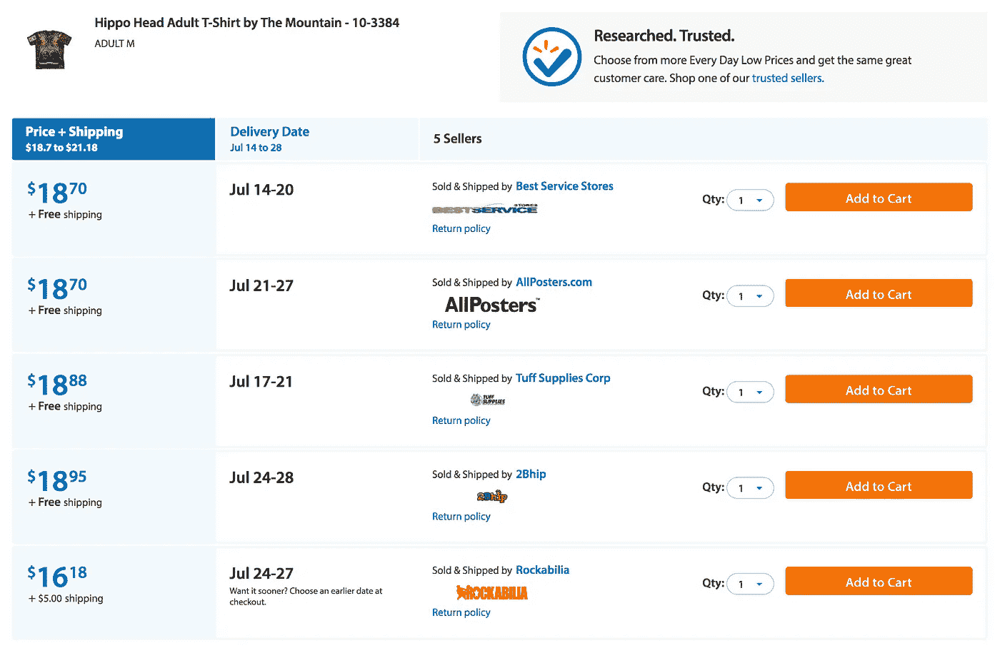

# 使用深度学习的电子商务中的产品匹配

> 原文：<https://medium.com/walmartglobaltech/product-matching-in-ecommerce-4f19b6aebaca?source=collection_archive---------0----------------------->

Walmart.com 是一个拥有数亿产品和数千卖家的市场。给定一个希望在 Walmart.com 上提供新产品的卖家，我们需要确定我们的目录中是否已经包含该产品。如果我们不这样做，那么当用户在我们的网站上搜索该产品时，他们可能会在搜索结果中看到重复的内容，这不是一个理想的用户体验。因此，我们需要形成由不同卖家出售的相同项目组如下。

Seller choice page for a sample item

另一方面，我们需要精确地创建组，并确保它们包含不同卖家出售的相同产品。一旦形成一个组，它就由一个项目页面来表示，在项目页面上只有一个标题、一个描述和一个价格。尽管客户可以选择其他卖家，并在如上所示的卖家选择页面上查看他们的价格，但单个卖家的产品内容不会显示在该页面上。因此，如果组不是同质的，单个卖家的产品可能与项目页面上描述的不同，这是不可接受的。

# **使用通用标识符对产品进行分组**

有通用标识符，如 [UPC](https://en.wikipedia.org/wiki/Universal_Product_Code) 、 [GTIN](https://en.wikipedia.org/wiki/Global_Trade_Item_Number) 、 [ISBN](https://en.wikipedia.org/wiki/International_Standard_Book_Number) 等，可用于识别相同的产品。然而，虽然这在大多数情况下提供了一个很好的分组，但在少数情况下，我们发现传入数据中的通用标识符信息是不正确的。在这种情况下，仅依赖标识符会导致不正确的分组。

例如，组成一个由同一产品的新版本和翻新版本组成的组，或将 16gb 的 iPhone 6s 报价与 32gb 的合并。现在商品页面只能显示一个标题和一个价格。因此，在最后一个例子中，我们可能会以标题显示 16gb 的 iPhone 与 32gb 的价格结束，在这种情况下，对该产品的需求将受到高价格的影响。相反，如果标题以 16gb 的价格显示 32gb iPhone 的信息，交易可能会迅速传播开来，我们可能会以低价获得数千份产品订单(价值数百万美元的收入),导致重大损失。这两种情况都是不可取的。因此，我们需要利用通用标识符以及其他产品内容来做出最终的匹配决策。在我们的解决方案中，我们使用我们认为最可靠的产品信息——标题、描述、图片和价格来做出匹配决策。

# 利用多个数据源

识别相同的产品对于构建最终的商品页面也很重要。产品可以根据其特征来描述，如品牌、颜色、尺寸等。为了使卖家更容易装载他们的物品，大多数产品功能不是强制卖家提供的。因此，我们发现不同的卖家可能会在其产品提要中提供不同的功能。通过利用同一产品的不同信息来源，我们可以增加商品页面上产品规格的覆盖范围。

Sample product specifications on an item page

# 挑战

*   如上所述，基于通用标识符的分组在很大程度上是可行的，但如果不可行，可能会对客户体验和收入产生重大影响。不匹配的低发生率使得很难获得大量匹配和不匹配项目对的标记数据，因为随机抽样将产生大多数正确匹配的组。随机选择两个不同的物品作为不匹配的物品对也不完全有效，因为在许多情况下，除了一个关键属性(例如，条件、存储大小、颜色等)之外，不匹配的物品几乎是相同的。
*   匹配产品的标题可能不相同，但包含语义相似的标记。另一方面，不匹配的产品可能在单个属性上不同，因此它们相应的标题可能相差一个字符(例如 6 包可乐与 8 包可乐)。
*   传入的属性数据可能丢失或有噪声。
*   相同的产品可能有也可能没有相同/相似的主映像。
*   高价格差异可能是不匹配的一个强有力的指标，但其本身很少是决定性的，因为相同的产品在不同的卖家之间可能有非常不同的价格，而某些类型的不匹配产品(例如不同的颜色或运动队品牌)可能仍然有非常接近或相等的价格。

# 方法

我们提出一种方法，利用我们认为最可靠的产品信息——标题、描述、图片和价格，以便做出匹配的决策。该系统由几个组件组成，根据具体的使用情况，可以利用这些组件中的一些或全部。

*   **标题相似度**:给定一对产品标题，量化它们的相似程度。
*   **图像相似度**:给定一对产品图像，量化它们的相似程度。
*   **属性提取/检测**:从每个产品的可用数据中识别品牌、状况、颜色、型号等关键属性，并测量属性值的差异。
*   **价格异常值识别**:给定一个产品的一组报价及其对应的价格，识别一个传入的报价价格是否是这个价格分布中的异常值。

我们在下面描述每一个部分。

## 标题相似度

让我们从一个有 5 个不同卖家报价的示例产品开始。我们在下面列出了他们的头衔:

*   Garmin nuvi 2699LMTHD GPS 设备
*   nuvi 2699LMTHD 汽车便携式 GPS 导航仪
*   Garmin nuvi 2699LMTHD — GPS 导航仪—汽车 6.1 英寸
*   Garmin Nuvi 2699lmthd Gps 设备
*   Garmin nuvi 2699LMT HD 6 英寸 GPS，带终身地图和高清交通信息(010–01188–00)

从上面的例子可以看出，不同卖家出售的相同产品可能会有明显不同的标题。

我们建立了一个用于估计标题相似度的神经网络模型。系统架构描述如下。

Architecture diagram for title similarity

第一层使用在所有标题的整个目录上预先训练的单词级嵌入(以更有效地处理在标题相似性的训练数据中未出现的单词)。在此训练之前，有一个使用逐点互信息识别短语的预处理步骤。这导致出于计算单词级嵌入的目的，将两个或更多个令牌(例如，Hewlett Packard)视为单个实体。我们使用 skip gram 模型训练了 100 维嵌入。

我们用交叉熵损失函数在连接的填充标题上训练卷积神经网络(以确保相等的长度)。

如前所述，这个问题很难获得大量的标注数据。为了避免这一点，我们完全在合成标签上训练标题相似性模型。训练数据创建如下:

*   我们目录中的一小部分由经过 UPC 验证的产品组成。对于每个这样的产品，一对来自不同来源的标题被随机抽样并作为匹配对添加。这可能包括相同的标题对。
*   我们还希望相似性度量能够捕捉到一个产品的一个标题与另一个标题相比可能包含更多/更少信息的场景。为此，来自目录的随机标题与相同标题配对，潜在地随机丢弃一些标记，并且也作为匹配对添加。
*   从产品目录中随机抽取两个不同的标题，并作为不匹配对添加。
*   为了模拟一对关键属性不同的产品可能由于相同的标识符而匹配在一起的情况，我们将以下产品对添加到训练集中:

1.  从目录中抽取包含特定属性值的标题。对应于属性值的子串被识别并用同一属性的不同值替换。原始标题和修改后的标题作为不匹配对添加。
2.  采取步骤以确保属性的替代值不是(几乎)与原始值同义(例如，条件属性的“二手”和“已用”值或颜色的“朱红”和“红色”)。
3.  基于观察到的不匹配的分布，目前为条件、包装数量、颜色、运动队等属性添加了如上所述的对。

*   为了相似性度量的对称性，对于每个对(t1，t2)，对(t2，t1)也添加相同的匹配决策

我们试验了几种不同的神经网络结构。模型比较如下表所示。

*   训练集大小:14，797，276
*   验证集大小:3，699，319

Model comparison for title similarity

下面显示了一些示例结果。

Example results for title similarity

## 图像相似度

对于图像相似性，我们再次面临标记数据量不足的问题。由不同卖家出售的相同产品的相应图像可能不相同(例如，不同的视角、不同的色温、不同的比例/纵横比等)，这一事实加剧了这个问题。

为了避免收集大量图像对的人工判断，我们决定对该组件使用间接方法。我们在辅助分类法上训练了几个基于图像的模型，例如可以在沃尔玛网站上导航的分类法。例如，以下产品属于分类法中的“电子产品”>“电视和视频”>“智能电视”节点。

Front end taxonomy

我们根据其在 ImageNet 数据上的性能使用了几种架构。对于相似性度量，我们使用网络的第一密集层作为特征提取器，并在该特征空间中计算余弦相似性。使用多个模型的原因是，我们发现不同的模型对产品图像数据的不同特质很敏感。我们在下面展示了整个系统架构和一些例子。

Block diagram for image similarity

Example results for image similarity

## 属性提取/检测

属性是产品的具体特征，如品牌、型号、状况、颜色等。我们大致区分两类属性:

*   封闭值列表:具有一组固定值的属性(根据性质或设计)。例如，条件、颜色、书籍格式都可以在这一类别中考虑。
*   开放值列表:没有固定值集的属性，例如品牌、型号等。

对于第一组属性，我们采用一个使用卷积神经网络的文本分类模型。该架构类似于标题相似性模型，输入仅为一个产品标题，最后一层由类别标签上的 softmax 层替换。

对于第二组属性，我们将属性提取设置为一个序列标记问题。我们使用生物编码方案标记标题，如下所示:

每个产品标题都进行了标记化，每个标记都分配有以下三个标签之一:

*   品牌:品牌名称中的第一个标记
*   I-brand:品牌名称的中间标记
*   o:不是品牌名称的一部分

示例:

**手动** ( *B 牌* ) **木工** ( *I 牌* ) **和** ( *I 牌* ) **织布工** ( *I 牌* ) SDPMSAR ( *O* )夫人( *O* )总是( *O* )对(

*我们使用下面的神经网络模型来提取这些属性。提取这些属性值有几个更微妙的问题。论文[对电子商务](https://arxiv.org/pdf/1608.04670.pdf)中产品标题的属性提取进行了全面的讨论。*

**

*Architecture diagram for attribute extraction from titles*

*对于品牌提取的情况，下面给出了上述模型与更经典的序列建模技术和一些基线方法的比较。双向 LSTM 网络的精确度和召回率优于所有其他模型，尽管条件随机场(CRF)和结构化感知器达到了几乎相同的结果。*

**

*Model comparison for brand extraction from titles*

## *价格异常检测*

*对于这一部分，目标是确定一个传入的报价是否是目标群体当前产品价格分布中的异常值，该报价将被合并到该目标群体中。仅当传入价格高于或低于该组中的所有其他价格时，才应用此测试。我们把它作为一个假设检验问题。*

*H0:在综合价格中没有异常值*

*哈:传入价格是一个异常值*

*我们试验了以下异常值检测技术:*

1.  *[迪克森 Q 测试](https://en.wikipedia.org/wiki/Dixon%27s_Q_test)*
2.  *[格拉布斯试验](http://www.itl.nist.gov/div898/handbook/eda/section3/eda35h1.htm)*
3.  *[卡方检验](https://rexplorations.wordpress.com/2015/09/05/simple-outlier-detection-in-r/)*
4.  *[巴特利特试验](http://www.itl.nist.gov/div898/handbook/eda/section3/eda357.htm)*

*卡方检验是一维数据中异常值检测的简单检验。我们假设组中当前产品价格的正态分布，并确定传入价格是否是该分布的异常值。卡方检验的主要缺点是它没有考虑样本量。*

*Dixon Q 检验和 Grubbs 检验因子在样本量上，这使它们更可取。即便如此，如果原始价格集紧密地聚集在一起，那么即使传入价格中美元价值的微小偏差也会被标记出来。为了解决这个问题，我们还采用了一种方差敏感检验——Bartlett 检验。我们使用该测试来检查原始价格集的方差和添加了传入报价的价格的方差之间是否存在显著差异。*

*如果 Grubbs 测试和 Bartlett 测试都认为该价格在 0.05 的显著性水平上是异常值，我们当前将该价格标记为异常值。*

*上述测试假设我们在当前组中至少有 2 个产品。在我们只有一个当前产品用于比较的情况下，我们基于较大价格与较小价格的比率是否超过某个阈值来标记传入价格，该阈值作为较小价格的函数呈指数衰减。*

# *最后决定*

*基于各个组件的结果，我们做出匹配/不匹配的决定。目前，我们使用一组从历史数据中抽象出来的规则，我们有这样的标签。每天对算法标记的错配样本进行评估，我们观察到精确度(算法标记的错配中真正错配的比例)在 85–90%之间。*

# *未来的工作*

*当前系统的设计考虑到在这个问题的背景下获取标记数据是昂贵的。通过利用大量未标记的数据，我们已经能够建立一个系统，显著降低我们目录中不匹配产品的比例。随着我们从这个练习中收集到更多的反馈，我们自然会增加我们拥有的标记数据的数量。我们希望遵循的一些方向包括:*

*   *建立一个标题相似性模型，利用匹配/不匹配的人工判断的标题对，而不是仅仅依靠合成数据。*
*   *为图像相似性建立监督模型，直接针对感兴趣的度量进行优化，而不是在辅助标签上训练模型，并作为副作用获得相似性。*
*   *使用标题、图像和价格联合训练模型，而不是训练单个组件来呈现最终的匹配/不匹配决策。*