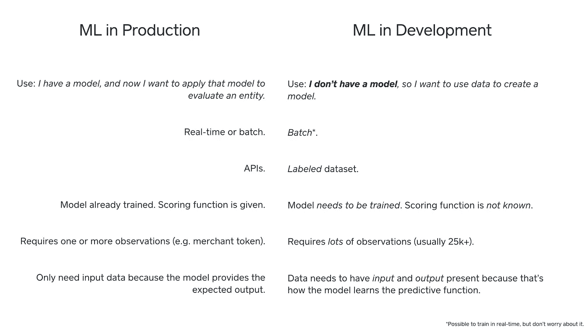
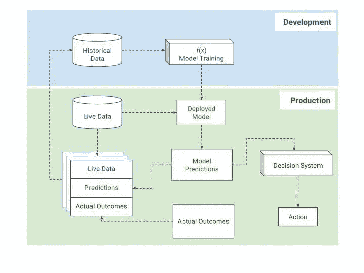
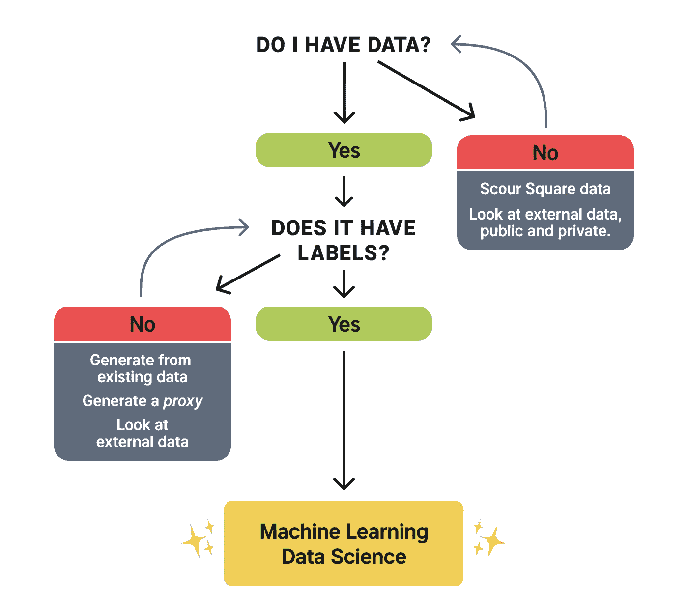

# 机器学习的产品规划

> 原文：<https://medium.com/square-corner-blog/product-planning-for-machine-learning-3714e875d967?source=collection_archive---------0----------------------->

## 为了规划基于机器学习的解决方案，您应该知道什么。

*胡安·埃尔南德斯和亚瑟·徐*

> 注意，我们已经行动了！如果您想继续了解 Square 的最新技术内容，请访问我们在 https://developer.squareup.com/blog[的新家](https://developer.squareup.com/blog)

当谈到应用机器学习时，算法通常是抓住大众想象力的东西。大多数机器学习文章强调的是导出模型的方法，而不是成功使用模型所需的操作条件。然而，模型只是一个更深层次系统的一部分。在公司环境中，算法的杠杆作用来自于作为最终服务于客户需求的大规模运行过程的一部分。将基于 ML 的解决方案从个人开发环境转移到生产系统会引入额外的因素，这些因素是组织在急于利用 ML 时经常忽略的。

我们认识到 ML 是一个多功能的工具。但是，像任何工具一样，它的有效性依赖于操作环境和问题背景。这篇博客文章涵盖了产品和流程经理应该知道的因素，以便很好地规划基于 ML 的解决方案。

# ML 如何适应产品策略和自动化

一个组织可以在产品策略的不同部分使用 ML。ML 的一些应用更具战略性，涉及应用统计方法来揭示洞察力，并提出产品和公司层面的商业建议。示例包括识别客户获取漏斗中的瓶颈，或找到可能导致更好的细分和定位的统计聚类。

ML 的其他应用本质上是战术性的，包括使用 ML 来自动化或优化一些过程。这第二类 ML 应用的几个例子是欺诈检测、营销活动优化、产品推荐、文档翻译、驾驶汽车以及许多其他应用。

这些例子的共同点是，它们往往涉及自动化决策。自动化允许你用更少的人做同样多的工作，或者释放人力和其他昂贵的资产去做更有价值的项目。支持者可以一次又一次地回答同一个问题，但如果他们的注意力得到解放，从而有能力注意到新出现的询问模式，并与产品经理分享这些客户见解，以指导创新和改善客户体验，那就更好了。

这篇博文的剩余部分关注于 ML 在产品策略中的一系列应用，这些应用对应于优化和自动化。

# 传统的自动化和基于 ML 的方法

区分自动化和 ML 是很重要的。虽然 ML 支持自动化，但这两者并不是严格意义上的同义词。自动化可以通过识别最佳的业务规则来实现，但是现在，ML 通常是实现智能自动化的更准确和更有效的方式。ML 允许组织直接从数据中做出预测，并使用这些预测来自动执行某种行为。

基于 ML 的方法与传统的自动化有什么不同？

**传统自动化:**业务流程管理和基于规则的系统。规则是由商业专家和分析师决定的。规则是静态的，但可以修改。

**带机器学习的自动化:**“规则”使用从*数据*中学习到的优化函数。“规则”是灵活的，可以适应新的行为模式。

ML 的自动化仍然需要以某种方式将 ML 引擎嵌入到决策引擎中。这可以从两个方面来考虑:ML 在规则引擎中起作用，或者 ML 作为规则引擎的输入。无论哪种方式，构建一个使用 ML 路由决策的复杂规则引擎都需要数据科学家和工程师之间的协调。

# 模型预测:如何使用输出？

**生产需要建什么**。在其成熟状态下，该评分/决策系统将能够在给定新观察的情况下，通过以下方式自动做出决策:(1)接受该观察的元数据，(2)识别要评估的该观察的适当模型和属性，以及(3)针对预定义的评估标准应用决策阈值。

这通常采取从生产中的决策引擎调用评分 API 的形式。当然，这假设存在几个工作系统并在其中进行通信，例如决策引擎、模型评分应用程序、实时数据馈送或可查询数据存储。

有时，当经理们谈论 ML 计划时，他们关注的是稳态，ML 环境在生产中会是什么样子。由于对训练模型所必需的数据的存在的假设并不总是得到满足，所以在产品规划中关于稳态的讨论经常过早地出现。

这并不是说我们不应该考虑这些事情，但制定实现目标的路线图是至关重要的。基于 ML 的解决方案规划的第一阶段是确保模型开发过程是可行的。这里有一些与生产和开发相关的语言和主题的区别。

我们倾向于谈论生产和开发的方式之间的这些区别提供了一个进入数据获取和反馈循环的途径。大多数项目经理已经知道，最大似然依赖于数据的可用性，但理解如何训练最大似然模型影响我们如何规划未来状态的解决方案也很重要。为了训练一个模型，你不仅需要一种实时摄取数据的能力，还需要一大组被称为训练数据的观察数据。这些数据用于校准和优化模型，以执行其预期功能。

# ML 模型生命周期

# 模型训练:ML 是如何工作的？

ML 是一种通过使用数据生成预测的方法(又名。观察、例子)来学习将输入与输出相关联的最优函数。在操作应用中，所学习的函数用于产生分数，该分数然后可用于自动化决策和/或过程。这里有一些与我们在 Square 工作相关的例子。

**Task:** 您想要通过创建一个为新的输入数据产生一些输出的函数来自动化一个过程。

-示例:计算*卖家*、*客户*、& c 的风险分值的函数

-示例:预测卖方是否会接受营销报价的函数。

-示例:预测卖方是否会处理欺诈性退款的功能。

-示例:预测卖家分期付款风险是否高的函数。

**解决方案:**用机器学习生成那个函数！

**然而，仅仅假设 ML 可以被“扔”到一个问题上来解决，这是对 ML 如何工作的误解。在使用 ML 方法处理问题之前，需要满足一些关键的假设。**

**假设:**

1.  你有数据可以学习。
2.  如果是分类问题，数据被“标记”，或者如果是回归问题，结果是已知的。

更简单地说，数据包含您试图近似的函数的 ***输入*** ***和输出*** 。

假设你已经标记了数据，这是一个很大的假设。情况并不总是这样。当计划将 ML 整合到产品中时，你需要知道开发工作的数据采集成本和时间。通常，在数据采集的成本/时间和数据的质量/确定性之间存在权衡。

# 数据采集和存储

如果您是从零开始使用 ML，很少会有与手头问题完全匹配的数据。一些数据资产比其他数据资产更直接相关。然而，一个组织通常为了 ML 之外的一些目的存储历史数据，并且具有不同类型的事件的可查询的积压以及相关的关联元数据。如果幸运的话，这可能是相关数据的成分。

在某些情况下，没有这样的内部数据(至少目前没有)。在这里，了解内部和外部数据获取策略的相对价值和成本是有好处的。您需要估计将各种内部和外部数据集集成到您的 ML 解决方案中的成本和收益。

通常，构建数据存储和访问系统时会考虑到一些不太复杂的用例，比如描述和诊断发生了什么。当设计这些系统时，重要的是规划未来的 ML 应用，这涉及到预测将会发生什么以及对此做些什么。这涉及到(通过产品)收集什么的设计，也涉及到如何存储它(数据库的设计)。如果你现在不记录和存储潜在有用的数据，以后实现 ML 将会很痛苦。

因此，数据收集和存储很重要。同样重要的是，要开始考虑如何高效地存储这些数据，以及评分时需要访问这些数据的模型托管系统如何检索这些数据。与此相关的是对数据的延迟、保真度、一致性和不变性的关注。

根据您的产品/组织在使用 ML 方面的成熟度，您可能有也可能没有训练模型所需的数据。对于监督学习模型，您可以处于三种数据基本状态。

1.  您正在优化一个现有的模型— **数据可能存在**
2.  你正在从零开始构建一个模型/产品/功能— **没有数据**
3.  你在重复已经存在的东西，也许会产生一个副产品。有些数据不是直接相关的，但你可以用它来启动你的新产品。在这些情况下，通常有一种方法可以从可用数据中的某个代理来推断性能。随着时间的推移，组织将能够细化结果、标签、性能定义，以评估和改进模型的校准。

# 数据规划路线图

让我们考虑最棘手的情况，当你只有很少或没有数据时。

一种即时生成数据的方法实际上是相对盲目地推出产品。

由于您需要生成正面和负面的结果来为将来的建模创建训练数据，并且还没有这样的数据存在，所以收集信息和开始进展的一种方法是简单地启动产品并观察结果。通过这样做，你实际上是在通过反复试验购买你需要的信息。例如，寻求服务新客户群的贷款人需要为新的人群重新调整他们的风险模型。他们可能会从利用常识试探法提供贷款开始，并招致短期损失。他们这样做是因为他们知道他们正在购买有价值的信息，而这些损失最终将被率先积累相关数据以成功服务于这个未知市场的长期收益所抵消。

如果您的数据很少或没有数据，请问自己以下问题:

*   **数据采集的速度和数量。**你有多少数据？需要？要多久才能拿到，要花多少钱？
*   **数据的价值与获取成本相比如何？**在某些情况下，数据代理比收集真实标签/绩效结果更便宜、更容易。这些情况下的权衡必须逐案评估。
*   **我们如何生成标签？**什么是反馈回路？也许是人为的评论和标签观察，也许标签是表现，比如转化。运营团队通常是有用的反馈来源。

# 结论

ML 的一个高价值应用是日常过程的自动化。ML 可以通过生成分数来实现自动化，这些分数被输入到基于规则的决策管理系统中。然而，基于 ML 的解决方案的成功依赖于拥有正确的操作环境。对于决策者来说，理解和规划 ML 解决方案运行所需的生产和开发环境是至关重要的。很难夸大开发环境的重要性，它从收集、存储和标记数据开始。作为一家拥有良好数据的成熟公司，并不保证您拥有解决问题或自动化手头流程所需的数据。这里提出的数据采集规划路线图不仅适用于开发新产品和进入新市场的成熟公司，也同样适用于刚刚起步的公司。