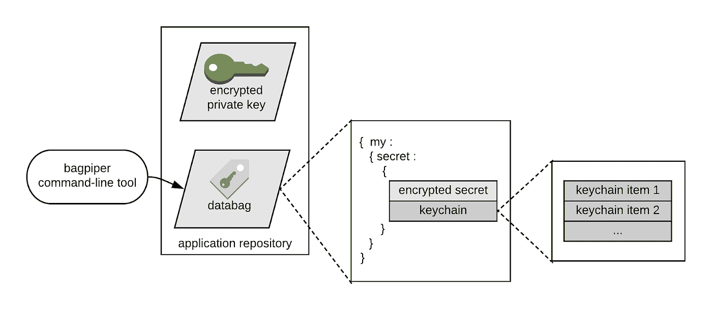
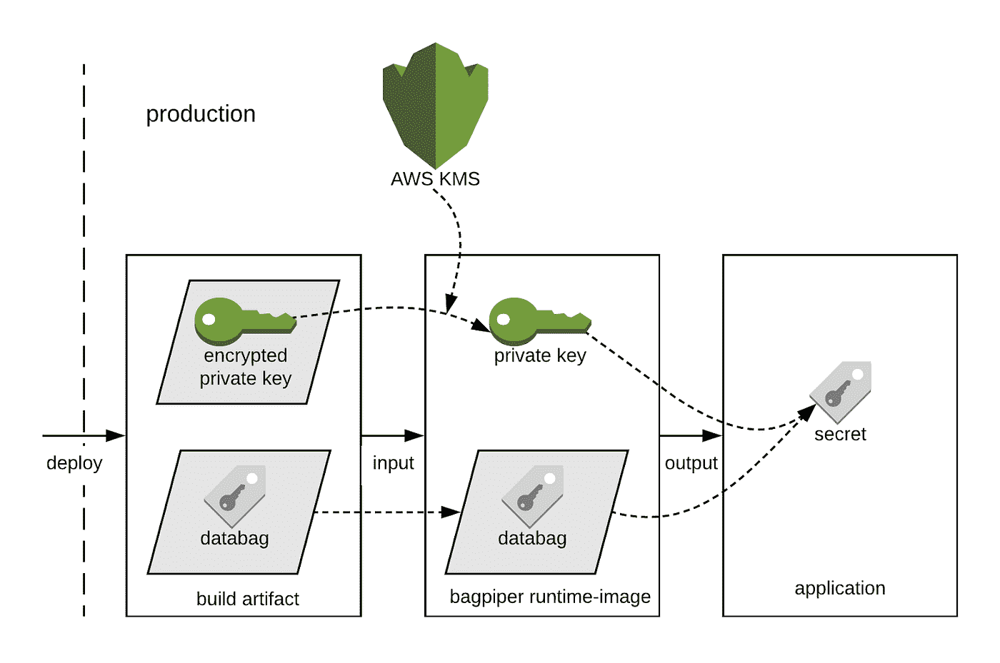
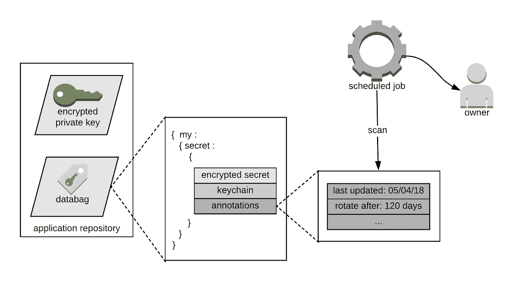
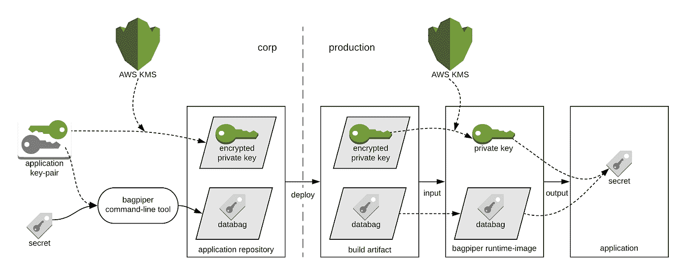

# Airbnb 的生产秘密管理

> 原文：<https://medium.com/airbnb-engineering/production-secret-management-at-airbnb-ad230e1bc0f6?source=collection_archive---------2----------------------->

## 我们的生产秘密管理理念和方法

Keys are handed off during a check-in in Shanghai

Airbnb 是一个建立在信任基础上的全球社区。安全团队通过维护存储、管理和访问敏感信息资产的安全标准来帮助建立信任。这些包括秘密，比如 API 密钥和数据库凭证。应用程序使用机密来提供日常的站点功能，而那些用于访问生产资源的机密尤其需要保护。这就是为什么我们建立了一个我们称之为 ***风笛*** 的内部系统来安全地管理所有的生产机密。

Bagpiper 是 Airbnb 在生产秘密管理的各个方面使用的工具和框架组件的集合。这包括存储、轮换和访问。更重要的是，风笛提供了一种安全的、可重复的模式，可以应用于整个工程。它被设计成与语言和环境无关，并支持我们不断发展的生产基础设施。为了更好地理解风笛是什么，有必要了解我们的设计考虑。

# 设计目标

几年前，Airbnb 的大部分应用程序配置都是使用 [Chef](/airbnb-engineering/making-breakfast-chef-at-airbnb-8e74efff4707) 来管理的。这些配置包括存储在 Chef 加密数据包中的秘密。Chef 帮助我们将基础设施作为代码，但是给我们的工程师带来了可用性问题，因为应用程序是使用单独的系统部署的。随着 Airbnb 的发展，这些挑战成为提高我们运营效率的重要机遇。

为了适应 Airbnb 的增长，我们需要将秘密管理从厨师中分离出来，因此我们建立了风笛来提供强大的安全性和卓越的运营。我们旨在实现这些目标:

*   提供最低特权访问模式
*   允许静态加密机密
*   支持跨不同语言和环境的应用程序
*   管理定期轮换的机密
*   与 Airbnb 的工程模式保持一致
*   随着 Airbnb 不断发展的基础设施而扩展

# 分段和访问控制

Bagpiper 通过使用特定于服务的密钥对秘密进行不对称加密来创建分段访问。在 Airbnb，服务是用基本的脚手架创建的，以支持常见的功能，如[服务间通信](/airbnb-engineering/building-services-at-airbnb-part-1-c4c1d8fa811b)。此时，一个唯一的 [IAM 角色](https://docs.aws.amazon.com/IAM/latest/UserGuide/id_roles.html)和一个公钥/私钥对也被创建。AWS 的密钥管理服务(KMS)使用[信封加密](https://docs.aws.amazon.com/kms/latest/developerguide/concepts.html#enveloping)对私钥进行加密。加密的内容与服务的 IAM 角色绑定在一起，因此除了服务本身没有人可以解密它。

选定的服务通过每个秘密的 ***钥匙串*** 访问每个秘密。Bagpiper 用在钥匙串上找到的每个公钥加密一个秘密。只有那些拥有相应私钥的服务才能解密这个秘密。信封加密用于加密秘密，但它对用户是透明的。在我们的部署中，生产应用程序将首先调用 KMS 来解密私钥，然后使用它来解密允许它访问的任意数量的秘密。由于大多数操作都是离线进行的，因此部署起来既可扩展又经济高效。

# 静态加密，使用时解密

Bagpiper 允许工程师添加、删除和轮换机密，或者将它们提供给选定的生产系统。风笛手将这项工作转换为文件更改，并将其作为 ***databag*** 文件写入磁盘。数据标签是 JSON 格式的文件，其结构类似于 Chef 加密的数据标签。Databag 文件以及加密的密钥文件和代码被签入应用程序的 Git 存储库。

Secrets are encrypted at rest as databag files

对秘密的修改和代码一样经历相同的修改-发布过程。这包括同行评审、持续集成(CI)和部署。在 CI 期间，数据标签和关键文件被合并到应用程序构建构件中。在部署时，应用程序使用 Bagpiper 客户端库从数据标签中读取机密。借助风笛，应用程序能够安全地访问机密。同时，将秘密与代码更改一起部署简化了发布过程。来自向前部署和回滚的应用程序状态是可预测和可重复的。我们能够朝着将基础设施作为具有改进的操作安全性的代码的方向前进。

# 应用支持和集成

我们今天使用的许多技术几年前在 Airbnb 还不存在，还有更多技术有待开发。为了 Airbnb 的未来，Bagpiper 必须能够支持跨不同语言和环境的各种应用程序。我们用 ***风笛运行时映像*** 实现了这个目标，这是一个跨平台的可执行程序，抽象解析和解密数据标签。它用 Java 编写，然后使用 [jlink](https://docs.oracle.com/javase/9/tools/jlink.htm) 工具构建到特定于平台的运行时映像中。Bagpiper runtime-image 在 Linux、OSX 和 Windows 系统上运行，没有 Java runtime environment (JRE)。它安装在不同的应用程序环境中，位于文件系统中。

Bagpiper 可以经济高效地支持不同类型的应用程序。如今，Airbnb 的大部分应用程序都是用 Java 和 Ruby 编写的。因此，我们为 Java 和 Ruby 应用程序创建了轻量级客户端库来安全地访问机密。在底层，这些客户端库从构建工件中读取数据标签和关键文件，并从文件系统中直接调用风笛运行时映像。客户端库接收这些秘密，并使它们习惯性地对应用程序可用。

Secret access in production

# 持续的秘密轮换

最佳实践是定期轮换机密。风笛手帮助对每个秘密的带注释的数据执行秘密轮换策略。 ***秘密注释*** 是键值对，可以指定秘密何时被创建或最后一次循环，以及何时应该再次循环。带注释的数据被编码并与加密的秘密一起存储在 databag 文件中。虽然它是未加密的，但它是与秘密加密联系在一起的，所以不可能被篡改。

Managed secret rotation

今天，出于管理轮换的目的，对少量但越来越多的秘密进行了注释。一个调度作业定期扫描应用程序 Git 存储库，以查找适合循环的机密。这些秘密通过内部漏洞管理系统进行跟踪，因此应用程序所有者要对此负责。有时可以生成秘密，例如 MySQL 数据库凭证。如果注释中描述了这一点，则会创建一个包含循环密码的文件更改的 pull 请求，供应用程序所有者查看和部署。

# 把所有的放在一起

我们从几个不同的角度看风笛手。它是一个秘密管理解决方案，使用非集中式的离线架构，与许多替代产品不同。Bagpiper 尽可能地利用 Airbnb 的基础设施，并使用 Airbnb 已经熟悉的基于 Git 的变更-发布模式。这种方法帮助我们满足了不同应用环境中的机密管理需求。为了有助于理解一切，请参见下面的架构图:

Making secrets available to production systems

# 总结想法

对于一家正在经历快速发展和转型的公司来说，安全且可重复的秘密管理实践至关重要。它还提出了许多独特的技术挑战和权衡。我们希望分享 Airbnb 的理念和方法对那些面临类似挑战的人有所帮助。由于我们仍然专注于构建技术来保护我们的社区，我们非常感谢 Airbnb 的领导者对我们的持续投资、承诺和支持。

想要帮助保护我们的社区吗？安全团队一直在寻找 [*有才能的人加入我们的团队*](https://www.airbnb.com/careers) *！*

*非常感谢保罗·杨、乔恩·泰、布鲁斯·谢罗德、莫砺锋·桑和安东尼·卢戈在本文发表前审阅了本文*