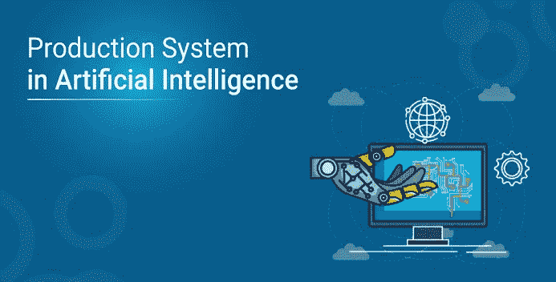

# 人工智能中的生产系统是什么？

> 原文：<https://medium.com/edureka/production-system-in-ai-7cc2b453aa47?source=collection_archive---------0----------------------->

生产系统是基于一套关于行为的规则。这些规则是在专家系统、自动规划和行动选择中有用的基本表示。它还提供了某种形式的人工智能。在本文中，我们将按以下顺序讨论人工智能中的产生式系统:

*   什么是生产系统？
*   生产系统的特征
*   控制/搜索策略
*   生产系统规则
*   生产系统的类别
*   优点和缺点
*   人工智能中的生产系统:示例

# 什么是生产系统？

产生式系统或产生式规则系统是一种计算机程序，通常用于提供某种形式的人工智能，它主要由一组关于行为的规则组成，但也包括在系统响应世界状态时遵循这些规则所必需的机制。

## 生产系统的组件

人工智能生产系统的主要组成部分是:

*   **全局数据库:**全局数据库是人工智能中产生式系统使用的中心数据结构。
*   **产生式规则集:**产生式规则作用于全局数据库。每个规则通常都有一个前提条件，全局数据库要么满足，要么不满足。如果前提条件得到满足，则通常应用该规则。规则的应用改变了数据库。
*   **控制系统:**控制系统然后选择应该应用哪个可应用的规则，并且当满足数据库上的终止条件时停止计算。如果多个规则同时触发，控制系统会解决冲突。

# 人工智能中产生式系统的特征

生产系统的主要特征包括:

**1。简单性:**生产系统中每个句子的结构都是唯一且统一的，因为它们使用“如果-那么”结构。这种结构简化了知识表示。生产系统的这一特性提高了生产规则的可读性。

**2。模块性:**这意味着产生式规则代码，即分散的知识。信息可以被视为独立事实的集合，可以从系统中添加或删除，基本上没有有害的副作用。

**3。可修改性:**这意味着修改规则的功能。它允许首先以框架形式开发产生式规则，然后再精确到适合特定的应用程序。

**4。知识密集型:**产生式系统的知识库存储的是纯知识。本部分不包含任何类型的控制或编程信息。每个产生式规则通常被写成一个英语句子；语义的问题由表示的结构来解决。

# 控制/搜索策略

在寻找任何问题的解决方案时，你如何决定应用哪条规则？您需要牢记良好控制策略的某些要求，例如:

*   一个好的控制策略的第一个要求是它应该**引起运动**。
*   对一个好的控制策略的第二个要求是，它应该是**系统化的**。
*   最后，必须是**高效**才能找到好答案。

# 生产系统规则

生产系统规则可以分为:

您可以将生产系统中的知识表示为一组规则以及控制系统和数据库。它可以写成:

*   **演绎推理规则**
*   **溯因推理规则**

***如果(条件)那么(条件)***

产生式规则也被称为条件-动作、前因-后果、模式-动作、情境-反应、反馈-结果对。

# 人工智能中产生式系统的分类

人工智能中有四大类生产系统:

*   **单调产生式系统**:这是一种产生式系统，在这种系统中，一条规则的应用永远不会阻止另一条规则的应用，这条规则也可以在选择第一条规则时应用。
*   **部分可换产生式系统**:这是一种产生式系统，在这种系统中，一系列规则的应用将状态 X 转换为状态 Y，然后这些规则的任意排列也将状态 X 转换为状态 Y。定理证明属于单调部分可换系统。
*   非单调生产系统:这些对于解决可忽略的问题很有用。从实现的角度来看，这些系统是重要的，因为当发现遵循了不正确的路径时，它们可以在没有回溯到先前状态的能力的情况下被实现。这种生产系统提高了效率，因为它不需要跟踪在搜索过程中所做的改变。
*   可交换系统:这些系统通常适用于发生变化但可以逆转的问题，以及操作顺序不重要的问题。通常不是部分可换的产生式系统对于许多发生不可逆变化的问题是有用的，例如化学分析。当处理这样的系统时，操作执行的顺序非常重要，因此必须在第一次尝试时就做出正确的决定。

# 优点和缺点

人工智能中生产系统的一些**优势**有:

*   这个系统是高度模块化的，因为每个规则都可以独立地添加、删除或修改
*   分离**知识**和**控制-识别动作循环**
*   状态空间研究数据的自然**映射**或目标驱动
*   该系统采用模式导向控制，比算法控制更加灵活
*   为搜索的**启发式控制**提供机会
*   对智能机器的**状态驱动本性**建模的好方法
*   在实时环境和应用中非常有用。

现在，让我们来看看的一些**缺点:**

*   它描述了在寻找问题的解决方案时可以执行的操作。
*   由于基于规则的生产系统不存储问题的结果以备将来使用，因此**缺乏学习**。
*   生产系统中的规则不应该有任何类型的**冲突解决**，因为当一个新规则被添加到数据库中时，它应该确保它不与任何现有的规则有任何冲突。

# 人工智能中的生产系统:示例

**问题陈述:**

我们有两个容量分别为 5l 和 3l 的水壶，还有一个可以无限供水的水龙头。目标是以尽可能少的步骤在 5 升的壶中准确地获得 4 升。

*   从水龙头灌满 5 升的水壶
*   清空 5 升的水壶
*   从水龙头把 3 升的水壶灌满水
*   清空 3 升的水壶
*   然后，将 3 升水壶倒空至 5 升
*   把 5 升的罐子倒空到 3 升
*   倒入 3 升到 5 升的水
*   倒入 5 升到 3 升的水，但不要倒空

**解决方案:**

也可能有其他解决方案，但这些是最短的，应该选择第一序列，因为它具有最少的步骤数。

至此，我们关于人工智能中的产生式系统的文章到此结束。我希望你了解什么是生产系统，以及如何使用它来轻松控制一个全球数据库。

如果你想查看更多关于人工智能、DevOps、道德黑客等市场最热门技术的文章，你可以参考 Edureka 的官方网站。

请留意本系列中的其他文章，它们将解释深度学习的各个其他方面。

> *1。* [*张量流教程*](/edureka/tensorflow-tutorial-ba142ae96bca)
> 
> *2。* [*PyTorch 教程*](/edureka/pytorch-tutorial-9971d66f6893)
> 
> *3。* [*感知器学习算法*](/edureka/perceptron-learning-algorithm-d30e8b99b156)
> 
> *4。* [*神经网络教程*](/edureka/neural-network-tutorial-2a46b22394c9)
> 
> *5。* [*什么是反向传播？*](/edureka/backpropagation-bd2cf8fdde81)
> 
> *6。* [*卷积神经网络*](/edureka/convolutional-neural-network-3f2c5b9c4778)
> 
> *7。* [*胶囊神经网络*](/edureka/capsule-networks-d7acd437c9e)
> 
> *8。* [*递归神经网络*](/edureka/recurrent-neural-networks-df945afd7441)
> 
> *9。* [*自动编码器教程*](/edureka/autoencoders-tutorial-cfdcebdefe37)
> 
> *10。* [*受限玻尔兹曼机教程*](/edureka/restricted-boltzmann-machine-tutorial-991ae688c154)
> 
> *11。*[*py torch vs tensor flow*](/edureka/pytorch-vs-tensorflow-252fc6675dd7)
> 
> *12。* [*深度学习用 Python*](/edureka/deep-learning-with-python-2adbf6e9437d)
> 
> *13。* [*人工智能教程*](/edureka/artificial-intelligence-tutorial-4257c66f5bb1)
> 
> *14。* [*张量流图像分类*](/edureka/tensorflow-image-classification-19b63b7bfd95)
> 
> *15。* [*人工智能应用*](/edureka/artificial-intelligence-applications-7b93b91150e3)
> 
> 16。 [*如何成为一名人工智能工程师？*](/edureka/become-artificial-intelligence-engineer-5ac2ede99907)
> 
> 17。 [*问学*](/edureka/q-learning-592524c3ecfc)
> 
> 18。 [*Apriori 算法*](/edureka/apriori-algorithm-d7cc648d4f1e)
> 
> *19。* [*马尔可夫链与 Python*](/edureka/introduction-to-markov-chains-c6cb4bcd5723)
> 
> 20。 [*人工智能算法*](/edureka/artificial-intelligence-algorithms-fad283a0d8e2)
> 
> *21。* [*最适合机器学习的笔记本电脑*](/edureka/best-laptop-for-machine-learning-a4a5f8ba5b)
> 
> *二十二。*[*12 大人工智能工具*](/edureka/top-artificial-intelligence-tools-36418e47bf2a)
> 
> *23。* [*人工智能面试问题*](/edureka/artificial-intelligence-interview-questions-872d85387b19)
> 
> *24。*[*Theano vs tensor flow*](/edureka/theano-vs-tensorflow-15f30216b3bc)
> 
> *25。* [*什么是神经网络？*](/edureka/what-is-a-neural-network-56ae7338b92d)
> 
> *26。* [*模式识别*](/edureka/pattern-recognition-5e2d30ab68b9)
> 
> *27。*[*tensor flow 中的物体检测*](/edureka/tensorflow-object-detection-tutorial-8d6942e73adc)

*原载于 2020 年 1 月 8 日 https://www.edureka.co***。**