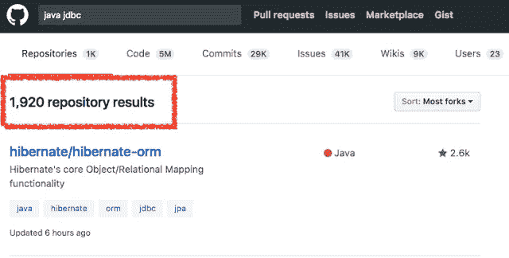
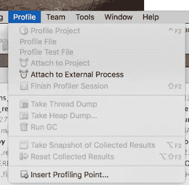
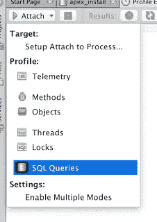
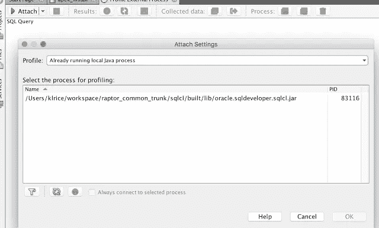
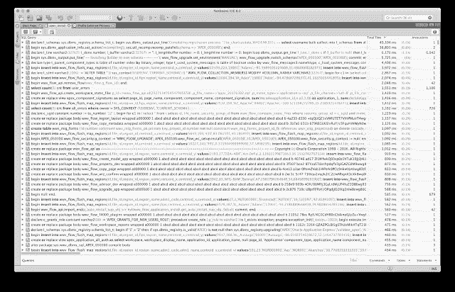

# 剖析 Java + JDBC 应用程序

> 原文：<https://medium.com/oracledevs/profiling-a-java-jdbc-application-ed7d8a1b2077?source=collection_archive---------0----------------------->

首先，以这种方式分析 Java 程序不需要 Java 编码，也不需要 Java 源代码。NetBeans 不久前添加了这个备份，我最近才发现它。能够连接到任何 Java 程序，并分析整个 JDBC 的 SQL。开发团队关于它的博客在这里:[http://jj-blogger . blogspot . nl/2016/05/netbeans-SQL-profiler-take-it-for-spin . html](http://jj-blogger.blogspot.nl/2016/05/netbeans-sql-profiler-take-it-for-spin.html)

# SQLcl

SQLcl 是我们用于编写 sql/sql 脚本的 Java 库，从 05/06 年的第 0 天起就在 SQLDev 中了。我们考虑了这一点，并在它周围加了一条 cmd 线。这使得测试特性、回归、性能等变得更加容易。以及提供具有扩展特征的新 cmd 线。这个库也是执行 Oracle 数据库网格基础设施安装的库，并且嵌入在 [Oracle REST 数据服务](http://oracle.com/rest)中。这是经过验证和测试的。这是所有使用普通 JDBC 与数据库对话的 Java 库。它与任何基于 java 的应用程序没有什么不同，这意味着它适用于任何 java 程序，例如 sqldeveloper、ords、自定义 jdbc、任何 java 程序。

# 压型

Netbeans 中的这个新特性使用起来非常简单，并且不需要 jsvs 代码的源代码。关闭配置文件菜单→附加到外部进程

然后将配置文件设置为 SQL 查询

单击 Attach，显示正在运行的 java 进程列表。这就是 SQL 的样子。

# 运行程序

现在，一旦 JDBC 流量开始发出，就可以捕获该语句的计时和出现时间，以及发出调用的 Java 堆栈。接下来是最难的部分，这些数据到底意味着什么？什么时候才算快，够快？

# 要改什么？

下面是 APEX 安装在我的笔记本电脑上进行到一半时的样子。有很多数据要看。最慢的语句是 dbms 注册表验证。很糟糕吗，可以加速吗？大概不会。调用最多的是对 DBMS _ OUPUT 的检查。那能减少吗？还有，大概不会。

这就是代码和预期动作的知识至关重要的时候。对我来说，将 SQL 程序从 19m 压缩到 7m 已经足够快了。这是通过对 APEX 安装脚本的**零**更改完成的，但只是通过观察流向数据库的流量并对其进行分析。

变化# 1:SQL 被命名为解析每一个 create 或 replace <plsql object="">,然后检查该对象上的错误。更快的方法是直接从 user_errors 中检查 count(1 ),而不进行名称解析。当 user_errors 表中没有错误时，不需要命名 resolve。所以整个路径被缩短了。它在这个堆栈中是可见的，调用了 1，106 次“select count(1)CNT from user _ errors”。变化#2: DBMS_OUTPUT 在对数据库的任何/所有命令之后被调用。这减少到只能调用一些输出。例如，不需要检查 alter session。这一变化减少了发出的 db 调用的数量。最快的电话是那些你没有打的电话。等等等等。</plsql>

没有什么比了解预期结果更重要的了。

*原载于 2017 年 7 月 12 日*[*Kris rice . io*](http://krisrice.io/2017-07-12-profiling-java-jdbc-application/)*。*