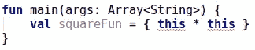
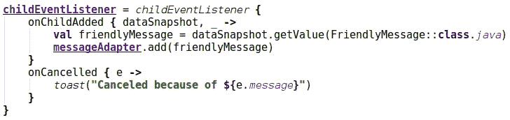

# 程序员字典:带接收方的函数文本与带接收方的函数类型

> 原文：<https://blog.kotlin-academy.com/programmer-dictionary-function-literal-with-receiver-vs-function-type-with-receiver-cc21dba0f4ff?source=collection_archive---------6----------------------->

我们已经讨论过 [*函数字面量*和*函数类型*](/kotlin-programmer-dictionary-function-type-vs-function-literal-vs-lambda-expression-vs-anonymous-edc97e8873e) 的区别。尽管 Kotlin 引入了扩展函数，但它也需要特殊的[类型](/programmer-dictionary-class-vs-type-vs-object-e6d1f74d1e2e)和[文字](/kotlin-programmer-dictionary-function-type-vs-function-literal-vs-lambda-expression-vs-anonymous-edc97e8873e)来处理它们。它们被称为带接收器的**函数字面量**和带接收器的**函数类型**。


Image from [miva.com](http://www.miva.com)

让我们从头开始。下面是一个简单的扩展函数的例子:

```
fun Int.square() = this * this// Usage
println(2.square()) // Prints: 4
```

我们已经[告诉](/programmer-dictionary-extension-receiver-vs-dispatch-receiver-cd154e57e277)带有`Int`的参数被传递给函数的 [**扩展接收器**](/programmer-dictionary-extension-receiver-vs-dispatch-receiver-cd154e57e277) ，`this`或者隐式调用对它的引用。如果我们需要将这个函数与[属性](/kotlin-programmer-dictionary-field-vs-property-30ab7ef70531)相关联，那么我们可以使用[函数引用](/kotlin-programmer-dictionary-function-type-vs-function-literal-vs-lambda-expression-vs-anonymous-edc97e8873e):

```
**val** squareFun: Int.()->Int = Int::square
```

我们使用的`Int.()->Int`是带有接收器的**函数类型。除了使用函数引用，我们可以使用带有接收者** 的 [**函数来定义函数。这就是我们如何使用 **lambda 表达式和接收者**来定义它**](/kotlin-programmer-dictionary-function-type-vs-function-literal-vs-lambda-expression-vs-anonymous-edc97e8873e)

```
**val** squareFun: Int.()->Int = { this * this }
```

这就是我们如何使用带有接收者的**匿名函数来定义它:**

```
**val** squareFun: Int.()->Int = **fun** Int.() = **this** * **this**
```

注意，带有接收者的**匿名函数与标准**匿名函数**具有不同的符号，因此当使用它时，可以推断出属性或变量类型:**

```
**val** squareFun = **fun** Int.() = **this** * **this**
```

**带有接收方**的 Lambda 表达式没有这样的能力，所以它需要显式类型声明:



Error because lambda expression does not have receiver by default and this is not allowed in this context (there is no [implicit receiver](/programmer-dictionary-implicit-receiver-vs-explicit-receiver-da638de31f3c))

带接收器的 Lambda 表达式在 Kotlin 中非常重要，因为它在 Kotlin DSL 中被大量使用。下面是一个使用不同处理程序定义监听器的 DSL 示例:



This listener creation was introduced and described in [Cleaning up Android project using Kotlin](/cleaning-up-android-project-using-kotlin-7265b24901)

由于这个事实，我们可以使用带有接收者的**函数类型和带有接收者**的 **lambda 表达式，我们可以严格指定可以定义什么处理程序(这里是`onChildAdded`或`onCancelled`)以及我们如何定义它们。`childEventListener`的实现可以在[这个要诀](https://gist.github.com/MarcinMoskala/db8e182ecc526868149114fc6d088bd9)上找到。**

[](https://www.kt.academy/#workshops-offer)

这个帖子是[科特林程序员词典](https://medium.com/kotlin-academy/kotlin-programmer-dictionary-2cb67fff1fe2)的[第十三](https://pl.bab.la/slownik/angielski-polski/thirteenth)部分。要了解最新的新部件，只需关注此媒体或[在 Twitter 上观察我](https://twitter.com/marcinmoskala)。如果你需要帮助，记得[我随时欢迎咨询](https://medium.com/@marcinmoskala/ive-just-opened-up-for-online-consultations-640349aaba55)。

喜欢的话记得**拍**。请注意，如果您按住鼓掌按钮，您可以留下更多的掌声。

[](http://eepurl.com/diMmGv)

以下是《科特林程序员词典》的其他部分:

*   [形参 vs 实参，类型形参 vs 类型实参](https://medium.com/kotlin-academy/programmer-dictionary-parameter-vs-argument-type-parameter-vs-type-argument-b965d2cc6929)
*   [语句 vs 表达式](https://medium.com/kotlin-academy/kotlin-programmer-dictionary-statement-vs-expression-e6743ba1aaa0)
*   [功能 vs 方法 vs 程序](https://medium.com/kotlin-academy/kotlin-programmer-dictionary-function-vs-method-vs-procedure-c0216642ee87)
*   [属性对字段](/kotlin-programmer-dictionary-field-vs-property-30ab7ef70531)
*   [类 vs 类型 vs 对象](/programmer-dictionary-class-vs-type-vs-object-e6d1f74d1e2e)
*   [对象表达式 vs 对象声明](/kotlin-programmer-dictionary-object-expression-vs-object-declaration-791b183ad16b)
*   [接收器](/programmer-dictionary-receiver-b085b1620890)
*   [隐式接收者 vs 显式接收者](/programmer-dictionary-implicit-receiver-vs-explicit-receiver-da638de31f3c)
*   [分机接收机 vs 调度接收机](/programmer-dictionary-extension-receiver-vs-dispatch-receiver-cd154e57e277)
*   [接收器类型与接收器对象](/programmer-dictionary-receiver-type-vs-receiver-object-575d2705ddd9)
*   [函数类型 vs 函数文字 vs Lambda 表达式 vs 匿名函数](/kotlin-programmer-dictionary-function-type-vs-function-literal-vs-lambda-expression-vs-anonymous-edc97e8873e)
*   [程序员字典:高阶函数](/programmer-dictionary-higher-order-function-9cadb07df94e)
*   [不变性 vs 协方差 vs 逆变](/kotlin-generics-variance-modifiers-36b82c7caa39)
*   [事件监听器 vs 事件处理器](/programmer-dictionary-event-listener-vs-event-handler-305c667d0e3c)
*   [代表团 vs 组成](/programmer-dictionary-delegation-vs-composition-3025d9e8ae3d)

