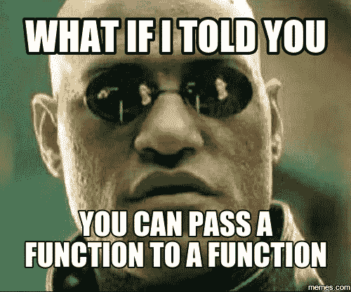

# 程序员词典:高阶函数

> 原文：<https://blog.kotlin-academy.com/programmer-dictionary-higher-order-function-9cadb07df94e?source=collection_archive---------0----------------------->

在[上一部分](/kotlin-programmer-dictionary-function-type-vs-function-literal-vs-lambda-expression-vs-anonymous-edc97e8873e)中，我们已经讨论了 Kotlin 函数式编程的最重要术语。在这一部分我们将讨论非常流行的函数式编程术语:**高阶函数**。这里有一个定义:

> **高阶函数**是以函数为自变量，或者返回函数的函数。

是的，在科特林是可能的；)



下面是一个将函数作为参数的高阶函数的例子:

```
fun sendData(data: Data, callback: ()->Unit) {
    thread {
        api.sendData(data)
        callback()
    }
}
```

下面是一个返回函数的高阶函数**的例子:**

```
fun makeLogger(for: Any) = fun(e: Error) { 
    Log.e(for::class.simpleName, e.message ?: "Error", e) 
}// Usage in MainActivity
val logger = makeLogger(this)
val error = Error("Simple error")
logger(error) // Logs: MainActivity: Simple error ...
```

类似地，我们使用术语**一阶函数**来引用不将函数作为参数或返回函数作为输出的函数。

**高阶函数**在 Kotlin 中非常重要，它们的使用是对旧语言的重要改进。几乎所有用于处理集合的函数都是高阶函数:

```
students.sortedBy { it.grade }
      .take(10)
      .map { it.name }
```

Kotlin stdlib 还包括不同的*扩展高阶函数*，如**让**、**运行**、**应用**、**也**、 **takeIf** 和 **takeUnless** 。类似地，像集合处理函数一样，它们经常在项目中使用。

接下来要注意的是，Kotlin 包含了许多重要的特性来支持高阶函数:

1.  内嵌函数(引入以提高高阶函数的效率)
2.  单个参数的隐式名称(很少用于将函数定义为值，因为类型推断是不可能的，但是在作为参数提供的 lambdas 中非常有用)
3.  参数约定中的最后一个 lambda(支持将函数作为参数传递的另一种方式)

支持**高阶函数**的重要特性的存在清楚地表明了它们的重要性。老实说，我们在 Kotlin 代码中使用它们，没有它们就不可能实现 DSL 或流处理。他们很伟大，我们爱他们；)

高阶函数的主题及其在 Kotlin 中的重要性我在第五章[用 Kotlin 开发 Android](https://www.packtpub.com/application-development/android-development-kotlin)中有详细描述。

这篇文章是科特林程序员词典的第十二部分。要了解最新的新部件，只需关注这个媒体或[在 Twitter 上观察我](https://twitter.com/marcinmoskala)。如果你需要帮助，记得[我随时欢迎咨询](https://medium.com/@marcinmoskala/ive-just-opened-up-for-online-consultations-640349aaba55)。

喜欢的话记得**拍**。请注意，如果您按住鼓掌按钮，您可以留下更多的掌声。

[](http://eepurl.com/diMmGv)

以下是《科特林程序员词典》的其他部分:

*   [形参 vs 实参，类型形参 vs 类型实参](https://medium.com/kotlin-academy/programmer-dictionary-parameter-vs-argument-type-parameter-vs-type-argument-b965d2cc6929)
*   [语句 vs 表达式](https://medium.com/kotlin-academy/kotlin-programmer-dictionary-statement-vs-expression-e6743ba1aaa0)
*   [功能 vs 方法 vs 程序](https://medium.com/kotlin-academy/kotlin-programmer-dictionary-function-vs-method-vs-procedure-c0216642ee87)
*   [属性对字段](/kotlin-programmer-dictionary-field-vs-property-30ab7ef70531)
*   [类对类型对对象](/programmer-dictionary-class-vs-type-vs-object-e6d1f74d1e2e)
*   [对象表达式 vs 对象声明](/kotlin-programmer-dictionary-object-expression-vs-object-declaration-791b183ad16b)
*   [接收器](/programmer-dictionary-receiver-b085b1620890)
*   [隐式接收者 vs 显式接收者](/programmer-dictionary-implicit-receiver-vs-explicit-receiver-da638de31f3c)
*   [分机接收机 vs 调度接收机](/programmer-dictionary-extension-receiver-vs-dispatch-receiver-cd154e57e277)
*   [接收器类型与接收器对象](/programmer-dictionary-receiver-type-vs-receiver-object-575d2705ddd9)
*   [函数类型 vs 函数文字 vs Lambda 表达式 vs 匿名函数](/kotlin-programmer-dictionary-function-type-vs-function-literal-vs-lambda-expression-vs-anonymous-edc97e8873e)
*   [带接收方的函数文字与带接收方的函数类型](/programmer-dictionary-function-literal-with-receiver-vs-function-type-with-receiver-cc21dba0f4ff)
*   [不变性 vs 协方差 vs 方差](/kotlin-generics-variance-modifiers-36b82c7caa39)
*   [事件监听器 vs 事件处理器](/programmer-dictionary-event-listener-vs-event-handler-305c667d0e3c)
*   [代表团 vs 组合](/programmer-dictionary-delegation-vs-composition-3025d9e8ae3d)

