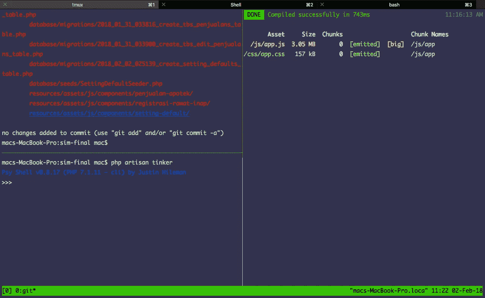
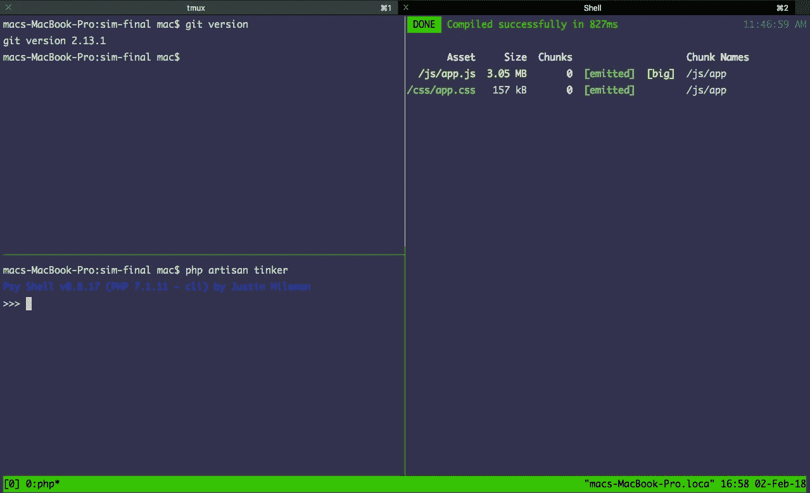
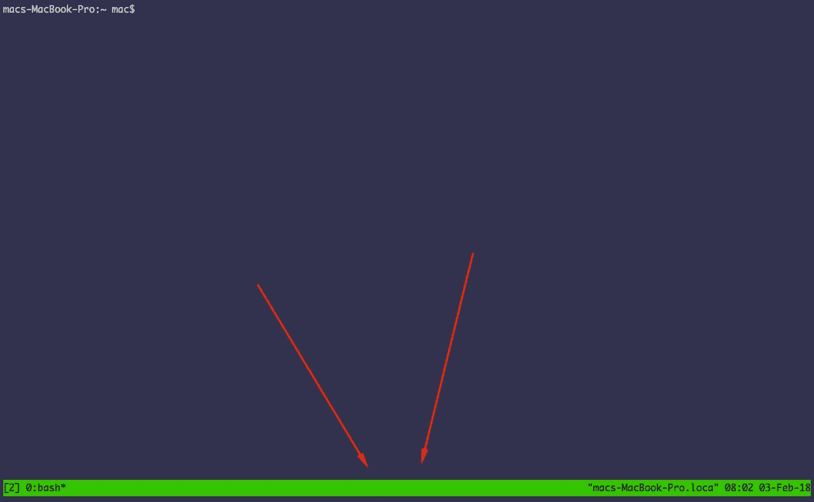
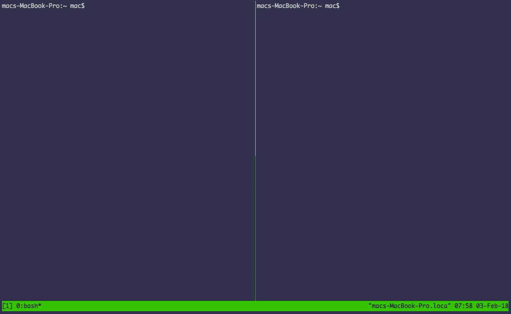
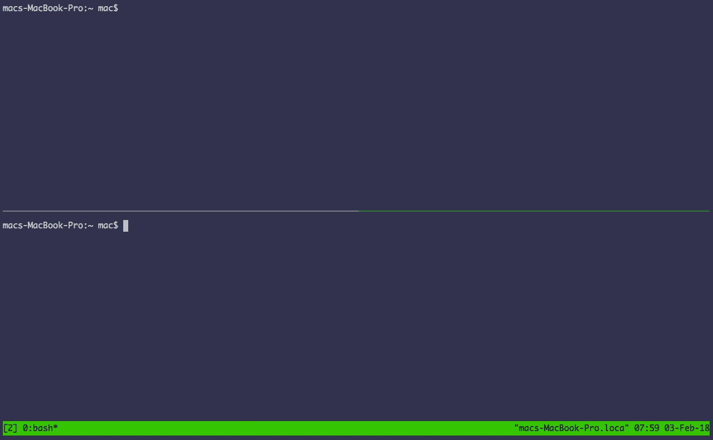
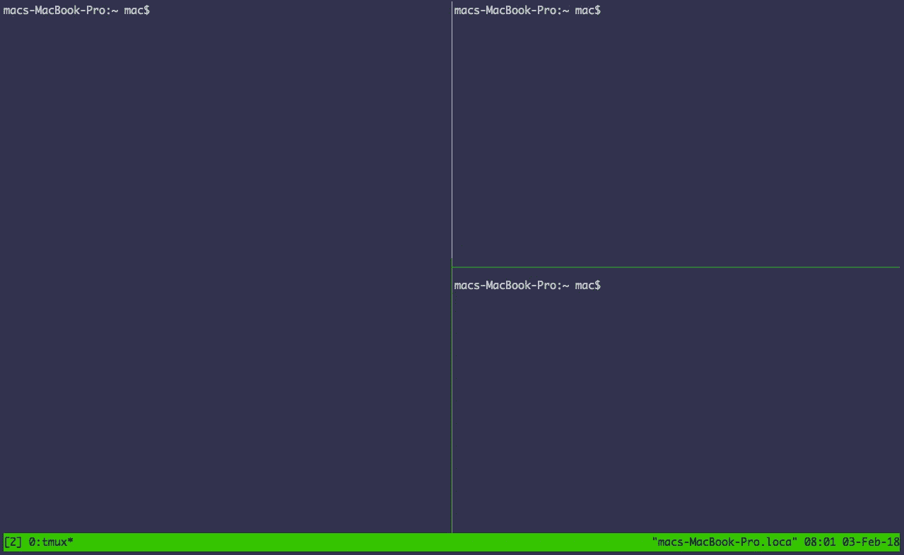

# Programmer Juga Bisa Jadi Penguasa Terminal — Belajar TMUX

> 原文：<https://medium.easyread.co/programmer-juga-bisa-jadi-penguasa-terminal-belajar-tmux-82c16a7d6b0f?source=collection_archive---------0----------------------->


Bus Station from pexels

Hai! kalian udah tahu belum,ternyata programmer juga bisa jadi penguasa terminal. Bukan cuma orang yang garang dan kekar aja yang bisa jadi penguasa terminal.

hehe, tapi tentunya bukan terminal bus ya.

maksud saya terminal yang ini.



TMUX

Sebagai programmer tentunya kalian harus sudah akrab dengan nama nya terminal atau kalau di windows dikenal command prompt (cmd).

Kalau kalian programmer masih merasa jarang menggunakan terminal, rasanya gak programmer banget.

Intinya sebagai programmer kita wajib untuk akrab dengan terminal, jangan dulu ngerasa risih dengan tampilan nya yang kelihatan jadul.

Tapi kalau kalian perhatikan sebenarnya ini terlihat cukup keren, apalagi jika dilihat oleh orang awam. PROGRAMMER BANGET.

Yang menjadi masalah, seringkali ketika menggunakan terminal, tidak cukup hanya membuka satu window saja, saya biasa nya paling sedikit bisa 3 sampai 5 windows terminal dalam kerjaan sehari-hari.

Untuk berpindah antar satu window ke window yang lainnya kadang agak ngerepotin karena windownya terpisah-pisah.

Sama kayak kita lagi browsing, kalau saya buka browser bisa sampai puluhan tab wkwk. Dan jadi agak ribet untuk pindah antar tab nya.

Nah, untuk itulah TMUX hadir untuk memudahkan kita untuk mengontrol terminal.

Contoh hasil penggunaan TMUX.



3 Pane di TMUX

Diatas ini ketika saya lagi ngoprek projek laravel.

kotak-kotak pemisah itu semua di sebut dengan **pane** .

Pane pertama digunakan untuk ngejalanin command artisan , command git , command npm dan lain sebagainya.

Pane kedua horizontal, saya gunakan untuk ngejalanin command npm run watch , yaitu untuk laravel mix.

Pane ketiga, saya gunakan untuk artisan tinker.

Dan itu tab selanjutnya saya gunakan untuk vim. Mantap! semua nya cukup dengan 1 terminal saja.

Kalau tanpa tmux, saya harus buka 3 tab di terminal, dan kalau mau melihat isi tab-tab tersebut saya harus pindah-pindah.

Dengan tmux , cukup hanya satu tab saja.

Mulai tertarik dengan tmux?

Kita lanjut ke penginstalan, untuk menginstal nya di Mac bisa pakai homebrew dengan command :

```
brew install tmux
```

untuk ubuntu dan temannya pakai command berikut :

```
sudo apt-get update
sudo apt-get install tmux
```

Untuk mulai menjalankan tmux dengan command :

`$ tmux`

Jika berhasil dijalankan maka akan muncul garis hijau tebal di bagian bawah terminal.



Jalankan Tmux

Berikut command-command dasar tmux yang saya gunakan dalam keseharian saya bekerja .

`Ctrl+b %` untuk membuat pane baru secara vertikal.



Pane vertikal

`Ctrl+b “` untuk membuat pane baru secara horizontal.



Pane Horizontal

jika tekan `Ctrl+b %` lalu `Ctrl+b “` maka akan jadi seperti berikut :



3 Pane

`Ctrl+b o` untuk berpindah antar pane searah jarum jam.

`Ctrl+b <arrow key>` untuk berpindah sesuai arah yang diinginkan bisa gunakan panah atas, bawah, kanan dan kiri.

`Ctrl+d` untuk menutup pane tanpa konfirmasi.

catatan: Ctrl+b maksudnya Ctrl ditekan bareng dengan b , lepas lalu ketikkan karakter selanjutnya.

Memang untuk menggunakan nya kita perlu menghafal beberapa shortcut, tapi menurut saya ini tools yang kalian gak akan rugi untuk meluangkan waktu mempelajarinya. worth it banget!

Asalkan tmux dipakai setiap hari, pasti kalian akan segera menguasainya.

Singkat saja artikel ini, karena sebenarnya hanya ini fitur utama dari tmux. Tapi kalau kalian mau yang lebih advance lagi saya akan kasih ebook belajar tmux. Happy Coding 💻 💻 😄

*Artikel ini di tulis oleh* [*Haidar Afif Maulana*](https://medium.com/u/631846fabf4?source=post_page-----82c16a7d6b0f--------------------------------) *, beliau adalah proffesional Full Stack Developer sejak 2014, beliau sering menulis artikel mengenai Software Engineering dan Programming. Follow profilnya untuk mendapatkan update-an terbaru artikel-artikel beliau.*

*Jika anda merasa artikel ini menarik dan bermanfaat, bagikan ke lingkaran pertemanan anda, agar mereka dapat membaca artikel ini.*