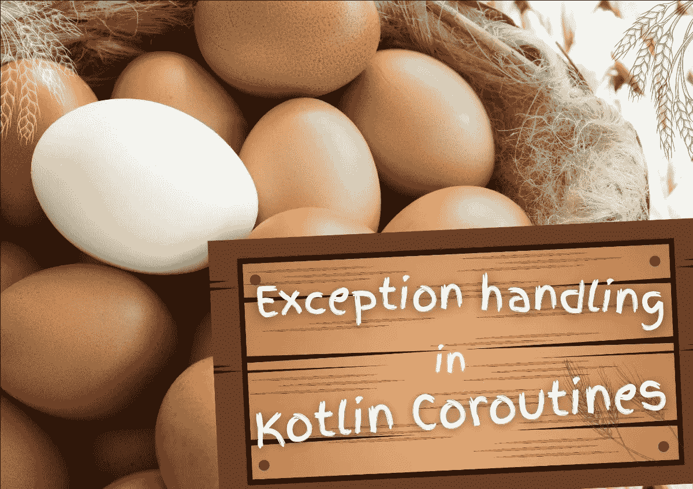
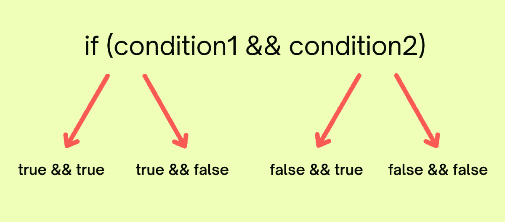
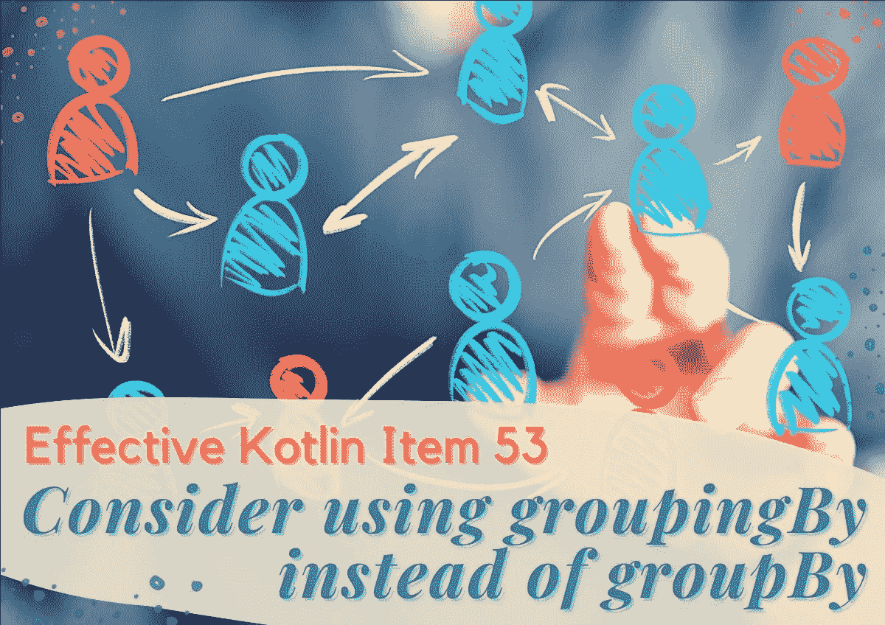

# 来自 Kt 的编程文章和有效的 Kotlin 研讨会。学院

> 原文：<https://blog.kotlin-academy.com/programming-articles-effective-kotlin-workshop-from-kt-academy-58f782436096?source=collection_archive---------4----------------------->

你好！
Kt。这里是学院**👋**

这些天晚上变得越来越长，所以这是一个扩展你的编程知识的好机会。查看我们的最新文章，让我们知道你的想法！

*️⃣:我们很想听听你对这份时事通讯的想法和建议。请回复此邮件与我们分享📩

以下是今天内容的简要总结👇

**文章**
👉[kot Lin 协程中的异常处理](https://kt.academy/article/cc-exception-handling)
👉[kot Lin 协程](https://kt.academy/article/cc-scoping-functions)中的作用域函数
👉[为所有遗漏的分支编写测试](/write-tests-for-all-your-missed-branches-3c74459ed512)
👉[有效 Kotlin 第 53 项:考虑使用 groupingBy 代替 groupBy](https://kt.academy/article/ek-grouping)

**卓有成效的科特林研讨会**即将在🥳举行

尽情享受吧！⏬

关于 Kotlin 协程中的异常处理机制，您需要了解的一切。

**Marcin Moskala 编写的 Kotlin 协同程序中的异常处理**👇

[Exception handling in Kotlin Coroutines](https://kt.academy/article/cc-exception-handling)
🔻 This is a chapter from the [Kotlin Coroutines](https://kt.academy/book/coroutines) book. You can find Early Access on [LeanPub](https://leanpub.com/coroutines/).

coroutineScope、withContext 和其他作用域函数是如何工作的，以及为什么它很棒。

**Marcin Moskala 的 Kotlin 协同例程**中的作用域函数👇

[Scoping functions in Kotlin Coroutines](https://kt.academy/article/cc-scoping-functions)
🔻 This is a chapter from the [Kotlin Coroutines](https://kt.academy/book/coroutines) book. You can find Early Access on [LeanPub](https://leanpub.com/coroutines/).

在这篇博文中，您将了解如何识别缺失的分支，并为您的代码编写更好的测试。

为所有遗漏的分支编写测试👇

[Write Tests for all your Missed Branches](/write-tests-for-all-your-missed-branches-3c74459ed512)

什么是分组，用 groupBy 代替 group by 如何实现性能优化？

考虑使用 groupingBy，而不是 Marcin Moskala 的 groupBy👇

[Effective Kotlin Item 53: Consider using groupingBy instead of groupBy](https://kt.academy/article/ek-grouping). 🔻 This is a chapter from the [Effective Kotlin](https://kt.academy/book/effectivekotlin) book. You can find it on [LeanPub](https://leanpub.com/effectivekotlin) or [Amazon](https://www.amazon.com/Effective-Kotlin-practices-Marcin-Moskala/dp/8395452837/ref=sr_1_1?dchild=1&keywords=effective+kotlin&qid=1615033955&sr=8-1).

只剩下 **2 周**来参加我们**由 Marcin Moskala 举办的**公开有效的 Kotlin 研讨会🔥

日期:**2021 年 10 月 25 日–27 日**
时间:**9:00–17:00 CEST**(GMT+2，华沙时区)
价格: **400 欧元**每人
郎:**恩**

查看详细信息并在此注册👇
[有效的科特林开放工场](https://kt.academy/workshop/effectiveKotlin)

今天就到这里吧！

谢谢，再见！

卡帕头。学院团队

www: [kt.academy](https://kt.academy/)
博客:[blog.kotlin-academy.com](http://blog.kotlin-academy.com/)
Twitter EN:[@ ktdotsacademy](https://twitter.com/ktdotacademy)
Twitter PL:[@ ktdotsacademypl](https://twitter.com/ktdotacademyPL)
FB:[@ ktdotsacademy](https://www.facebook.com/KtDotAcademy)
LinkedIn:[@ Kt。学院](https://www.linkedin.com/company/kt-academy/)

