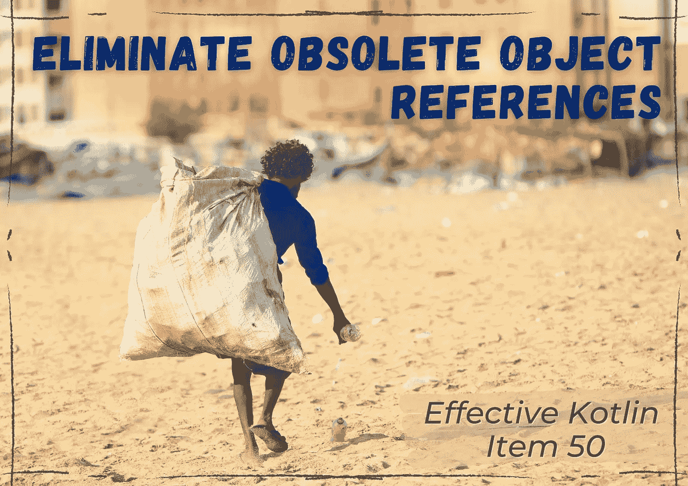
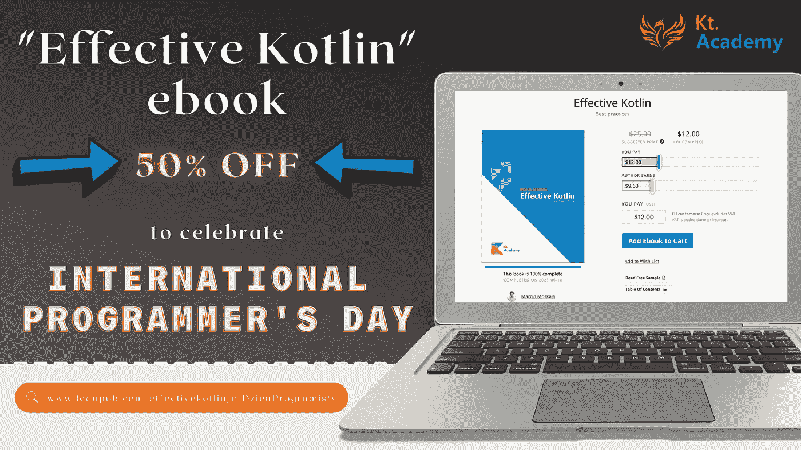

# 来自 Kt 的编程文章和播客。学院

> 原文：<https://blog.kotlin-academy.com/programming-articles-podcast-from-kt-academy-ca50fd69118b?source=collection_archive---------2----------------------->

你好！
Kt。这里是学院**👋**

我们今天为您带来了大量精彩的文章，所以让我们直接跳到内容吧！

*️⃣:我们很想听听你对这份时事通讯的想法和建议。请回复此邮件与我们分享📩

以下是今天内容的简要总结👇

**文章**
👉[兜帽下的花冠](https://kt.academy/article/cc-under-the-hood)
👉[协程内置支持 vs 库](https://kt.academy/article/cc-built-in-vs-library)
👉[科特林](/thinking-functionally-in-kotlin-1928c9995643)中的功能性思维
👉有效 Kotlin 项目 49: [考虑使用内联值类](https://kt.academy/article/ek-value-classes)
👉有效的 Kotlin 项目 50: [消除过时的对象引用](https://kt.academy/article/ek-object-references)

[与霍尔格一起编码](https://anchor.fm/coding-with-holger?utm_medium=social&utm_source=twitter&utm_campaign=postfity&utm_content=postfity5a725) —与马钦·莫斯卡拉一起播客科特林
[国际程序员节](https://leanpub.com/effectivekotlin/c/DzienProgramisty) —有效科特林电子书🥳半价

尽情享受吧！⏬

深入探究暂停和延续在幕后是如何工作的。

**兜帽下的花冠**马尔钦·莫斯卡兹👇

[Coroutines under the hood](https://kt.academy/article/cc-under-the-hood)
🔻 This is a chapter from the [Kotlin Coroutines](https://kt.academy/book/coroutines) book. You can find Early Access on [LeanPub](https://leanpub.com/coroutines/).

语言内置的协同程序功能和作为库发布的协同程序功能有什么区别？

在 Marcin Moskala 撰写的文章**协程内置支持 vs 库**中找到答案👇

[Coroutines built-in support vs library](https://kt.academy/article/cc-built-in-vs-library)
🔻 This is a chapter from the [Kotlin Coroutines](https://kt.academy/book/coroutines) book. You can find Early Access on [LeanPub](https://leanpub.com/coroutines/).

在 Kauserali Hafizji 撰写的文章**Kotlin 中的功能性思维**中，我们将与 kot Lin 一起工作👉凡是用 Java 的地方都可以用 Kotlin！

[Thinking functionally in Kotlin](/thinking-functionally-in-kotlin-1928c9995643)

什么是值类，如何使用和内联它们？

考虑使用 Marcin Moskala 的内联值类👇

[Effective Kotlin Item 49: Consider using inline value classes](https://kt.academy/article/ek-value-classes)
🔻 This is a chapter from the [Effective Kotlin](https://kt.academy/book/effectivekotlin) book. You can find it on [LeanPub](https://leanpub.com/effectivekotlin) or [Amazon](https://www.amazon.com/Effective-Kotlin-practices-Marcin-Moskala/dp/8395452837/ref=sr_1_1?dchild=1&keywords=effective+kotlin&qid=1615033955&sr=8-1).

如何帮助我们的垃圾收集器，避免内存泄漏？🤔

**消除过时的对象引用**👇

[Effective Kotlin Item 50: Eliminate obsolete object references](https://kt.academy/article/ek-object-references)
🔻 This is a chapter from the [Effective Kotlin](https://kt.academy/book/effectivekotlin) book. You can find it on [LeanPub](https://leanpub.com/effectivekotlin) or [Amazon](https://www.amazon.com/Effective-Kotlin-practices-Marcin-Moskala/dp/8395452837/ref=sr_1_1?dchild=1&keywords=effective+kotlin&qid=1615033955&sr=8-1).

Marcin Moskala 是 Holger 播客中的嘉宾。显然，他是在谈论科特林和一般的编程。

你可以在这里听👇
[**编码同霍尔格:科特林同马尔辛**](https://anchor.fm/coding-with-holger?utm_medium=social&utm_source=twitter&utm_campaign=postfity&utm_content=postfity5a725)

**13 号不一定不吉利！**

13.09.我们正在庆祝🥳国际程序员节

值此之际，我们为您提供 **50%折扣的《有效科特林》电子书**！

你可以通过这个链接购买👇

[https://leanpub.com/effectivekotlin/c/DzienProgramisty](https://leanpub.com/effectivekotlin/c/DzienProgramisty)

*️⃣有效期为 2021 年 9 月 13 日至 15 日

今天就到这里吧！

谢谢，再见！

卡帕头。学院团队

www: [kt.academy](https://kt.academy/)
博客:[blog.kotlin-academy.com](http://blog.kotlin-academy.com/)
Twitter EN:[@ ktdotsacademy](https://twitter.com/ktdotacademy)
Twitter PL:[@ ktdotsacademypl](https://twitter.com/ktdotacademyPL)
FB:[@ ktdotsacademy](https://www.facebook.com/KtDotAcademy)
LinkedIn:[@ Kt。学院](https://www.linkedin.com/company/kt-academy/)

