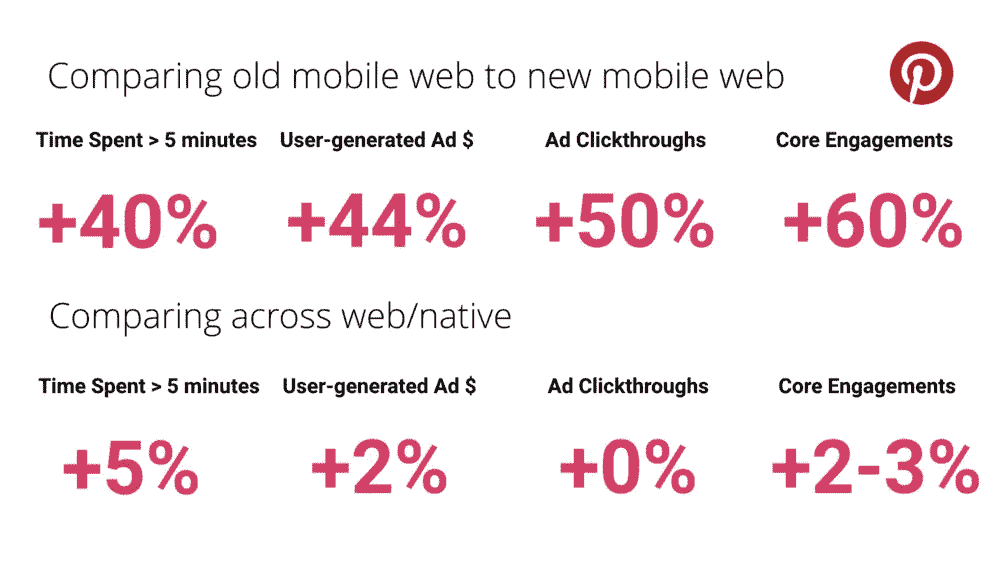
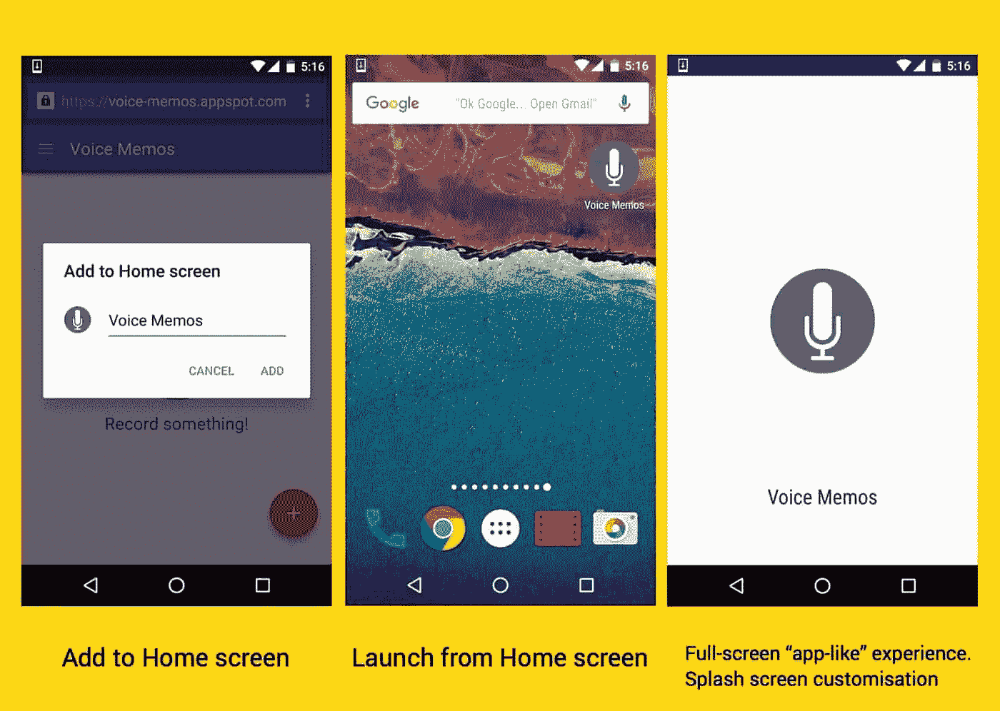
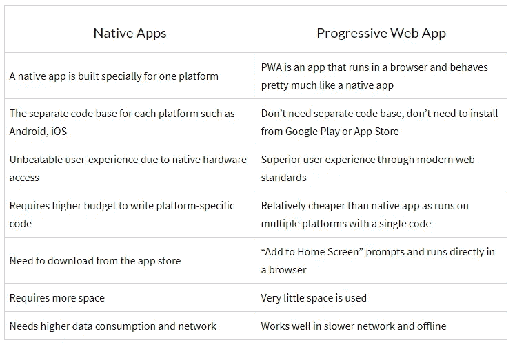
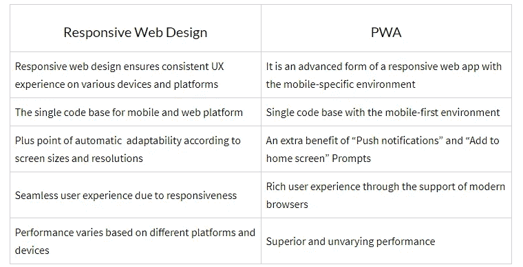
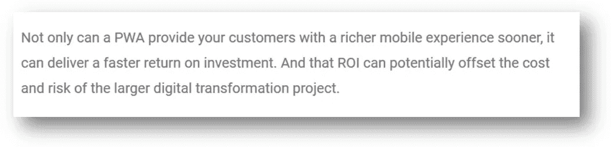

# 渐进式网络应用程序:这里是你需要知道的关于 PWA 的一切

> 原文：<https://medium.com/quick-code/progressive-web-app-heres-everything-you-need-to-know-about-pwa-cf2fefcbf24e?source=collection_archive---------0----------------------->

“**渐进式网络应用**的想法创造了历史。

即使是现在，它也有迎合移动和网络平台需求的巨大潜力，值得讨论。几年前，移动 app vs. mobile web 的流行辩论成为 PWA 存在的背后原因。

我们为什么要谈论它？

【cloudfour.com】按 [按](http://cloudfour.com/)

******Pinterest** 将他们的**移动网站重建为 PWA** 并注意到**核心约定** **提高了**60%。他们还注意到****增加了**44%**用户产生的广告收入**和**花费的时间也增加了 **40%** 。********

********

*****Image:* [*Dev Channel on Medium*](/dev-channel/a-pinterest-progressive-web-app-performance-case-study-3bd6ed2e6154)****

****Tinder 通过其新的 PWA 将**加载时间**从 **11.91 秒减少到了**4.69 秒。****

******Trivago** 观察到，对于将其 **PWA 添加到主屏幕**的人来说，**用户参与度**增加了 **150%** 。****

******优步**的 **PWA** 用**不到 3 秒**加载到 **2G 网络** s****

******BookMyShow** 的 **PWA** 比 **android** 小 **54x，比一个 **iOS app** 小**180 x**。它还将转换率提高了 80%以上。******

**福布斯网站只需 2.5 秒就能在 mobile 上加载，而之前的网站需要 6.5 秒。**

**Flipkart 的 **PWA** 正在推动其**新客户获取**的 **50%** 。**

****Twitter Lite** 注意到每会话页面**增加**65%，推文增加 **75%，而**跳出率**减少 **20%** **。******

**Ola 已经报告移动流量**增长了 68**。**通过 **PWA** 预订的用户**中有 20%之前**卸载了 Ola 原生 App** 。**

****OLX** 看到**使用**推送通知**和**重新参与**的广告点击率比**高 146%。不，这些不只是数字。这些都是普华永道会计事务所(PWA)的成功案例。**

# **为什么渐进式网络应用越来越流行？**

## **以下是从普华永道的历史到现状，你需要了解的所有信息。**

# **什么是 PWA？**

**简而言之，渐进式网络应用是加载到网络浏览器中的网络应用，就像网页或网站一样。它通过类似本机的功能(如脱机工作的能力、推送通知和设备硬件可访问性)为您提供丰富的移动体验。**

**这感觉就像一个原生应用程序，提供了与原生应用程序相同的体验。无需从应用商店下载。它在 web 浏览器中加载、运行和运行。**

## **渐进式网络应用推广移动优先方法**

**根据一份 [Statista](https://www.statista.com/statistics/274774/forecast-of-mobile-phone-users-worldwide/) 报告，**

> **预计到 2019 年，移动电话用户将达到 46.8 亿。**
> 
> **进一步来看，2016 年，估计全球 62.9%的人口已经拥有手机。到 2019 年，这一比例将达到 67%。**

**这清楚地表明，移动优先的方法无处不在。移动应用的兴起也标志着“一切应用”时代的到来。**

**另一方面，网络应用的开发在很大程度上也是进化的。从静态网站到动态到单页 web 应用，许多概念和技术已经被引入和使用。网络开发者优先考虑的是响应性的网页设计，以及探索渐进式网络应用和跨平台应用等创意。**

**虽然几乎任何东西都可以用同一个应用，但用户发现很难在一台设备上安装、维护和使用各种应用。**

****需要考虑的因素有:****

*   **增加的应用程序大小**
*   **不经常使用该应用程序**
*   **互联网连接性低**
*   **高数据和存储消耗**
*   **频繁更新和权限**
*   **用于特定目的的替代品的数量，如食品配送、电子商务等**

**PWA 正是克服这些问题的正确选择。怎么做？**

**[PWA 连接了网络和移动](https://www.spec-india.com/blog/progressive-web-apps-offering-best-two-worlds-web-mobile/)的区别，在网络浏览器中为用户提供卓越的原生性能。最简单地说，这是一种通过网络交付的移动应用。**

# **听起来很有趣？以下是渐进式网络应用的一些特点:**

*   ****它提供了超级丰富的体验:**由于现代网络标准，它提供了一个吸引人的用户体验**
*   ****类似 App 的体验:**使用时，你会感受到原生的体验和功能**
*   ****安全:**它使用 HTTPS 来防止任何威胁和漏洞**
*   **现代版:由于像服务人员这样的功能，这些应用程序是最新的**
*   ****响应速度快:**就响应速度而言，PWA 最适合移动设备、台式机和平板电脑**
*   ****离线工作，在低质量的网络上:**这是最重要的；它离线运行，甚至在低连接**
*   ****可链接:**通常通过链接共享，不需要单独安装**

# **添加到主屏幕提示:PWA 的主要吸引力:**

**为了方便安装，PWA 提供了“添加到主屏幕”弹出窗口，允许用户轻松地在移动设备上安装应用程序。该功能是该应用程序受欢迎的重要原因之一。接受提示后，应用程序将被轻松快速地安装。**

****

***Image:* [*developers.google.com*](https://developers.google.com/web/updates/2015/12/getting-started-pwa)**

# **进步的网络应用是如何出现的？**

**你会惊讶地发现，到 2019 年，搜索引擎用户的数量预计将达到 2.364 亿。**

**通常，用户更喜欢他们设备上的搜索引擎，而不是直接在 app store 中搜索解决方案。另一方面，移动搜索对于每年增长率为 146%的企业来说至关重要。**

> **“Progressive web app 利用 web 和移动平台来证明其在可用性、用户体验、速度、财务可行性和整体效率方面超越原生应用的能力。”**

**本地应用程序和响应性 Web 应用程序还有其他一些故事要讲。原生应用提供了卓越的用户体验，但上市时间更长，成本也高得多。响应式 web 应用程序也提供了类似本地的体验，但它需要额外的努力来实现兼容性。**

**随着 web 开发向更动态、更快速、响应性更强的应用程序发展，JavaScript、CSS3 和 HTML5 等技术随着先进的标准越来越受欢迎。**

**出于同样的想法，设计师弗朗西斯·贝里曼和谷歌 Chrome 工程师亚历克斯·罗素在 2015 年首次引入了“渐进式网络应用”这一术语，旨在将移动体验和现代浏览器的支持结合起来。**

**在选择 PWA 后，组织观察到参与度和投资回报率大幅上升。然而，在你妄下结论之前，有几个问题和因素需要注意。**

# **PWAs vs 原生应用:你需要知道什么？**

****

## **请看这里的快速对比:**

# **响应式网页设计 vs 渐进式网页应用:澄清困惑**

****

**很明显，在 cots、用户体验、上市时间和应用优化方面，PWA 比响应式 web 设计、 [web 应用开发](https://www.spec-india.com/services/web-application-development/)和原生应用开发具有额外的优势。**

## **PWA 和 SEO:用户友好和 SEO 友好的强大在线存在**

****

***Image: Pinterest PWA SEO Score via* [*Pinterest_Engineering on Medium*](/@Pinterest_Engineering/a-one-year-pwa-retrospective-f4a2f4129e05)**

> ****“顶级渐进式网络应用在搜索引擎优化中得分 85%。”****

**任何应用程序都需要更深入的参与模式来创造成功故事。一旦下载了应用程序，就很难保持相同的参与度。**

**PWA 为此提供了一个合适的解决方案:**

**通过推送通知和添加到主屏幕，PWA 赢得了用户参与的战斗。*凭借显著更快的加载时间、离线运行功能、响应式设计、安全结构和更低的数据使用量*，使用必要的关键词进行优化非常容易，从而获得在线展示的好处。**

# **用于电子商务的渐进式网络应用:利用 PWA 的高转换特性**

**零售商经常尝试各种策略来吸引他们的客户，无论是本地应用程序还是响应式设计。零售商非常重视移动优先的用户体验，他们依靠渐进式 web 应用程序开发来提供类似应用程序的体验和更高的转化率。**

**它解决了移动转化率较低的基本问题，例如**

*   **发现应用程序的可用性，然后从 app store 下载**
*   **推送通知比电子邮件效果更好，提高了点击率**
*   **添加到主屏幕以提供直接从浏览器访问的功能**
*   **全屏模式，无缝用户体验**
*   **更快地加载页面，实现更流畅的用户交互**
*   **真正的原生移动优先设计，增加移动用户参与度**
*   **来自 Google 的 SEO boost 可以吸引购物者和访问者的注意**

****

***Credit:* [*Think with Google Blog*](https://www.thinkwithgoogle.com/marketing-resources/progressive-web-app-mobile-revenue/)**

**观看以下视频，了解 PWA 如何帮助全球知名的电子商务平台 Flipkart 提高销售额:**

# **PWA 如何提高投资回报率和转化率？**

**技术每年都在变化。**

**移动体验凭借前所未有的功能和使用案例占据了中心舞台。**

*****“移动战略不再是当今时代的‘秘方’，而是一种必须。”*****

**随着 iOS 11.3 的推出，苹果已经开始支持 PWA 的基本技术集。渐进式网络应用通常被认为是“低投资高回报”。它以经济高效的方式提供了卓越的用户体验。**

***“总体而言，移动网络每周活跃用户同比增长 103%，其中巴西增长 156%，印度增长 312%。在参与度方面，会话长度增加了 296%，看到的图钉数量增加了 401%，人们将图钉保存到板上的可能性增加了 295%。”***

****–Pinterest 工程团队在一个中型岗位****

**全球品牌已经采用 PWA 来提供跨平台和设备的完美体验和可访问性。它作为一项关键技术同时面向网络和移动用户。**

**此外，它在不可靠和缓慢的数据连接中表现良好，这使得它在经历过信号丢失、2G 网络、中断的交易和不成功的过程的用户中很受欢迎。这往往会导致潜在客户的流失。这里，PWA 提供了额外的可访问性和可用性的优势，即使在最慢的连接中。**

****这里有一个领先的酒店搜索引擎 Trivago 的例子:****

> **在因一段时间离线而中断会话的用户中，67%的用户在重新上线后会继续浏览网站。**
> 
> **–**用谷歌帖子思考****

**此外，它还可以用于在顾客从商店下载产品或服务之前检查他们想要的产品或服务。有许多类似的场景，PWA 工作得非常好。**

## **你有什么见解？**

**目前，现代技术已经将 web 应用程序开发提升到了一个新的水平。PWA 远不止这些。在采用它之前，有许多事情需要考虑，并且要深入了解好处、缺点、需求和结果。我们希望你喜欢阅读关于 PWA！**

**请继续关注更多关于 PWA 及其与其他类型应用程序的比较的文章。我们欢迎您的意见和建议！**

***本帖最初发表于我们的博客:* [*此处*](https://www.spec-india.com/blog/progressive-web-app-heres-everything-you-need-to-know-about-pwa/)**