# 使用 PokeAPI 和 Firebase 部署渐进式 Web 应用程序

> 原文：<https://medium.easyread.co/progressive-web-apps-with-pokeapi-and-deploy-using-firebase-9e6aeb9e3abd?source=collection_archive---------2----------------------->

## 如何创建一个简单的渐进式 Web 应用程序并部署到 Firebase？

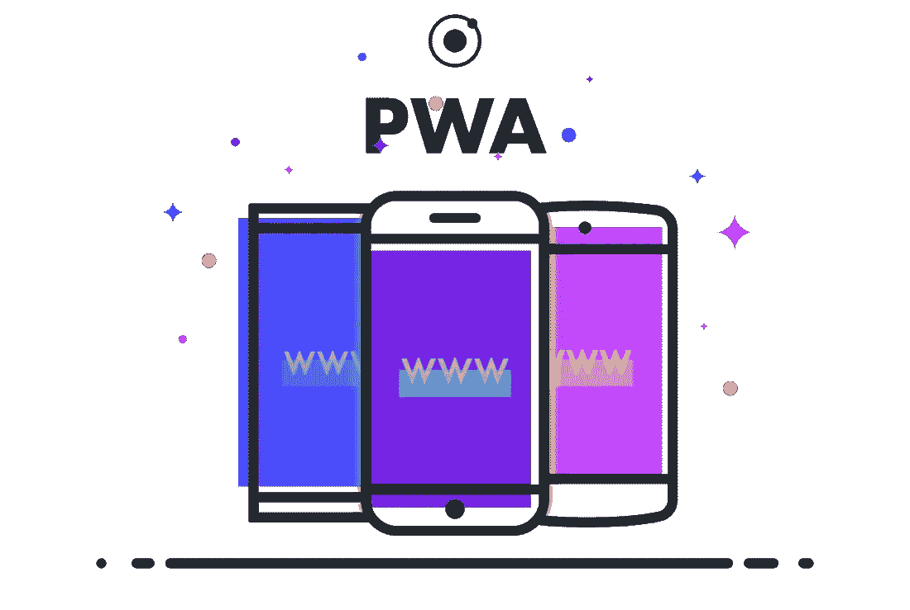

[https://encrypted-tbn0.gstatic.com/images?q=tbn:ANd9GcQN9smacZhSdYRvNjOJG8orpNdrAVkVxSPNL8VYTCMcO5LRmQwB](https://encrypted-tbn0.gstatic.com/images?q=tbn:ANd9GcQN9smacZhSdYRvNjOJG8orpNdrAVkVxSPNL8VYTCMcO5LRmQwB)

> 大家好，现在我想分享一下我在完成建造 PWA 课程后的收获。实际上，已经有大量文章介绍了 PWA。但是我仍然写这个，因为我对它感到兴奋。我写这篇文章是基于我的经验，所以如果这篇文章有什么问题请纠正我😅

我们首先要知道的是**“什么是 PWA”**。PWA 是一个 web 应用程序，结合了现代浏览器的功能和移动体验。使用 PWA，有很多优点，例如在离线模式下运行应用程序，直接将应用程序添加到屏幕上，通过 URL 访问，等等。虽然 PWA 具有所有的优点，但它也有一些缺点，比如还不支持所有的浏览器，不能通过商店应用程序获得，等等。但是，凭借 PWA 提供的优势，我们没有办法不尝试它。

# 当我们构建 PWA 时，我们必须使用一些组件。

## 服务行业人员

Service worker 是一个在后台应用程序中运行的脚本，与网页分离，允许我们使用一些不需要用户交互的功能。当用户向我们的网站发出请求时，服务人员将充当代理，并决定该请求是继续发送到服务器还是使用之前存储的数据(点击此处了解更多)。

## 隐藏物

缓存是当我们访问某个页面时，浏览器用来节省一些资源的本地存储。如果我们第二次访问该页面，该页面将从缓存中加载资源。

## Web 应用程序清单

Web 应用程序清单是一个 JSON，它包含关于我们应用程序的元数据，并告诉浏览器应用程序应该如何运行。(此处阅读更多)。

## **获取 API**

Fetch API 是一个允许我们通过网络访问和操作资源的接口。(此处阅读更多[)。](https://developer.mozilla.org/en-US/docs/Web/API/Fetch_API/Using_Fetch)

## **推送通知**

推送通知是一种通知用户重要事件的方式，即使他们此刻没有使用应用程序。(此处阅读更多)

## 应用程序外壳

应用程序外壳是一个用户界面组件，将像标题，侧栏，页脚使用。它将首先缓存，并在每次用户访问时显示相同的内容(一致性)。因为我们将应用程序外壳保存在缓存中，所以不需要向服务器请求它。(此处阅读更多)。

## 索引 b

IndexedDB 是我们浏览器内置的数据库。IndexedDB 是 NoSQL，这意味着我们不能使用 SQL 语法进行查询。(此处阅读更多[)。](https://developers.google.com/web/ilt/pwa/working-with-indexeddb)

在我们尝试制作自己的 PWA 之前，我们需要准备:

*   版本≥ 52 的 Chrome 浏览器
*   [Chrome 网络服务器](https://chrome.google.com/webstore/detail/web-server-for-chrome/ofhbbkphhbklhfoeikjpcbhemlocgigb?hl=id)
*   编辑器( [WebStrom](https://www.jetbrains.com/webstorm/) ， [VSCode](https://code.visualstudio.com/) ， [Sublime](https://www.sublimetext.com/) )
*   HTML、CSS 和 Javascript 的基础知识

现在，让我们构建自己的 PWA。我们将尝试构建一个关于口袋妖怪的简单应用程序。我们将为这个项目使用口袋妖怪 API([PokeAPI](https://pokeapi.co/))。我们也将使用物化 CSS(在这里下载)。如果你愿意，你可以使用另一个 CSS 框架。提取。zip 文件到您的项目文件夹中。您的项目文件夹应该如下所示👇

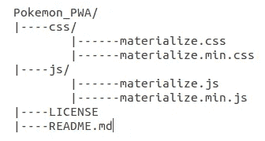

Project structure

第一步，在根文件夹中创建`index.html`。创建 HTML 结构，并用以下内容填充`<body>`标记:

之后，在`</body>`标签之前，加上这个👇

我们在这里做的是，检查对象导航器是否已经存在于我们的浏览器中。如果导航器不存在，这意味着我们的浏览器还不支持。然后，我们使用方法`navigator.serviceWorker.register().`注册我们的`service-worker.js`。现在，让我们创建一个文件`service-worker.js`,并用这个代码填充它👇

我们在这里所做的是，首先我们用一个变量`CACHE_NAME.`给缓存命名，然后，我们在`urlsToCache.`中添加我们想要缓存的文件，之后，我们为`install`添加一个事件监听器，当服务工作者注册成功时将调用它。我们先用`caches.open()`打开缓存，用`cache.addAll().`将我们的`urlsToCache`文件添加到缓存中，我们可以在**缓存**中检查我们的缓存是否成功，在 **DevTools** 标签**应用**中。

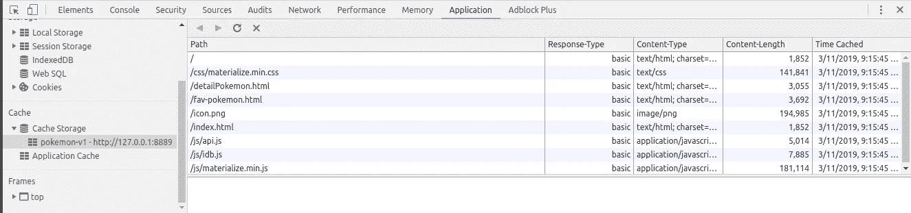

Our asset already in cache.

接下来，让我们添加这段代码来使用缓存中的资产。

我们在这里做的是，首先，我们检查请求是否与缓存中的资产相等。如果请求匹配，它将从缓存中返回资产。如果不是，它将向服务器请求资产。然后，让我们的应用程序能够**添加到主屏幕**。将这段代码添加到我们的`<head>`元素中👇

然后，在根文件夹中创建一个文件`manifest.json`,并添加以下代码👇

为了确保我们的清单已经正确设置，请转到 Chrome DevTools 的**应用程序**面板上的**清单**选项卡。毕竟，我们可以通过使用 Chrome 的 Web 服务器来运行我们的应用程序，并转到 URL。

我们已经制作了所有需要的组件，现在，让我们添加数据。正如我之前提到的，我们将使用 PokeAPI。可以先查一下试试。
我们要做的第一件事是在`js`文件夹中创建一个文件`api.js`。当我们的应用程序与 PokeAPI 交互时，这个文件将进行处理。在`api.js`中添加这段代码👇

我们在这里做的是，首先，我们创建包含 API URL 的变量`base_url`。然后，我们创建一个函数`getAllPokemon()`从 API 中获取 pokemon 的所有数据。在这个函数中，我们还使用`innerHTML`将数据呈现到 HTML 中，并将响应保存到缓存中。之后，让我们通过添加这段代码来调用`index.html`中的函数👇

不要忘记用`<script src="js/api.js"></script>`调用`api.js`并将文件添加到`service-worker.js`。

当你运行应用程序时，你应该会得到如下结果。酷吧 lol。

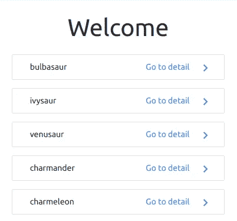

List of Pokemon

然后，让我们在根文件夹中创建`detailPokemon.html`，以显示口袋妖怪的细节。你可以复制`index.html`并用这个代码修改`<script>`里面的代码👇

现在，让我们用下面的代码创建`api.js`中的函数👇

这个函数将从 API 得到一个关于口袋妖怪名称的响应，我们将在 HTML 中显示数据。到这里，我们应该可以看到`index.html`中所有的口袋妖怪列表，并且可以看到`detailPokemon.html`中每个口袋妖怪的细节，如下图所示。你可以根据自己的意愿定制细节，做得比我的更好(我不擅长设计😅).

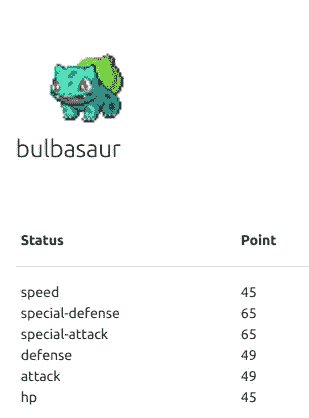

Detail of Pokemon

现在，让我们做一些改进😆。我们要做的是，我们将为我们最喜欢的口袋妖怪制作一个页面，并能够使用通知。我们会用 IndexedDB 来拯救我们最喜欢的口袋妖怪。

首先，我们在这里下载库[。提取文件，并将`idb.js`文件复制到`js`文件夹中。不要忘记将它添加到`urlsToCache`变量内的`service-worker.js`中，以首先缓存该文件。不要忘记在`</body>`标签前用`<script src="js/idb.js"></script>`调用`idb.js`。现在，让我们在`detailPokemon.html`中添加 fab 来触发功能，并将口袋妖怪保存到我们的收藏夹列表中。在按钮中，我们添加了`onclick`事件，并调用`addPokemon()`来触发保存数据到 IndexedDB 的函数。](https://github.com/jakearchibald/idb/archive/v2.1.3.zip)

让我们在`js`文件夹中创建一个文件`db.js`，不要忘记像以前一样在`sevice-worker.js`中添加该文件。这个文件将处理我们的数据库操作。首先，添加如下代码👇

我们在这里做的是，首先，我们使用`idb.open()`返回一个包含数据库对象的承诺，我们将使用它与 IndexedDB 进行交互。如果数据库尚不存在，IndexedDB 将创建一个新的数据库。我们将使用`id`作为使用`keypath`的主键。之后，在`db.js`中为`addPokemon()`功能添加如下代码👇

我们在这里做的是，在从 API 获取数据后，我们将使用事务把它保存到数据库中。如果交易成功，它将重定向到`fav-pokemon.html`是的，我们现在没有`fav-pokemon.html`，但我们以后会添加它。我们先完成函数。

现在，我们能够将口袋妖怪存储到数据库中我们最喜欢的列表中。让我们用这段代码创建另一个函数来获取所有我们喜欢的口袋妖怪👇

使用`store.getAll()`函数，我们将从数据库中获取所有数据，并使用`innerHTML`将其显示在 HTML 中。接下来，我们将用这段代码创建`deletePokemon()`函数👇

在上面的代码中，我们将能够使用`id`作为参数从数据库中删除口袋妖怪。如果交易成功，它会将我们重定向到`index.html`。现在，我们的`db.js`已经准备好了，让我们在根文件夹中创建`fav-pokemon.html`，并调用`getAllFavPokemon()`函数。

接下来，让我们将`fav-pokemon.html`链接到我们的应用程序，如下所示👇

这就是了😙我们的应用应该能够:

1.  显示 API 中的所有口袋妖怪
2.  前往详细口袋妖怪
3.  将口袋妖怪添加到收藏夹列表
4.  从收藏列表中删除口袋妖怪

最后，让我们做一些通知，当我们把口袋妖怪添加到我们最喜欢的列表，也当我们删除它。首先，在`index.html`中添加这段代码

这段代码将检查浏览器是否支持通知。如果通知允许，我们将能够从这个应用程序接收通知。最后，将这段代码添加到`addPokemon()`和`deletePokemon()`函数内的`db.js`中。

addPokemon()的通知

删除口袋妖怪的通知()

酷吧？现在，我们将使用 firebase 部署我们的应用程序🤩首先，我们的环境需要`npm`。(点击查看[)。然后，让我们从在终端中键入这个命令开始。](https://docs.npmjs.com/downloading-and-installing-node-js-and-npm)

```
$ npm install -g firebase-tools
```

接下来，让我们在[https://console.firebase.google.com/](https://console.firebase.google.com/)
中创建我们的 firebase 账户，然后按照步骤操作，直到弹出**你的新项目准备好了**。打开你的终端，输入

```
$ firebase login.
```

通过这个命令，你将得到窗口浏览器来验证你的谷歌帐户。如果登录过程成功，您将看到如下成功消息。

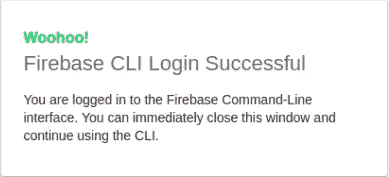

Login firebase success

现在，我们可以转到项目目录并键入

```
$ firebase init
```

它将向我们显示如下一些选项。

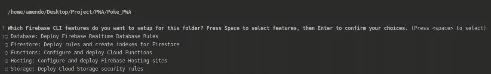

去选择**托管:配置和部署 Firebase 托管站点**。
然后我们会得到如下的选项。如果您还没有在 firebase 中创建项目，选择**【创建新项目】，**并创建项目。

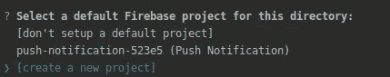

之后，你会得到一个如下的问题，第一个问题只需回车，第二个问题输入 **N** 。

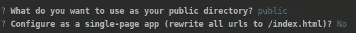

然后，它会生成文件`firebase.json`和`.firebashrc`。如果成功，您会收到这条消息。

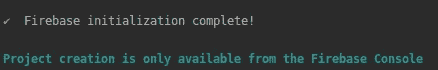

然后，我们可以使用命令:

```
$ firebase use --add
```

该命令将我们的项目添加到 firebase，并在 firebase 中选择目标项目。

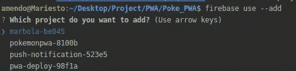

您将被要求为项目创建一个别名，您可以随意填写。我用`pokemonpwa`制作我自己的

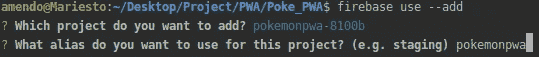

在我们部署我们的应用程序之前，我们需要改变我们的`firebase.json`中的一些东西，应该是这样的。

我们在这里所做的是，当应用程序启动时，应用程序将前往`index.html`。

对于最后一步，只需键入

```
$ firebase deploy
```

然后嘣💥💥💥。我们的项目已经部署。我们可以通过**托管 URL** 访问它。

亚什🎉 🎉 🎉这是我们的应用程序。希望这篇文章对你有帮助。如果你有意见或纠正，请告诉我。另一篇文章再见👋

> 你可以在我的回购[这里](https://github.com/mariesto/PokemonPWA)访问完整的代码