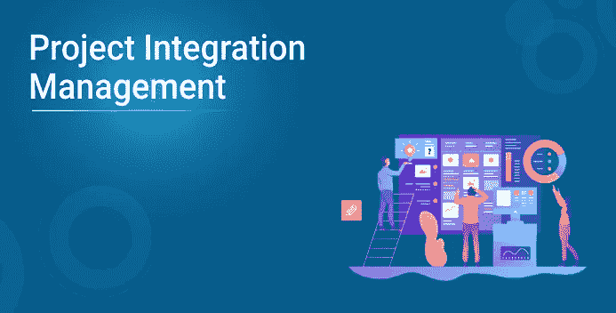
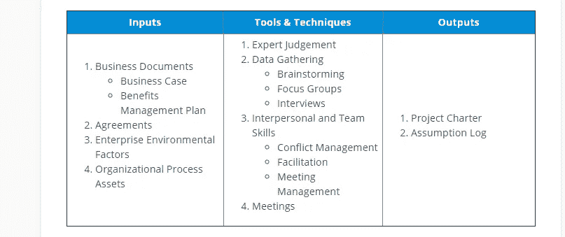
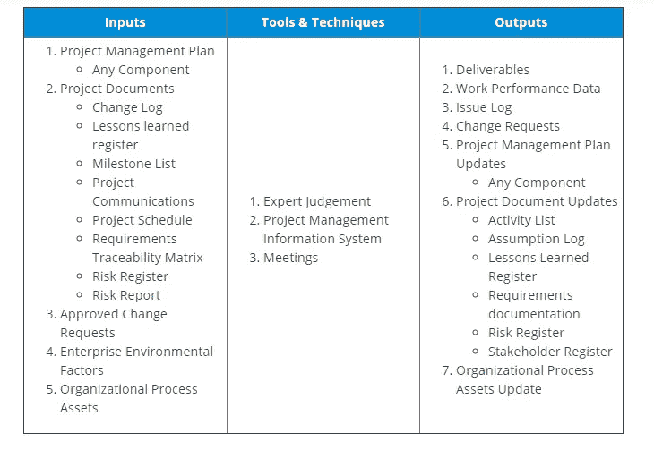
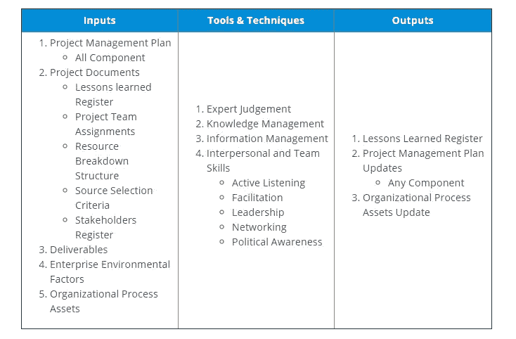
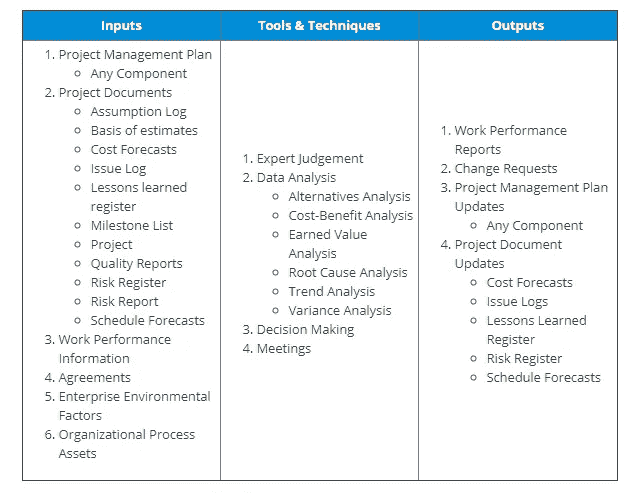
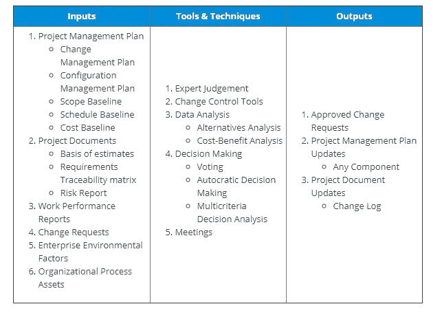
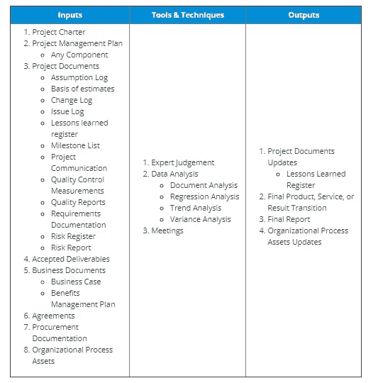

# 项目集成管理

> 原文：<https://medium.com/edureka/project-integration-management-b2f36d4ba666?source=collection_archive---------1----------------------->

项目管理是一个复杂的框架，它是围绕许多活动和过程建立的，这些活动和过程就像拼图一样。项目集成管理有助于将所有这些部分整合成一个有凝聚力的整体，并确保项目的成功。通过这篇项目集成管理的文章，我将试图给你一个完整的关于集成管理是如何工作的，它的各种过程，以及在每一个过程中使用的工具。

以下是我将在这篇项目集成管理文章中讨论的主题:

*   项目集成管理
*   集成管理的需求
*   项目集成管理流程

现在，让我们开始我们的文章。

# 项目集成管理

项目集成管理是项目管理框架的第一个知识领域，有助于维持项目的稳定性。它涉及项目管理生命周期的所有阶段——启动、计划、执行、监控和结束。这意味着集成管理有助于项目经理密切关注在整个项目生命周期中执行的各种程序；从开始到结束。

对于项目经理来说，拥有一个合适的集成管理计划是非常重要的，因为它将确保整个团队朝着一个共同的目标努力，同时在给定的时间框架、范围和预算内成功完成项目。

# 集成管理的需求

*   集成管理确保了项目的各种交付物的到期日、它的生命周期和收益管理计划是一致的。
*   为了实现项目目标，它提供了一个组织良好的管理计划，完美地同步了各种过程。
*   它有助于管理和控制项目管理活动/任务所需的绩效和变更。
*   它协调关于影响项目的关键变更的决策。
*   集成管理通过采取必要的步骤来实现目标，从而度量和监控项目的进展。
*   它在收集关于所取得成果的数据、分析数据以获得更深入的见解，然后将其传达给相关的利益攸关方方面发挥着至关重要的作用。
*   通过适当的集成管理，您将能够顺利地完成与项目相关的所有任务，并正式结束每个阶段、签订合同、将项目作为一个整体并释放资源。
*   需要时帮助协调和同步阶段转换。

# 项目集成管理流程

项目集成管理的整个知识领域被进一步划分为更小的过程，作为项目经理的访问点。这些过程中的每一个都是项目集成管理不可分割的一部分，有助于项目的成功。这些过程是:

1.  制定项目章程
2.  制定项目管理计划
3.  指导和管理项目工作
4.  管理项目知识
5.  监督和控制项目工作
6.  执行集成的变更控制
7.  关闭项目

现在让我更深入地研究这些过程，并解释各个过程中使用的各种输入、输出和工具。

## 1.制定项目章程

在这个过程中，正式的文件被开发出来，授权一个项目的存在。在开始项目实施之前创建项目章程是非常重要的，因为该章程将提供一个逐步交付计划。随着章程的发展，项目经理获得了对应用于项目活动的各种资源的控制权。通过制定项目章程，你将能够在组织目标和承担的项目之间建立直接的联系。它还将作为项目的正式文档，组织可以使用它来证明其对项目的承诺，并说服风险承担者支持项目。

制定项目章程的过程通常包括以下几点:

*   **项目愿景:**项目愿景基本上定义了项目的总体目标，包括项目的清晰愿景和使命、项目对组织的影响以及最终的可交付成果。
*   **项目组织:**接下来是指定参与项目开发的整个团队的角色和职责，这将包括从相关利益相关者开始的每个人、他们与项目的关系、内部和外部人力资源以及客户。
*   **实施:**项目组织完成后，下一步就是制定实施计划。该计划将使客户和利益相关者了解项目进展中的关键里程碑、变更或更新，以及项目完成的独特依赖性。
*   风险管理:执行风险管理非常重要，因为它将识别任何潜在的风险或可能妨碍项目顺利交付的关注领域。

下表列出了此过程中涉及的各种输入、工具、技术和输出:

## 2.制定项目管理计划

开发项目管理计划的过程包括定义、准备和协调其他计划组件，以最终将它们集成到项目管理框架中。制定项目管理计划的主要优势是它可以作为所有团队成员的路线图。它给了他们前进的方向，朝着成功的项目交付的统一目标前进。

该项目管理计划包括几个方面:

*   **第一次头脑风暴会议:**通过这次会议，主要利益相关者聚集在一起讨论项目记录。这被证明是启动项目管理生命周期第一个过程(即规划)的有效方法；同时在项目团队成员之间建立信任。
*   **向风险承担者解释总体项目目标:**尽管有项目管理计划，变更是不可避免的，项目经理必须承认这一事实。通过这个项目的过程中，有一些修改和变化是必然发生的，以调整和克服不可预测的问题。
*   **团队成员和利益相关者的职责:**随着项目的启动，在利益相关者中确定谁将负责批准项目计划的各个方面是非常重要的。
*   **范围声明:**范围声明有助于获得赞助，并指定项目结果，以防止任何类型的误解，并使团队团结一致。
*   **制定基线:**在进入项目的开发阶段之前，为成本、资源、进度、可交付成果等各个方面设定基线是非常重要的。
*   **创建人员配备计划:**人员配备计划是一个时间表，表明每个人力资源参与项目的时间和持续时间。
*   **分析风险:**有助于评估和降低潜在风险，从而确保项目质量完好无损。
*   **制定沟通计划:**适当的沟通计划为员工提供了一个结构，在这个结构中，团队成员被分配了适当的沟通点来报告他们的问题和进展。

下表列出了此过程中涉及的各种输入、工具、技术和输出:

## 3.指导和管理项目工作

根据项目管理计划，该过程有助于指导和管理项目工作，并进行必要的更改以实现承诺的目标。有了正确的项目方向和管理，项目成功的可能性增加了，同时提高了可交付的质量。

该流程贯穿整个项目生命周期，主要包括以下几个方面:

*   **批准的变更请求:**项目的计划、范围、成本或进度中要求/请求的任何授权变更都以系统的方式进行记录。
*   **企业环境因素:**跟踪任何可能对最终结果产生积极或消极影响的内部或外部因素。这些因素可能包括市场条件、基础设施、组织文化或项目管理计划。
*   **组织过程资产:**随着因素，组织资产如政策、程序、正式&非正式计划、历史信息等。，必须对可能影响最终交付成果的因素进行适当的跟踪和评估。

下表列出了此过程中涉及的各种输入、工具技术和输出:

## 4.管理项目知识

项目知识的管理对于实现承诺的项目目标和进一步促进未来的学习和参考是非常必要的。这主要是通过使用历史或现有的组织数据和管理新知识来完成的。这主要有助于利用组织知识和提高项目结果。

这个过程贯穿于整个项目生命周期，包括各种输入、工具、技术和输出:

## 5.监督和控制项目工作

为了实现项目管理计划中定义的绩效目标，实施该流程。在监督和控制过程中，项目被跟踪、审查，并且它的总体进展被报告，这使得涉众能够得到项目状态的确切想法。这个过程贯穿于项目的整个生命周期，并作为项目经理的指南，以确保项目如期进行。这一过程的几个方面是:

*   **提供一致的更新:**定期的性能报告和项目状态更新对于正确地推动项目走向成功是非常必要的。
*   **重新审视范围陈述:**有时，重新审视项目范围有助于项目经理确保所做的修改得到很好的保留。
*   控制基线:必须严格遵守项目开始时承诺的基线，如果引入任何变更，必须详细记录。这将有助于保持团队的专注和正轨。
*   **关注质量控制:**质量控制是项目成功的主要支柱，必须严格执行。因此，对于项目经理来说，对各种项目组件进行持续的评估以确保它们的效率是非常重要的。
*   **监测和控制风险:**单独的风险监测和控制过程是非常必要的，因为风险可能导致项目失败或偏离最初的结果。因此，在每个项目阶段评估新风险有助于及早发现潜在的风险/威胁，并提前减轻风险。

下表列出了此过程中涉及的各种输入、工具、技术和输出:

## 6.执行集成的变更控制

执行该过程是为了控制在整个项目生命周期中收到的各种变更请求。在这里，所有变更请求、批准的变更、对最终交付成果的修改、项目文件、项目管理计划等。，都进行了审查。执行此过程有助于保存包含变更列表的集成文档，同时评估由于新变更可能产生的总体风险。

下表列出了该过程中涉及的各种输入、工具、技术和输出:

## 7.关闭项目

这是项目集成管理的最后一个过程，在此过程中，各种项目活动、阶段和合同被最终确定下来。它提供了一个可以成功完成项目的受控环境。结束过程包括项目信息的保存、计划工作的完成、相关资源的释放等活动。

下表列出了该过程中涉及的各种输入、工具技术和输出:

这就把我们带到了这篇项目集成管理文章的结尾。希望它有助于增加您知识的价值。

*原为 2019 年 2 月 25 日在*[*https://www.edureka.co*](https://www.edureka.co/blog/project-integration-management/)*发布。*