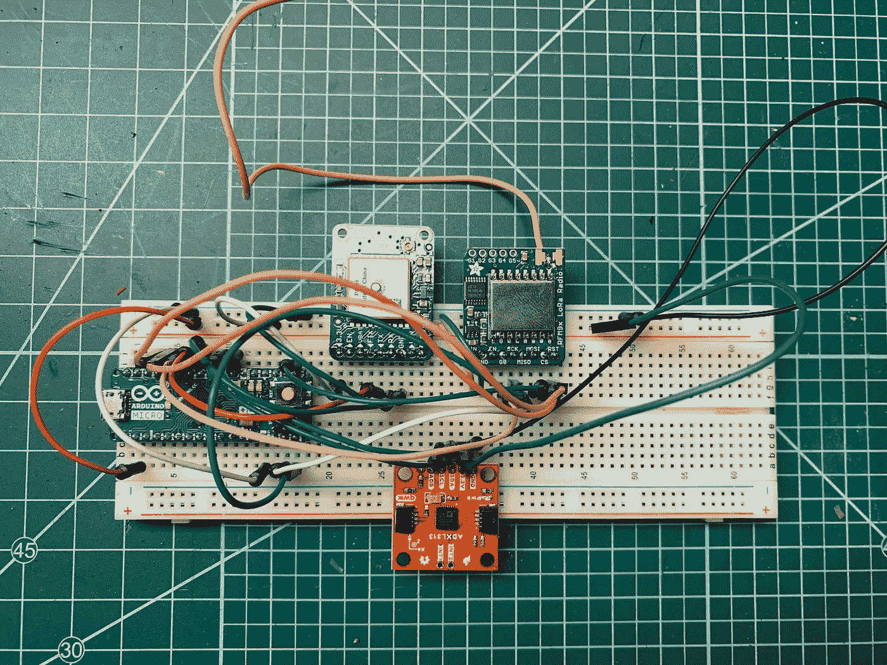
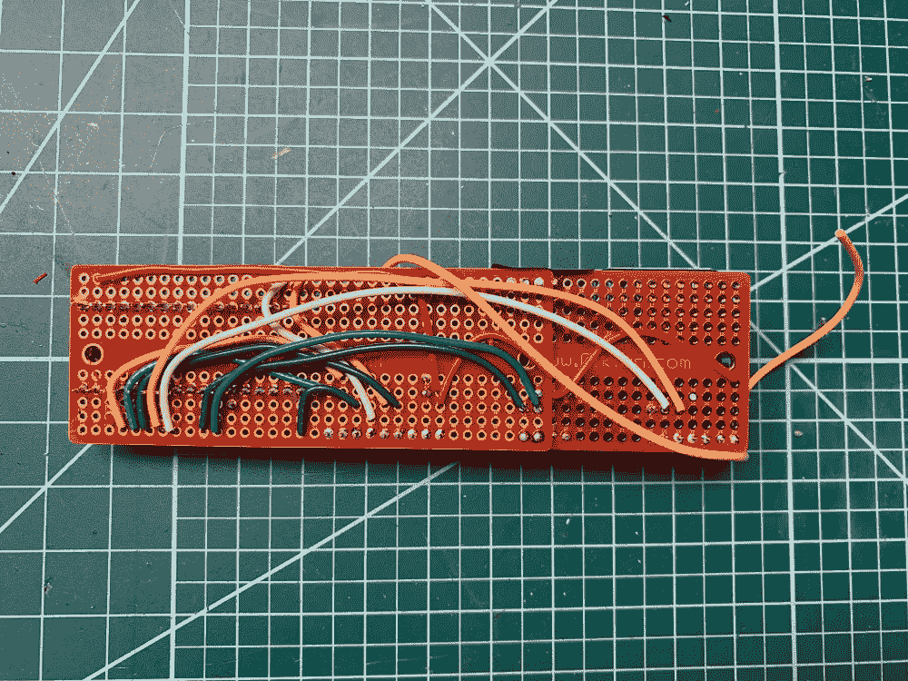
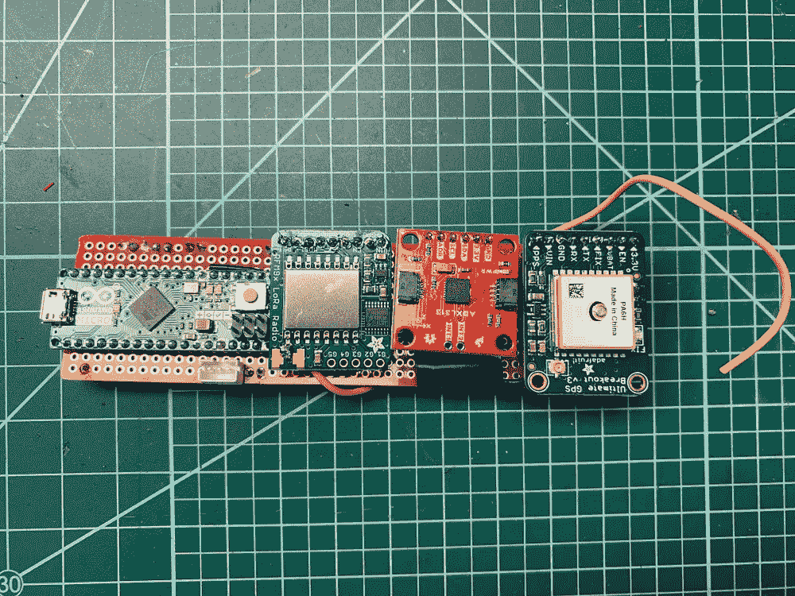
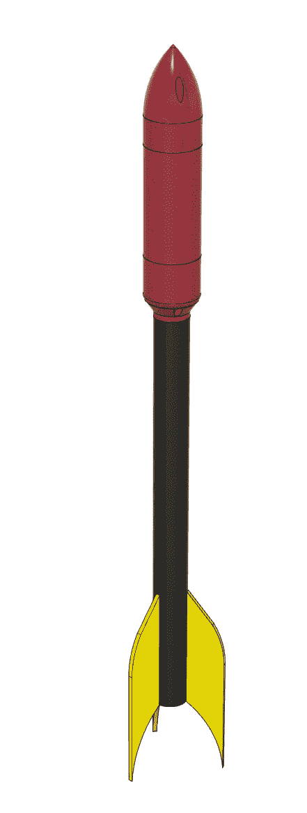

# 凯塞尔计划运行

> 原文：<https://medium.com/oracledevs/project-kessel-run-fc081eb0fd03?source=collection_archive---------0----------------------->

克里斯·本森


如果你愿意，你可以在 GitHub [这里](https://github.com/chrisbensen/chris-blogs/blob/main/WeekendHacks/rocket/rocket.md)阅读这篇博文。

火箭很酷，那为什么不造一个云连接的火箭呢？我称之为凯塞尔之旅。祝你国庆节快乐！这是一枚物联网火箭。

飞行计算机是一个 Arduino + LoRa 收发器+ GPS +加速度计，向运行 Raspberry Pi + LoRa 收发器的基站广播，该收发器连接到我手机的互联网热点，并将一切发送到 Oracle Cloud。

# 先决条件

要建造一个，你需要一些东西。

1.您拥有一个 OCI 账户或一个[自由级账户](/oracledevs/create-an-oracle-always-free-cloud-account-bc6aa82c1397)。

1.从[这里](https://demoparts.withoracle.cloud/sharedbom?ref=295451616379598227377985226295520958226)拿零件。

2.从 [Thingiverse](https://www.thingiverse.com/thing:5377245) 下载 3D 可打印文件。

## 建造火箭

装配工作相当顺利。下载 3D 打印文件和鳍。如果你有激光切割机，这非常简单，否则打印出[rocketfins.pdf](https://github.com/chrisbensen/chris-blogs/blob/main/WeekendHacks/rocket/files/models/rocketfins.pdf)，把它放在一些轻木上，用工艺刀切出三个翅膀作为稳定器。

鼻锥由两部分组成。为了打印这些，我用了一个 0.4 毫米的喷嘴。如果您添加电子元件，您还可以打印出电池座，或者如果您使用不同的电池，您会想要定制它。一个简单的方法是用绝缘胶带将电线连接到电池的两端。

## 飞行计算机

对于这一步，您需要上述先决条件中的以下项目:

*   [洛拉转运站](https://learn.adafruit.com/adafruit-rfm69hcw-and-rfm96-rfm95-rfm98-lora-packet-padio-breakouts)
*   [Arduino Micro](https://www.etechnophiles.com/arduino-micro-pinout-schematic-and-specifications/)
*   [GPS](https://www.adafruit.com/product/746)
*   [加速度计](https://www.sparkfun.com/products/17241)

## 飞行计算机的布线



arduino Micro-> LoRa
MISO-Pin 50->LoRa MISO
MOSI-Pin 51->LoRa MOSI
SCK-Pin 52->LoRa SCK
Pin 9->LoRa CS
Pin 8->LoRa RST
Pin 7->LoRa G0
3.3v->LoRa 3.3v
GND-

Arduino Micro -> GPS
引脚 3 - > ADXL313 SCL
引脚 2->adxl 313 SDA
3.3v->adxl 313 3.3v
GND->adxl 313 GND

Arduino Micro -> GPS
引脚 6 - > GPS TX
引脚 5->GPS RX
3.3v->GPS 3.3v
GND->GPS GND

我用的是 433 MHz 的 LoRa transeiver，它需要一个天线。对于 433 MHz 波段，波长为 299 . 792 . 458/433 . 000 . 000 = 69.24 厘米。四分之一是 17.31 厘米，这是一个很好的长度，所以我剪了一根这样长度的电线，并将其焊接到发射器和接收器的天线上。

## 飞行计算机原型试验板

飞行计算机需要缩小，所以我焊接了一些接头，并连接了一个原型试验板。



## 基站

基站是一个连接到 LoRa 传输接收器的 Raspbery Pi，该传输接收器通过电话的移动热点连接到电话。无线电收发机必须与安装在飞行计算机上的相同。

[Lora 收发器](https://learn.adafruit.com/adafruit-rfm69hcw-and-rfm96-rfm95-rfm98-lora-packet-padio-breakouts)
任何 Pi 3 或 Pi 4 都可以。

Pi -> LoRa
Pi 引脚 MOSI - > LoRa MOSI
Pi 引脚 MISO - > LoRa MISO
Pi 引脚 SCK - > LoRa SCK
Pi 引脚 25 - > LoRa CS
Pi 引脚 5 - > LoRa RST
Pi 引脚 CE1 - > LoRa G0
Pi 引脚 3.3v - > LoRa VIN
Pi 引脚 GND - >

# 愿源头与你同在



将以下草图上传到 Arduino。注意，你还需要文件 [lora.h](https://github.com/chrisbensen/chris-blogs/blob/main/WeekendHacks/rocket/files/cloudrocket/LoRa.h) 和 [lora.cpp](https://github.com/chrisbensen/chris-blogs/blob/main/WeekendHacks/rocket/files/cloudrocket/LoRa.cpp) 。

```
[cloudrocket.ino](https://github.com/chrisbensen/chris-blogs/blob/main/WeekendHacks/rocket/files/cloudrocket/cloudrocket.ino)

//Board: Arduino Mega 2560
//Processor: ATMega 2560// LoRa
// [https://www.adafruit.com/product/3073](https://www.adafruit.com/product/3073)
// ATMega2650 ->LoRa
// MISO-pin 50 ->LoRa MISO
// MOSI-pin 51 ->LoRa MOSI
// SCK- Pin 52 ->LoRa SCK
// Pin 7 ->LoRa CS
// Pin 6 ->LoRa RST
// Pin 2 ->LoRa G0
// SS- pin 53 //N/A
//
// Arduino Micro ->LoRa
// MISO-pin 50 ->LoRa MISO
// MOSI-pin 51 ->LoRa MOSI
// SCK- Pin 52 ->LoRa SCK
// Pin 9 ->LoRa CS
// Pin 8 ->LoRa RST
// Pin 7 ->LoRa G0
// 3.3v ->LoRa 3.3v
// GND ->Lora GND
#include <SPI.h>
#include “LoRa.h”const int csPin = 9; // LoRa radio chip select
const int resetPin = 8; // LoRa radio reset
const int irqPin = 7; // interrupt request pinconst byte localAddress = 0xBB;
const byte destinationAddress = 0xFF;
const byte syncWord = 0xB4; // Sync word (network ID)
const byte spreadingFactor = 7; //spreading factor (6–12)// Accelerometer
// [https://learn.sparkfun.com/tutorials/sparkfun-qwiic-3-axis-accelerometer-adxl313-hookup-guide?_ga=2.60797357.1096858093.1651183108-2026033215.1651006494](https://learn.sparkfun.com/tutorials/sparkfun-qwiic-3-axis-accelerometer-adxl313-hookup-guide?_ga=2.60797357.1096858093.1651183108-2026033215.1651006494)
// Arduino Micro -> Accelerometer
// Pin 3 -> ADXL313 SCL
// Pin 2 -> ADXL313 SDA
// 3.3v ->ADXL313 3.3v
// GND ->ADXL313 GND
#include <Wire.h>
#include <SparkFunADXL313.h>
ADXL313 myAdxl;
const int accelerometerIC2Address = 0x1D;// GPS
// [https://www.adafruit.com/product/746](https://www.adafruit.com/product/746)
// Arduino Micro -> GPS
// Pin 6 -> GPS TX
// Pin 5 -> GPS RX
// 3.3v ->GPS 3.3v
// GND ->GPS GND
#include <Adafruit_GPS.h>
#include <SoftwareSerial.h>SoftwareSerial GPSSerial(6, 5);
Adafruit_GPS GPS(&GPSSerial);
uint32_t timer = millis();void setup() {
 Serial.begin(115200); // initialize serial// — — — — — — — — — — — — — — — — — — — — — — — — — — — — — — — — — — 
 // Initialize LoRa
 Serial.println(“LoRa Duplex Init”);
 LoRa.setPins(csPin, resetPin, irqPin); // set CS, reset, IRQ pinif (!LoRa.begin(433E6)) { // 915E6)) { // initialize ratio at 915 MHz
 Serial.println(“Error LoRa init failed”);
 while (true);
 }LoRa.setSyncWord(syncWord);
 LoRa.setSpreadingFactor(spreadingFactor);
 LoRa.setTxPower(20, true);
 LoRa.setTimeout(10); //set Stream timeout of 10ms
 Serial.println(“LoRa init succeeded”); //set the I/O pin modes:// — — — — — — — — — — — — — — — — — — — — — — — — — — — — — — — — — —
 // Initialize Accelerometer
 Serial.println(“Accelerometer Init”);
 Wire.begin(accelerometerIC2Address);//Begin communication over I2C
 if (myAdxl.begin() == false) {
 Serial.println(“Error accelerometer init failed”);
 while(1);
 }Serial.print(“Accelerometer init succeeded”);
 myAdxl.measureModeOn(); // wakes up the sensor from standby and put it into measurement mode// — — — — — — — — — — — — — — — — — — — — — — — — — — — — — — — — — — 
 // Initialize GPS
 Serial.println(“GPS Software Serial”);
 GPS.begin(9600);
 // uncomment this line to turn on RMC (recommended minimum) and GGA (fix data) including altitude
 GPS.sendCommand(PMTK_SET_NMEA_OUTPUT_RMCGGA);
 // uncomment this line to turn on only the “minimum recommended” data
 //GPS.sendCommand(PMTK_SET_NMEA_OUTPUT_RMCONLY);
 // For parsing data, we don’t suggest using anything but either RMC only or RMC+GGA since
 // the parser doesn’t care about other sentences at this time// Set the update rate
 GPS.sendCommand(PMTK_SET_NMEA_UPDATE_1HZ); // 1 Hz update rate
 // For the parsing code to work nicely and have time to sort thru the data, and
 // print it out we don’t suggest using anything higher than 1 Hz// Request updates on antenna status, comment out to keep quiet
 GPS.sendCommand(PGCMD_ANTENNA);delay(1000);
 // Ask for firmware version
 GPSSerial.println(PMTK_Q_RELEASE);Serial.println(“Setup Complete”);
 Serial.flush();
}int counter = 0;void sendData(String name, String value) {
 String packet = “,” + name + “,” + value;
 Serial.print(packet);
 LoRa.print(packet);
}void loop() {
 char c = GPS.read();if ©
 Serial.write(c);// if a sentence is received, we can check the checksum, parse it…
 if (GPS.newNMEAreceived()) {
 // a tricky thing here is if we print the NMEA sentence, or data
 // we end up not listening and catching other sentences!
 // so be very wary if using OUTPUT_ALLDATA and trytng to print out data
 //Serial.println(GPS.lastNMEA()); // this also sets the newNMEAreceived() flag to falseif (!GPS.parse(GPS.lastNMEA())) { // this also sets the newNMEAreceived() flag to false
 Serial.println(“GPS FAILED”);
 return; // we can fail to parse a sentence in which case we should just wait for another
 }
 }if (!myAdxl.dataReady()) {// check data ready interrupt, note, this clears all other int bits in INT_SOURCE reg
 Serial.println(“Waiting for dataReady.”);
 }
 else {
 myAdxl.readAccel();// send packet
 LoRa.beginPacket();
 LoRa.print(“BEGIN,”);
 sendData(“id”, String(counter));
 sendData(“src”, String(localAddress));
 sendData(“dest”, String(destinationAddress));
 sendData(“x”, String(myAdxl.x));
 sendData(“y”, String(myAdxl.y));
 sendData(“z”, String(myAdxl.z));
 sendData(“day”, String(GPS.day, DEC));
 sendData(“month”, String(GPS.month, DEC));
 sendData(“year”, String(GPS.year, DEC));
 sendData(“fix”, String((int)GPS.fix));
 sendData(“quality”, String((int)GPS.fixquality));if (GPS.fix) {
 sendData(“latitude”, String(GPS.latitude, 4));
 sendData(“lat”, String(GPS.lat));
 sendData(“longitude”, String(GPS.longitude, 4));
 sendData(“long”, String(GPS.lon));
 sendData(“knots”, String(GPS.speed));
 sendData(“angle”, String(GPS.angle));
 sendData(“altitude”, String(GPS.altitude));
 sendData(“satellites”, String((int)GPS.satellites));
 }
 LoRa.print(“,END”);
 Serial.println();
 LoRa.endPacket();
 }counter++;
 delay(50);
}[lora.py](https://github.com/chrisbensen/chris-blogs/blob/main/WeekendHacks/rocket/files/pi/lora.py)

import time
import busio
from digitalio import DigitalInOut, Direction, Pull
import board
import adafruit_rfm9x
import requests
import os
import jsonURL = os.getenv(‘URL’)
print(URL)if (URL is None):
 print(“URL environment variable not found”)flight_file = open(“lora.log”, “a+”)# Configure LoRa Radio
CS = DigitalInOut(board.CE1)
RESET = DigitalInOut(board.D25)
spi = busio.SPI(board.SCK, MOSI=board.MOSI, MISO=board.MISO)
rfm9x = adafruit_rfm9x.RFM9x(spi, CS, RESET, 433.0)#915.0)
rfm9x.tx_power = 23def get_val(data, name):
 index = data.index(name)if index != None:
 return data[index + 1]return Nonedef make_json(data, fields):
 result = {}for i in range(len(fields)):
 name = fields[i]
 result[name] = get_val(data, name)return resultwhile True:
 packet = None
 rssi = rfm9x.last_rssi# check for packet rx
 packet = rfm9x.receive(with_header=True)
 if packet is None:
 print(“waiting”)
 else:
 try:
 print(packet)
 packet_text = str(packet, “ascii”)
 print(packet_text)
 data = packet_text.split(“,”)
 print(data)print(get_val(data, “x”), get_val(data, “y”), get_val(data, “z”))fields = [‘id’, ‘x’, ‘y’, ‘z’]
 j = make_json(data, fields)
 j[“signal”] = “{0} dB”.format(rssi)if (URL is not None):
 response = requests.post(URL, json = j)flight_file.write(json.dumps(j))
 flight_file.write(“,\n”)
 except:
 print(“except”)
```

将`lora.py`复制到您的 Pi。

# 云

用`python3 lora.py`跑。如果你创建了环境变量`export URL=<endpoint>`，所有的数据都将被传输到 REST endoint。这需要一个 Oracle 云帐户。你可以在这里得到一个:[自由层账户](/oracledevs/create-an-oracle-always-free-cloud-account-bc6aa82c1397)。

请继续关注未来如何设置流媒体云。