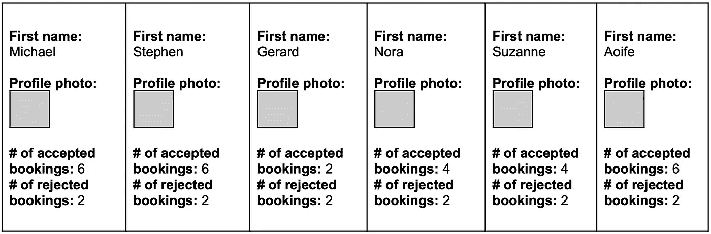
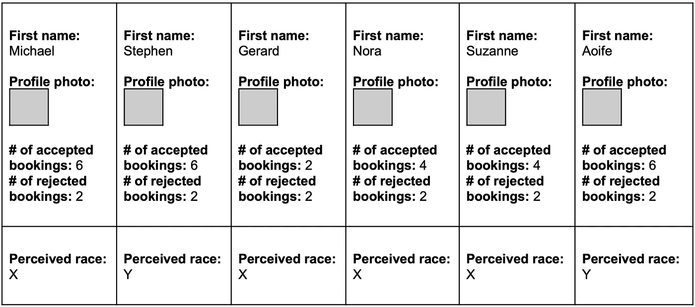
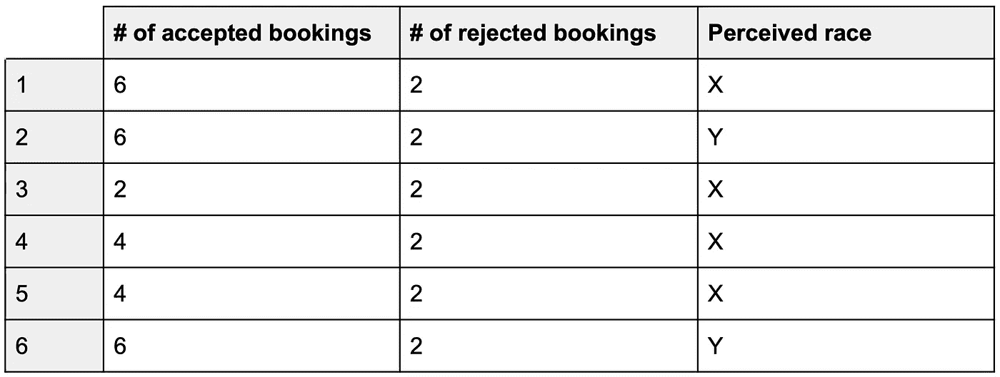
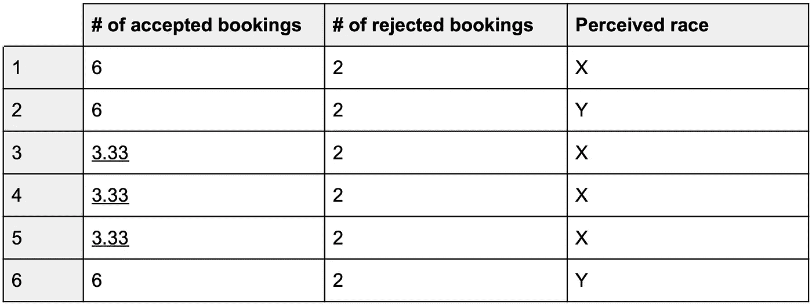
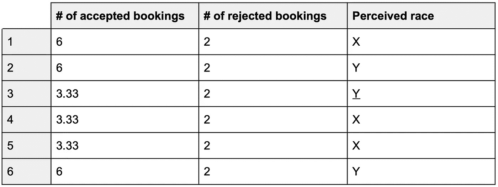
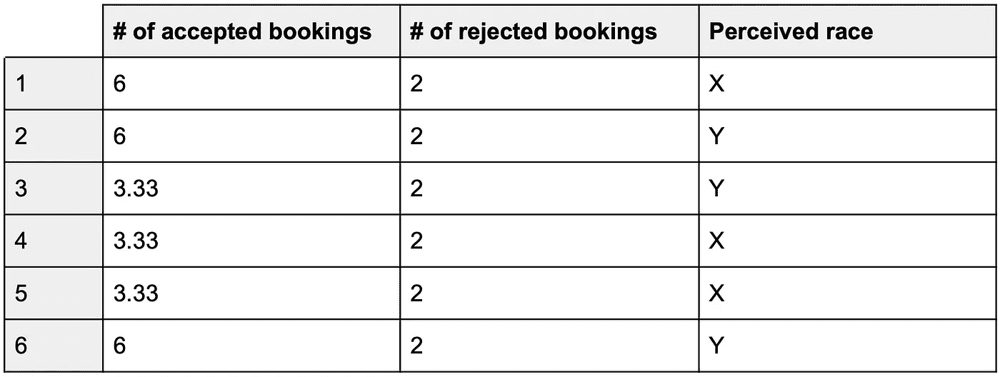

# 灯塔计划第 1 部分:P 敏感的 k-匿名

> 原文：<https://medium.com/airbnb-engineering/project-lighthouse-part-1-p-sensitive-k-anonymity-c6ee7d79c4f9?source=collection_archive---------2----------------------->

*这是一个由两部分组成的系列，讲述我们将如何使用匿名的感知人口统计数据来衡量 Airbnb 客人接受率的差异。第一部分概述了我们使用的 p 敏感 k-匿名隐私模型。*

# 介绍

6 月，Airbnb 反歧视产品团队宣布了[项目灯塔](https://www.airbnb.com/against-discrimination)，这是一项旨在衡量和打击在 Airbnb 上预订或托管时的歧视的举措。我们与美国最大的在线种族正义组织[变革之色](https://colorofchange.org)合作发起了这个项目，该组织拥有超过 700 万名成员，并得到了其他领先的民权和隐私权组织的指导。

灯塔项目的核心是一个在美国使用的新系统，用来衡量人们在 Airbnb 平台上的体验差异，这种差异可能是歧视和偏见的结果。该系统旨在使用与 Airbnb 个人账户无关的感知种族数据来衡量这些差异。通过进行这种分析，我们可以了解我们的平台在包容性方面的状态，并开始制定和评估干预措施，从而在 Airbnb 的平台上实现更公平的结果。

我们专注于衡量感知种族(而不是自我认同的种族)的不平等，因为歧视通常是一个人对另一个人的*感知*的结果。此外，为“灯塔计划”收集的数据将以保护人们隐私的方式进行处理，并将专门用于反歧视工作。

这一系列博客文章的目标是对我们开发的系统提供一个高层次的概述。迄今为止，我们的工作主要集中在两个目标上:

1.  设计一个以隐私为中心的流程，利用[匿名的感知种族数据](https://www.airbnb.com/resources/hosting-homes/a/a-new-way-were-fighting-discrimination-on-airbnb-201)。
2.  确保得到的数据可以用来准确地衡量产品中潜在的体验差距。

在本帖中，我们将重点关注如何使用满足 **p 敏感 k 匿名**的数据来计算游客感知种族的接受率。

我们对 p 敏感 k 匿名的使用只是我们采取的保护用户隐私的设计隐私方法的一部分。该计划的其他隐私功能包括用户通知和选择——我们的社区可以选择不参与。这个项目还受益于 Airbnb 安全工程团队为保护所有用户数据安全所做的惊人工作。

本系列的第二篇文章展示了我们如何验证这些数据可以导致对产品干预影响的准确估计。

这些博客文章旨在介绍灯塔计划的方法论，在我们的[技术论文](https://news.airbnb.com/wp-content/uploads/sites/4/2020/06/Project-Lighthouse-Airbnb-2020-06-12.pdf)中有更详细的描述。**通过公开分享我们的方法，我们希望帮助其他科技公司系统地衡量和减少他们平台上的歧视。**

# 设置

我们设计了 Project Lighthouse 来帮助我们理解产品中潜在的体验差距——也就是说，一个人群对产品的体验可能与另一个人群不同。例如，我们可以使用 Project Lighthouse 来调查感知到的人口统计群体在预订接受率方面的潜在差异。

在这篇文章的其余部分，我们将通过一个使用虚构数据的例子来说明我们如何在保护用户隐私的同时根据感知的种族来计算接受率。我们将首先提出一种简单但不保护隐私的方法作为反事实；然后，我们将介绍我们的实际方法，该方法采取步骤来匿名化数据。

我们将在六个虚构的 Airbnb 用户身上演示这两种方法:

*   迈克尔
*   斯蒂芬
*   杰勒德
*   Honora
*   苏珊娜(人名)
*   Aoife

每个虚构的用户都向 Airbnb 提供了一张个人资料照片。每个用户还试图在 Airbnb 上进行多次预订；每一次尝试预订都被接受或拒绝。Michael、Stephen 和 Aoife 各有 6 个接受和 2 个拒绝的预订；Nora 和 Suzanne 各有 4 个接受和 2 个拒绝的预订；杰拉德有两个接受和两个拒绝的预订。

Figure 1\. A fictional set of six Airbnb users.

图 1 中的每个框都包含我们可能拥有的关于 Airbnb 客人的信息:用户提交的个人资料照片和名字，他们尝试预订被接受的次数，以及他们尝试预订被拒绝的次数。

# 简单方法

如果我们简单地让一个人根据他们的名字和个人资料照片给每个客人贴上他们感知的种族标签，那么我们可以很容易地计算出每个感知种族的准确接受率。

Figure 2\. A fictional set of six Airbnb users with associated perceived race labels.

例如，在图 2 中，被感知为“X”的客人的接受率是 67%，被感知为“Y”的客人的接受率是 75%。因此，X 组和 Y 组之间的**接受率差距**为 8%。

这种方法的缺点是 Airbnb 会有一个数据库，其中包含每个用户与其感知的种族之间的 1:1 映射。不幸的是，如果一个**误操作者**(有意或无意地以非设计方式使用系统的人)获得了这样一个数据库，它可能会对我们的用户造成重大伤害，因为它可能允许误操作者根据他们感知的种族来锁定我们的用户。因此，我们希望避免这种 1:1 的映射，而是只存储计算接受率差距所需的最少量的数据。

# 以隐私为中心的方法

为了实现这一点，我们将隐私嵌入到灯塔项目的设计中。具体来说，灯塔计划的一个核心组成部分是保护一个名为**p-sensitive k-anonymous**的隐私属性。

我们选择 p 敏感的 k-匿名主要是为了减轻一种叫做**的数据泄露的风险。如果一个误操作者能够大规模地获得用户感知的比赛，就会发生某些属性泄露。**

我们希望防止这类事件的发生，因此在系统设计过程中，我们将注意力集中在 k-匿名等属性上，而不是其他属性，如ε-差分隐私。(ε-差分隐私最适合防止**成员身份泄露**，这意味着误操作者已经确定用户是否出现在数据集中，以及**概率泄露**，这意味着误操作者已经通过攻击增加了他们对用户属性的了解，但还没有达到确定的程度。)

为了解释 **p 敏感 k 匿名**，让我们检查下表，它表示与图 2 中相同的一组虚构用户。

Figure 3\. A transposed version of Figure 2, with first names and profile photos removed.

删除用户 id(如图 3 所示)不足以保护用户隐私。一个客人仍然可以有一个唯一的已接受预订和已拒绝预订的号码，从而使误操作者能够辨别他们的种族。例如，如果一个误操作者访问了这个表，知道 Gerard 在这个表中，并且知道 Gerard 被接受了 2 次，被拒绝了 2 次，那么他们就会知道 Gerard 的感知种族是“X”，因为“接受数”= 2 和“拒绝数”= 2 的唯一一行的“感知种族”=“X”。

接下来，让我们对数据集进行 k 匿名化:

Figure 4\. A k-anonymized version of Figure 3\. The underlined cells are where changes were made in order for the dataset to satisfy k-anonymity.

[**K-匿名**](https://en.wikipedia.org/wiki/K-anonymity) 意味着在我们的数据集中，每个唯一对(接受数，拒绝数)至少有 *k 个*实例。具体来说，我们的数据集现在是**3-匿名**(所以 k = 3)，因为我们可以确认每个唯一的接受/拒绝对— (6，2)和(3.33，2) —在数据集中至少出现 **3** 次(分别在第 1、2、6 行和第 3、4、5 行)。

图 4 中第 3、4 和 5 行的三个单元格中的文本带有下划线，以准确显示哪些数字被更改，从而使数据集满足 3-匿名性。为了实现 k-匿名，我们可以有许多方法来修改数据集；在这种情况下，我们对带下划线的单元格(2、4、4)的原始内容进行平均，得到 3.33。

最后，让我们 **p-sensitize** 我们的数据集:

Figure 5\. A p-sensitized version of Figure 4\. The underlined cell is where a change was made in order for the dataset to satisfy p-sensitive k-anonymity.

[**P-敏感 k-匿名**](https://ieeexplore.ieee.org/document/1623889) 是指除了满足 k-匿名外，每个唯一对(接受数，拒绝数)至少具有 *p* 个不同的感知种族值。具体来说，我们的数据集是**2-敏感 3-匿名**，因为每个唯一的接受/拒绝对至少有 3 行(k = 3)和至少 **2 个**不同的感知种族值(p = 2): (6，2)与 2 个感知种族值(“X”和“Y”)相关联，(3.33，2)与 2 个感知种族值(“X”和“Y”)相关联。

图 5 中一个单元格中的文本带有下划线，以准确显示哪个感知种族标签发生了变化，从而使数据集对 2 敏感。为了实现 p 敏感的 k 匿名性，我们可以有许多方法来修改数据集；在这种情况下，我们将带下划线的单元格的原始内容从“X”更改为“Y”。

我们的数据集现在是 **p 敏感 k 匿名:**

Figure 6\. The final p-sensitive k-anonymous dataset**.**

作为这种转变的结果，我们大大降低了将用户感知的种族暴露给不良行为者的风险。不幸的是，这种数据匿名化过程有一个缺点:它可能会危及我们准确计算每个感知种族的接受率的能力。我们的例子展示了这种风险:在匿名化的数据集中，X 组的接受率为 68%，Y 组的接受率为 72%，而在匿名化发生之前，接受率分别为 67%和 75%。

为了探索这种风险，我们设计了一组模拟来了解采取措施匿名化数据将如何影响我们衡量接受率差距的能力。通过这些模拟，我们验证了我们的方法仍然可以导致对不同感知种族的客人的接受率的准确估计。我们的[下一篇博文](/airbnb-engineering/project-lighthouse-part-2-measurement-with-anonymized-data-69fb01eac88)更详细地涵盖了这些模拟——包括我们的方法、结果和结论。

# 灯塔计划

p 敏感 k-匿名的隐私属性是灯塔计划的核心组成部分。灯塔项目的另一个核心组成部分是，为了将感知的种族标签与 p 敏感的 k 匿名数据相关联，我们正在与外部研究伙伴合作。这个合作伙伴为我们提供了基于人类判断而不是机器学习模型的感知种族标签。

我们做出这个决定是因为我们认为确定感知种族信息的最佳方式是使用人类感知，而不是机器学习。在种族这样敏感的问题上使用算法、面部识别技术或机器学习，需要民权和隐私组织等方面的仔细考虑和投入。如果我们考虑这样做，除了确保我们的用户知情之外，我们还会寻求他们的指导和支持。

# **结论**

在这篇博文中，我们描述了我们如何分析匿名数据来衡量 Airbnb 接受率差距，这种差距可以归因于客人的感知种族。我们将自己的方法与一个更简单的方法进行了对比，以展示我们方法的隐私优势。我们希望灯塔计划中的系统——在我们的[公开发表的技术论文](https://news.airbnb.com/wp-content/uploads/sites/4/2020/06/Project-Lighthouse-Airbnb-2020-06-12.pdf)中有更详细的描述——可以帮助其他技术公司系统地测量和减少他们平台上的歧视。

灯塔计划代表了 Airbnb 内外许多人的合作成果。Airbnb 反歧视产品团队是:希德·巴苏、露丝·伯曼、亚当·布鲁姆斯顿、约翰·坎贝尔、安妮·迪亚兹、奈奈子·埃拉、本杰明·伊万斯、苏哈达·帕尔卡尔、斯凯勒·沃顿。在 Airbnb 内部,“灯塔计划”还展示了 Crystal Brown、Zach Dunn、Janaye Ingram、Brendon Lynch、Margaret Richardson、Ann Staggs、Laura Rillos 和 Julie Wenah 的作品。最后，我们感谢许多人审阅了我们的[技术论文](https://news.airbnb.com/wp-content/uploads/sites/4/2020/06/Project-Lighthouse-Airbnb-2020-06-12.pdf)，这篇博文正是基于此。

我们知道偏见、歧视和系统性不平等是复杂而长期的问题。解决这些问题需要持续的关注、适应和合作。我们鼓励科技行业的同行加入我们的战斗，共同推动我们走向一个人人共享的世界。

想了解更多？[灯塔计划系列的第二部分在这里可以找到](/airbnb-engineering/project-lighthouse-part-2-measurement-with-anonymized-data-69fb01eac88)。

有关灯塔项目的更多信息，请访问:[https://www . Airbnb . com/resources/hosting-homes/a/a-new-way-were-fighting-discrimina tion-on-Airbnb-201](https://www.airbnb.com/resources/hosting-homes/a/a-new-way-were-fighting-discrimination-on-airbnb-201)