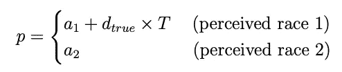
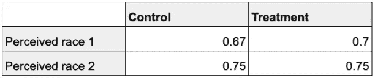
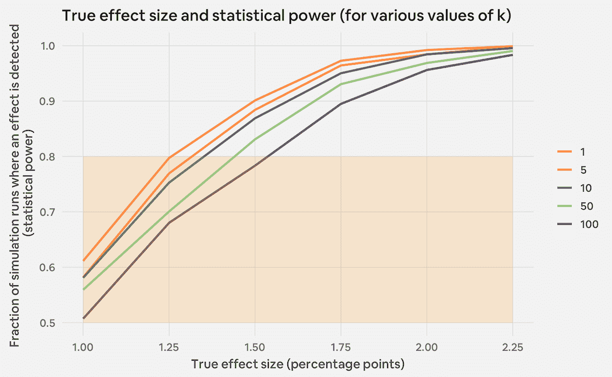
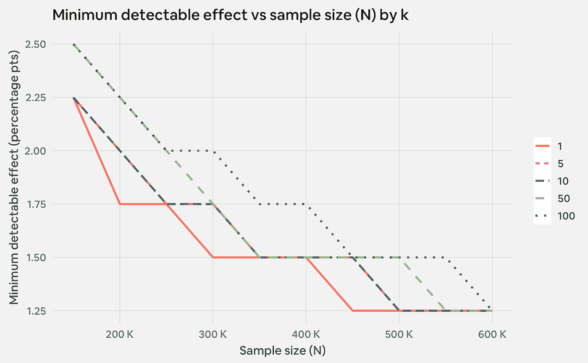

# 灯塔计划—第 2 部分:匿名数据测量

> 原文：<https://medium.com/airbnb-engineering/project-lighthouse-part-2-measurement-with-anonymized-data-69fb01eac88?source=collection_archive---------3----------------------->

关于我们如何使用匿名人口统计数据来衡量 Airbnb 客人接受率差异的两部分系列。第二部分着眼于我们用来理解匿名化对我们的接受率估计精度的影响的框架。( [*此处读 Part 1*](/airbnb-engineering/project-lighthouse-part-1-p-sensitive-k-anonymity-c6ee7d79c4f9)*)*

# 介绍

6 月，Airbnb 反歧视产品团队宣布了 [Project Lighthouse](https://www.airbnb.com/against-discrimination) ，这是一项旨在衡量和打击在 Airbnb 上预订或托管时的歧视的举措。我们与拥有数百万会员的美国最大的在线种族正义组织 Color Of Change 合作发起了这个项目，并得到了其他领先的民权和隐私权组织的指导。

灯塔项目的核心是一个新颖的系统，用来衡量人们在 Airbnb 平台上的体验差异，这种差异可能是歧视和偏见的结果。该系统旨在衡量与 Airbnb 个人账户无关的感知种族数据的差异。通过进行这种分析，我们可以了解我们的平台在包容性方面的状态，并开始制定和评估干预措施，从而在 Airbnb 的平台上实现更公平的结果。

在本系列的[第一篇文章](/airbnb-engineering/project-lighthouse-part-1-p-sensitive-k-anonymity-c6ee7d79c4f9)中，我们提供了一些关于灯塔项目的更广泛的背景，并介绍了**p-sensitive k-anonymous**的隐私模型，这是我们用来保护社区数据的工具之一。在本帖中，我们将重点关注如何评估匿名数据的有效性，这些数据是在衡量我们产品团队干预的影响时获得的。

这些博客文章旨在介绍灯塔计划的方法论，在我们的技术论文[中有更详细的描述。通过公开分享我们的方法，我们希望帮助其他技术公司系统地测量和减少他们平台上的歧视。](https://news.airbnb.com/wp-content/uploads/sites/4/2020/06/Project-Lighthouse-Airbnb-2020-06-12.pdf)

# 我们如何使用 A/B 测试

像科技行业的大多数其他产品团队一样，Airbnb 反歧视团队也进行 A/B 测试，用户被随机分配到控制组或治疗组，以衡量其干预措施的影响。例如，我们可以使用 A/B 测试来衡量推广即时图书对预订转换率的影响。类似地，我们也可以使用 A/B 测试来了解在预订被确认之前模糊客人档案照片的影响，如预订率和取消率。

我们最感兴趣了解的一些主题是人口统计组之间的接受率是否存在差距，以及特定的干预措施是否会影响这一差距。我们可以通过 A/B 测试来回答这两个问题。

考虑一个假设的 A/B 测试，我们分析其对被视为“种族 1”和“种族 2”的游客的影响。在这样的测试中，所有用户被随机分配到对照组或治疗组；一个人的种族并不影响这项任务。只有在 A/B 测试结束后，当我们分析测试的影响时，感知的种族才变得相关。图 1 显示了这个假设测试的一些可能结果。在本例中，对照组中被视为“种族 1”的游客的接受率为 67%，被视为“种族 2”的游客的接受率为 75%。通过对比对照组的接受率，可以发现接受率的基线差异，为 75% — 67% = 8 个百分点。

假设干预将被感知为“种族 1”的游客的接受率增加到 70%，而将被感知为“种族 2”的游客的接受率保持在 75%不变。治疗组内接受率的差距计算为 75% — 70% = 5 个百分点。因此，我们的结论是，干预已经将被视为“种族 1”和“种族 2”的游客之间的接受率差距减少了 8–5 = 3 个百分点。

*Figure 1: Example of an A/B test’s potential impact on guest acceptance rates*

# 测量目标和统计功效

正如我们在之前的[帖子](/airbnb-engineering/project-lighthouse-part-1-p-sensitive-k-anonymity-c6ee7d79c4f9)中所讨论的，我们利用 p 敏感的 k 匿名隐私模型来保护用户数据，同时计算不同人口统计群体之间 Airbnb 体验的潜在差距(在本例中，接受率)。实施这种隐私模式有时需要我们通过更改或删除分析中的值来修改数据。这可能削弱我们准确估计度量标准的能力，例如接受率，以及我们的 A/B 测试对它们的影响。

为了确保我们能够准确衡量干预的影响，我们开展了一项关于匿名化对**数据效用和**数据分析有用性的影响的研究。更准确地说，我们关心的是**统计功效**，即当干预措施有效时，我们观察到某个指标发生统计显著变化的概率。更大的样本量和效应量通常会产生更大的统计功效。我们的测试有足够的统计能力，这使我们能够满怀信心地衡量我们的干预措施的影响。

我们的努力集中在理解执行 p 敏感的 k 匿名可能如何影响我们的 A/B 测试的统计能力。我们这项分析的目的是了解在测量我们的干预对人口统计群体的预订接受率的影响时，改变某些参数，如在实施 k-匿名时选择的 k 值，如何影响统计功效。

# 模拟设置

我们用来理解匿名化对测量的影响的主要工具是基于*模拟的功耗分析*。为了更好地理解这种分析是如何工作的，让我们首先回顾一下我们如何统计分析 A/B 测试对人口统计组之间接受率差异的影响。

仅为讨论起见，假设我们有一个数据集，其中每行代表 Airbnb 上的一个预订请求，列为:

*   接受:如果预订请求被接受，则为 1，否则为 0
*   治疗:无论游客是在 A/B 测试的控制组还是治疗组，我们都可以对其进行编码，在控制组取值 0，在治疗组取值 1
*   感知种族:游客感知的种族，我们可以对其进行编码，对于被感知为“种族 1”的游客，取值为 0；对于被感知为“种族 2”的游客，取值为 1

然后，我们可以运行以下形式的线性回归:

这里，系数 a 是对照组中被认为是“种族 1”的客人的接受率，a + b_obs 是对照组中被认为是“种族 2”的客人的接受率，a + c_obs 是治疗组中被认为是“种族 1”的客人的接受率。出于我们分析的目的，我们主要关注系数 d_obs,⁴，它给出了 A/B 测试对被视为“种族 1”和“种族 2”的游客之间接受率差异的影响。

假设我们也可以进行许多 A/B 测试，我们知道干预对接受率的真实影响。然后，我们可以通过在每次测试后运行上述回归并记录 d_obs 是否在统计上显著不同于零来估计统计功效。也就是说，我们将通过“我们发现有统计学显著效果的测试部分”来估计“发现有统计学显著效果的概率”。虽然我们不能用 actual⁵ A/B 测试进行这种分析，但我们可以模拟数据并遵循类似的过程。这是基于仿真的功耗分析的核心思想。

基于模拟的功耗分析的核心步骤是模拟单个 A/B 测试。为此，我们生成一个合成数据集，其中每行代表一个假设的预订请求。我们随机生成每一行的感知种族标签和对照组/治疗组分配。我们将验收建模为伯努利随机变量，验收概率 p 为:

继续图 1 中的例子，我们设置 a_1 = 0.67，a _ 2 = .75，d_true = 0.03。这里是⁶，如果用户在 A/B 测试的对照组中，T = 0，如果用户在治疗组中，T = 1。这为我们提供了以下接受率:

*Table 1: acceptance rates for one hypothetical run of a simulation*

然后，我们可以匿名化该数据集，并使用上面详述的回归分析匿名化的数据，记录我们的结果。多次重复这个过程(在我们的例子中，至少 1000 次)允许我们估计我们的测试的统计能力。

# 模拟结果

基于模拟的功耗分析的好处之一是，我们可以改变假设实验设置的不同方面，以了解它们对数据效用的影响。在我们的案例中，我们有兴趣了解以下因素的影响:

*   k 的值，用于实施 p 敏感的 k-匿名。
*   N 的值，即 A/B 测试中预订请求的数量。
*   干预在减少被视为“种族 1”和“种族 2”的游客之间接受率差异方面的功效。我们将此称为**真实效果大小**(上一节中的 d_true)。

为此，我们可以固定 k，N 和真实效应大小，并运行模拟 1000 次，以获得观察到的效应大小的分布(上一节中的 d_obs)。然后，我们可以对不同的 k，N 值和真实效应大小重复这个练习，以研究它们如何影响 d_obs 的分布。例如，我们可以计算模拟运行中检测到统计显著效果的部分，并将其用作我们对统计功效的估计。

图 2 总结了这一分析的主要结果。水平轴代表真实效果大小(d_true)，而垂直轴代表我们基于模拟的统计功效估计。每条线代表实际效应大小与特定 k 值的统计功效之间的关系。我们还对图表中统计功效低于 80%的区域进行了着色，因为最佳做法是运行功效至少为 80%的 A/B 测试。

*Figure 2: Simulation results (statistical power)*

我们在图 2 中注意到的第一件事是，统计功效随着真实效应大小而增加。这是我们的经验证据，它“更容易检测更大的影响”，并且是在任何基于仿真的功耗分析中进行的有用的健全性检查。其次，我们看到，强制匿名会导致统计能力的轻微下降，这取决于 k 的值。对于 k = 5 或 10，这种下降相对于可识别数据(k = 1)在 5-10%之内。另一方面，对于 k = 100，相对减少 10-20 %,这取决于真实的效应大小。

查看这些结果的另一种方法是分析**最小可检测效应**，对于不同的 k 和 n 值，最小真实效应大小为 80%。图 3 在横轴上绘制了样本大小，在纵轴上绘制了最小可检测效应。不同的线划分了不同的 k 值。

*Figure 3: Simulation results (minimum detectable effect)*

与图 2 相似，图 3 显示最小可检测效应随着 k 的增加而增加。更高的最小可检测效应是不期望的，因为这意味着我们只能用相同数量的统计功效来检测更大的变化。然而，该图显示了如何增加样本量来弥补这一点。例如，我们需要在 A/B 测试中分析 200，000 个预订请求，以检测具有可识别数据(k = 1)的 1.75 个百分点的影响大小。当我们使用 p 敏感的 k 匿名数据时，k = 5，这增加到 250，000 个预订请求。实际上，这意味着我们可以运行我们的 A/B 测试更长时间，以便它们包含更多的预订请求，使它们具有足够的统计能力。

# 结论

总之，我们基于模拟的功效分析表明，我们可以使用 p 敏感的 k 匿名数据来衡量我们的干预措施的影响，以减少客人感知种族在 Airbnb 体验中的差异。虽然强制匿名会导致统计能力下降 20%，但取决于 k 的值，运行更长时间的测试以获得更大的样本量可以弥补这一点。

值得注意的是，我们的 A/B 测试分析工作流程明显不同于技术行业中更普遍采用的工作流程。我们现在进行的每个分析都需要大量的前期工作，以确保我们有 p 敏感的 k 匿名数据。如果我们使用可识别的数据，我们还会运行更长时间的 A/B 测试。

然而，我们的发现表明，在保护我们社区隐私的同时，审计在线平台的大规模用户体验差距是可能的。我们希望我们的工作可以作为其他技术公司的资源，这些公司也希望系统地测量和减少他们平台上的歧视。我们公开发布的技术论文描述了这些帖子中涉及的主题，以及我们更详细地实施 p 敏感 k 匿名的方法。我们的[登陆页面](https://www.airbnb.com/against-discrimination)对灯塔计划有一个更全面的概述。

灯塔计划代表了 Airbnb 内外**许多**人的合作成果。Airbnb 反歧视团队成员包括:希德·巴苏、露丝·伯曼、亚当·布鲁姆斯顿、约翰·坎贝尔、安妮·迪亚兹、奈奈子·埃拉、本杰明·伊万斯、苏哈达·帕尔卡和斯凯勒·沃顿。在 Airbnb 内部,“灯塔计划”还展示了 Crystal Brown、Zach Dunn、Janaye Ingram、Brendon Lynch、Margaret Richardson、Ann Staggs、Laura Rillos 和 Julie Wenah 的作品。我们还要特别感谢 Laura Murphy 和 Conrad Miller，感谢他们在整个项目中的持续支持和指导。

我们知道偏见、歧视和系统性不平等是复杂而长期的问题。解决这些问题需要持续的关注、适应和合作。我们鼓励我们在技术行业的同行加入我们的战斗，并帮助推动我们所有人共同走向一个人人都能归属的世界。

这项分析目前正在我们的美国社区进行。灯塔计划中使用的感知种族数据与 Airbnb 个人账户无关。此外，为“灯塔计划”收集的数据将以保护人们隐私的方式进行处理，并将专门用于反歧视工作。你可以在第一篇博客文章或 Airbnb 资源中心中了解更多信息。

# 脚注

[1]为了便于说明，我使用了虚构的标签“种族 1”和“种族 2”。这里提出的框架可以扩展到分析多个(> 2 个)感知种族身份之间接受率的差距。

[2]在不失一般性的情况下，该编码可以颠倒为对照组为 1，治疗组为 0。对分析的唯一影响是 c_obs 将变成(控制-治疗接受率，而不是治疗-控制接受率)

[3]与治疗变量类似，这种编码也可以反过来

[4]这里 obs 是 observed 的简写

[5]我们不能在实际的 A/B 测试中做到这一点有几个原因。首先，这样做需要我们进行产品干预，我们知道对接受率差异的真正影响是什么，但我们不知道。其次，我们概述的程序将要求个人层面的感知种族标签，这将违反我们的隐私承诺。

[6]为了将这些值与上面的回归方程联系起来，a + b_obs 估计 a_1，a 估计 a_2