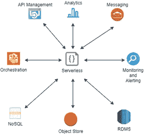
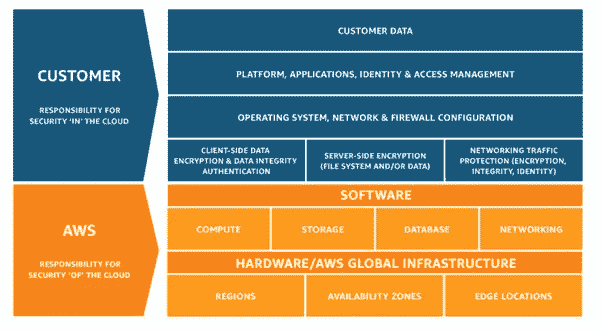
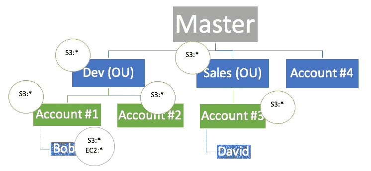

# 保护您的无服务器解决方案

> 原文：<https://medium.com/version-1/protecting-your-serverless-solution-cd5d4247e27c?source=collection_archive---------1----------------------->

Photo by [Collin Armstrong](https://unsplash.com/@brazofuerte?utm_source=medium&utm_medium=referral) on [Unsplash](https://unsplash.com?utm_source=medium&utm_medium=referral)

近年来，无服务器的增长是巨大的。越来越多的组织意识到这项技术的好处，即不必管理底层基础设施，并且能够按需扩展。大部分增长都是偶然的，没有一个战略，这导致安全性很大程度上是一种事后想法。

*本文将描述组织如何保护其无服务器解决方案。它将重点关注部署在* [*AWS 中的解决方案及其无服务器产品*](https://www.version1.com/it-service/digital-services/modernise-with-aws/)*【Lambda。然而，许多原则可以应用于所有的云平台。*

# 为什么无服务器解决方案不安全？

无服务器技术强制使用微服务设计模式。这导致许多小型服务执行独特的功能。有了许多服务，组织可以开发**无服务器蔓延**和可能导致未知、不受管理和不安全的无服务器解决方案。

# **无服务器的组件**

所有无服务器解决方案的核心是一种编程语言或代码。任何解决方案都需要各种接触点和集成，如数据存储和编排技术。这些组件将构成整个解决方案的一部分，因此每个组件的安全性与代码本身一样重要。

Various components of Serverless Solutions.

# **成本效益分析**

保护任何解决方案的第一步是进行成本效益分析。这包括确定正在考虑的无服务器解决方案的组件。然后进行风险评估。必须使用定量和定性方法确定部分或整个解决方案损失的影响和可能性。由此产生的风险评估将决定解决方案对组织的重要性。它将有助于理解将要采取的风险处理方法；是否应该减轻、接受、避免或转移风险。实施安全控制的总成本应始终低于系统损失的成本。

# **无服务器定价**

Photo by [Fabian Blank](https://unsplash.com/@blankerwahnsinn?utm_source=medium&utm_medium=referral) on [Unsplash](https://unsplash.com?utm_source=medium&utm_medium=referral)

为了确保解决方案的安全，需要考虑无服务器的定价。使用无服务器时有两种定价方式:直接和间接。

## *直接定价*

这是适用于无服务器功能的定价；密码。

有一个慷慨的免费层，一些组织利用，从来没有超过。免费层用完后，以下定价要素将影响组织必须支付的费用:

*   **请求** —调用无服务器功能的次数
*   **内存** —无服务器功能消耗的内存
*   **持续时间** —执行无服务器功能所花费的时间
*   **提供并发** —函数的预期用途。这有助于减少无服务器函数调用延迟

## *间接定价*

如前所述，无服务器功能本身将与许多其他组件交互，形成整体解决方案的一部分。该解决方案使用的各种组件都有相关的成本。例如，如果使用 S3，则必须考虑存储量的成本和数据请求的成本。

任何解决方案经常被遗忘的一个方面是数据传输成本。任何从 AWS 区域转移出来的数据都必须包括在内。如果最初没有在解决方案的定价中考虑到这一点，这通常会让人感到意外。

# 分担责任模式

使用云的好处是运行服务的底层平台由云提供商管理。云解决方案的一部分将由云提供商管理，另一部分将由云客户管理。责任级别将取决于所使用的服务。

通过无服务器，云提供商管理云客户代码运行的平台。平台的功能和安全性更新由云提供商执行。解决方案的配置和代码将由云客户负责。

采用无服务器解决方案的组织需要了解他们的责任从哪里开始，到哪里结束。这将提供关于需要在何处部署安全控制的详细知识。

The AWS Shared Responsibility Model.

# **知道正常**

保护解决方案时，应询问几个问题:

*   它试图为企业实现什么目标？
*   解决方案在技术上是如何实现的？
*   是如何编排的？
*   有哪些触动点和整合点？
*   它是如何操作维护的？
*   哪些用户和服务可以访问？
*   有哪些反复出现的问题？
*   如何处理错误？
*   如何对其进行监控，有哪些警报？

在实施任何安全控制措施之前，掌握重要的**指标**和关键绩效指标(KPI)至关重要。要了解性能的衡量标准、使用频率、一天中不同时间的并发性和负载是最基本的。有了这些指标，组织就能知道解决方案的正常行为是什么。任何超出预期范围的指标都可能表示发生了安全事件。

# **保护代码**

无服务器解决方案主要由编程代码组成。GitHub 或 AWS CodeCommit 等**源代码管理器(SCM)** 通常用于存储和管理代码。SCM 通过记录对代码所做的任何更改的信息来提供责任。SCM 通常由 SCM 提供商以软件即服务(SaaS)的形式提供。对于那些喜欢将代码保留在内部而不是云中的人来说，通常可以选择在内部托管和管理它。

Photo by [Chris Ried](https://unsplash.com/@cdr6934?utm_source=medium&utm_medium=referral) on [Unsplash](https://unsplash.com?utm_source=medium&utm_medium=referral)

应该为用户或进程提供一组最低限度的特权，以便他们能够完成任务。这就是所谓的**最小特权原则(POLP)** 。如果用户只需要对代码进行只读访问，那么这是应该提供的唯一权限。

**应该启用多因素认证(MFA)** 以在向 SCM 认证时提供额外的安全层。

在处理代码时，SCMs 将提供使用 SSH 或 HTTPS 来克隆存储库。这两种都是用于传输代码的安全传输方法。

需要保护的关键分支如**主**或一些**特征**分支**。**工程师应该不能直接推这些分支。他们应该创建开发分支，这些分支应该在合并到关键分支之前由拉请求审查。

**一致的命名约定**应该应用于函数名和提交消息。包含任务参考号是一个好的做法。然后，这可以与项目跟踪系统联系起来，以理解代码变更的上下文和完整描述。

一个**虚拟桌面环境，**如 AWS 工作区，在云中，可以为每个工程师调配。这些可以是 Windows 或 Linux 操作系统。所有的开发都可以在云端进行。因此，代码永远不会驻留在工程师的笔记本电脑或设备上。如果设备被盗或放错地方，密码不会丢失。

如果使用移动设备在本地处理代码，那么应该在设备上验证一组基线要求，例如在驱动器**上进行防病毒或**加密**。应考虑移动数据管理(MDM)** 或**移动应用管理(MAM)** 解决方案，以便在设备丢失时远程擦除数据。

# **身份访问管理(IAM)和角色**

IAM 控制对资源和 AWS 控制台的访问。应该使用 POLP 来限制对资源的访问。理想情况下，Lambda 控制台应该是只读的，用于查看目的，所有功能都应该从自动化管道中更新。

> AWS IAM Access Analyser —在使用 AWS 时是一项有用的服务。它提供了资源何时被访问以及被谁访问的详细信息 ***。***

**角色**允许 AWS 服务能够交互。例如，附属于 Lambda 的角色需要能够写入 CloudWatch 来创建日志。在开发过程中，创建一个能够与任何服务交互的单一角色，并将该角色附加到每个功能上，这是很有诱惑力的。然而，这引起了安全问题并违反了 POLP。建议的做法是创建一个只包含所需服务访问权限的角色，并将该角色与一个功能相关联。每个功能都应该有自己的角色。

# **网络**

默认情况下，Lambda 可以访问互联网。允许 Lambda 访问 VPC 中的资源是可能的。该功能将无法访问互联网。要允许它访问互联网，可以实施网络地址转换(NAT)解决方案，这是专用子网中的资源需要外部访问时应遵循的模式。

# **秘密**

Photo by [Kristina Flour](https://unsplash.com/@tinaflour?utm_source=medium&utm_medium=referral) on [Unsplash](https://unsplash.com?utm_source=medium&utm_medium=referral)

永远不要在代码或环境配置中指定或硬编码凭据。它们变得可见且容易获得。机密应该集中存储在可以管理和轮换的地方。秘密管理器在运行时动态地提供秘密。AWS 有两个选项可供使用:

*   **AWS SSM 参数库** —基本机密管理
*   **AWS 机密管理器** —功能丰富的机密管理

应该使用 IAM 将访问权限限制在 secret manager 控制台本身。

# **功能配置**

Lambda 的一些配置属性包括

*   **并发性—** 可以同时发生的函数调用的数量
*   **节流—** 达到并发限制时产生的错误
*   **超时—** 功能可以运行的持续时间

这些需要根据指标和 KPI 设置为适当的值。上述任何问题都可能是由安全问题引起的，因此应该进行调查。

# 数据

Photo by [Margaret Weir](https://unsplash.com/@margotd1?utm_source=medium&utm_medium=referral) on [Unsplash](https://unsplash.com?utm_source=medium&utm_medium=referral)

Lambda 可以写入任何数据存储类型。**静态数据应该加密**。默认情况下，大多数数据存储都倾向于加密，或者只需勾选一个标记来启用基本加密。**对加密密钥的访问应该受到限制**并且应该轮换

数据的**居住地应符合当地法律法规。可能需要确保数据不会离开其所在的区域。这可能会对灾难恢复计划产生影响，灾难恢复计划可能涉及到迁移到另一个区域，并可能违反法律法规。**

**应针对数据制定保留和归档政策**，以遵守法律法规。只要法律允许或要求，组织就应该保留数据。

# **API 网关**

大多数解决方案需要与多个 API 进行交互。API 网关的使用为内部和外部 API 提供了集中管理服务。AWS API 网关有许多安全控制:

**网关资源策略和 IAM** —可用于控制 API 的访问和调用

**API 密钥** —使用确保消费者提供预期的密钥，以控制节流并管理 API 的监控

**λ授权者和 AWS 认知者** —提供控制 API 授权的机制

**节流和缓存** —控制 API 和缓存的调用次数，这在 API 负载较重时非常有用，例如受到 DDoS 攻击时。

# **AWS 组织**

AWS 鼓励创建多个帐户来隔离部门和功能。使用 **AWS 组织**可以创建位于主账户下的分层账户结构。**服务控制策略(SCPs)** 可用于允许或拒绝子账户使用特定服务。

An example of AWS Organization use.

**合并账单**允许显示提供给主账户的每个个人账户的账单和费用。将这一点与资源的强制聚集结合起来，可以带来对正在使用的资源的成本有一个粒度视图的好处。

# **无服务器开发**

可以使用几种方法开发无服务器。传统的模式是让开发人员在本地工作，并通过 Lambda 控制台将代码提交给 AWS。

更现代的方法将会被使用**容器**被封闭，这样可以包含所有需要的包和库。这使得将该功能的所有需求放在一个地方变得更加容易。

像 AWS Cloud9 这样的集成开发环境越来越受欢迎。与虚拟桌面环境**、**一样，它们允许所有开发都在云中进行。

应该遵循安全的开发实践，这些实践可以是所使用的编程语言所特有的。开放 web 安全项目(OWASP)提供了一组关于如何保护 Web 应用程序的有用资源和推荐实践。它们包含一个高优先级安全风险列表，参与无服务器解决方案的任何人都应该熟悉这些风险。

> OWASP(2017)十大关键风险是:
> 
> 1.注射
> 
> 2.身份验证被破坏
> 
> 3.敏感数据暴露
> 
> 4.XML 外部实体(XXE)
> 
> 5.中断的访问控制
> 
> 6.安全错误配置
> 
> 7.跨站点脚本(XSS)
> 
> 8.不安全的反序列化
> 
> 9.使用具有已知漏洞的组件
> 
> 10.记录和监控不足

# **DevOps / DevSecOps**

在组织中采用**开发运营(DevOps)** 或**开发安全运营(DevSecOps)** 文化，可以打破能力之间的壁垒，实现快速协作。它涉及到自动化工具的使用，如 AWS CodeCommit、AWS CodeDeploy 和 AWS CodePipeline 以及第三方工具。

代码构建、测试和部署活动的自动化提供了许多好处，尤其是能够审计变更、提供快速变更和安全问题补救。组织的安全能力可以集成到团队和自动化管道中。各个阶段的批准应包括关键审查者和安全团队。

# **测试**

各种形式的测试可以集成到部署管道中。**静态测试**是对处于非运行、未编译状态的代码进行审查。这可以通过使用代码审查、拉请求或 AWS CodeGuru 和 SonarQube 等工具进行安全和性能相关测试来手动完成。

**动态测试**是解决方案处于运行状态时对代码的测试。AWS 市场上有各种支持动态测试的解决方案，如 Selenium 和 Apache Bench 用于安全性和性能测试。

**渗透测试**涉及雇佣第三方，试图通过将他们置于恶意行为者的心态中来发现组织系统中的漏洞。这可以作为组织更广泛的安全计划的一部分，也可以作为无服务器解决方案的重点。

# **架构良好的框架——无服务器镜头**

Photo by [Steve Johnson](https://unsplash.com/@steve_j?utm_source=medium&utm_medium=referral) on [Unsplash](https://unsplash.com?utm_source=medium&utm_medium=referral)

AWS 提供了架构完善的框架，其中包含成本优化、卓越运营、可靠性、性能效率和安全性等支柱。它们提供了这些领域的最佳实践。

有一个无服务器镜头，可以用来最大限度地发挥无服务器的优势，并确保解决方案的安全。

# **监控、故障排除和报警**

许多服务可用于监视和调查 AWS 中的安全事件。应该结合使用多种工具，并与安全和信息事件管理(SIEM)服务集成。这些应提供给组织的运营和安全团队。

*   AWS CloudWatch —用于捕获解决方案的日志
*   AWS CloudTrail —捕获 AWS API 调用的审计跟踪
*   AWS 配置—捕获对资源的更改，并与标记和 Lambda 一起实施补救
*   AWS X 射线—允许跟踪解决方案流程，了解问题所在以及任何延迟
*   AWS SNS —用于基于配置阈值的警报
*   AWS 安全中心—一种 SIEM，提供反映解决方案安全状况的控制面板
*   AWS Detective —提供事件的直观历史记录，便于进一步调查

还有许多专业的第三方产品提供上述服务。Splunk 是流行的监控、记录和 SIEM 服务的一个例子。

# **事件响应**

任何组织的安全观点应该是**预期**会发生安全事故。应创建、审查和维护安全策略、业务连续性和灾难恢复计划。

应监控应用程序指标，以了解正常行为。基线的异常可以识别正在发生的安全事件。基于应用程序的意外行为实施警报可以让运营或安全团队进行调查并做出响应。

应经常进行常见事件的演练。一些排练可能需要一个**完全中断测试**，这会干扰组织。借助云的优势和即时供应基础设施的能力，**并行测试**可以通过部署临时解决方案来执行，而不会影响组织。

# **你永远不会结束**

对于不想管理底层平台的组织来说，无服务器解决方案具有突出的优势。技术和当地法规的变化可能会导致无服务器解决方案的安全性发生变化。实施安全控制从来都不是一次性的工作。威胁的范围很大，而且还在不断扩大。恶意行为者不断开发新方法来破坏和渗透系统。组织努力领先于威胁并定期审查其安全态势至关重要。安全是一个永恒的过程，工作永远不会结束。

> 阅读更多内容:[为什么您必须用 AWS 更新您的应用程序](https://www.version1.com/it-service/digital-services/modernise-with-aws/)

**关于作者**

*Sat Gainda 是* [***版本 1***](https://www.version1.com/) ***，*** *的云解决方案架构师，致力于利用创新云系统的企业级项目。敬请关注 Medium 上的版本 1，了解更多来自 Sat 的* [*云聚焦帖子*](https://www.version1.com/introduction-to-serverless/) *。*