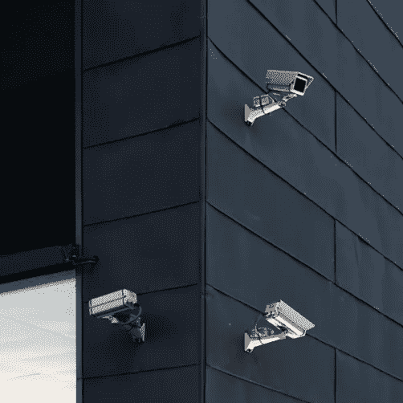

# 保护性监控/审计

> 原文：<https://medium.com/version-1/protective-monitoring-audit-a5fff819fe?source=collection_archive---------7----------------------->

大规模系统的保护性监控或审计可能是软件应用程序最重要的部分之一。等等，别跑。作为一个站在两边的人，我认为值得写下我的想法，为什么审计很重要，作为软件开发团队有什么好主意，审计团队可以提供什么信息或服务来使审计日志的实现更容易。

Photo by
Ennio Dybeli from Unsplash

**那么，到底什么是保护性监控？**

简而言之，它将日志提供给另一个应用程序，该应用程序可以用来搜索日志，以确保该应用程序被正确使用。这也是为了确保应用程序被正确的人使用。例如，记录谁使用了该应用程序，以确保他们正确地使用了该应用程序，以及他们是否被允许使用该应用程序。这在处理个人身份数据的应用程序中尤其重要。有几种方法可以做到这一点。

您可以拥有一个安全运营中心(SOC)。该团队可以查看原始基础架构日志和基于主机的日志，以确保系统得到应有的使用。该团队通常还用于监控网络，以确保没有未经授权的人试图访问您的网络。或者，如果你的组织中有人试图做一些他们不应该做的事情。

这些类型的日志非常有用，而且这方面的工具也很普遍，尤其是如果您使用 AWS 或 Azure 这样的云平台。

**应用级监控示例**

然而，这种类型的日志记录非常广泛，更详细地了解用户在应用程序中做了什么难道不是有益的吗？举一个非常简单的笔记应用程序为例，记录谁登录了您的应用程序，他们何时添加/编辑/删除了笔记，以及他们何时注销，这可能是一个好主意。通过这种方式，您可以获得一个时间表，显示用户当天使用您的应用程序时都做了些什么。

需要考虑记录什么，例如，如果您需要知道用户在他们添加注释中添加了什么。根据您所讨论的应用程序的敏感性，这里可能需要做出隐私与风险缓解的决策。在基本的任务列表中，您可能不希望捕获用户正在查看的内容，但是，在医院的记录系统中，您可能希望记录某个特定员工查看了哪些记录，以便他们可以被随机审计，以确保他们只查看他们需要查看的患者数据。此类日志也有利于合规性。

**作为审计提供的基本事件**

开发人员可以问自己的一个基本问题是，当查看特定人员的用户活动时，他们可能会发现什么是有用的。通常是当用户:

已登录/注销

添加/编辑/删除了一些数据

已经执行了搜索

查看了搜索结果

当用户从系统中导出数据时

这些就是行动。为了使这些有用，您需要执行搜索的用户名以及该操作最少发生的时间。您可能希望提供一些其他功能，例如将数据导入系统。最后，尽早与保护性监控团队合作通常是个好主意。如果你已经考虑到了以上所有更好的，然后他们可以通知你任何更复杂的要求或哪些数据不包括在你的日志中。从个人经验来看，为您的审计团队提供一组专门的审计日志更容易，这些日志是根据他们的需求定制的，而不是仅仅将您的所有应用程序日志发送给他们，这些日志可能过于嘈杂或包含他们不感兴趣的事件。

保护性监控团队能提供什么？

如果您有多个基于 web 的应用程序需要提供保护性监控，那么提供一个 rest API 可能会很有用，多个不同的应用程序可以向该 API 写入它们的审计。这有助于应用程序团队检查他们发送的数据是否是需要的。坦率地说出你对团队的要求也是一个优势。此外，如果您的需求发生了变化，那么尽快通知应用程序团队会使应用程序团队的生活更轻松。

**总结**

因此，总而言之，当开发应用程序时，我们应该考虑如何在开发过程的早期审计它们。我们应该确保自己对可以提供哪些审计事件有所了解。最后，我们应该在开发过程的早期与保护性监控/审核团队合作，以清楚地理解审核要求。显然，如果一个团队能够提供审计级别的细节，他们就能够提供一个好的起点。保护性监控是一项复杂的任务，但审计和应用团队合作将能够提供有用的审计，以帮助确保系统安全并以合规的方式使用。

但是，我只是一个开发者。我很想听听您对审计/保护性监控的想法和经验，无论是在提交应用程序方面还是在审计方面。

**更多信息**

[记录和监控—NCSC.GOV.UK](https://www.ncsc.gov.uk/collection/10-steps/logging-and-monitoring)

**关于作者**

Niall Richards 是版本 1 的高级 Java 开发人员