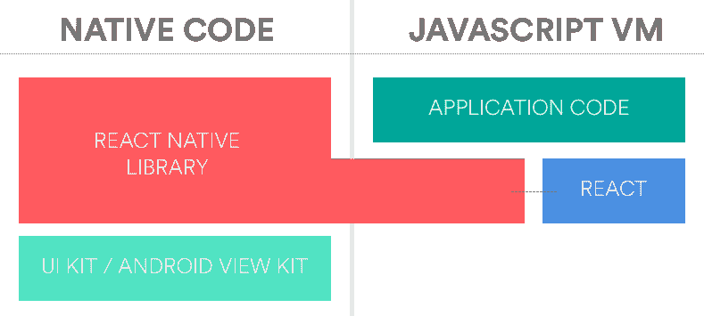
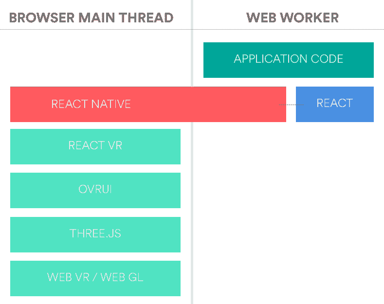
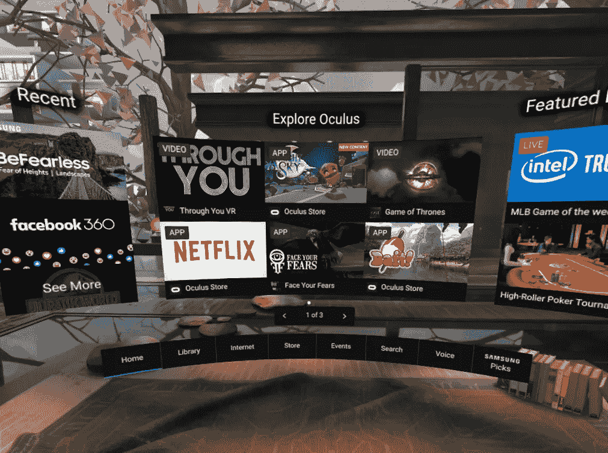

# 用 React VR 制作原型

> 原文：<https://medium.com/airbnb-engineering/prototyping-with-react-vr-4d5ab91b6f5a?source=collection_archive---------0----------------------->

## React 在 Web 和 Native 上的悠久历史导致了在虚拟空间中非常自然的探索。我们很乐意告诉你！

Next time you are in Beijing, come visit us!

在 Airbnb，自 2014 年以来，我们一直在使用 [React](https://github.com/facebook/react) 为我们的网站构建用户界面。React 从根本上改变了我们构建 UI 的方法，我们一直是开源社区的积极贡献者，参与的项目有[酵素](http://airbnb.io/projects/enzyme/)、 [Hypernova](http://airbnb.io/projects/hypernova/) 、 [react-sketchapp](http://airbnb.io/react-sketchapp/) 、 [react-with-styles](http://airbnb.io/projects/react-with-styles/) 、 [react-dates](http://airbnb.io/projects/react-dates/) 和 [react-native-maps](https://github.com/airbnb/react-native-maps) 。

[React VR](https://facebook.github.io/react-vr/) 提供了一个独特的机会，利用我们的专业知识来快速测试和重复我们一直在尝试的许多 VR 想法。为了做到这一点，我们在 Airbnb Samara 的虚拟现实实验室召集了一个由 React 和虚拟现实专家组成的小组，看看在 F8 React 虚拟现实发布前的 3 周内我们能完成什么。以下是 React VR 的技术概述，以及 React、React Native 和 React VR 之间的相似之处。

The video of our React VR prototyping experience, shown on stage at Facebook’s F8 conference

## **为什么做出反应**

React 最大的创新之一是，它使开发人员能够将一个系统(如 web 或移动应用程序的 UI)描述为一组声明性组件。这种声明性方法的强大之处在于，UI 的描述与其实现是分离的，允许作者构建定制的“呈现器”，这些“呈现器”不仅面向 web 浏览器，还面向更多平台，例如[硬件](https://github.com/iamdustan/react-hardware)、[终端应用](https://github.com/Yomguithereal/react-blessed)、[音乐合成器](https://formidable.com/blog/2016/08/22/make-dope-beats-with-reactjs/)和 [Sketch.app](http://airbnb.io/react-sketchapp/) 。

> React as 范型非常适合包装底层平台 API 的复杂性，并为使用它们的开发人员提供一致和流畅的工具。
> 
> 乔恩·戈尔德，《用代码绘画》[http://airbnb.design/painting-with-code](http://airbnb.design/painting-with-code/)

## **引擎盖下的反应原生**

因为 React VR 是建立在 React Native 之上的，所以我们先来看看它在引擎盖下是如何工作的。 [React Native](https://github.com/facebook/react-native) 建立在一个渲染器上，该渲染器控制 iOS 和 Android 上的原生 UI。React 应用程序代码在移动设备的后台线程中的 JavaScript 虚拟机中运行，让主线程自由地呈现原生 UI。React Native 为 app 的原生层和 JavaScript 层提供了沟通的桥梁。当应用程序中的 React 组件被呈现时，React 本机呈现器将所有需要发生的 UI 更改序列化为基于 JSON 的格式，并通过桥异步发送该有效负载。本机层接收并反序列化这个有效负载，相应地更新本机 UI。

*Diagram 1: React Native architecture.*

在过去的一年里，Airbnb 在 React Native 上进行了大量投资，因为我们认识到跨平台共享知识、工程师和代码的力量。11 月，我们推出了新的[体验](https://www.airbnb.com/experiences)平台，它主要是在我们的 iOS 和 Android 应用程序上用 React Native 编写的，我们组建了一个全职的 React Native 基础架构团队来继续这项投资。

> 学一次，随处写。
> 
> Tom Occhino， [React Native:将现代网络技术引入手机](https://code.facebook.com/posts/1014532261909640/react-native-bringing-modern-web-techniques-to-mobile/)

## **React VR 基于 React Native**

React VR 的架构反映了 React Native 的架构，React 应用程序代码在后台线程中运行——在本例中，是 Web 浏览器中的一个 [Web Worker](https://developer.mozilla.org/en-US/docs/Web/API/Web_Workers_API) 。当应用程序的 React 组件被渲染时，React VR 利用 React 本机桥来序列化任何必要的 UI 更改，并将它们传递给主线程，在这种情况下，主线程是浏览器的主 JavaScript 运行时。在这里，React VR 利用 Oculus 的一个名为 [OVRUI](https://www.npmjs.com/package/ovrui) 的库，将待定 UI 更新的有效载荷翻译成 [Three.js](https://threejs.org/) 命令，使用 WebGL 渲染一个 3D 场景。

*Diagram 2: React VR is built directly on top of React Native*

最后，React VR 利用 WebVR 的新`navigator.getVRDisplays()` API 将 3D 场景发送到用户的头戴显示器，如 Oculus Rift、HTC Vive 或三星 Gear VR。由 Mozilla 倡导的新标准 WebVR ，在最近的主流浏览器版本中都得到了支持。查看 [webvr.info](https://webvr.info/) 了解浏览器支持的最新信息。

因为 React VR 实现了许多与 React 原生实现相同的公共 API，所以我们可以访问同样庞大的模式、库和工具生态系统。任何开发过 React 或 React 原生应用程序的开发人员都会对此感到熟悉。我们能够快速建立并运行一个虚拟现实原型；很快，我们搭建了一个基本的 React 应用程序，设置了 Redux，并开始使用我们的生产 JSON API 获取样本数据。

通过热模块重新加载和 Chrome Dev 工具调试，我们可以像 React web 和 React Native development 一样快速地进行迭代，这允许我们向众所周知的墙扔一堆 UI 想法，看看什么会坚持下来。

> 使用 React (JavaScript)已经证明是 VR 应用开发的一个比我预期的更大的胜利——UI dev 比 Unity 快几倍。
> 
> 约翰·卡马克，Oculus 首席技术官，也是《雷神之锤》的原创者。

## **虚拟现实中的 Flexbox**

React VR 继承了 React Native 基于 flexbox 的布局和样式引擎，并进行了一些调整，允许在 3 维空间中进行变换。

Flexbox 对 React Native 的支持由 [Yoga](https://facebook.github.io/yoga/) 提供，这是一个由脸书创建的跨平台布局引擎，通过将 flexbox 指令转换为布局度量来简化移动开发。因为是用 C 写的，Yoga (née css-layout)可以原生嵌入 Objective-C 和 Java 移动应用。React VR 也使用 Yoga 进行 flexbox 布局。“但是怎么做呢？”你问“是用 C 写的！”React VR 团队已经通过使用 [Emscripten](https://github.com/kripken/emscripten) 将 Yoga C 代码交叉编译成 JavaScript 实现了这一点。多酷啊。

这是 React VR 的一个强大功能:开发者可以跨 web、React Native 和 VR 使用相同的样式和布局系统，这为跨这些平台直接共享布局样式打开了大门。

## **共享原语**

与 React Native 一样，React VR 提供了一组用于构建 UI 的基本原语— `<View>`、`<Text>`、`<Image>`、`Stylesheet`—此外还添加了自己的 VR 专用原语，如`<Pano>`、`<Box>`等。这使得我们可以将一些现有的 React 本地组件放入 VR 中，在 2D 表面上进行渲染。

这是非常令人兴奋的，因为我们已经在`react-primitives`上构建了我们的 [UI 组件系统](https://airbnb.design/building-a-visual-language/)，这是一个我们开发的库，通过提供基本的`<View>`、`<Text>`、`<Image>`等来跨平台共享 React 组件。各种平台的原语，包括 web、native 和 Sketch.app(通过我们的 [react-sketchapp](https://airbnb.design/painting-with-code/) 项目)。

这意味着我们可以在 VR 中直接使用按钮、行、图标等，保持 Airbnb 设计语言的一致性，而不必从头开始重写。

查看我们的工程师 Leland Richardson 在 React Europe 上的演讲，更深入地了解下面的`react-primitives`的前景。

Airbnb engineer Leland Richardson’s talk at React Europe: “React as a Platform: A path towards a truly cross-platform UI”

**<>/**

可以想象，将 2D 内容放在 3D 空间的平面上通常达不到最佳的观看体验。目前，许多 VR 应用程序通过将 2D UI 渲染到观众面前弯曲的圆柱形平面上来解决这一问题，给它一种“2.5D”的感觉。

A screenshot of Oculus home captured in Gear VR, showing of its use of a cylindrical layer for displaying 2D content for a “2.5D” feel

React VR 为此提供了`<CylindricalLayer>`组件，我们发现它可以有效地在我们的应用程序中显示菜单和其他交互式内容，并且是将我们 UI 库中现有的 2D React 组件集成到 VR 环境中的最佳方式。

由于能够利用我们现有的 React 知识、工具和 UI 组件系统，我们几乎可以立即在 React VR 中提高工作效率。再加上热模块重新加载的魔力，这使我们能够调整三维空间中对象的方向，并接收沉浸在虚拟现实环境中的人的即时反馈，我们设法制作了大量低逼真度的原型，与用户一起测试它们，并迅速了解我们的想法在虚拟现实中哪些可行，哪些不可行。

这种广泛的实验对于首次涉足虚拟现实开发的人来说是必要的——我们一次又一次地发现，UX 的想法在纸上听起来很好，但一旦戴上虚拟现实耳机，可能会感觉很奇怪，而且许多在 2D 工作得很好的 UI 隐喻并不能很好地转化为 3D。我们 3 周冲刺的主要收获之一是，我们必须开始发展对 UX 虚拟现实最佳实践的新理解，我们只能在有限的程度上依靠现有的网络和移动学习。幸运的是，有研究人员正在打造这些新的道路，比如 VR 的 [UX 背后的人们，我们可以从他们的辛勤工作中学习。](https://www.uxofvr.com/)

还需要注意的是，React VR、WebVR 和 VR 硬件都是新生技术。在前沿工作所固有的不稳定性会使开发过程变得令人沮丧和坎坷。另一方面，生态系统的发展速度令人难以置信，尤其是 React VR 在我们使用预发布版本进行原型开发的三个月内迅速成熟。

最后，我们要感谢在这次探索中支持我们的脸书和 Oculus 团队，我们很高兴能够为推动该平台向前发展做出贡献。我们迫不及待地想看看商店里有什么！