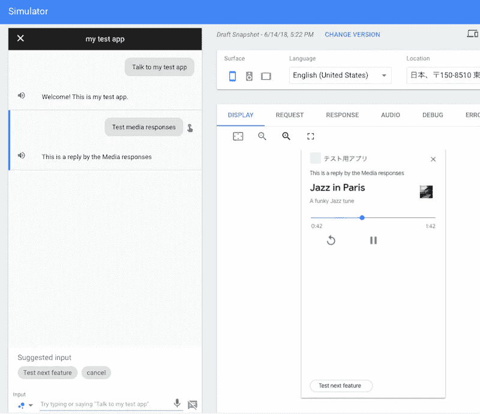
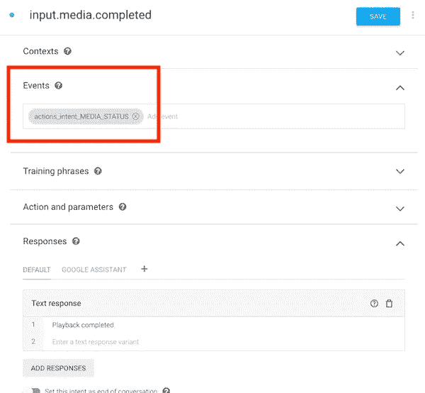

# 使用媒体响应提供长音频内容

> 原文：<https://medium.com/google-developer-experts/providing-long-audio-content-using-media-responses-945fab46a6e0?source=collection_archive---------4----------------------->

7 月 14 日， [Leon Nicholls](https://plus.google.com/u/0/+LeonNicholls) 在 G+上宣布，除了 ko-KR 之外，在 Google locales 上的所有行为现在都支持媒体回应。

媒体回应更新:[https://plus.google.com/u/0/+LeonNicholls/posts/cbATWnXx5cv](https://plus.google.com/u/0/+LeonNicholls/posts/cbATWnXx5cv)

[](https://plus.google.com/u/0/+LeonNicholls/posts/cbATWnXx5cv) [## 介质响应更新介质响应现在支持所有移动操作...

### 媒体响应更新媒体响应现在支持除 ko-KR 之外的所有 Google 本地操作…

plus.google.com](https://plus.google.com/u/0/+LeonNicholls/posts/cbATWnXx5cv) 

我们对 SSML 的音频长度有限制。长度在 120 秒以内。然而，我们可以用“媒体反应”来超越这个限制。正如宣布的那样，媒体回应功能现在可以在大多数语言中使用。太好了！

我尝试使用该功能，以便确认它是否正常工作。结果正常工作了。

我使用了下面的测试代码:

```
app.intent("input.media", conv => {
    if (!conv.surface.capabilities.has("actions.capability.MEDIA_RESPONSE_AUDIO")) {
        conv.ask("The media response audio surface is not supported for the user's device.");
        return;
    }
    conv.ask(new SimpleResponse({
        speech: "This is a reply by the Media responses",
        text: "This is a reply by the Media responses"
    }));
    conv.ask(new MediaObject({
        name: 'Jazz in Paris',
        url: '[http://storage.googleapis.com/automotive-media/Jazz_In_Paris.mp3'](http://storage.googleapis.com/automotive-media/Jazz_In_Paris.mp3'),
        description: 'A funky Jazz tune',
        icon: new Image({
            url: '[http://storage.googleapis.com/automotive-media/album_art.jpg'](http://storage.googleapis.com/automotive-media/album_art.jpg'),
            alt: 'Media icon',
        }),
    }));
    conv.ask(new Suggestions("Test next feature"));
});
```

新的 surface `actions.capability.MEDIA_RESPONSE_AUDIO`已经推出。如果我们发送媒体响应，我们需要检查用户的设备是否支持 surface。如果支持，我们可以发送媒体响应。

为了发送媒体响应，我们使用了`MediaObject`类。该类的用法很简单。基本上，我们只传递音频文件的 URL。但是，除此之外，如果我们想继续当时的谈话，我们必须做到以下几点:

*   送了`SimpleResponse`。
*   另外，发送`Suggestions`以提供建议芯片。

在发送了上面的媒体响应后，我们将看到来自 Google Assistant 的以下响应:



在动作模拟器中，我们可以测试媒体反应。特别是我们可以看到包括音频播放器 UI 在内的响应。当时，指定的音频已经自动启动。

如果您想在发送媒体响应时结束对话，建议芯片是不必要的，如以下代码所示:

```
app.intent("input.media", conv => {
    if (!conv.surface.capabilities.has("actions.capability.MEDIA_RESPONSE_AUDIO")) {
        conv.ask("The media response audio surface is not supported for the user's device.");
        return;
    }
    conv.close(new SimpleResponse({
        speech: "This is a reply by the Media responses",
        text: "This is a reply by the Media responses"
    }));
    conv.close(new MediaObject({
        name: 'Jazz in Paris',
        url: '[http://storage.googleapis.com/automotive-media/Jazz_In_Paris.mp3'](http://storage.googleapis.com/automotive-media/Jazz_In_Paris.mp3'),
        description: 'A funky Jazz tune',
        icon: new Image({
            url: '[http://storage.googleapis.com/automotive-media/album_art.jpg'](http://storage.googleapis.com/automotive-media/album_art.jpg'),
            alt: 'Media icon',
        }),
    }));
});
```

我们可以在回放完成后处理回调。如果使用 Dialogflow，可以通过处理`actions_intent_MEDIA_STATUS`事件来了解播放完成情况。



更多详情，请参见针对谷歌开发者的官方文件。