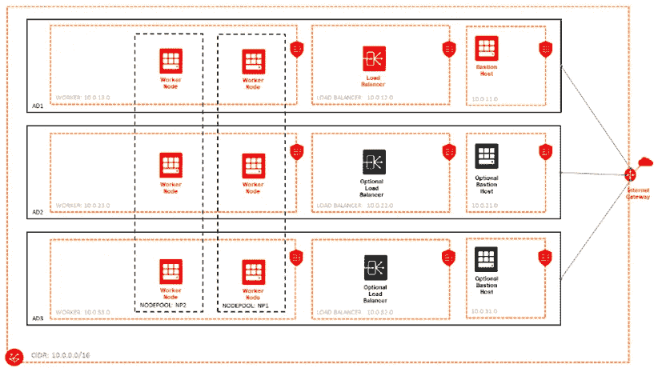

# 人们不会简单地将 Kubernetes 部署到云上

> 原文：<https://medium.com/oracledevs/provisioning-oracle-container-engine-oke-using-terraform-41542fd15d1c?source=collection_archive---------1----------------------->


Boromir

手动创建 Oracle 容器引擎(OKE)集群可能是一项耗时的任务。至少，您需要创建以下内容:

*   一个 VCN，一个互联网网关，一个 NAT 网关，如果你想一个私有工作者节点部署
*   具有一组安全规则的工作子网
*   负载平衡器子网及其安全规则

所有这些都有很好的记录[这里](https://docs.cloud.oracle.com/iaas/Content/ContEng/Concepts/contengnetworkconfigexample.htm)。

假设您已经正确完成了所有工作，现在您可以创建一个集群和节点池了。

如果您很快需要一个集群，比如说一个实验或演示，您还可以使用 OCI 控制台中的快速创建选项。但是当你可以实际编码的时候，为什么要手工做呢？

## terraform-oci-oke 简介

我们最近在 github 上发布了[terraform-OCI-oke](https://github.com/oracle-terraform-modules/terraform-oci-oke)s̶a̶m̶p̶l̶e̶-̶o̶k̶e̶-̶f̶o̶r̶-̶t̶e̶r̶r̶a̶f̶o̶r̶m̶(i̶'̶l̶l̶̶t̶r̶y̶̶t̶o̶̶m̶a̶k̶e̶̶i̶t̶̶l̶e̶s̶s̶̶a̶̶m̶o̶u̶t̶h̶f̶u̶l̶̶i̶n̶̶t̶h̶e̶̶f̶u̶t̶u̶r̶e̶完成)，它使用 terra form 和 Terraform OCI provider 来自动化 oke 部署。

一些功能包括以下内容:

*   提供所有基本要求，如 VCN、网关、子网、安全列表等
*   您的工作子网和负载平衡器子网的可配置网络设置
*   安装并配置了 git、oci-cli、kubectl 和 helm 的堡垒的可选配置
*   选择在私有或公共模式下运行工作节点
*   可配置的节点池数量、节点池大小、工作节点形状和拓扑
*   可选插件，如 kubernetes 仪表板、网络策略 calico、helm
*   可选的[创建认证令牌](https://docs.cloud.oracle.com/iaas/Content/Identity/Tasks/managingcredentials.htm)，用于创建 Kubernetes 秘密。然后，您可以使用这个秘密作为 imagePullSecrets，这样 OKE worker 节点就可以从私有的 [OCIR](https://docs.cloud.oracle.com/iaas/Content/Registry/Concepts/registryoverview.htm) 存储库中提取图像。

让我们兜一圈。下面是一个你可以用 [terraform-oci-oke](https://github.com/oracle-terraform-modules/terraform-oci-oke) 脚本创建的例子。



OKE Cluster with Bastion

我将假设您(a)已经为 terraform 配置了您的 OCI 帐户(b) [创建了用于创建 OKE 集群的策略](https://docs.cloud.oracle.com/iaas/Content/ContEng/Concepts/contengpolicyconfig.htm)。如果没有，先按照这里[的指示](https://github.com/oracle/sample-oke-for-terraform/blob/master/docs/instructions.md)。

首先，克隆回购:

```
git clone [https://github.com/oracle-terraform-modules/terraform-oci-oke.git](https://github.com/oracle-terraform-modules/terraform-oci-oke.git) tfoke
cd tfoke
```

将 terraform.tfvars.example 复制到 terraform.tfvars 并编辑 terraform.tfvars:

```
cp terraform.tfvars.example terraform.tfvars
```

输入以下信息:

*   api _ 指纹
*   api_private_key_path
*   隔离舱名称
*   隔离舱 _ocid
*   租赁 _ocid
*   user_ocid
*   ssh _ 私有 _ 密钥 _ 路径
*   ssh 公共密钥路径

如果您想要创建身份验证令牌和 Kubernetes 秘密，您还需要提供以下内容:

*   电子邮件地址
*   租赁 _ 名称
*   用户名

所有的地形选项都有完整的文档[在这里](https://github.com/oracle/sample-oke-for-terraform/blob/master/docs/terraformoptions.md)。

您现在可以运行 terraform 计划并应用:

```
terraform plan
terraform apply -auto-approve
```

默认情况下，将为您创建一个包含 3 个工作节点的群集，除非您更改了 node_pools 和 node_pool_quantity_per_subnet 参数。

完成后，terraform 将为您打印以下内容:

```
bastion_public_ips = XXX.XXX.XXX.XXX
kubeconfig = export KUBECONFIG=generated/kubeconfig
ocirtoken = sensitive
ssh_to_bastion = ssh -i ~/.ssh/id_rsa opc@XXX.XXX.XXX
```

kubeconfig 文件也将在生成的目录下创建，这样您就可以设置您的 KUBECONFIG 环境变量并开始使用 kubectl:

```
export KUBECONFIG=generated/kubeconfig
```

并验证您可以与群集交互:

```
kubectl get nodes
NAME        STATUS   ROLES   AGE   VERSION                                                                                                                                  
10.0.13.2   Ready    node    20h   v1.12.6                                                                                                                                  
10.0.23.2   Ready    node    20h   v1.12.6                                                                                                                                  
10.0.33.2   Ready    node    20h   v1.12.6
```

访问仪表板:

```
demo/dashboard.sh
Access K8s Dashboard: [http://localhost:8001/api/v1/namespaces/kube-system/services/https:kubernetes-dashboard:/proxy/](http://localhost:8001/api/v1/namespaces/kube-system/services/https:kubernetes-dashboard:/proxy/)
```

打开浏览器并访问仪表板:[http://localhost:8001/API/v1/namespaces/kube-system/services/https:kubernetes-dashboard:/proxy/](http://localhost:8001/api/v1/namespaces/kube-system/services/https:kubernetes-dashboard:/proxy/)并使用生成的文件夹中的 kubeconfig 登录。

## 使用堡垒

bastion 安装了 oci-cli 和 helm，并且具有 kubectl 和 helm 自动完成功能。只需登录并开始与您的集群交互:

```
ssh -i ~/.ssh/id_rsa opc@XXX.XXX.XXXkubectl get nodes
NAME        STATUS   ROLES   AGE   VERSION                                                                                                                                  
10.0.13.2   Ready    node    20h   v1.12.7                                                                                                                                  
10.0.23.2   Ready    node    20h   v1.12.7                                                                                                                                  
10.0.33.2   Ready    node    20h   v1.12.7
```

你可以随时打开/关闭堡垒。

## 重用、插件和社区

该项目还被设计为可重用的，这意味着您可以克隆和添加您自己的私人定制。

在接下来的几个月中，我们还希望为该项目添加一些插件，以自动将其他软件部署到集群中，我们希望通过社区努力来实现这一点。我们正在考虑的一些插件包括:

*   伊斯迪奥
*   MySQL 运算符
*   API 网关，如大使和孔
*   WebLogic 运算符

你可以在这里看到完整的名单。当然，如果你有一个插件的想法，我们很乐意听到你的意见。或者更好的方法是，向我们发送拉取请求。