# Proxychains，Anonsurf & MacChanger -增强您的匿名性！

> 原文：<https://medium.com/edureka/proxychains-anonsurf-macchanger-ethical-hacking-53fe663b734?source=collection_archive---------0----------------------->

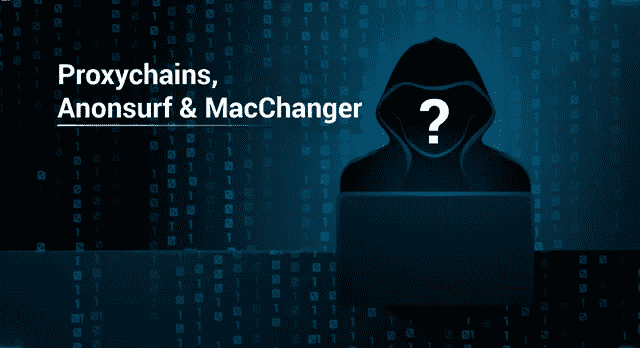

Proxychains, Anosurf & MacChanger — Edureka

道德黑客被认为是黑客的光明面，因为它是为了使安全性更好而使用的。但是，即使道德黑客是合法的，它也不是完全安全的，因此，匿名就像一个盾牌。在这篇文章中，我将告诉你为什么匿名对于一个有道德的黑客是重要的，以及如何增加他们的匿名性。

这些是我将在本文中涉及的主题:

*   为什么匿名对于道德黑客很重要？
*   匿名代理链
*   匿名冲浪
*   匿名的 MacChanger

# 为什么匿名对于道德黑客很重要？

> “为什么我在进行道德黑客活动时应该匿名？

当我告诉别人匿名进行道德黑客攻击时，这是我经常被问到的问题。这个问题的答案是，“因为你不是一个人”。

让我简单解释一下。如果你是一个有道德的黑客，那么这个组织已经给了你许可，因此，你可能会认为你没有麻烦。但是请记住，当你试图寻找一个**漏洞**的时候，网络中可能还有一些**其他黑客**。为了保护自己免受黑客攻击，你需要匿名。

你永远不知道还有谁和你在同一个网络中。如果一个**黑帽黑客**发现网络中还有其他人，那么他可能会试图**黑你的系统**。这就是为什么匿名甚至对有道德的黑客也很重要。

现在，你知道为什么匿名是必要的，让我们看看你如何匿名。我将讨论使用 Anonsurf、Proxychains 和 MacChanger 进行道德黑客攻击来保护您的身份的 3 种方法。

# 匿名代理链

在了解道德黑客的代理链之前，让我告诉你什么是代理。你知道当你向服务器请求网页时会发生什么吗？请求从您的系统发送到服务器。服务器处理请求，并用您请求的数据进行响应。然后，这个响应被发送到您的系统。

你认为服务器是如何识别你的系统的？通过你的 IP 地址！

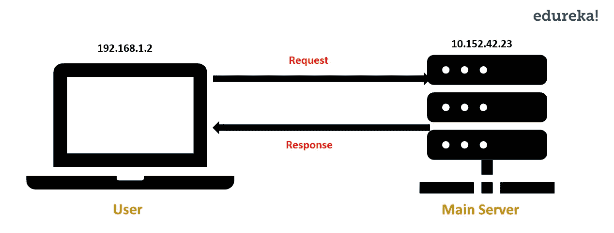

IP 地址可以用来识别黑客的系统，而代理是避免这种情况的一种方法。代理通过代理服务器将请求从您的系统重定向到主服务器。使用这个，您的系统的 IP 地址是隐藏的，因为对主服务器的请求是通过代理服务器进行的。

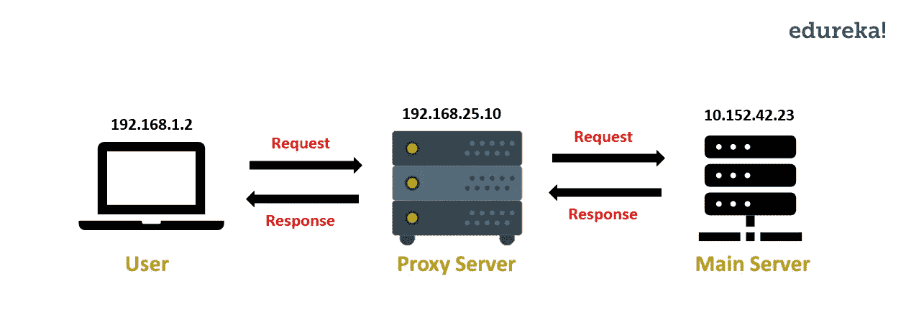

当您使用 Proxychain 进行道德黑客攻击时，您的请求将通过多个代理服务器重定向，而不是使用一个代理服务器。这使得追溯 IP 变得困难。现在您已经知道了什么是 Proxychain，让我们看看如何使用 proxy chain 进行道德黑客攻击。

要安装 Proxychain，请打开终端并运行以下命令:

`$ sudo apt-get install proxychains`

接下来，您需要在配置文件中进行一些更改。打开 **proxychains.conf** 文件。

`$ sudo nano /etc/proxychains.conf`

在这个文件中，默认情况下，对行 **dynamic_chain** 进行注释，对行 **strict_chain** 不进行注释。从**动态链**中删除注释，并注释掉**严格链。**这是为了让 Proxychain 即使在少数代理服务器不在线的情况下也能工作。

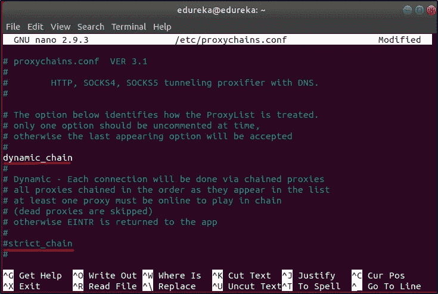

为了让道德黑客的 Proxychain 更有效，让我们添加更多的代理服务器。向下滚动到文件的末尾，您将看到一个默认的代理服务器。在文件末尾添加以下几行:

```
socks4 36.66.210.159 44034
socks4 182.52.51.19 32591
socks4 167.249.78.22 4145
socks4 91.195.158.171 4145
socks4 45.4.255.168 4145
socks4 31.145.166.28 4145
```

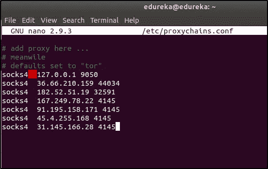

建议你多加几个这样的代理服务器。您可以在互联网上通过简单的“**代理服务器列表**”搜索找到代理服务器的详细信息。

保存(Ctrl+O)并退出(Ctrl+X)文件。

在使用 Proxychain 之前，请检查您的 IP 地址是否可跟踪。要检查这一点，打开任何互联网浏览器，并打开以下网址:[https://www.dnsleaktest.com。这个网站会显示你的 IP 地址。关闭浏览器。现在让我们试试 Proxychain。](https://www.dnsleaktest.com/)

运行 proxychain 的语法是:`$ proxychains <application/command>`

让我们运行 Proxychain，看看它是否有效。打开终端并运行以下命令:

`$ proxychains firefox [www.dnsleaktest.com](http://www.dnsleaktest.com)`

您现在可以看到 IP 地址已经更改。

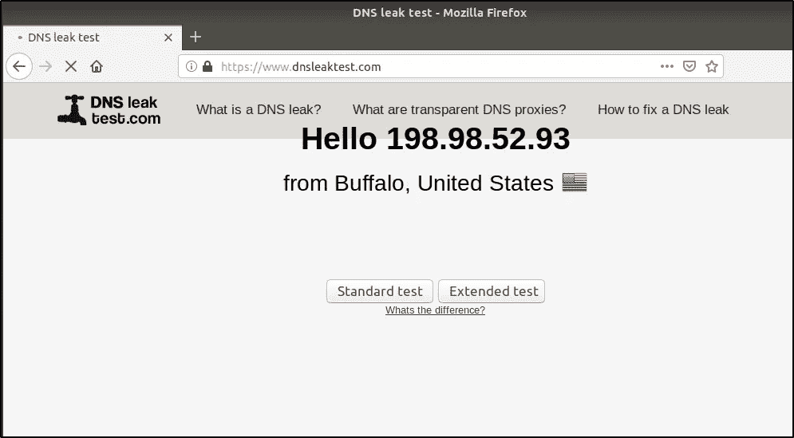

现在，点击**标准测试。**如果你使用的代理服务器是在线的，那么你会看到不同的 IP 地址，这些地址隐藏了你的实际 IP 地址。

Proxychain 是隐藏 IP 地址的好方法。但这还不够。要添加另一层匿名，您可以使用 Anonsurf。

# 匿名冲浪

Anonsurf 是一款通过 TOR 中继路由每个数据包来帮助您保持匿名的工具。当您使用 Anonsurf 进行道德黑客攻击时，来自您系统的所有流量都会通过 TOR 代理服务器，因此您的 IP 地址会发生变化。

现在让我们看看如何在 Ubuntu 上安装和使用 Anonsurf 进行道德黑客攻击。

要下载 Anonsurf，请在终端中运行以下命令:

`$ git clone [https://github.com/Und3rf10w/kali-anonsurf.git](https://github.com/Und3rf10w/kali-anonsurf.git)`

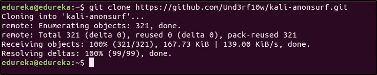

接下来，您必须安装 Anonsurf。为此，请在终端中运行以下命令:

`$ cd kali-anonsurf/`

`$ ./installer.sh`

现在 Anonsurf 已经安装好了，让我们看看它是如何工作的。但在此之前，我们先检查一下你的 IP 是否有迹可循。要检查这一点，打开任何互联网浏览器，打开以下网址:[https://www.dnsleaktest.com](https://www.dnsleaktest.com/)

这个网站会显示你的 IP 地址。现在关闭浏览器并运行 Anonsurf。

要启动 Anonsurf，请在终端中运行以下命令:

`$ anonsurf start`

现在，再次打开浏览器，转到[https://www.dnsleaktest.com](https://www.dnsleaktest.com/)。您将看到您的 IP 地址已更改。这意味着来自您系统的流量正通过另一台服务器进行路由。

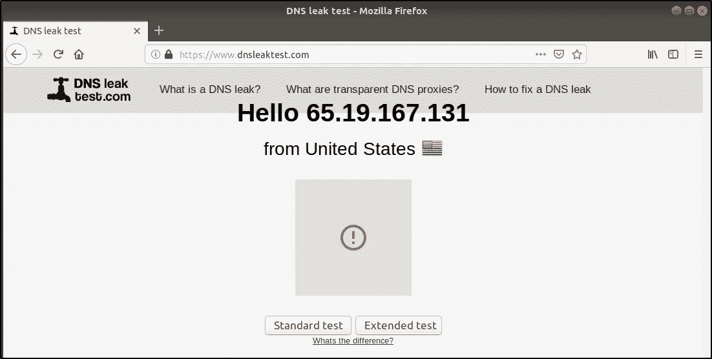

要了解 Anonsurf 用于道德黑客的其他选项，请在终端中运行以下命令:

`$ anonsurf`

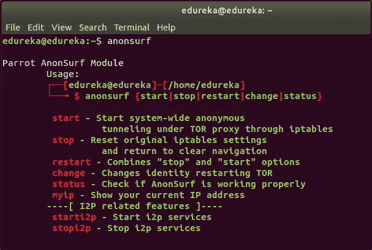

Anonsurf 和 Proxychains 帮助您隐藏 IP 地址。但是隐藏 IP 地址就足够了吗？一点也不！匿名的下一个层次可以通过改变 MAC 地址来实现。

# 匿名的 MacChanger

每台设备都有制造商分配给它的唯一 MAC 地址。当您连接到路由器时，此 MAC 地址存储在路由器的表中。因为 MAC 地址对于每台设备都是唯一的，所以它可以用来识别黑客使用的系统/设备，这可能会导致您的身份暴露。

为了避免被您的 MAC 地址识别，您可以临时更改它。这就是你可以使用 MacChanger 进行道德黑客攻击的地方。MacChanger 是一个工具，它会将设备的 MAC 地址更改为假 MAC 地址，直到设备重新启动。

要安装 MacChanger，请在终端中运行以下命令:

`$ sudo apt install macchanger`

现在，让我告诉你如何改变网络设备的 MAC 地址。

要检查系统中哪些设备可用，请在终端中运行以下命令:

`$ ifconfig`

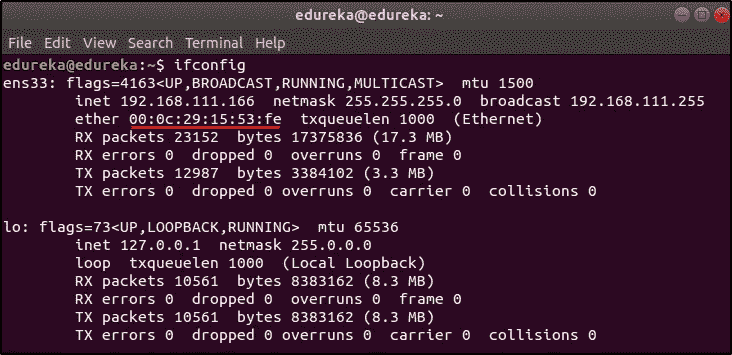

看看接口 **ens33** 的 MAC 地址，我将把它改成一个随机的 MAC 地址。要更改 MAC 地址，我将在终端中运行以下命令:

`$ sudo macchanger -r ens33`

**注意:**您的系统上可能有不同的界面，请相应地更改上面的命令。

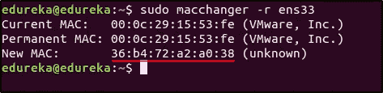

您可以看到 MAC 地址已经更改。MacChanger 是一个简单但重要的隐藏黑客身份的工具。

你已经学会了 3 种保持匿名的方法。黑客们使用许多这样的工具来保持匿名。我建议你多研究一下如何增加你的匿名性。如果你想查看更多关于人工智能、DevOps、云等市场最热门技术的文章，你可以参考 Edureka 的官方网站。

请留意本系列中的其他文章，它们将解释网络安全的各个方面。

> 1.[什么是网络安全？](/edureka/what-is-cybersecurity-778feb0da72)
> 
> 2.[网络安全框架](/edureka/cybersecurity-framework-89bbab5aaf17)
> 
> 3.[隐写术教程](/edureka/steganography-tutorial-1a3c5214a00f)
> 
> 4.[什么是网络安全？](/edureka/what-is-network-security-1f659407dcc)
> 
> 5.[什么是计算机安全？](/edureka/what-is-computer-security-c8eb1b38de5)
> 
> 6.[什么是应用安全？](/edureka/application-security-tutorial-e6a0dda25f5c)
> 
> 7.[渗透测试](/edureka/what-is-penetration-testing-f91668e2291a)
> 
> 8.[道德黑客教程](/edureka/ethical-hacking-tutorial-1081f4aacc53)
> 
> 9.[关于 Kali Linux 你需要知道的一切](/edureka/ethical-hacking-using-kali-linux-fc140eff3300)
> 
> 10.[使用 Python 的道德黑客](/edureka/ethical-hacking-using-python-c489dfe77340)
> 
> 11. [DDOS 攻击](/edureka/what-is-ddos-attack-9b73bd7b9ba1)
> 
> 12.[使用 Python 的 MAC changer](/edureka/macchanger-with-python-ethical-hacking-7551f12da315)
> 
> 13 [ARP 欺骗](/edureka/python-arp-spoofer-for-ethical-hacking-58b0bbd81272)
> 
> 14.[什么是密码学？](/edureka/what-is-cryptography-c94dae2d5974)
> 
> 15.[足迹](/edureka/footprinting-in-ethical-hacking-6bea07de4362)
> 
> 16.[50 大网络安全面试问答](/edureka/cybersecurity-interview-questions-233fbdb928d3)

*原载于 2019 年 3 月 15 日*[*www.edureka.co*](https://www.edureka.co/blog/proxychains-anonsurf-macchanger-ethical-hacking/)*。*