# 使用 Mendix 发布任何关于脸书的内容

> 原文：<https://medium.com/mendix/publish-any-content-on-facebook-using-mendix-c8c257e3edc4?source=collection_archive---------5----------------------->

Publish any Content on Facebook using Mendix

# 截至 2021 年底，脸书每月活跃用户约为 29.1 亿，是全球使用最多的在线社交网络。自然，将内容发布到脸书的能力对你的应用的成功是一笔巨大的财富。

# 我们可以在脸书上发布来自其他应用的各种内容。同样，我们可以从 Mendix 应用程序到脸书做同样的事情。该功能有助于提高应用的流量，尤其是对电子商务销售或零售商而言。

在这篇简短的博客中，我将介绍如何在脸书上设置你的应用程序。然后，我将向您展示如何使用脸书的 RESTful API 将这一功能集成到您的 Mendix 应用程序中。

## **在脸书创建应用**

1.**用你的脸书用户名和密码创建一个******开发者账号**，用你的脸书 **账号**创建一个** [**公共页面。**](https://www.facebook.com/)****

**2.**转到** [**MyApps**](https://developers.facebook.com/apps/) 脸书开发者账号。**创建一个新的应用程序**并选择应用程序的类型，给出名称细节。**

**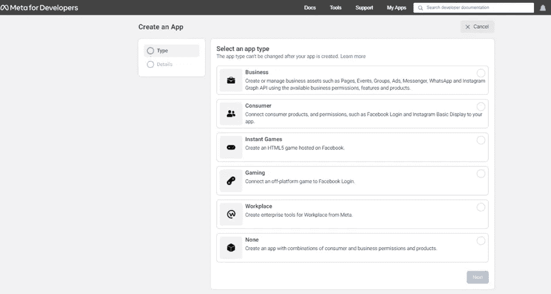**

**3.**转到开发者工具** s，选择**图形 API** 浏览器。**

**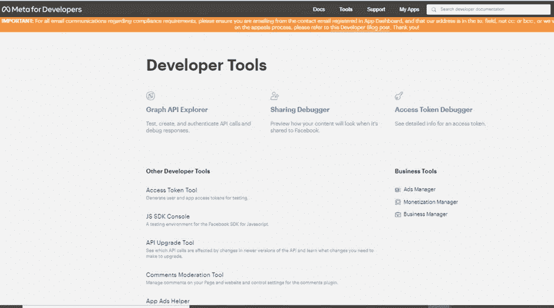**

**4.**添加所需权限**和**生成访问令牌**，您可以使用此访问令牌从 Mendix 访问脸书，但是**它即将过期**。**

**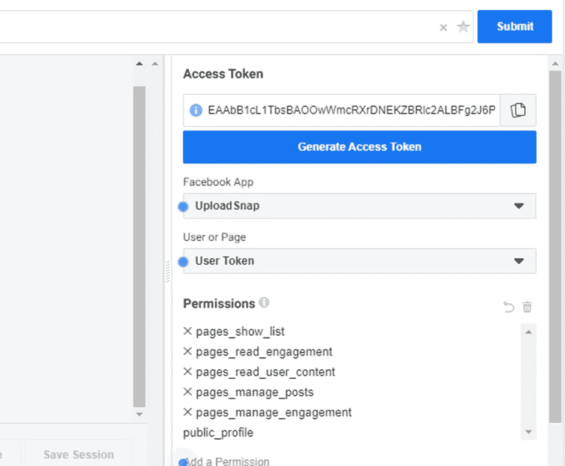**

**5.为了**获得一个长期的访问令牌**。复制短期访问令牌并将其粘贴到[调试访问令牌](https://developers.facebook.com/tools/debug/accesstoken)中，然后调试并获得扩展访问令牌。**

**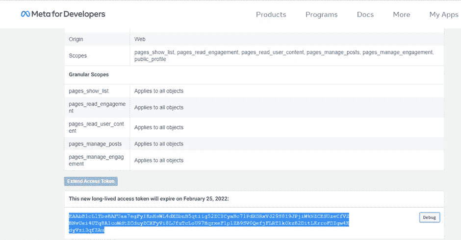**

## **门迪克斯的一面**

**要在 T42 门迪克斯的脸书上发布一张图片，你需要一个页面 ID 。**

**在数据库中存储**长期访问令牌和页面 ID。**(考虑使用加密市场模块安全存储这些详细信息)**

**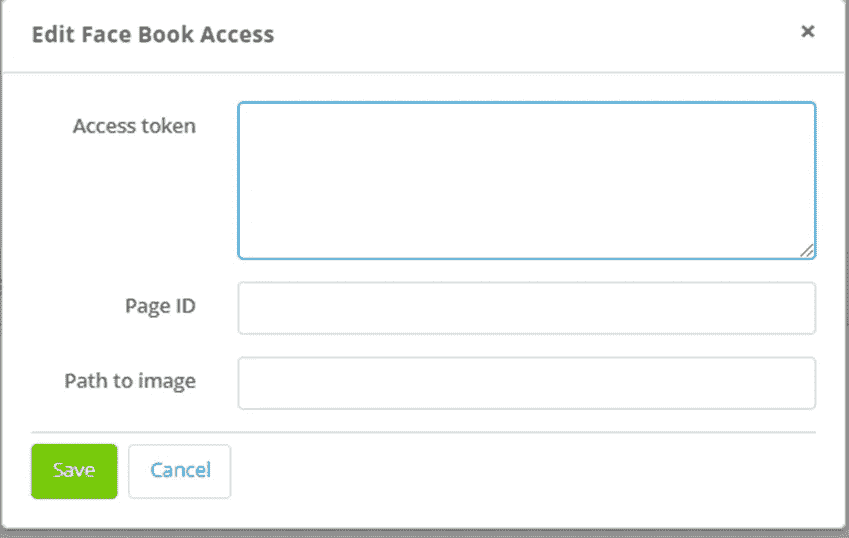**

****调用 REST 活动**获取页面访问令牌，然后将页面访问令牌传递给另一个 REST 调用活动**以在脸书发布图像**。**

**这里使用了**长期访问令牌**来获取/发布在**定制 HTTP 头标签中作为授权载体密钥。****

**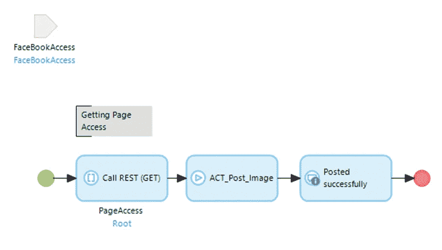**

## **获取页面访问权限**

**要获得页面访问权限**，你需要一个页面 ID** 。页面 ID 定义了您要发布到哪个脸书页面。**

**打开你的脸书公共页面，在网址里，你会得到页面 ID。**

**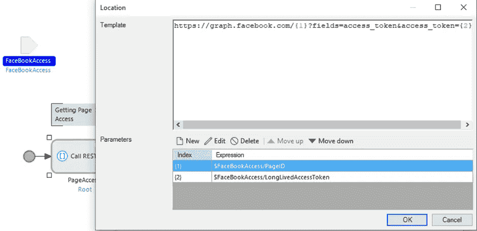**

1.  ****创建 JSON 结构**并存储响应。**

**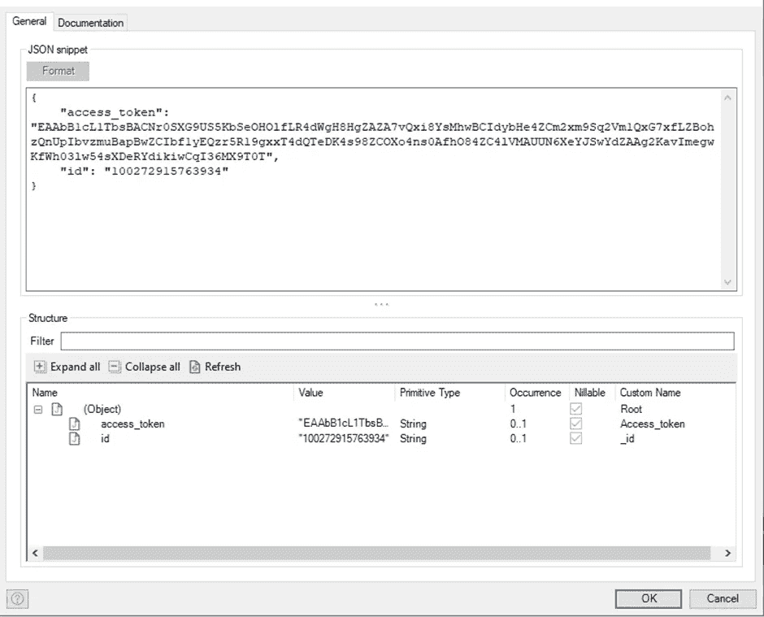**

**2.在创建**导入映射**选择元素时，这里我只需要页面访问令牌。**

**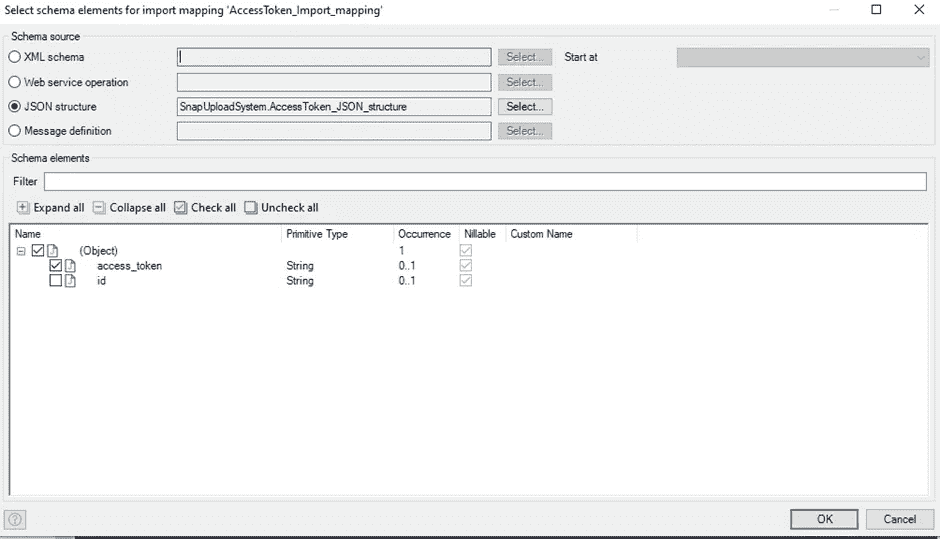**

**3.创建一个新的**非持久实体**来存储页面访问令牌**

**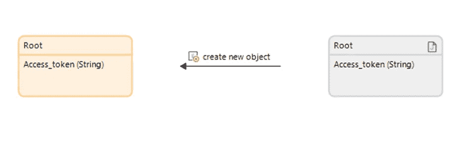**

**获得页面访问令牌后，您将能够在 Mendix 的脸书页面上发布任何内容，方法是将其包含在您的位置 URL 中，如下所示。**

**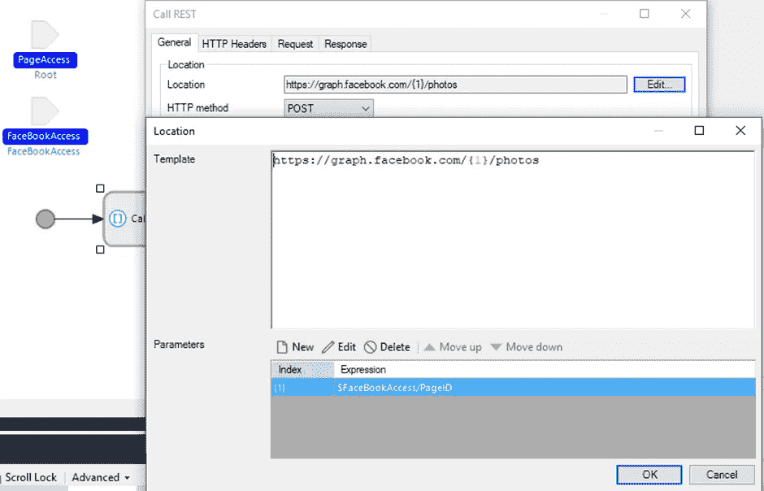****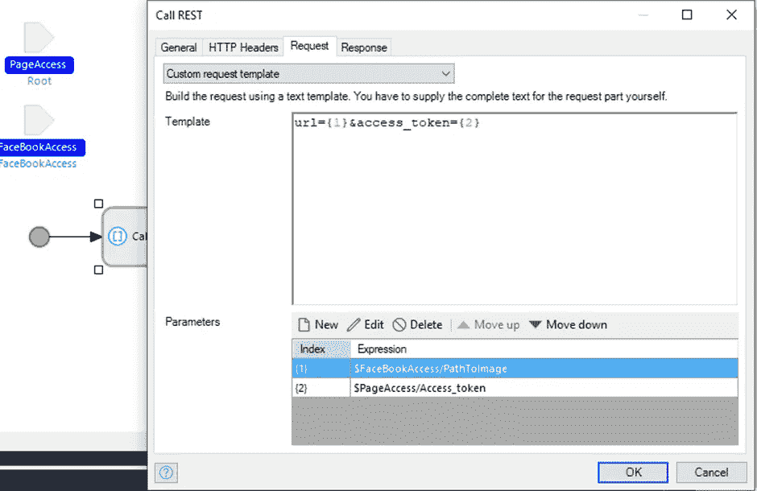**

## ****准备好了！****

**现在，您可以向脸书发布任何内容了。当微流触发时，您将收到一个成功的响应。为了确保它的工作，检查最近在脸书网页上通过 Mendix 发布的帖子。**

**我希望你觉得这很有趣并且有用，请随时在评论中提问。**

## **阅读更多**

** [## 开发者的脸书

### 有问题吗？查看我们新的和改进的开发人员支持中心，并立即找到您的问题的答案…

developers.facebook.com](https://developers.facebook.com/)  [## 脸书开发者文档

### 在您的平台上轻松设置脸书最佳商业工具，实现一站式购物。了解如何创建和发布…

developers.facebook.com](https://developers.facebook.com/docs/)  [## 使用 REST 服务- Studio Pro 9 操作指南| Mendix 文档

### 在您的 Mendix 应用程序中，您可以使用来自 REST 服务的信息。本指南通过一个示例向您展示了如何做到这一点…

docs.mendix.com](https://docs.mendix.com/howto/integration/consume-a-rest-service) 

*来自发布者-*

*如果你喜欢这篇文章，你可以在我们的* [*中页*](https://medium.com/mendix) *找到更多喜欢的。对于精彩的视频和直播会话，您可以前往*[*MxLive*](https://www.mendix.com/live/)*或我们的社区*[*Youtube PAG*](https://www.youtube.com/c/MendixCommunity/community)*e .*

*希望入门的创客可以注册一个* [*免费账号*](https://signup.mendix.com/link/signup/?source=direct) *，通过我们的* [*学苑*](https://academy.mendix.com/link/home) *获得即时学习。*

有兴趣更多地参与我们的社区吗？你可以加入我们的 [*Slack 社区频道*](https://join.slack.com/t/mendixcommunity/shared_invite/zt-hwhwkcxu-~59ywyjqHlUHXmrw5heqpQ) *或者那些想要更多参与的人，看看加入我们的*[*Meetups*](https://developers.mendix.com/meetups/#meetupsNearYou)*。***