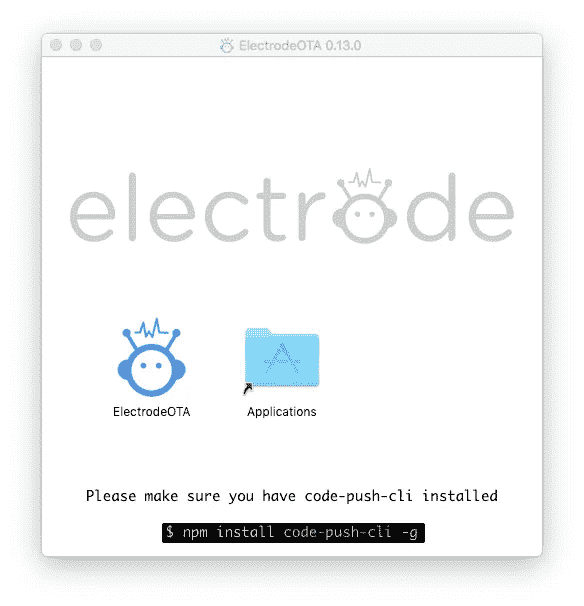
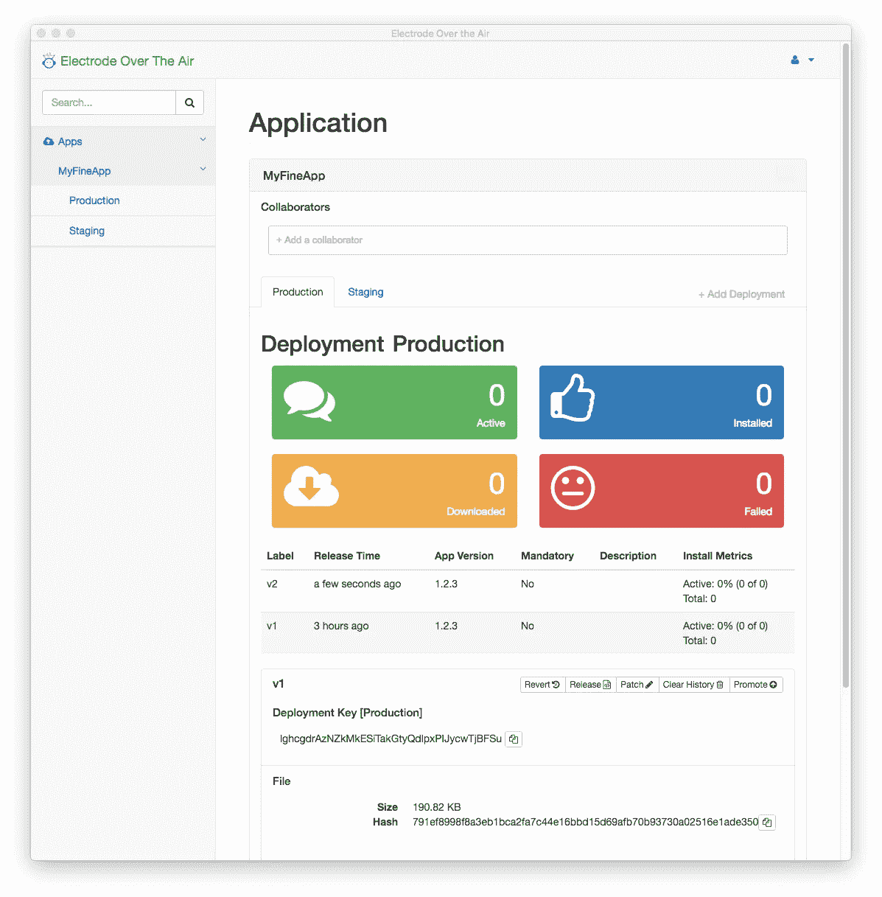

# 发布 React Native Applications Over The Air with Electrode RN OTA，这是一个来自@WalmartLabs 的开源版本

> 原文：<https://medium.com/walmartglobaltech/publish-react-native-bundles-over-the-air-with-the-first-electrode-rn-release-3780edb387ba?source=collection_archive---------2----------------------->

在@WalmartLabs，我们花了一年时间将我们的应用堆栈从 Backbone/Java 转变为 React/Node.js，这一努力在上周我们新平台的开源发布中达到高潮， [Electrode](/walmartlabs/introducing-electrode-an-open-source-release-from-walmartlabs-14b836135319#.z9pcubdhb) 。我们已经从开源社区收到了很多很好的反馈，这将帮助我们确定扩展和改进[电极](/walmartlabs/introducing-electrode-an-open-source-release-from-walmartlabs-14b836135319#.z9pcubdhb)的下一步。

我们特别兴奋的一个方向是将[电极](/walmartlabs/introducing-electrode-an-open-source-release-from-walmartlabs-14b836135319#.z9pcubdhb)扩展到移动应用领域。我们一直在试验并投资于 [React Native](https://facebook.github.io/react-native/) ，我们已经让部分沃尔玛应用程序在生产中运行 React Native。

React Native 有几个好处，包括跨多个平台的代码共享、易于学习和一个崭露头角的生态系统，但从我们的角度来看，它最有吸引力的功能之一是能够通过无线方式更新应用程序，而无需经过应用商店的批准过程。然而，事实证明，OTA 更新有多种实现方式，分属几个不同的阵营。一些实现是专有的，而另一些则开源了平台的一些部分。

因为我们喜欢开源解决方案，所以我们非常喜欢微软的代码推送客户端 SDK。但是，需要使用 Azure 来管理应用捆绑包。我们认为 Azure 很棒，但我们想要一个具有所有代码推送功能的应用程序，能够在任何云供应商上使用，包括我们自己的内部云。[所以我们造了一个](http://www.electrode.io/docs/electrode_react_native_over_the_air_electron.html)。

今天，我们很高兴地宣布[无线电极](http://www.electrode.io/docs/electrode_react_native_over_the_air_electron.html)(电极 OTA 等等)，这是一个独立的应用程序，将管理您的捆绑，并与微软代码推送客户端兼容。现在，您可以使用 100%开源的解决方案来实现 React 本机 OTA 更新，代码推送在客户端，而[电极 RN OTA](http://www.electrode.io/docs/electrode_react_native_over_the_air_electron.html) 在后端。

借助[电极 OTA 服务器](http://www.electrode.io/docs/electrode_react_native_over_the_air_electron.html)，您可以在自己的服务器上托管、管理和监控您的 JavaScript 包，因此您可以控制访问和安全性。通过对您的代码推送客户端应用程序进行小的调整，将它指向您自己的服务器而不是微软的服务器，您可以无缝地将 React 原生包部署到运行在 iOS 和 Android 上的客户端应用程序。

顺利管理跨平台应用需要强大的 CI 系统。因为[电极 OTA 服务器](http://www.electrode.io/docs/electrode_react_native_over_the_air_electron.html)是开源的，你可以自由地修改和调整它的行为以适应你的应用的需求，它的可插拔架构(基于我们自己的电极服务器基础设施)意味着社区可以将其功能扩展到我们还没有想到的领域。

部署和更新您的应用程序只是成功的一半，因此我们还内置了查询 Cassandra 后端的功能，以便为您的数据团队提供大量分析。您将深入了解诸如何时更新、上次更新的效果如何等问题。

我们没有就此止步。我们还开发了[电极 OTA 桌面](http://www.electrode.io/docs/electrode_react_native_over_the_air_electron.html)，这是一个跨平台的基于电子的应用程序(没错，就是 Electrode on electronic)来简化多部署环境的管理。

Electrode on Electron

[电极 OTA](http://www.electrode.io/docs/electrode_react_native_over_the_air_electron.html) 让您完全控制部署计划，并在配置管理中发生意外时进行回滚，因为任何没有回滚计划的部署都是在诱惑部署神。

所有这些只是我们 React 本地生态系统计划的第一步。我们感谢社区为代码推送所做的所有工作，并希望这些贡献有助于表达我们回馈社会的承诺。

“当公司拥抱开源时，所有人都是赢家；GitHub 开源负责人 Brandon Keepers 表示:“社区获得了一系列已经过测试和强化的生产就绪工具，GitHub 上的开发人员社区可以进一步完善和发展这些工具。“通过在 GitHub 上发布电极 OTA，@ WalmartLabs 正在帮助 React 原生平台的进一步创新，并增加其堆栈中技术的标准化。”

我们同意！

**检查电极在空气中的自然反应:**

[在这里阅读文件](http://www.electrode.io/docs/electrode_react_native_over_the_air_electron.html)

【https://github.com/electrode-io/electrode-ota-server 

[https://github.com/electrode-io/electrode-ota-desktop](https://github.com/electrode-io/electrode-ota-desktop)

[https://github.com/electrode-io/electrode-ota-ui](https://github.com/electrode-io/electrode-ota-ui)