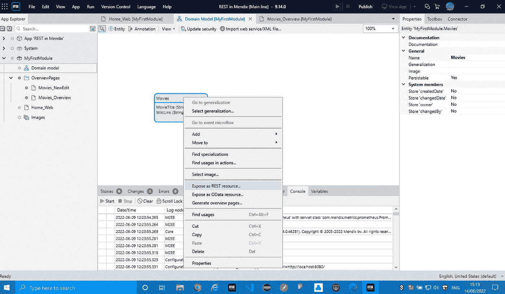

# 在 Mendix 中发布 REST APIs

> 原文：<https://medium.com/mendix/publishing-rest-apis-in-mendix-8a1feea99a71?source=collection_archive---------1----------------------->

Publishing REST APIs in Mendix

# 应用程序编程接口或 API 已经成为我们让两台计算机或系统在今天的网络上相互通信的标准方式。我在这里小心地使用“标准”这个词，因为如果你从事过 API 开发，你会知道它们在不同的项目中往往是特殊和独特的。

您遇到的大多数 API 将遵循一组称为表述性状态转移或简称 REST 的规则。在这篇博客中，我将关注 REST APIs 以及它们如何在 Mendix 中工作。

# 具象什么？

简单地说，REST 是一组控制数据传输的“规则”或协议。当一个 API 遵循这些规则时，我们称之为 RESTful API。术语 REST 是 Roy Fielding 在他 2000 年发表的博士论文“基于网络的软件架构的架构风格和设计”中创造的。不要担心，你不必阅读他的论文就能理解 RESTful API——它们已经成为当今网络上系统间传输数据的事实方式。

那么这些规则是什么呢？简而言之，它们在不同的 API 之间有所不同，但是一些普遍接受的标准有助于使 API RESTful:

*   **将实体或资源组织成唯一的 URIs** 。URI 代表统一资源标识符。它们由两部分组成——网络位置和您试图访问的资源。网络位置通常是网站 URL，而资源将是网站保存的数据表。
*   它是**无国籍**。这意味着您可以以任何顺序调用任何 API，只要您向它提供所需的正确细节。它也适用于高性能应用程序，因为服务器不需要存储客户端的会话数据。
*   它使用 **HTTP 方法**。RESTful APIs 有不同的类型或 HTTP 方法。您希望与数据交互的方式决定了要使用哪种类型的方法。( **GET** 检索数据， **POST** 创建数据， **PATCH** 更新数据， **DELETE** 销毁或擦除数据，还有更多，但这些是*主要的*)
*   数据有效载荷使用 **JSON** 或 **XML** 进行格式化。大多数 REST APIs 会将数据格式化成 JSON 或 XML 有效载荷。其他一些格式包括 HTML、标记、图像和文档(当一个 API 支持多种有效载荷格式时，您可以使用" **Accept** "头来指定您想要返回的格式)

如果你有兴趣了解更多关于休息的历史和标准，你可以在维基百科上读到更多。

# 消费与出版

在 API 开发中，发布一个 API 供他人使用和自己使用是有区别的。Mendix 允许你做这两件事，你可以使用其他系统的 REST APIs，也可以发布你自己的，所有这些都在同一个应用程序中。一些应用程序甚至称自己的公开服务为架构的一部分。

因为我之前的文章是关于消费的，所以在这篇博客**中，我将谈论在 Mendix 中发布 REST API**。

这里值得一提的是， **Mendix 还支持开箱即用的 OData API**，这在某些场景下提供了许多优势，并具有一些强大的过滤器，如 skip、filter、order by 和 select。然而，这篇文章是关于标准 REST APIs 的，我更愿意在我的下一篇博客中讨论 OData 因为它是一个广泛的主题，我想详细讨论它。

# 创建公开的 REST 服务

学习的最好方法是去做——所以这一节将是关于如何发布 REST API 的实用指南。为了使用一个简单的用例，我将向您展示如何创建一个简单的 API 集合——与我已经构建的一个简单的电影目录应用程序进行交互。

如你所见，该应用程序只是一个主页，显示电影标题列表和该电影的 IMDB 页面链接。让我们用数据填充它，这样我们就有东西可以交互了。

如果我们想要在我们的域模型中公开来自一个实体的数据，我们可以简单地选择这个实体，右键单击它，并选择“作为 REST 资源公开”

它将在您的项目中请求一个服务，但是您可以选择在项目的任何模块中创建新的服务。对于这个例子，我把我的称为 Movielist。

然后，您需要决定一个关键属性。只有当您希望与特定数据进行交互并利用 HTTP 方法(如 GET by key、Patch 和 Delete)时，才需要这样做

一旦你点击 OK，Studio Pro 将会完成剩下的工作，并生成所有的映射和逻辑来为你的实体提供一个 REST API。

此时，您可以在本地运行您的项目，并通过 Postman 或其他 API 测试软件与 API 进行交互。

一旦你的应用开始运行，你的新服务将可访问(在你的本地开发机器上)，你将能够在{Your_app_URL/api-doc/}上看到你的应用的所有已发布 api 的摘要，在我的例子中是:[http://localhost:8080/API-doc/](http://localhost:8080/api-doc/)

# 用 Postman 测试 API

一旦您的应用程序正在运行，并且您已经在同一台机器上安装并打开了 [**Postman**](https://www.postman.com/) ，您可以通过双击它来打开 Studio Pro 为我们生成的 GET 方法的详细信息。

您会注意到，有一个名为“示例位置”的字段。这是一个例子，因为它使用本地主机和应用程序本地副本的运行时端口。这对邮递员来说很好，所以我们可以复制这个 URI 并在那里使用它。

在 Postman 中创建一个新请求，并将其粘贴到“请求 URI”字段的 URI 中，然后单击“发送”。

您应该会在下面的窗口中看到以 XML 格式返回的结果。请注意，我们还会收到一个状态字段，即 200 OK。这意味着请求已成功处理。

# 自己动手

听起来很简单——但是如果我想对服务的功能有更多的控制呢？嗯，你不必依赖 Studio pro 为你生成。你也可以完全从零开始创建一个 API，并根据你的喜好指定每个细节。

上面我提到过，我们创建的自动生成的服务将以 XML 格式返回数据。这对于大多数场景来说都没问题，但是如果您想用 JSON 返回结果呢？

我们可以打开处理这个端点逻辑的微流。在这种情况下，它被称为“Movies_Get_All”

现在，微流只是检索所有记录并返回它们。到 XML 的转换由连接到 REST 服务“Movies_Export”的导出映射来处理。

**要将返回类型**更改为 JSON，我们可以**使用值为“**应用程序/JSON** ”的“接受”头**，正如我上面提到的。

无需重新运行应用程序，在 Postman 中再次测试它，除了添加“Accept”—“Application/JSON”头之外，不更改任何细节。

如果一切顺利，您将收到 JSON 中的有效载荷。请注意，服务的响应时间减少了近 400 ms(毫秒),这是 API 响应时间的一个显著改进。这是因为 JSON 是专门为数据传输而设计的。您可以使用优化最佳实践来微调服务以获得更快的响应时间，例如 [**应用索引**](https://docs.mendix.com/refguide/indexes/) 以加快数据库检索时间。

# 从头开始构建

您可以更进一步，从头开始创建 API 的所有组件。我们现在可以通过为这个公开的服务构建一个新的资源来尝试这一点，这个资源将专门问候用户。

首先，在公开服务的 resources 下点击“Add ”,给新的资源起一个名字——我把我的命名为“hellothere ”,然后点击“OK”。

接下来，我们需要为这个资源创建一个操作。选择新资源后，单击“操作”下的“添加”。

我们将保留 GET 方法，不改变操作路径——我们只需要提供一个微流来处理逻辑。点击“选择”，选择你想要的流，点击“新建”，我用的是自动生成的微流名称“GetHelloThere”。

打开流，并双击微流端点，这样我们就可以将数据有效负载指定为一个定制的 JSON 字符串。

**'{【问候】':"******' ' } '****

****注意问候的 JSON 键值对和 Youtube 链接周围的引号**。**这不是双引号，而是两个单引号开始和结束**。这是为了转义字符串，因为 Studio pro 通常将引号解释为字符串变量中的一个分隔符，**这指示 Studio pro 在响应**中包含引号。**

**现在，我们可以重新运行我们的应用程序，并在 Postman 中测试新服务，如果一切顺利，我们应该会看到我们的自定义有效负载返回一个 **200 OK 状态**。**

****

# **一切就绪！**

**现在，您已经了解了使用 Mendix 创建自己的 REST APIs 所需的一切。如果你想了解更多，比如在你的服务中添加安全性、认证或自定义标题，请务必前往 academy.mendix.com 学习。请留意我的下一篇文章，在那里我将进入 OData 的世界。**

# **阅读更多**

 **[## 发布 REST 服务

### 描述如何从本机发布 REST web 服务。

docs.mendix.com](https://docs.mendix.com/howto/integration/publish-rest-service/)**  **[## 发布的休息服务

### 已发布 REST 服务的配置选项

docs.mendix.com](https://docs.mendix.com/refguide/published-rest-service/)**  **[## 自定义身份验证微流参数

### 传递给已发布 REST 服务的自定义身份验证微流的参数

docs.mendix.com](https://docs.mendix.com/refguide/published-rest-authentication-parameter/)**  **[## 发布的 REST 查询参数

### 已发布 REST 查询的参数

docs.mendix.com](https://docs.mendix.com/refguide/published-rest-query-parameters/)**  **[## HttpRequest & HttpResponse 系统实体

### 1 简介 HttpRequest 是一个系统实体，表示对服务器的请求。HttpResponse 表示…

docs.mendix.com](https://docs.mendix.com/refguide/http-request-and-response-entities/)**  **[## HttpRequest & HttpResponse 系统实体

### 1 简介 HttpRequest 是一个系统实体，表示对服务器的请求。HttpResponse 表示…

docs.mendix.com](https://docs.mendix.com/refguide/http-request-and-response-entities/)** 

***来自发布者-***

**如果你喜欢这篇文章，你可以在我们的 [*中页*](https://medium.com/mendix) *找到更多喜欢的。对于精彩的视频和直播会话，您可以前往*[*MxLive*](https://www.mendix.com/live/)*或我们的社区*[*Youtube PAG*](https://www.youtube.com/c/MendixCommunity/community)*e .***

***对于希望入门的创客，您可以注册一个* [*免费账户*](https://signup.mendix.com/link/signup/?source=direct) *，并通过我们的* [*学院*](https://academy.mendix.com/link/home) *获得即时学习。***

***有兴趣加入我们的社区吗？加入我们的* [*松弛社区频道*](https://join.slack.com/t/mendixcommunity/shared_invite/zt-hwhwkcxu-~59ywyjqHlUHXmrw5heqpQ) *。***