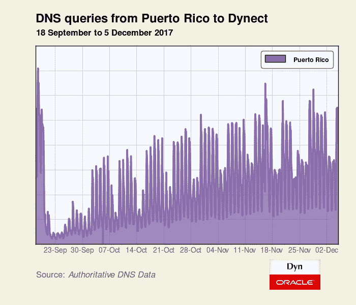

# 波多黎各缓慢的互联网复苏

> 原文：<https://medium.com/oracledevs/puerto-ricos-slow-internet-recovery-defaa0ebffc3?source=collection_archive---------0----------------------->

虽然大多数到波多黎各的 BGP 路由已经恢复，但来自该岛的 DNS 查询量仍然只是 9 月 19 日(风暴袭击的前一天)的一小部分。与简单的 BGP 路由公告相比，DNS 活动是实际互联网使用(或缺乏互联网使用)的更好指标。

我们一直在分析自 2005 年卡特里娜飓风以来飓风和地震等自然灾害的影响。与 2011 年日本附近的[地震](https://dyn.com/blog/japan-quake/)、2012 年的[飓风](https://dyn.com/blog/hurricane-sandy-initial-impact/)或 2015 年的[地震](https://dyn.com/blog/earthquake-rocks-internet-in-nepal/)相比，波多黎各的灾难就其对互联网接入的长期和广泛影响而言是独一无二的。下面的分析讲述了那个故事。

**DNS 统计**

从波多黎各到我们[互联网指南](https://dyn.com/labs/dyn-internet-guide/)递归 DNS 服务的查询仍然没有恢复到飓风前的水平，如下图所示。本周早些时候，也就是 12 月 4 日，我们只处理了 9 月 18 日，也就是飓风来临前收到的来自波多黎各的 53%的查询量。两个日期都是星期一，希望排除可能的星期效应。

从波多黎各到我们的[权威 DNS](https://dyn.com/dns/) 服务的查询也比飓风前有所减少，但不如我们的递归 DNS 服务多。这可能是因为我们的权威 DNS 服务的缓存效果更明显，因为与我们的递归 DNS 服务相比，它们处理的域集更小。此外，如果这些计算机在恢复服务后恢复到默认 DNS 配置，我们可能会失去一些 Internet Guide 客户端。无论如何，这一数量仍然低于飓风前权威域名的水平。与 9 月 18 日相比，12 月 4 日我们处理了 71%来自波多黎各的查询量。

根据这两个数字(53%和 71%)，我们估计波多黎各的互联网服务只有飓风前的一半多一点。

**BGP 和 Traceroute 测量统计**

下图显示了飓风对波多黎各路由网络的影响，由主要提供商进行了着色。随着飓风登陆，许多 BGP 路线被取消，该岛遭受了被称为美国历史上最大的停电。到 11 月初，这些路由中的大部分再次出现在全球路由表中。然而，对最后一英里基础设施的破坏意味着许多波多黎各人仍然无法获得互联网接入。

如下图所示，我们对波多黎各的 traceroute 测量讲述了一个类似的故事-2017 年 9 月 20 日急剧下降，随后是一个漫长的缓慢恢复，随着波多黎各基础设施的不同部分恢复在线，这一恢复似乎是渐进的。尽管全岛停电，但在整个分析期间，波多黎各的一些网络(如[关键枢纽网络](http://criticalhub.com/))仍然可以到达。虽然下图显示了比上面基于 BGP 的图更陡的下降，但我们测量的响应主机通常是核心基础架构的一部分。这些主机比[接入层](https://en.wikipedia.org/wiki/Hierarchical_internetworking_model#Access_layer)网络更有可能连接到备用电源，并且可能像上面的 BGP 路由一样，夸大了恢复的程度。

**海底电缆撞击**

或许人们对这一事件不太了解的是飓风玛丽亚对几个南美国家网络连接的影响。波多黎各是几条连接南美和全球互联网的海底电缆的重要着陆点。由于洪水，为意大利电信的 Seabone 网络服务的电缆登陆站不得不关闭。Seabone 的一份声明写道:

> 我们必须通知你，飓风玛丽亚(5 级)已经影响到波多黎各，在岛上造成严重破坏和洪水。我们不得不切断站内节点的电源，以免对设备造成严重损坏。

因此，在 2017 年 9 月 21 日下午早些时候，我们在多个南美国家观察到流量从意大利电信转移，因为海底电缆变得不可用。为了说明这种影响，下面是四个南美 ASN，它们在此时失去了一个中转提供商。[cable vision Argentina](https://www.cablevisionfibertel.com.ar/)(as 10481)来自阿根廷，其他三家来自巴西。巴西供应商 [Citta Telecom](http://cittatelecom.com.br/) AS27720)失去了 [Eweka Internet](https://www.eweka.nl/en/wie_is_eweka/) 的服务，而其他供应商失去了意大利电信 transit。

此外，飓风过后，委内瑞拉现任 [CANTV](http://www.cantv.net/) [宣布](http://www.cantv.net/ciencia/resena.asp?id=232883&Fresena=TRUE)由于风暴造成的海底电缆损坏，他们的国际容量已经减少了 50%。这一声明遭到了越来越多受到政府审查和监视的公民的质疑。

> *síCLARO OTRO menti ras MAS！委内瑞拉互联网信息中心*[*pic.twitter.com/eH2kMEUfwk*](https://t.co/eH2kMEUfwk)
> 
> *—noticias simonbolivar(@ noticias sb 1)*[*2017 年 9 月 22 日*](https://twitter.com/NoticiasSB1/status/911232995130003456?ref_src=twsrc%5Etfw)

然而，我们的数据显示，CANTV 的国际链接受损与该地区因飓风影响而出现的其他中断一致。下面的图显示了在波多黎各海底电缆站被淹没后，2017 年 9 月 21 日世界各地几个城市的 CANTV 延迟达到峰值。

**结论**

飓风 Maria 到达波多黎各后， [Qmulos，](https://www.qmulos.com/)的首席安全架构师 Sean Donelan 立即开始尽职尽责地[向](https://mailman.nanog.org/pipermail/nanog/2017-September/092524.html) [NANOG 电子邮件列表](https://www.nanog.org/list/faq)发布他收集的关于岛上连接情况的状态更新。此外，网站[http://status.pr/](http://status.pr/)已经建立，以收集关于复苏状态的各种指标。

现在经过两个多月的事后回顾，我们可以真正体会到这场飓风在许多方面的破坏力，而不仅仅是对互联网的破坏。波多黎各可能不再像风暴过后那样成为头条新闻，但让美国的这一部分重新站立起来所需的资源确实是广泛的。

以下是关于如何提供帮助的更多信息:

> 波多黎各飓风受害者仍然需要帮助。下面是你能做的[*https://t.co/lSmulxJ0Kv*](https://t.co/lSmulxJ0Kv)
> 
> *— PBS 新闻小时(@ news hour)*[*2017 年 11 月 10 日*](https://twitter.com/NewsHour/status/929046013339471873?ref_src=twsrc%5Etfw)

*原载于 2017 年 12 月 7 日 blogs.oracle.com**的* [*。*](https://blogs.oracle.com/internetintelligence/puerto-ricos-slow-internet-recovery)