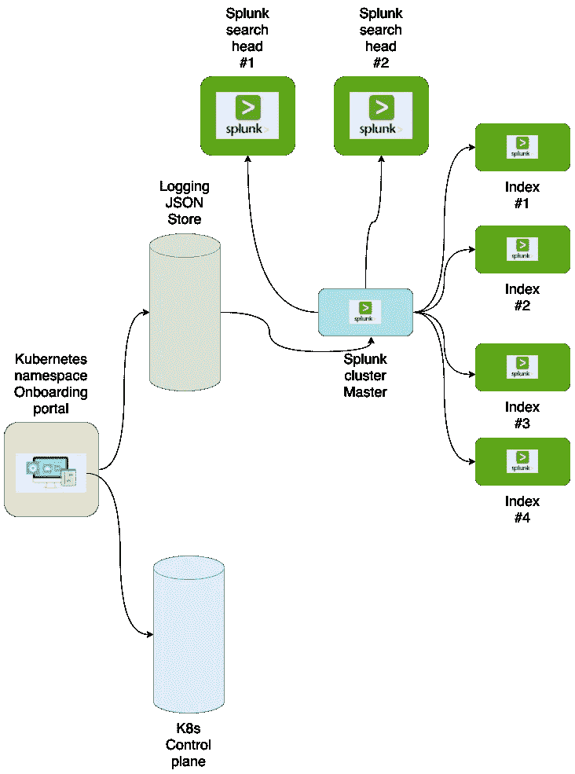
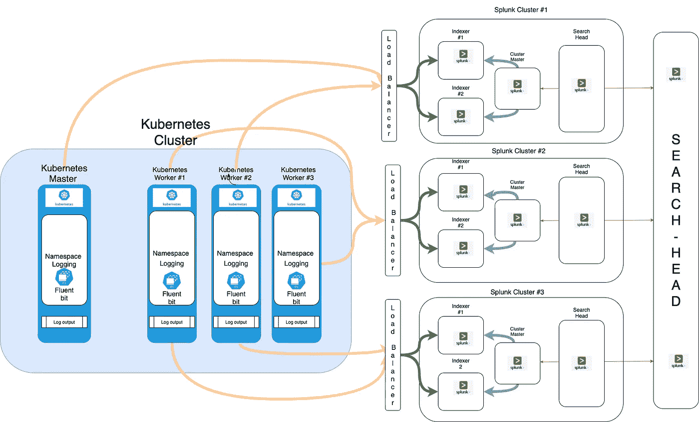
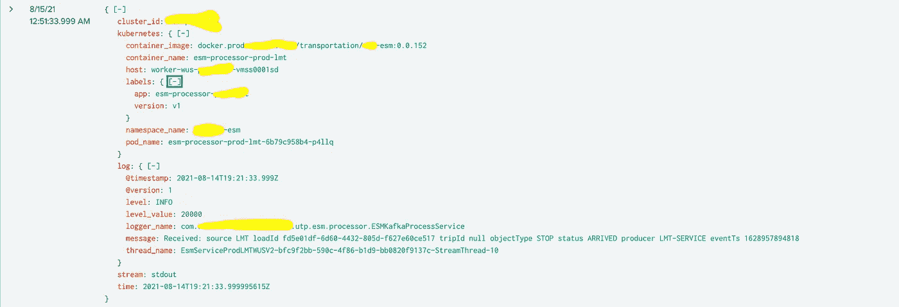

# 使用 Fluent Bit 和 Splunk 进行泵送测井

> 原文：<https://medium.com/walmartglobaltech/pumped-up-logging-with-fluent-bit-and-splunk-6c1c8fc19fd7?source=collection_archive---------3----------------------->

如果您不熟悉 [Fluent Bit](https://fluentbit.io/documentation) ，这是一个用 C 语言编写的开源应用程序，可以帮助将数据从多个来源运送到多个目的地，比如虚拟机、集装箱和物联网设备。Fluent Bit 非常轻量级、高性能和有弹性，这使得它非常适合于 Kubernetes 环境。
要向 [Splunk](https://docs.splunk.com/Documentation) 发送数据，我们需要在 Fluent Bit 配置中定义一个输出。我们将屏蔽主机和 Splunk_token 参数，并使用“tls”验证，以允许我们暂时跳过添加证书。
我们还在 Splunk 中为属于 [Kubernetes](https://kubernetes.io/docs/home/) 集群的应用程序配置了每个命名空间的动态索引创建。

# 挑战

为了 Kubernetes 的稳定运行，我们需要通过从所有应用程序/pod/容器/作业等收集日志信息来捕获正在运行的应用程序中发生的事件。由于在 Kubernetes 上运行的应用程序基于 Docker 容器，因此需要考虑日志记录:

*   日志信息本地存储在主机操作系统中，没有相关的 Kubernetes 元数据，如名称空间、pod 名称、标签和注释名称。
*   当容器被终止时，日志信息被删除。Kubernetes 通过执行“kubectl logs”命令提供了捕获日志消息的本机功能，但在高度扩展和分布式环境中无法工作。这就是流畅比特的发挥作用的地方；Fluent Bit 通过 Kubernetes 元数据帮助您集中运行应用程序的日志信息，并将信息路由到期望的目的地，如 Splunk。在本文中，我们将分享 Fluent Bit 是如何工作的，例如，Kubernetes 和 Splunk，动态索引创建，索引映射，对 Splunk 配置的多集群支持。
*   我们可以在[日志架构](https://kubernetes.io/docs/concepts/cluster-administration/logging/)中了解更多关于 Kubernetes 的日志概念。
*   基于标签或注释的多租户 Splunk 集群上应用程序的动态索引映射。
*   在 Splunk 集群上创建命名空间时的动态索引创建。
*   应用团队专用 Splunk 集群的动态流程。

# 流利比特是如何工作的

Fluent Bit 提供了“Fluent Bit DaemonSet”，使您能够轻松地从容器化的应用程序中收集日志信息。使用 DaemonSet，您可以确保所有(或一些)节点运行一个 pod 的副本。Fluent Bit 提供了 [Kubernetes](https://docs.fluentbit.io/manual/pipeline/filters/kubernetes) 过滤器插件，通过添加带有 Kubernetes 元数据的记录来丰富 pod 日志信息。这样，我们可以识别日志信息的来源，并通过标记记录轻松过滤信息。我们可以在[流畅钻头文档](https://docs.fluentbit.io/manual/)中了解更多关于流畅钻头 DaemonSet 的信息。我们可以在[为 Kubernetes](https://github.com/fluent/fluent-bit) 找到用于部署的 Fluent Bit DaemonSet 容器映像和示例配置文件。

# Splunk 上的动态索引创建

由于我们有多租户集群，我们要求应用程序将应用程序日志保存到其专用的 Splunk 索引和集群中。
因此，我们使用 JSON Store 和 Lua 为 fluent bit 配置添加了动态索引创建和映射支持。
在创建名称空间的时候(通过 API 发生)，我们已经注入了一个新的 API 来将索引数据推送到所有 Kubernetes 集群的专用 JSON 存储中。



Splunk index store for dynamic creation

Splunk 索引的默认配置，以后的应用程序可以通过 ansible 行动手册或 API 更新属性，以便在 JSON 商店中进行更新。

```
 {
  "name": "splunk-test",
  "delete": 1,
  "cluster-id": "splunk-1",
  "misc_props": [
    {
      "value": 1,
      "attribute": "maxWarmDBCount"
    },
    {
      "value": 1000,
      "attribute": "maxTotalDataSizeMB"
    },
    {
      "value": 604800,
      "attribute": "maxHotSpanSecs"
    },
    {
      "value": 1209600,
      "attribute": "frozenTimePeriodInSecs"
    }
  ],
  "maxDataSize": "auto",
  "maxHotBuckets": 1
}

# Adding index {{index.name}}
[{{index.name}}]

repFactor = auto
homePath = {{volume_dirs.1}}/{{ index.name }}/db
coldPath = {{volume_dirs.2}}/{{ index.name }}/colddb
thawedPath = $SPLUNK_DB/{{ index.name }}/thaweddb
maxDataSize = {{ index.maxDataSize | default(default_maxDataSize) }}
maxHotBuckets = {{ index.maxHotBuckets | default(default_maxHotBuckets) }}


datatype = {{index.datatype}}



{{ prop.attribute }} = {{ prop.value }}




```

在 Splunk cluster-master 上创建 index.conf 后，我们将有一个角色配置来应用集群捆绑包。

```
- name: apply cluster-bundle
  become: true
  become_user: "{{splunk_user_name}}"
  command: "{{splunk_install_dir}}/splunk/bin/splunk apply cluster-bundle --answer-yes -auth {{web_username}}:{{web_password}}"
```

# 使用 Splunk 记录日志

让我们通过 Splunk 的一个用例来看看 Fluent Bit 在 Kubernetes 中是如何工作的。在本例中，我们部署了应用程序单元和服务，并查看了 Fluent Bit 如何处理日志消息，以及如何使用 Splunk 可视化日志消息。通过这个例子，我们可以了解 Kubernetes 日志记录中流畅的 Bit 行为以及如何入门。下图描述了示例用例的概述。



在本文中，我们使用内部 Splunk。

正如我们在下面看到的，Fluent Bit 在日志命名空间中被配置为 daemonset。

```
a0d00qf@m-c02dj3hfmd6n ~ % kubectl get ds -n logging
NAME         DESIRED   CURRENT   READY   UP-TO-DATE   AVAILABLE   NODE SELECTOR   AGE
fluent-bit   12        12        12      12           12          <none>          27h
a0d00qf@m-c02dj3hfmd6n ~ %
a0d00qf@m-c02dj3hfmd6n ~ % kubectl get nodes
NAME                                 STATUS   ROLES        AGE    VERSION
cp2-scus-dev-amls01-vmss000000       Ready    master       348d   v1.18.18
cp2-scus-dev-amls01-vmss000001       Ready    master       348d   v1.18.18
cp2-scus-dev-amls01-vmss000002       Ready    master       348d   v1.18.18
etcd2-scus-dev-amls01-vmss000000     Ready    etcd         348d   v1.18.18
etcd2-scus-dev-amls01-vmss000001     Ready    etcd         348d   v1.18.18
etcd2-scus-dev-amls01-vmss000002     Ready    etcd         348d   v1.18.18
istio2-scus-dev-amls01-vmss00001d    Ready    istio,node   64d    v1.18.18
istio2-scus-dev-amls01-vmss00001f    Ready    istio,node   64d    v1.18.18
istio2-scus-dev-amls01-vmss00001g    Ready    istio,node   64d    v1.18.18
worker2-scus-dev-amls01-vmss000017   Ready    node         64d    v1.18.18
worker2-scus-dev-amls01-vmss000018   Ready    node         64d    v1.18.18
worker2-scus-dev-amls01-vmss00001a   Ready    node         64d    v1.18.18
a0d00qf@m-c02dj3hfmd6n ~ %
```

以下是 Fluent 位配置图中 Splunk 输出的配置。

```
[OUTPUT]
        Name       splunk
        Match       loggingApp1
        host       splunk-1.xyz.net
        port       80
        Retry_Limit 3
        Splunk_Send_Raw On
        splunk_token e42f79e4-xxxx-xxxx-xxxx-xxxx-xxx
        tls false
        tls.verify false
        Alias App1
        net.keepalive true
        net.keepalive_idle_timeout 5
        net.keepalive_max_recycle 12096
        net.connect_timeout 30
[OUTPUT]
        Name       splunk
        Match       loggingApp2
        host       splunk-2.xyz.net
        port       80
        Retry_Limit 3
        Splunk_Send_Raw On
        splunk_token e42f79e4-yyyy-xxxx-yyyy-xxxx-xxx
        tls false
        tls.verify false
        Alias App2
        net.keepalive true
        net.keepalive_idle_timeout 5
        net.keepalive_max_recycle 12096
        net.connect_timeout 30
```

正如本文前面提到的，我们有一个动态的索引映射，它依赖于事件标签的 post-Kubernetes 过滤器(添加到事件中的 post 元数据)。我们已经配置了 Lua 脚本来读取和映射标签。Lua 脚本将把 key (index)和 value 作为标签值插入到每个事件的 index 字段中。
如果应用程序没有为 Splunk 索引设置任何标签，Lua 脚本会将其配置为将名称索引到名称空间名称。

```
[FILTER]
    Name                kubernetes
    Match              loggingApp.*
    Kube_URL            [https://kubernetes.default.svc:443](https://kubernetes.default.svc:443)
    Kube_CA_File        /var/run/secrets/kubernetes.io/serviceaccount/ca.crt
    Kube_Token_File     /var/run/secrets/kubernetes.io/serviceaccount/token
    Annotations Off
    Merge_Log      On
    Merge_log_key       log
    K8S-Logging.Exclude On
    Keep_Log false
[FILTER]
    Name rewrite_tag
    Match loggingApp.*
    Emitter_Mem_Buf_Limit 1G
    Emitter_Name kube
    Alias emiiter_kube
    Rule $event['kubernetes']['labels']['splunk-cluster'] ^([(a-z)(A-Z)(0-9)]+)$ $event['kubernetes']['labels']['splunk-cluster'] false
[FILTER]
    Name      lua
    Match      kube.*
    script rename_index.lua #name to a script in ConfigMap
    Protected_mode true
    call splunk_index
```

索引映射的 Lua 函数:

```
function splunk_index(tag, timestamp, record)
  local updated_log = {}local k8s_metadata
  local extracted_value = ""
  log = record
  if type(log) == 'table'
  then
    k8s_metadata = log["kubernetes"]
    if type(k8s_metadata) == 'table'
    then
      extrLabels = k8s_metadata["labels"]
      if (extrLabels ~= nil)
      then
        extracted_label = k8s_metadata["labels"]["splunk-index"]
        if (extracted_label ~= nil)
        then
          new_index = extracted_label
          updated_log = log
          updated_log["index"] = new_index
        else
          extracted_value = k8s_metadata["namespace_name"]
          extracted_value = .. extracted_value
          updated_log = log
          updated_log["index"] = extracted_value
        end
      else
        extracted_value = k8s_metadata["namespace_name"]
        extracted_value = .. extracted_value
        updated_log = log
        updated_log["index"] = extracted_value
      end
    else
      return -1, timestamp, updated_log
    end
  else
    return -1, timestamp, updated_log
  end
return 2, timestamp, updated_log
end
```

在配置中，如我们所见，我们使用了重写标记过滤器，这是为了根据标签中提供的 Splunk 群集配置重写标记，通过该过滤器，我们将通过支持具有动态映射的多 Splunk 群集日志记录，将日志转发到指定的 Splunk 群集。

```
[FILTER]
    Name rewrite_tag
    Match loggingApp.*
    Emitter_Mem_Buf_Limit 1G
    Emitter_Name kube
    Alias emiiter_kube
    Rule $event['kubernetes']['labels']['splunk-cluster'] ^([(a-z)(A-Z)(0-9)]+)$ $event['kubernetes']['labels']['splunk-cluster'] false
```

# 在 Splunk 中检查事件



Sample event in Splunk

# 限制

1.  Splunk 支持有限数量的索引，具体取决于群集的大小和运行状况。
2.  长时间运行后创建动态索引可能会导致 Splunk 群集不稳定。为了减轻这种情况，我们可以设置每个集群固定的索引数量，如果需要，我们将添加一个带有索引器的新集群主服务器，以支持在同一个搜索头下创建新的索引。
3.  如果 Splunk 群集和索引的数量增加，Fluent Bit 可能会由于过滤器的数量而出现资源问题和性能影响。
4.  事件格式和大小也会影响流畅的 Bit 性能。

# 结论

这篇文章展示了如何将 Fluent Bit 配置为通过 Splunk 索引和集群的动态映射将日志发送到多个 Splunk 集群和 Splunk 索引。