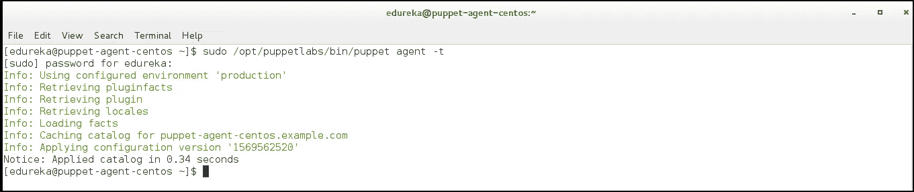

# 如何将 Puppet 模块用于 IT 基础设施自动化？

> 原文：<https://medium.com/edureka/puppet-modules-bb07c2e74f41?source=collection_archive---------4----------------------->


以前，系统管理员使用 shell 脚本来运行他们的服务器，这种方法的可伸缩性为零。为成百上千个不断变化的服务器及其系统配置不断修改脚本是一项令人望而生畏的任务。

在这篇关于**傀儡模块&清单**的文章中，让我们看看如何使用傀儡模块来自动化服务器设置、程序安装和系统管理。

本博客将涵盖以下主题:

*   木偶编程入门
*   木偶编程中的关键术语
*   木偶程序工作流程
*   演示:自动安装 Apache 和 MySQL

# 木偶编程入门

Puppet 是广泛用于配置管理的流行 DevOps 工具之一。它用于在基础架构中实现*一致性*。Puppet 可以将基础设施定义为代码，管理多个服务器，并执行系统配置，从而帮助自动化基础设施管理过程。

Puppet 有自己的配置语言，`**Puppet DSL**`。与其他 DevOps 程序一样，Puppet 自动化了更改，消除了手动脚本驱动的更改。但是，Puppet 不是简单的另一种 shell 语言，也不是纯粹的编程语言，比如 PHP。相反，Puppet 使用一种**基于声明性模型的方法**来实现 IT 自动化。这使得 Puppet 能够将基础设施定义为代码，并通过程序来执行系统配置。

在开始演示之前，让我们先看看 puppet 编程的几个核心方面。

# **木偶编程中的关键术语**

## 表明

一个傀儡程序被称为**清单**，其文件名为**。pp** 扩展。Puppet 的默认主清单是`*/etc/puppet/manifests/site.pp*`。(这定义了全局系统配置，如 LDAP 配置、DNS 服务器或适用于每个节点的其他配置)。

## 班级

在这些清单中有其他模块可以调用的称为**类**的代码块。类配置大型或中型的功能块，例如运行应用程序所需的所有包、配置文件和服务。类使得重用 Puppet 代码和提高可读性变得更加容易。

## 资源

Puppet 代码主要由资源声明组成。**资源**描述了关于系统期望状态的特定元素。例如，它可以包括一个特定的文件应该存在或一个软件包应该安装。

## 木偶模块

除了主`site.pp`清单，它在**模块**中存储清单。

我们所有的 puppet 代码都组织在模块中，这些模块是我们可以重用和共享的 Puppet 的基本构件。每个模块管理基础设施中的特定任务，例如安装和配置一个软件。

模块包含 Puppet 类、定义的类型、任务、任务计划、容量、资源类型和插件，例如自定义类型或事实。在 Puppet 模块路径中安装模块。Puppet 从模块路径中的每个模块加载所有内容，使这段代码可供使用。


Puppetlabs 有预定义的模块，我们可以通过从`[**PuppetForge**](https://forge.puppet.com/)`下载它们来立即使用。您还可以创建一个定制的 puppet 模块来满足您的需求。

# **木偶程序工作流程**

我们将使用 Puppet 的声明性语言在称为清单的文件中描述系统的期望状态。清单描述了应该如何配置网络和操作系统资源，如文件、包和服务。


Puppet 将清单编译成**目录**，并将每个目录应用到其对应的节点，以确保节点的配置在整个基础设施中是正确的。

# 演示:自动安装 Apache 和 MySQL

这篇关于 puppet 模块的文章是实践性的，它将展示使用 puppet 模块的两种方法，并教你如何自动安装配置了这两个模块的服务器。

*   从头开始创建一个木偶模块——Apache 模块
*   使用 PuppetForge 的 Puppet 模块——MySQL 模块
*   从傀儡主人到傀儡代理的傀儡模块的自动化安装

首先，确保您已经准备好一个傀儡基础设施，包括一个傀儡主服务器和 2 个傀儡代理。

*   傀儡师:Ubuntu 18.04
*   代理 1: Ubuntu 18.04
*   特工 2: CentOS7

下面是我们将在这次实践中实现的目标的概述:


让我们从动手开始:

## 从头开始创建模块

在这个 puppet 模块中，我们将处理下载 Apache 包、配置文件和设置虚拟主机等任务。

*   从 Puppet Master 中，导航到 Puppet 的模块目录并创建 Apache 目录:

```
cd /etc/puppet/modules
sudo mkdir apache
```

*   在 apache 目录中，创建子目录:清单、模板、文件和示例。

```
cd apache
sudo mkdir {manifests, templates, files, examples}
```

*   导航到清单目录:
*   `cd manifests`
*   从这里开始，我们将根据代码部分的目标将模块分成不同的类。

**init.pp** - >下载 Apache 包

**params.pp** - >定义任何变量和参数

**config.pp** - >管理 Apache 服务的任何配置文件。

**vhosts.pp** - >定义虚拟主机。

该模块还将利用 **Hiera** (一个内置的键值配置数据查找系统，用于将数据从 Puppet 代码中分离出来)数据来存储每个节点的变量。

## 步骤 1:下载 Apache 包

创建 init.pp 类

现在我们将在 manifests 目录下创建一个`init.pp`文件来保存 apache 包。
因为我们有两个不同的操作系统(ubuntu 和 CentOS7)使用不同的 Apache 包名，所以我们必须使用一个变量`$apachename`。

```
/etc/puppetlabs/code/environments/production/modules/apache/manifests/init.ppclass apache {
package { 'apache':
name    => $apachename,
ensure  => present,
}
}
```

***包*** 资源允许管理一个包。这用于添加、删除或确保包存在。

在大多数情况下，资源的 ***名称***(Apache，如上)应该是被管理的包的名称。由于不同的命名约定，我们使用*名称*引用来调用包的实际名称。所以*取名*，称之为尚未定义的变量`$apachename`。

***确保*** 参考确保包存在。

## 创建 params.pp 文件

`params.pp`文件将定义所需的变量。虽然我们可以在`init.pp`文件中定义这些变量，但是由于需要在资源类型本身之外使用更多的变量，所以使用 `params.pp`文件允许在 if 语句中定义变量，并在多个类中使用。

创建一个`params.pp`文件和下面的代码。

```
/etc/puppetlabs/code/environments/production/modules/apache/manifests/params.ppclass apache::params {
if $::osfamily == 'RedHat' {
$apachename = 'httpd'
}
elsif $::osfamily == 'Debian' {
$apachename = 'apache2'
}
else {
fail('this is not a supported distro.')
}
}
```

在最初的`init.pp`类之外，每个类名都需要从 apache 中分支出来。我们称这个类为 **apache::params** 。双冒号后的名称应该与文件共享一个名称。如果该语句用于定义参数，从 **Facter** 提供的信息中提取，Puppet 将 Facter 安装作为其安装本身的一部分。这里，Facter 将下拉操作系统系列(osfamily)，以辨别它是`Red Hat`还是`Debian-based.`

有了最终定义的参数，我们需要将`params.pp`文件和参数调用到`init.pp`中。为此，我们需要在类名之后、左花括号({)之前添加参数。

所以我们之前创建的`init.pp`应该是这样的:

```
class apache ( $apachename = $::apache::params::apachename,) inherits ::apache::params
{
package { 'apache':
name => $apachename,
ensure => present,
}
}
```

值字符串`*$::apache::params::value*`告诉 Puppet 从 **apache** 模块、 **params** 类中提取值，后跟参数名。片段`*inherits ::apache::params*`允许`init.pp`继承这些值。

## 步骤 2:管理配置文件

Apache 配置文件会有所不同，这取决于您是在基于 Red Hat 还是基于 Debian 的系统上工作。

你可以在这个演示的最后找到以下依赖文件: `httpd.conf`(红帽)`apache2.conf` (Debian)。

*   将`httpd.conf`和`apache2.conf`的内容复制到单独的文件中，保存在`*/etc/puppetlabs/code/environments/production/modules/apache/files.*`的**文件**目录下
*   将这两个文件编辑为**禁用** keepalive。您需要在`httpd.conf`文件中添加行 **KeepAlive Off** 。如果你不想改变这个设置，我们应该在每个文件的顶部添加一个注释:
    `/etc/puppetlabs/code/environments/production/modules/apache/files/httpd.conf`

`#This file is managed by puppet`

将这些文件添加到`init.pp`文件中，这样 Puppet 将知道这些文件在主服务器和代理节点上的位置。为此，我们使用 ***文件*** 资源。

```
/etc/puppetlabs/code/environments/production/modules/apache/manifests/init.ppfile { 'configuration-file':path    =>$conffile,ensure  =>file,source  =>$confsource,}
```

因为我们在两个不同的位置有配置文件，所以我们给资源一个通用名称**配置文件**，文件 ***路径*** 被定义为一个带有 path 属性的参数。

***保证*** 保证它是一个文件。

***来源*** 提供了在傀儡师的位置上面创建的文件。

打开`params.pp` 文件。

我们在 if 语句中定义了`$conffile`和`$confsource`变量:

```
/etc/puppetlabs/code/environments/production/modules/apache/manifests/params.ppif $::osfamily == 'RedHat' {
...
$conffile     = '/etc/httpd/conf/httpd.conf'
$confsource   = 'puppet:///modules/apache/httpd.conf'
}
elsif $::osfamily == 'Debian' {
...
$conffile     = '/etc/apache2/apache2.conf'
$confsource   = 'puppet:///modules/apache/apache2.conf'
}
else {
...
```

我们需要将参数添加到`init.pp`文件中 apache 类声明的开头，类似于前面的例子。

当配置文件改变时，Apache 需要重新启动。为了实现自动化，我们可以将服务资源与 ***notify*** 属性结合使用，每当配置文件发生更改时，该属性将调用资源运行:

```
/etc/puppetlabs/code/environments/production/modules/apache/manifests/init.ppfile { 'configuration-file':
path    =>$conffile,
ensure  =>file,
source  =>$confsource,
notify  => Service['apache-service'],
}
service { 'apache-service':
name          =>$apachename,
hasrestart    => true,
}
```

***服务*** 资源使用已经创建的参数，该参数定义了 Red Hat 和 Debian 系统上的 Apache 名称。
***has restart***属性用于触发已定义服务的重启。

## 步骤 3:创建虚拟主机文件

根据您的系统的分布，虚拟主机的文件将被不同地管理。因此，我们将把虚拟主机的代码放在一个 if 语句中，类似于在`params.pp`类中使用的语句，但是包含实际的傀儡资源。

*   在 Apache/manifest/目录中，创建并打开一个`vhosts.pp`文件。添加 if 语句的框架:

```
/etc/puppetlabs/code/environments/production/modules/apache/manifests/vhosts.ppclass apache::vhosts {
if $::osfamily == 'RedHat' {
}
elsif $::osfamily == 'Debian' {
}
else {}
}
```

虚拟主机文件在 CentOS 7 服务器上的位置是`/etc/httpd/conf.d/vhost.conf**.**`,您需要在 Puppet master 上创建该文件作为模板。对位于`/etc/apache2/sites-available/example.com.conf`的 Ubuntu 虚拟主机文件做同样的操作，用服务器的 FQDN 替换 example.com。

*   导航到 **apache** 模块中的**模板**文件，然后为您的虚拟主机创建两个文件:

**对于红帽系统:**

```
/etc/puppetlabs/code/environments/production/modules/apache/templates/vhosts-rh.conf.erb
<VirtualHost *:80>
ServerAdmin <%= [@adminemail](http://twitter.com/adminemail) %>
ServerName <%= [@servername](http://twitter.com/servername) %>
ServerAlias www.<%= [@servername](http://twitter.com/servername) %>
DocumentRoot /var/www/<%= [@servername](http://twitter.com/servername) -%>/public_html/
ErrorLog /var/www/<%- [@servername](http://twitter.com/servername) -%>/logs/error.log
CustomLog /var/www/<%= [@servername](http://twitter.com/servername) -%>/logs/access.log combined
</Virtual Host>
```

**对于 Debian 系统:**

```
/etc/puppet/modules/apache/templates/vhosts-deb.conf.erb<VirtualHost *:80>
ServerAdmin <%= [@adminemail](http://twitter.com/adminemail) %>
ServerName <%= [@servername](http://twitter.com/servername) %>
ServerAlias www.<%= [@servername](http://twitter.com/servername) %>
DocumentRoot /var/www/html/<%= [@servername](http://twitter.com/servername) -%>/public_html/
ErrorLog /var/www/html/<%- [@servername](http://twitter.com/servername) -%>/logs/error.log
CustomLog /var/www/html/<%= [@servername](http://twitter.com/servername) -%>/logs/access.log combined
<Directory /var/www/html/<%= [@servername](http://twitter.com/servername) -%>/public_html>
Require all granted
</Directory>
</Virtual Host>
```

我们在这些文件中只使用了两个变量:`*adminemail*`和`*servername*`。我们将在`site.pp`文件中逐个节点地定义它们。

*   返回到 `vhosts.pp`文件。现在可以在代码中引用创建的模板:

```
/etc/puppetlabs/code/environments/production/modules/apache/manifests/vhosts.ppclass apache::vhosts {
if $::osfamily == 'RedHat' {
file { '/etc/httpd/conf.d/vhost.conf':
ensure    => file,
content   => template('apache/vhosts-rh.conf.erb'),
}
} elsif $::osfamily == 'Debian' {
file { "/etc/apache2/sites-available/$servername.conf":
ensure  => file,
content  => template('apache/vhosts-deb.conf.erb'),
}
} else {
fail('This is not a supported distro.')
}
}
```

这两个分发系列都调用文件资源，并在各自的分发中采用虚拟主机位置的名称。对于 Debian 来说，这再次意味着引用 `$servername`值。内容属性调用各自的模板。

*   两个虚拟主机文件都引用两个目录。默认情况下，它们不在系统中。我们可以通过使用文件资源来创建它们，每个都在 if 语句中。完整的 `vhosts.conf`文件应该类似于:

```
/etc/puppetlabs/code/environments/production/modules/apache/manifests/vhosts.ppclass apache::vhosts {
if $::osfamily == 'RedHat' {
file { '/etc/httpd/conf.d/vhost.conf':
ensure    => file,
content   => template('apache/vhosts-rh.conf.erb'),
}
file { [ '/var/www/$servername',
'/var/www/$servername/public_html',
'/var/www/$servername/log', ]:
ensure    => directory,
}
} elsif $::osfamily == 'Debian' {
file { "/etc/apache2/sites-available/$servername.conf":
ensure  => file,
content  => template('apache/vhosts-deb.conf.erb'),
}
file { [ '/var/www/$servername',
'/var/www/$servername/public_html',
'/var/www/$servername/logs', ]:
ensure    => directory,
}
} else {
fail ( 'This is not a supported distro.')
}
}
```

## 步骤 4:测试模块

*   导航到`apache/manifests/`目录，对所有文件运行**木偶解析器**以确保木偶编码没有错误:

```
sudo /opt/puppetlabs/bin/puppet parser validate init.pp params.pp vhosts.pp
```

它应该返回空的，没有问题。


*   导航到 apache 模块中的**示例**目录。创建一个`init.pp`文件并包含创建的类。用您自己的值替换`$servername` 和`$adminemail`的值:

```
/etc/puppetlabs/code/environments/production/modules/apache/examples/init.ppserveremail = '[webmaster@example.com](mailto:webmaster@example.com)'
$servername = 'puppet.example.com'
include apache
include apache::vhosts
```

*   通过使用**–noop**标签:
    `sudo /opt/puppetlabs/bin/puppet apply --noop init.pp`运行**木偶应用**来测试模块


它应该不返回任何错误，并输出它将从事件中触发刷新。要在 Puppet master 上安装和配置 apache，如果需要的话，可以在没有–noop 的情况下再次运行。

*   导航回主 Puppet 目录，然后导航到 manifests 文件夹(不是 Apache 模块中的文件夹)。

`cd /etc/puppetlabs/code/environments/production/manifests`

创建一个`site.pp`文件，并为每个代理节点包含 Apache 模块。同时输入`adminemail`和`servername`参数的变量。您的`site.pp`应该如下所示:

```
/etc/puppetlabs/code/environments/production/manifests/site.ppnode 'puppet-agent-ubuntu.example.com' {
$adminemail = '[webmaster@example.com](mailto:webmaster@example.com)'
$servername = 'puppet.example.com'
include apache
include apache::vhosts
}
node 'puppet-agent-centos.example.com' {
$adminemail = '[webmaster@example.com](mailto:webmaster@example.com)'
$servername = 'puppet.example.com'
include apache
include apache::vhosts
}
```

默认情况下，受管节点上的 Puppet agent 服务将每 30 分钟自动检查一次主节点，并应用主节点上的任何新配置。您还可以在自动代理运行之间手动调用 Puppet 代理进程。要在代理节点上手动运行新模块，请登录到节点并运行:

`sudo /opt/puppetlabs/bin/puppet agent -t`

既然我们已经学习了如何从头开始创建一个模块，那么让我们学习如何使用 puppetlabs 的 puppet forge 中已经存在的模块。

## 使用 PuppetForge 的模块

傀儡锻造已经有很多模块供服务器运行。我们可以像您创建的模块一样广泛地配置它们，并且可以节省时间，因为我们不需要从头开始创建模块。

确保你在`*/etc/puppetlabs/code/environments/production/modules*`目录下，安装 [Puppet Forge 的 MySQL 模块](https://forge.puppetlabs.com/puppetlabs/mysql)由 PuppetLabs 提供。这也将安装任何必备模块。

`cd /etc/puppetlabs/code/environments/production/modules`

`sudo /opt/puppetlabs/bin/puppet module install puppetlabs-mysql`

## 使用 Hiera 创建数据库

在为 MySQL 模块创建配置文件之前，请考虑您可能不希望在所有代理节点上使用相同的值。为了给 Puppet 提供每个节点的正确数据，我们使用 Hiera。您将在每个节点上使用不同的根密码，从而创建不同的 MySQL 数据库。

*   导航到`/etc/puppet`并在主 puppet 目录中创建 Hiera 的配置文件`hiera.yaml`。您将使用 Hiera 的默认值:

```
/etc/puppetlabs/code/environments/production/hiera.yamlversion: 5
hierarchy:
- name: Common
path: common.yaml
defaults:
data_hash: yaml_data
datadir: data
```

*   创建文件`common.yaml`。它将为 MySQL 定义默认的 **root** 密码:

`*/etc/puppetlabs/code/environments/production/common.yam*`

`mysql::server::root_password: 'password'`

当变量没有在别处定义时，我们使用`common.yaml`文件。这意味着所有服务器将共享相同的 MySQL 根密码。这些密码也可以被散列以增加安全性。

*   要使用 MySQL 模块的默认设置，您可以在`site.pp`文件中添加一个**include '::MySQL::server '**行。但是，在本例中，您将覆盖模块的一些默认设置，为您的每个节点创建一个数据库。

用以下值编辑`site.pp`文件:

```
node 'Puppetagent-ubuntu.example.com' {
$adminemail = '[webmaster@example.com](mailto:webmaster@example.com)'
$servername = 'hostname.example.com'
include apache
include apache::vhosts
include mysql::server
mysql::db { "mydb_${fqdn}":
user     => 'myuser',
password => 'mypass',
dbname   => 'mydb',
host     => $::fqdn,
grant    => ['SELECT', 'UPDATE'],
tag      => $domain,
}
}
node 'Puppetagent-centos.example.com' {
$adminemail = '[webmaster@example.com](mailto:webmaster@example.com)'
$servername = 'hostname.example.com'
include apache
include apache::vhosts
include mysql::server
mysql::db { "mydb_${fqdn}":
user     => 'myuser',
password => 'mypass',
dbname   => 'mydb',
host     => $::fqdn,
grant    => ['SELECT', 'UPDATE'],
tag      => $domain,
}
}
```

## 从傀儡主人到傀儡代理的傀儡模块的自动化安装

*   您可以登录每个节点并发出以下命令，在每个节点上手动运行这些更新:

`sudo /opt/puppetlabs/bin/puppet agent -t`

*   否则，受管节点上的傀儡代理服务将每 30 分钟自动检查一次主节点，并应用主节点上的任何新配置。



因此，通过应用目录，整个安装在代理节点上实现了自动化。在这里可以找到用于这个演示的代码文件和依赖项。

我希望这个演示能够帮助您清楚地了解 puppet 模块和清单，以及它们在自动化 IT 基础设施中的用途。在这种情况下，您的工作变得非常简单，只需在 Puppet Master 中指定配置，Puppet agents 就会自动评估主清单并应用指定 Apache 和 MySQL 设置的模块。如果你有任何疑问，请随时张贴在 Edureka 社区。

就是这样，伙计们，这就把我们带到了这篇文章的结尾。如果你想查看更多关于人工智能、DevOps、道德黑客等市场最热门技术的文章，那么你可以参考 [Edureka 的官方网站。](https://www.edureka.co/blog/?utm_source=medium&utm_medium=content-link&utm_campaign=puppet-modules-automation)

请留意本系列中解释 DevOps 各个方面的其他文章。

> *1。* [*DevOps 教程*](/edureka/devops-tutorial-89363dac9d3f)
> 
> *2。* [*饭桶教程*](/edureka/git-tutorial-da652b566ece)
> 
> *3。* [*詹金斯教程*](/edureka/jenkins-tutorial-68110a2b4bb3)
> 
> *4。* [*Docker 教程*](/edureka/docker-tutorial-9a6a6140d917)
> 
> *5。* [*Ansible 教程*](/edureka/ansible-tutorial-9a6794a49b23)
> 
> *6。* [*傀儡教程*](/edureka/puppet-tutorial-848861e45cc2)
> 
> *7。* [*厨师教程*](/edureka/chef-tutorial-8205607f4564)
> 
> *8。* [*Nagios 教程*](/edureka/nagios-tutorial-e63e2a744cc8)
> 
> *9。* [*如何编排 DevOps 工具？*](/edureka/devops-tools-56e7d68994af)
> 
> *10。* [*连续交货*](/edureka/continuous-delivery-5ca2358aedd8)
> 
> *11。* [*持续集成*](/edureka/continuous-integration-615325cfeeac)
> 
> *12。* [*连续部署*](/edureka/continuous-deployment-b03df3e3c44c)
> 
> *13。* [*持续交付 vs 持续部署*](/edureka/continuous-delivery-vs-continuous-deployment-5375642865a)
> 
> *14。* [*CI CD 管道*](/edureka/ci-cd-pipeline-5508227b19ca)
> 
> *15。* [*Docker 作曲*](/edureka/docker-compose-containerizing-mean-stack-application-e4516a3c8c89)
> 
> *16。* [*码头工人群*](/edureka/docker-swarm-cluster-of-docker-engines-for-high-availability-40d9662a8df1)
> 
> *17。* [*Docker 联网*](/edureka/docker-networking-1a7d65e89013)
> 
> *18。* [*天穹*](/edureka/ansible-vault-secure-secrets-f5c322779c77)
> 
> *19。* [*可变角色*](/edureka/ansible-roles-78d48578aca1)
> 
> *20。* [*适用于 AWS*](/edureka/ansible-for-aws-provision-ec2-instance-9308b49daed9)
> 
> *21。* [*詹金斯管道*](/edureka/jenkins-pipeline-tutorial-continuous-delivery-75a86936bc92)
> 
> 22。 [*顶级 Docker 命令*](/edureka/docker-commands-29f7551498a8)
> 
> *23。*[*Git vs GitHub*](/edureka/git-vs-github-67c511d09d3e)
> 
> *24。* [*顶级 Git 命令*](/edureka/git-commands-with-example-7c5a555d14c)
> 
> 25。 [*DevOps 面试问题*](/edureka/devops-interview-questions-e91a4e6ecbf3)
> 
> *二十六。* [*谁是 DevOps 工程师？*](/edureka/devops-engineer-role-481567822e06)
> 
> *二十七。* [*DevOps 生命周期*](/edureka/devops-lifecycle-8412a213a654)
> 
> *28。*[*Git Reflog*](/edureka/git-reflog-dc05158c1217)
> 
> *29。* [*易变条款*](/edureka/ansible-provisioning-setting-up-lamp-stack-d8549b38dc59)
> 
> 30。 [*组织正在寻找的顶尖 DevOps 技能*](/edureka/devops-skills-f6a7614ac1c7)
> 
> *30。* [*瀑布 vs 敏捷*](/edureka/waterfall-vs-agile-991b14509fe8)
> 
> *31。* [*詹金斯小抄*](/edureka/jenkins-cheat-sheet-e0f7e25558a3)
> 
> *32。* [*Ansible 备忘单*](/edureka/ansible-cheat-sheet-guide-5fe615ad65c0)
> 
> *33。* [*Ansible 面试问答*](/edureka/ansible-interview-questions-adf8750be54)
> 
> *34。* [*50 码头工人面试问题*](/edureka/docker-interview-questions-da0010bedb75)
> 
> *35。* [*敏捷方法论*](/edureka/what-is-agile-methodology-fe8ad9f0da2f)
> 
> *36。* [*詹金斯面试问题*](/edureka/jenkins-interview-questions-7bb54bc8c679)
> 
> *37。* [*Git 面试问题*](/edureka/git-interview-questions-32fb0f618565)
> 
> *38。* [*Docker 架构*](/edureka/docker-architecture-be79628e076e)
> 
> 39。[*devo PS 中使用的 Linux 命令*](/edureka/linux-commands-in-devops-73b5a2bcd007)
> 
> 40。 [*詹金斯 vs 竹子*](/edureka/jenkins-vs-bamboo-782c6b775cd5)
> 
> *41。* [*Nagios 教程*](/edureka/nagios-tutorial-e63e2a744cc8)
> 
> *42。* [*Nagios 面试问题*](/edureka/nagios-interview-questions-f3719926cc67)
> 
> 43。 [*DevOps 实时场景*](/edureka/jenkins-x-d87c0271af57)
> 
> 44。 [*詹金斯和詹金斯 X 的区别*](/edureka/jenkins-vs-bamboo-782c6b775cd5)
> 
> 45。[*Windows Docker*](/edureka/docker-for-windows-ed971362c1ec)
> 
> *46。*[*Git vs Github*](http://git%20vs%20github/)

*原载于 2019 年 10 月 18 日*[*https://www.edureka.co*](https://www.edureka.co/blog/puppet-modules-automation/)*。*