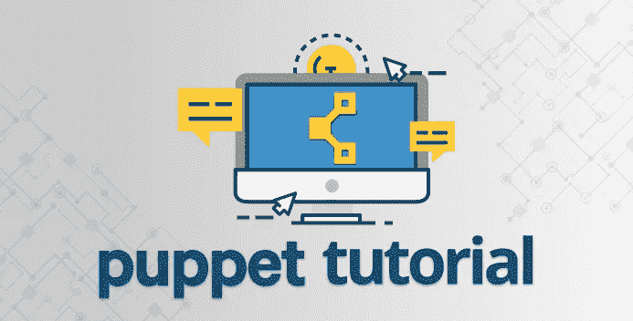
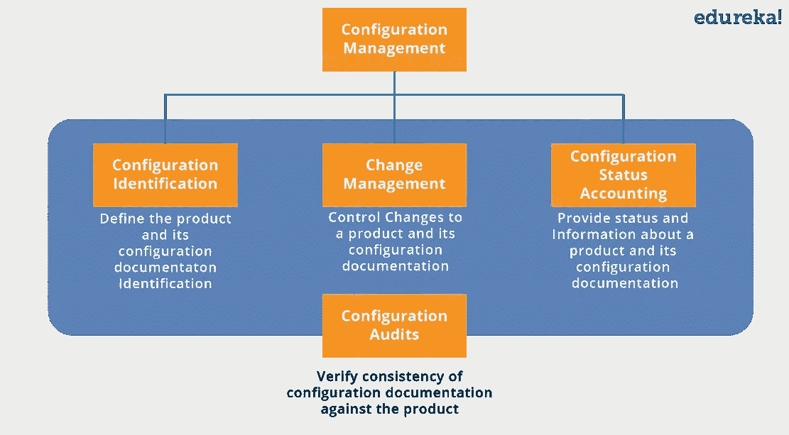
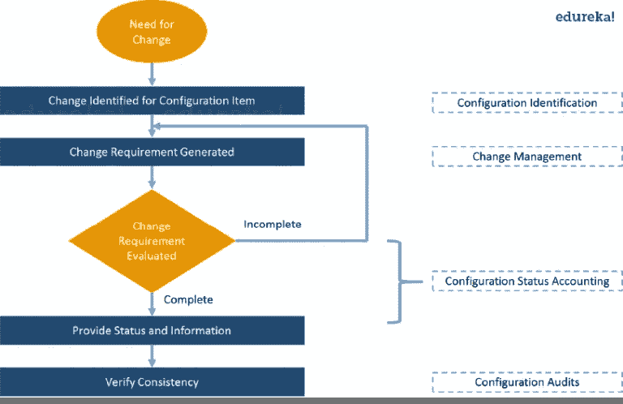
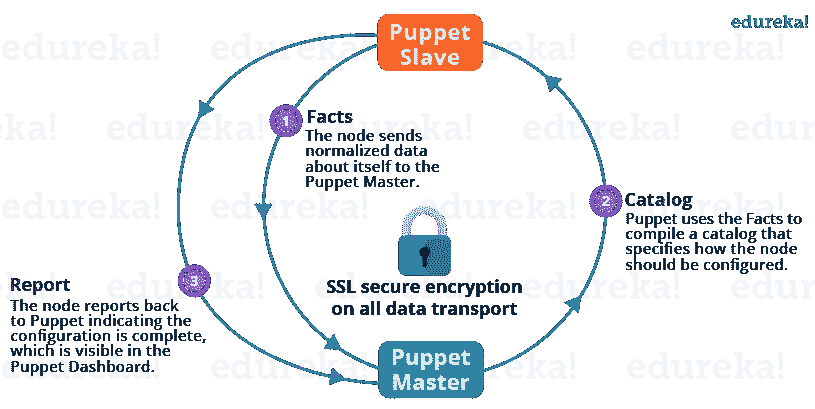
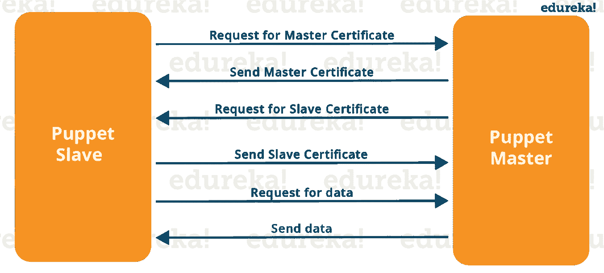
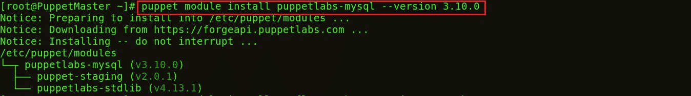
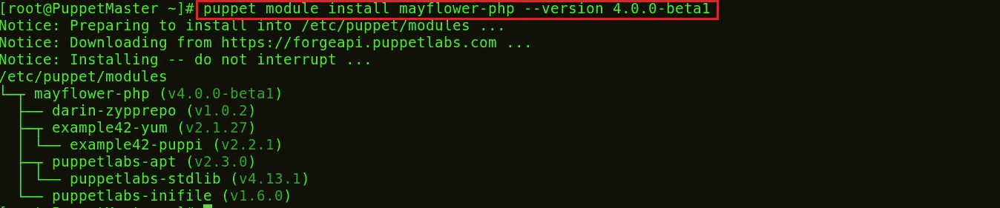
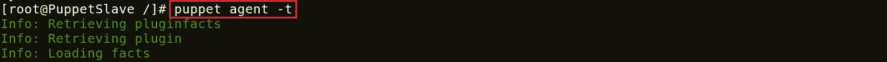
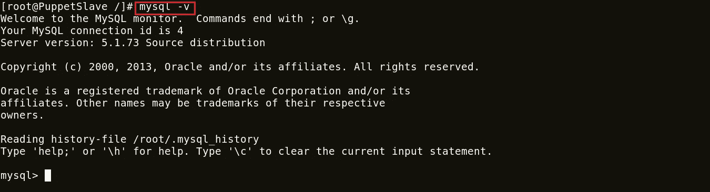
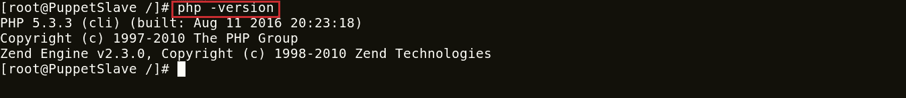

# Puppet 教程-配置管理的一站式解决方案

> 原文：<https://medium.com/edureka/puppet-tutorial-848861e45cc2?source=collection_archive---------0----------------------->



Puppet Tutorial - Edureka

Puppet 是一个配置管理工具，用于部署、配置和管理服务器。在本木偶教程中，将涵盖以下主题:

*   什么是配置管理？
*   木偶建筑
*   傀儡主从通信
*   木偶部件
*   亲自动手

# 什么是配置管理？

在这个木偶教程中，我将向您解释配置管理的不同的相互依赖的活动。但在此之前，我们先了解一下什么是**配置项** (CI)。一个*配置项目*是任何服务组件、基础设施元素或其他需要被管理的项目，以确保服务的成功交付。CI 的例子包括单独的需求文档、软件、模型和计划。

配置管理由以下元素组成:

*   配置标识
*   变更管理
*   配置状态核算
*   配置审计

下图解释了这些组件:



Components of Configuration Management- Puppet Tutorial

**配置标识:**它的流程是:

*   用唯一标识符标记软件和硬件配置项目
*   标识描述配置项的文档
*   将相关配置项目分组到基线中
*   标记配置项和基线的修订。

变革管理:从组织和个人的角度来看，这是一种应对变革的系统方法。

**配置状态统计:**包括记录和上报配置项描述(如硬件、软件、固件等)的过程。)以及设计和生产过程中与基线的所有偏差。在怀疑有问题的情况下，可以快速确定基线配置的验证和批准的修改。

**配置审计:**配置审计提供了一种机制，用于确定系统的当前状态与最新基线和文档的一致程度。基本上，这是一个正式的审查，以验证正在交付的产品将按照广告、促销或以任何方式向客户承诺的那样工作。它使用作为质量审计和测试结果的可用信息，以及配置状态记帐信息，来保证已经构建了所需的内容。

让我们通过一个用例来理解配置管理。假设您必须更新某个特定软件或想要替换它，在这种情况下，应遵循以下流程图来成功进行配置管理:



Flowchart for Configuration Management- Puppet Tutorial

现在是了解木偶建筑的正确时间。

# 木偶建筑

Puppet 使用主从架构。下图描述了同样的情况:



Puppet Architecture - Puppet Tutorial

上图中执行了以下功能:

*   傀儡代理人将事实发送给傀儡主人。事实基本上是表示从状态的某个方面的键/值数据对，比如它的 IP 地址、正常运行时间、操作系统或者它是否是一个虚拟机。稍后我会在博客中详细解释这些事实。
*   Puppet Master 使用这些事实来编译一个目录，该目录定义了应该如何配置从设备。目录是一个文档，它描述了傀儡主设备在从设备上管理的每个资源的期望状态。稍后我将详细解释目录和资源。
*   Puppet Slave 向 Master 报告配置已完成，这可以在 Puppet 仪表板中看到。

# **傀儡主从通讯**

傀儡主人和奴隶在 SSL 的帮助下通过安全的加密通道进行通信。下图描述了同样的情况:



Communication Between Puppet Slave & Master - Puppet Tutorial

从上图可以看出:

*   傀儡奴求傀儡师证。
*   收到傀儡主人证书后，主人请求得到奴隶证书。
*   一旦主设备签署了从设备证书，从设备就请求配置/数据。
*   最后，傀儡主人会将配置发送给傀儡奴隶。

现在让我们来看看各种木偶组件。

# 木偶的组成部分

**清单:**每一个奴隶都在傀儡主人那里得到了它的配置细节，用当地的傀儡语言写成。这些细节是用木偶能理解的语言写的，被称为显化。它们由傀儡代码组成，文件名使用*。pp* 扩展。这些基本上都是傀儡程序。
*例如，*您可以在 Puppet Master 中编写一个清单，创建一个文件并在所有连接到 Puppet Master 的 Puppet Slaves 上安装 Apache 服务器。

**模块:**Puppet 模块是清单和数据(比如事实、文件和模板)的集合，它们有特定的目录结构。模块对于组织 Puppet 代码很有用，因为它们允许您将代码分成多个清单。模块是自包含的代码和数据束。

**资源:**资源是建模系统配置的基本单位。每个资源描述了系统的某个方面，比如特定的服务或包。

**Facter:** Facter 收集关于 Puppet Slave 的基本信息(事实)，如硬件详细信息、网络设置、操作系统类型和版本、IP 地址、MAC 地址、SSH 密钥等。这些事实随后在傀儡师的清单中作为变量出现。

**Mcollective:** 这是一个框架，允许在多个从机上并行执行几个作业。它执行各种功能，例如:

*   无论是在小组中还是在非常大的部署中，都可以与从集群进行交互。
*   使用广播范例来分发请求。所有从设备同时接收所有请求，请求附有过滤器，只有匹配过滤器的从设备才会对请求进行操作。
*   使用简单的命令行工具调用远程从属设备。
*   编写关于基础设施的自定义报告。

**Catalogs:**Catalog 描述了从机上每个被管理资源的期望状态。它是傀儡主人应用于给定奴隶的所有资源的汇编，以及这些资源之间的关系。傀儡主机根据清单和从机提供的数据(如事实、证书和环境，如果提供的话)以及可选的外部数据(如来自外部从机分类器的数据、导出的资源和函数)来编译目录。然后，当被请求时，主设备将编译后的目录提供给从设备。

现在在这个木偶教程中，我的下一节将集中在动手上。

# 亲自动手

我将向您展示如何将 MySQL 和 PHP 从傀儡主人部署到傀儡奴隶。我只使用了一个从设备进行演示，一个主设备可以连接数百个从设备。为了部署 PHP 和 MySQL，我将使用 forge.puppet.com 提供的预定义模块。您也可以创建自己的模块。

**第一步:**在 Puppet Master 中安装 MySQL 和 PHP 模块。

**执行这个:**

```
puppet module install puppetlabs-mysql –version 3.10.0
```

这个 MySQL 模块安装、配置和管理 MySQL 服务。该模块管理 MySQL 的安装和配置，并扩展 Puppet 以允许管理 MySQL 资源，如数据库、用户和授权。



```
puppet module install mayflower-php –version 4.0.0-beta1
```

这个模块用于管理 PHP，特别是 php-fpm。PHP-FPM (FastCGI 进程管理器)是另一个 PHP FastCGI 实现，具有一些额外的功能，对任何规模的站点都有用，尤其是繁忙的站点。



**第二步:**在 Puppet 清单中包括 MySQL 服务器和 PHP。

**执行这个:**

```
vi /etc/puppet/manifests/site.pp
```

您可以使用任何其他编辑器，如 vim、gedit 等。在 site.pp 文件中添加以下内容:

```
include '::mysql::server' 
include '::php'
```

*保存并退出*。

**第三步:**傀儡奴隶定期(每 30 分钟后)从主人那里获取它的配置。它将评估主清单并应用指定 MySQL 和 PHP 设置的模块。如果您想立即试用，您需要在每个从属节点上运行以下命令:

**执行此命令:**

```
puppet agent -t
```



所以 MySQL 和 PHP 在从节点上安装成功。

**步骤 4:** 检查安装的 MySQL 和 PHP 的版本:

**执行此命令:**

```
mysql -v
```



```
php -version
```



**恭喜你！** MySQL 和 PHP 在你的 Puppet Slave 中启动运行。这里我只给你们展示了一个奴隶，但是想象一下如果有上百个奴隶。在这种情况下，您的工作变得非常容易，只需在 Puppet Master 和 Puppet Slaves 中指定配置，就会自动评估主清单并应用指定 MySQL 和 PHP 设置的模块。

关于木偶教程的博客到此结束。如果你想查看更多关于人工智能、Python、道德黑客等市场最热门技术的文章，你可以参考 [Edureka 的官方网站。](https://www.edureka.co/blog/?utm_source=medium&utm_medium=content-link&utm_campaign=puppet-tutorial)

请留意本系列中的其他文章，它们将解释 DevOps 的各个方面。

> 1. [DevOps 教程](/edureka/devops-tutorial-89363dac9d3f)
> 
> 2. [Git 教程](/edureka/git-tutorial-da652b566ece)
> 
> 3.[詹金斯教程](/edureka/jenkins-tutorial-68110a2b4bb3)
> 
> 4. [Docker 教程](/edureka/docker-tutorial-9a6a6140d917)
> 
> 5. [Ansible 教程](/edureka/ansible-tutorial-9a6794a49b23)
> 
> 6.[厨师教程](/edureka/chef-tutorial-8205607f4564)
> 
> 7. [Nagios 教程](/edureka/nagios-tutorial-e63e2a744cc8)
> 
> 8.[如何编排 DevOps 工具？](/edureka/devops-tools-56e7d68994af)
> 
> 9.[连续交货](/edureka/continuous-delivery-5ca2358aedd8)
> 
> 10.[持续集成](/edureka/continuous-integration-615325cfeeac)
> 
> 11.[连续部署](/edureka/continuous-deployment-b03df3e3c44c)
> 
> 12.[持续交付与持续部署](/edureka/continuous-delivery-vs-continuous-deployment-5375642865a)
> 
> 13. [CI CD 管道](/edureka/ci-cd-pipeline-5508227b19ca)
> 
> 14.[码头工人撰写](/edureka/docker-compose-containerizing-mean-stack-application-e4516a3c8c89)
> 
> 15.[码头工人群](/edureka/docker-swarm-cluster-of-docker-engines-for-high-availability-40d9662a8df1)
> 
> 16. [Docker 联网](/edureka/docker-networking-1a7d65e89013)
> 
> 17.[可承担的角色](/edureka/ansible-roles-78d48578aca1)
> 
> 18.[易变拱顶](/edureka/ansible-vault-secure-secrets-f5c322779c77)
> 
> 19.[负责 AWS](/edureka/ansible-for-aws-provision-ec2-instance-9308b49daed9)
> 
> 20.[詹金斯管道](/edureka/jenkins-pipeline-tutorial-continuous-delivery-75a86936bc92)
> 
> 21.[顶级 Git 命令](/edureka/git-commands-with-example-7c5a555d14c)
> 
> 22.[顶部停靠命令](/edureka/docker-commands-29f7551498a8)
> 
> 23. [Git vs GitHub](/edureka/git-vs-github-67c511d09d3e)
> 
> 24. [DevOps 面试问题](/edureka/devops-interview-questions-e91a4e6ecbf3)
> 
> 25.[谁是 DevOps 工程师？](/edureka/devops-engineer-role-481567822e06)
> 
> 26. [DevOps 生命周期](/edureka/devops-lifecycle-8412a213a654)
> 
> 27. [Git 参考日志](/edureka/git-reflog-dc05158c1217)
> 
> 28.[可变准备金](/edureka/ansible-provisioning-setting-up-lamp-stack-d8549b38dc59)
> 
> 29.[组织寻找的顶尖开发人员技能](/edureka/devops-skills-f6a7614ac1c7)
> 
> 三十岁。 [*瀑布 vs 敏捷*](/edureka/waterfall-vs-agile-991b14509fe8)
> 
> 31。 [*Maven 用于构建 Java 应用*](/edureka/maven-tutorial-2e87a4669faf)
> 
> *三十二。* [*詹金斯小抄*](/edureka/jenkins-cheat-sheet-e0f7e25558a3)
> 
> *33。*[](/edureka/ansible-cheat-sheet-guide-5fe615ad65c0)
> 
> **34。* [*Ansible 面试问答*](/edureka/ansible-interview-questions-adf8750be54)*
> 
> *35。 [*50 码头工人面试问题*](/edureka/docker-interview-questions-da0010bedb75)*
> 
> *36。 [*敏捷方法论*](/edureka/what-is-agile-methodology-fe8ad9f0da2f)*
> 
> **37。* [*詹金斯面试问题*](/edureka/jenkins-interview-questions-7bb54bc8c679)*
> 
> **38。* [*Git 面试问题*](/edureka/git-interview-questions-32fb0f618565)*
> 
> **39。* [*Docker 架构*](/edureka/docker-architecture-be79628e076e)*
> 
> *40。[*devo PS 中使用的 Linux 命令*](/edureka/linux-commands-in-devops-73b5a2bcd007)*
> 
> *41。 [*詹金斯 vs 竹子*](/edureka/jenkins-vs-bamboo-782c6b775cd5)*
> 
> *42。 [*Nagios 面试问题*](/edureka/nagios-interview-questions-f3719926cc67)*
> 
> **43。* [*DevOps 实时场景*](/edureka/jenkins-x-d87c0271af57)*
> 
> **44。* [*詹金斯和詹金斯 X 的区别*](/edureka/jenkins-vs-bamboo-782c6b775cd5)*
> 
> *45。[*Windows Docker*](/edureka/docker-for-windows-ed971362c1ec)*
> 
> *46。[*Git vs Github*](http://git%20vs%20github/)*

**原载于 2016 年 12 月 7 日 www.edureka.co**[*。*](https://www.edureka.co/blog/puppet-tutorial/)**