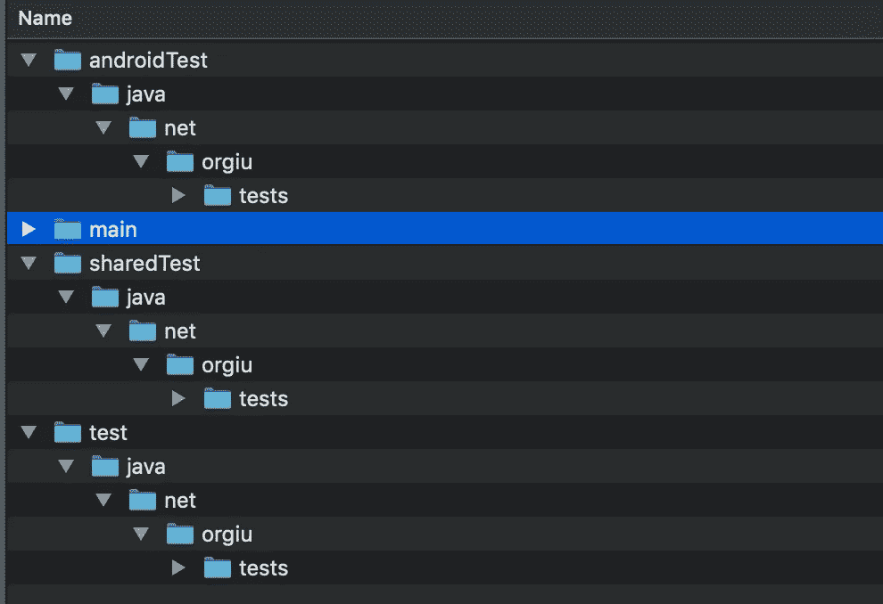
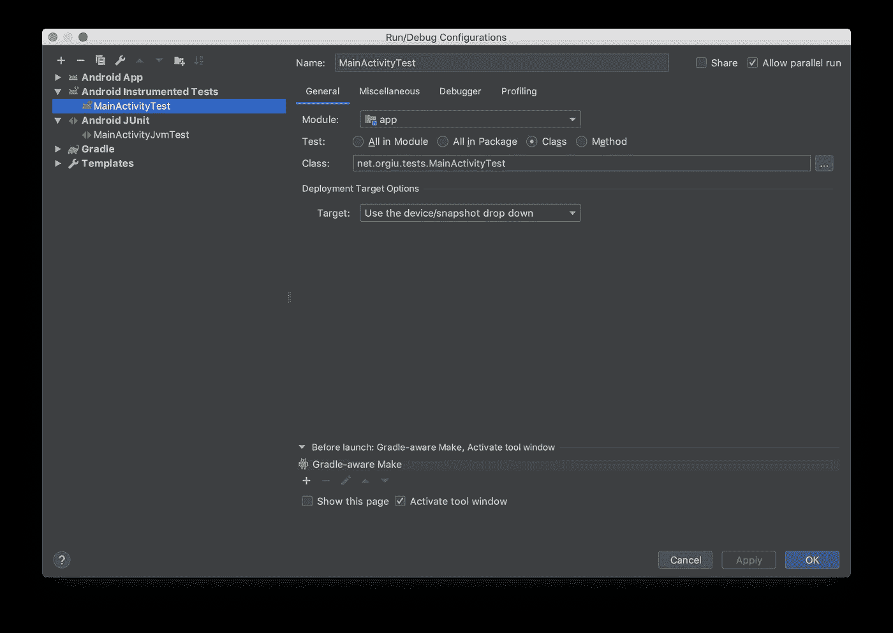
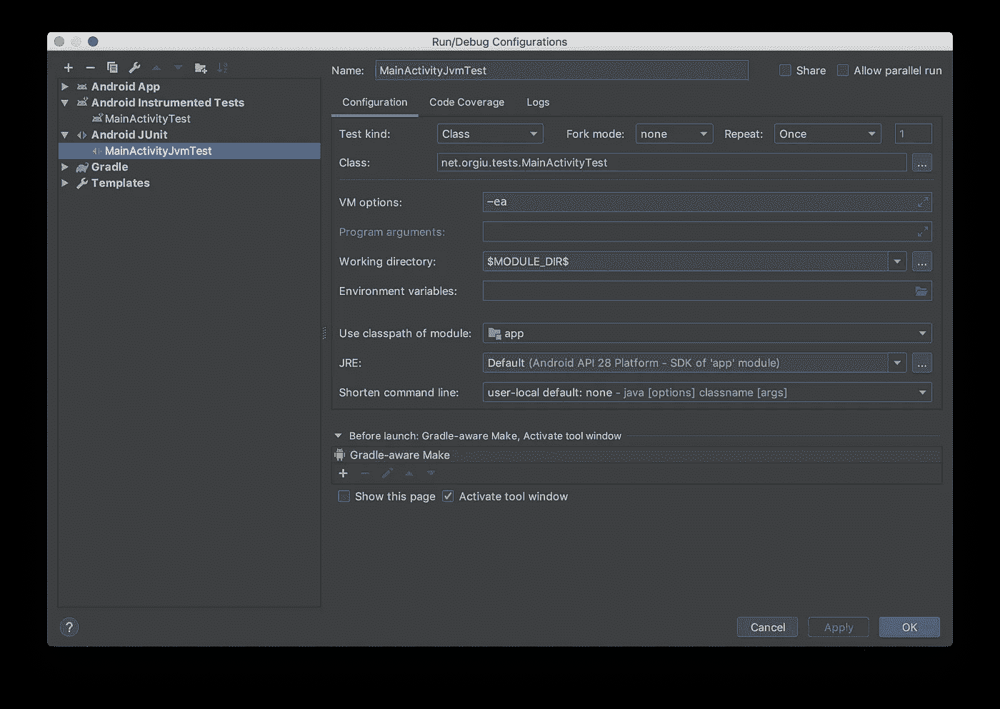

# 挑战安卓测试的极限

> 原文：<https://medium.com/google-developer-experts/pushing-the-limits-of-androidx-test-3776ff249c71?source=collection_archive---------1----------------------->

Picture by [Bernard Spragg](https://stocksnap.io/author/bernardspragg)

AndroidX Test 是测试与 Android 框架交互的代码的新方法，它有一个非常好的特性，可以通过 Robolectric 在仿真器(或物理设备)或 JVM 上运行相同的测试类**。这两种测试环境的主要区别在于测试实际包含在哪里。当我们希望测试在设备上运行时，类应该放在`androidTest`文件夹中，而使用 Robolectric 意味着我们的文件放在`test`文件夹中。**

这种区别在某种程度上限制了在单独的环境中一次一次地运行测试的自由，因为每个特定的测试必须在`androidTest`或`test`文件夹中。

## 共享代码

我们可能已经熟悉了通过单个文件夹 : `sharedTest`在单元和集成测试之间共享一些资源的想法。我们可以利用这个想法，将我们希望能够在不同配置上运行的测试移动到这个文件夹中，这样`test`和`androidTest`源代码都可以看到它们。

第一步是手动创建共享文件夹，与其他两个文件夹位于同一级别，具有相同的包结构:

现在，我们可以在模块的`build.gradle`文件中添加几行；这是在两种测试类型之间共享文件夹的逻辑:

## 一个非常简单的测试

作为这个解决方案如何工作的例子，我们将使用这个非常简单的 Espresso 测试:

> 注意`@RunWith`注释。当将这个测试用例作为集成测试运行时，这不是强制性的，但是当使用 Robolectric 来指导框架如何运行套件时，我们需要它。

我们的下一步是将相同的依赖项声明为`testImplementation`和`androidTestImplementation`，这样我们可以确保我们的测试总是拥有它需要的所有对象，无论它是如何运行的。此程序的唯一例外是**机器人电气依赖性**，它仅在`testImplementation`时需要，以便提供 JVM 环境:

Latest versions of these artefacts can be found on [Android Developers website](https://developer.android.com/jetpack/androidx/releases/test).

现在，我们可以指示我们的单元测试以正确的方式使用 Android 资源，包括框架值和特性，并返回默认值:

> 这一步可能是不必要的，我们应该总是检查什么是缺省值。

## 运行配置

由于我们希望在两种不同的模式下运行我们的测试，我们需要一个配置来运行它们作为**单元测试**，另一个配置在设备上运行它们**:这可以在 Android Studio 中通过几次点击来完成，我们的配置如下所示:**

Configuration for Instrumentation tests

Configuration for Unit tests

> **注:**在我所有的尝试中，每次从`sharedTest`文件夹运行测试，使用靠近类名的绿色小 play 图标，Android Studio 都把它解读成一个`androidTest`。此外，一旦我创建了一个 JVM 配置并运行它，每次我从 play 按钮执行测试时，它都会在 JVM 上运行。我不确定这是意料之中的行为还是巧合，但这是一件有趣的事情。

值得记住的一点是，这两种配置可能需要不同的名称，因为以完全相同的方式拼写它们可能会导致 Android Studio 混淆:在我们的例子中，我们只是添加了“JVM”来标识将在本地运行的配置和在设备上运行的配置。

## 挑战极限

我们刚刚探索的过程允许我们在两种配置中运行测试，但是如果我们使用 CI，这可能成为我们测试例程中的一个缺陷:因为我们的类对于单元和工具测试都是可见的，所以包含在共享文件夹中的测试用例将运行两次。当我们执行`test`任务时，第一个运行在 JVM 上，当我们运行`connectedTest`任务时，第二个运行在真实版本的 Android 上。

如果我们的测试只在两个环境中的一个环境中失败，这很快就会成为一个问题，因此我们需要找到一个解决方案，允许我们在需要的地方运行测试，但只限制我们的 CI 在特定的环境中运行测试。

为了做到这一点，我们可以使用 JUnit 4 中的一个 API，它可以让我们将测试分成不同的类别，并轻松地包含或排除它们。第一步是创建一个空接口，这将是我们要处理的类别的名称:

然后，我们修改简单的 Espresso 测试，将上述类别分配给它:

最后一步是通过在我们的`build.gradle`文件中添加以下几行，从单元测试执行中排除类别，通过它的全名来识别:

## 包扎

这种方法确实很新，仍然需要一些改进。在有些情况下，这种方法非常简单，而且很有帮助，不仅仅是 Espresso 测试，还有仪器测试以及所有与 Android 框架相关的测试。

无论如何，如果你想检验这个解决方案并探索它是如何工作的，或者可能给出一些关于如何使事情变得更好的建议，请随意访问 GitHub 上的[资源库。](https://github.com/tiwiz/AndroidXSharedTest/)