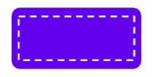

# 在 Jetpack Compose 中按右按钮

> 原文：<https://medium.com/androiddevelopers/pushing-the-right-buttons-in-jetpack-compose-124cb4b17197?source=collection_archive---------0----------------------->

*以下帖子由 Jetpack Compose 团队的 Louis Pullen-Freilich(软件工程师)、*[*mat vei Malkov*](https://twitter.com/matvei_jj)*(软件工程师)和*[*Preethi Srinivas*](https://twitter.com/p3srini?lang=en)*(UX 研究员)撰写。*

Jetpack Compose 最近[发布了](https://android-developers.googleblog.com/2021/07/jetpack-compose-announcement.html) 1.0，带来了一组稳定的 API 来构建 ui。今年早些时候，我们发布了我们的 [API 指南](https://github.com/androidx/androidx/blob/androidx-main/compose/docs/compose-api-guidelines.md)，概述了编写 Jetpack Compose APIs 的最佳实践和 API 设计模式。这些指导方针是我们的 API 表面上多次迭代的结果，但是没有显示这些模式是如何出现的，也没有显示我们做出决策背后的推理。

今天，我们将带您经历一个相对“简单”的组件`Button`的进化之旅，让您深入了解我们是如何将 API 设计得既易用又灵活的。这需要根据开发人员的反馈对 API 的可用性进行一些调整和改进。

# 绘制可点击的矩形

谷歌 Android Toolkit 团队有一个内部笑话，我们所做的一切只是在屏幕上画一个彩色矩形，并让它点击。事实证明，这是 UI 工具包中最难做到的事情之一。

人们可能会认为按钮是一个简单的组件——一个带有单击监听器的彩色矩形。有许多不同的事情使得设计`Button` API 变得复杂:可发现性、参数的顺序和命名等等。一个额外的约束是灵活性:`Button`提供了许多参数，以便开发人员可以根据自己的喜好定制单个元素。默认情况下，一些参数使用主题中的值，而一些参数可以依赖于其他参数的值。这些结合起来使得设计`Button` API 成为一个有趣的挑战。

两年前，我们在第一次迭代`Button` API 时，从[公共提交](https://github.com/androidx/androidx/commit/d4f91b3a79ced7473e21c7c000edd469d24c318b)开始:

Initial Button API

除了名字之外，`Button` API 的最初形式与我们已经确定的最终版本几乎没有共同之处。它已经发展了许多次，我们将带你经历这些。

1.0 Button API

# 获取开发人员的反馈

在 Compose 的研究和实验阶段，我们的`Button`组件接受了一个`ButtonStyle`参数。`ButtonStyle`为`Button`建模的视觉配置，如颜色、形状等。这使我们能够表示三种不同的[材料按钮类型](https://material.io/components/buttons)(包含、概述&文本)；我们简单地公开了顶级构建器函数，这些函数返回与材料规范中的按钮类型相对应的`[ButtonStyle](https://github.com/androidx/androidx/commit/401f755476bfb330bcf4580709a86b170f1c9442)`实例。开发人员可以选择这些内置样式中的一个进行小的调整，或者通过从头开始创建一个新的`ButtonStyle`来完全定制一个`Button`。我们对最初版本的`Button` API 感到满意——这是一个可重用的 API，包含易于使用的风格。

为了验证我们的假设和设计方法，我们邀请开发人员参加编码会议，使用`Button` API 完成简单的编程练习。编程练习包括构建这个屏幕:

The screen of the [Rally](https://material.io/design/material-studies/rally.html) Material Study that developers were tasked to build

使用[认知维度框架](https://citeseerx.ist.psu.edu/viewdoc/download?doi=10.1.1.222.7327&rep=rep1&type=pdf)对这些编码会话中的观察结果进行审查，以便[评估`Button` API 的可用性](https://cacm.acm.org/magazines/2016/6/202645-improving-api-usability/fulltext)。

我们立即在这些会话中观察到一个有趣的模式——一些开发人员开始使用`Button` API:

Using the Button API

其他人试图创建一个`Text`组件并用圆角矩形包围它:

Adding Padding around some Text to try and emulate a Button

当时，使用样式 API 如`themeShape`或`themeTextStyle`需要前面的`+`操作符。这是由于当时 Compose 运行时的某些限制造成的。开发人员研究表明，开发人员发现很难知道运营商做了什么。从这一观察中得到的一个重要结论是，API 设计者无法直接控制的方面会影响人们对 API 的看法。例如，我们听到一位开发人员对运营商做出了如下评论:

> *“据我所知，这是重用现有的样式，或者在它的基础上进行扩展”*

大多数开发人员指出了组合 API 之间的不一致性——例如，用于样式化`Button`的技术与样式化`Text`组件的技术不同。

此外，我们观察到大多数开发人员在将圆角边框应用到`Button`时遇到了很大的困难，这是一项人们认为非常简单的编码任务。通常，他们深入实现的多个层次来理解 API 结构。

> *“我只是在这里随便放些东西，绝对不相信这能成功”*

Correctly customizing a Button’s text style, color, and shape

这影响了开发人员如何将样式应用于一个`Button`。例如，`ContainedButtonStyle`并没有映射到开发者在为 Android 应用程序实现按钮时已经知道的东西。

Early insights from developer research

从编码会议中，我们了解到我们需要简化`Button` API，以便更容易实现简单的定制，同时仍然支持复杂的用例。我们从可发现性和可定制性开始，这给我们带来了下一组挑战:*样式*和*命名*。

# 维护 API 一致性

在我们的编码会议中，样式给开发人员带来了很多问题。为了理解其中的一些，让我们后退一步，评估一下为什么样式作为一个概念存在于 Android 框架和其他工具包中。

一个*‘style’*本质上是一个 UI 相关属性的集合，可以应用于一个组件，比如一个`Button`。样式有两个主要好处:

1.将 UI 配置与业务逻辑分离

在命令式工具包中，能够独立定义样式有助于分离关注点，并使代码更容易阅读:UI 可以在一个地方定义，如 XML 文件，回调和业务逻辑可以分别定义和附加。

在诸如 Compose 这样的声明性工具包中，业务逻辑和 UI 在设计上耦合较少。像`Button`这样的组件大多是无状态的，只显示您传递给它们的数据，而不需要在新值到达时更新内部状态。因为组件只是函数，所以可以通过向`Button`函数传递一个参数来进行定制，就像对任何其他函数一样。但是这使得 UI 配置和行为配置的分离变得困难。例如，在`Button`上设置`enabled = false`不仅可以控制`Button`的行为，还可以控制`Button`的外观。

这就引出了一个问题:`enabled`应该是一个顶级参数还是应该作为一个属性在样式中传递？其他可以应用于`Button`的样式呢，比如提升，或者当`Button`被按下时颜色的变化？设计可用 API 的核心原则是保持一致性；我们认识到确保不同 UI 组件之间的 API 一致性是非常重要的。

2.自定义一个组件的多个实例

在经典的 Android `View`系统中，样式是有益的，因为创建一个新组件的成本非常高:你需要创建一个子类，实现构造函数，应用自定义属性。样式允许以更简洁的方式表达一组共享的属性。例如，考虑创建一个`LoginButtonStyle`来定义应用程序中所有登录按钮的外观。在 Compose 中，可能如下所示:

Defining a style for a login button

`LoginButtonStyle`现在可以在用户界面的多个`Button`中重用，而不需要在每个`Button`上显式设置所有这些参数。但是，如果您也想提取文本，所以每个登录按钮都有相同的文本:*“log in”*怎么办？

在 Compose 中，每个组件都是一个函数，所以这里自然的解决方案是定义一个函数，在内部调用`Button`，并向`Button`提供正确的文本:

Creating a semantically meaningful LoginButton function

由于组件的无状态特性，以这种方式提取函数的成本非常低:参数可以直接从包装函数传递到内部按钮。而且由于你不是在扩展一个类，你只需要公开你想要的参数；其他一切都可以放在`LoginButton`的实现内部，防止颜色和文本被覆盖。这种方法允许比仅使用一种样式更大范围的定制。

此外，创建一个`LoginButton`函数比将一个`LoginButtonStyle`传递给一个`Button`函数在语义上更有意义。我们还从研究会议中观察到，独立的函数比样式更容易被发现。

没有样式，`LoginButton`现在可以被重构，直接将参数传递给底层的`Button`，而不需要样式对象，与任何其他定制一致:

The final LoginButton implementation

因此，我们[移除了样式](https://github.com/androidx/androidx/commit/e386f97dd769da18d9f3103958714e43d797219f)并将参数直接平铺到组件中——这既是为了与整体组合理念保持一致，也是为了鼓励开发人员创建语义上有意义的“包装”函数:

OutlinedButton in 1.0

# 提高 API 的可发现性或可见性

我们还在研究中观察到一个重大缺陷，即如何将形状应用于按钮。为了定制`Button`的形状，开发人员可以使用 shape 参数，该参数接受一个`Shape`对象。负责创建具有捷径的按钮的开发人员通常采用这种方法:

1.  使用默认值创建一个简单的`Button`
2.  从`MaterialTheme.kt`源文件中寻找一些与形状主题相关的线索
3.  查看`MaterialButtonShapeTheme`功能
4.  确定`RoundedCornerShape`，并尝试使用类似的方法创建一个带有切角的形状

大多数开发人员在这一点上迷失了，当审查 API 和源代码时，他们经常会被自己所经历的深度所淹没。我们观察到开发人员在发现`CutCornerShape`时遇到了很大的困难，因为它是在一个独立于其他 shape APIs 的包中公开的。

可见性是对开发人员定位完成目标所需的功能或参数的难易程度的一种度量。它与编码时所需的认知努力直接相关；寻找和使用方法的搜索路径越长，API 就越不可见。因此，这会导致开发人员的工作效率和满意度降低。基于这种认识，我们[将 CutCornerShape](https://github.com/androidx/androidx/commit/468c797c109cf24a561dad6a496310964d2a4a2b) 移到了与其他 shape APIs 相同的包中，以支持轻松发现。

# 映射到开发人员的工作框架

现在是时候获得更多反馈了——我们在一系列进一步的编码会议中回头评估了`Button` API 的可用性。在这些会议中，我们按照材料设计规范中的规定准确命名按钮:`Button`变成了`ContainedButton`以符合规范。然后我们测试了新的命名以及当时我们拥有的`Button`的整体 API。评估了两个主要的开发者目标:

*   创建一个`Button`并处理点击事件
*   使用预定义的材质主题设计`Button`的样式

Material Buttons from material.io

我们从这些会议中得到的一个关键见解是，大多数开发人员不熟悉用于材质按钮的命名约定。例如，许多人无法区分`ContainedButton`和`OutlinedButton`:

> *“contained button 是什么意思？”*

我们观察到开发人员在输入`Button`时花费了相当多的精力猜测，并看到自动完成提示了三个`Button`组件。大多数开发人员希望默认为`ContainedButton`，因为它是最常用的，也是最像“按钮”的。很明显，我们需要一个开发人员可以使用的默认值，而不需要阅读材料设计指南。另外，基于视图的 [MDC-Android](https://github.com/material-components/material-components-android) `Button`默认为一个包含的按钮，所以这里也有使用它作为默认按钮的先例。

# 更清晰地表达角色

研究中的另一个困惑点是存在两个版本的`Button`:一个`Button`接受文本的`String`参数，另一个`Button`接受表示一般内容的可组合 lambda 参数。这里的目的是在两个不同的层中提供 API:

*   一个更简单的带文本的`Button`，更容易实现
*   一个更高级的`Button`，对放在里面的内容不那么固执己见

我们观察到开发人员在选择一个而不是另一个时遇到了困难:`String`重载开始很简单，但是当从`String`重载转移到 lambda 重载时，定制*“悬崖”*的存在使得增量定制`Button`变得很有挑战性。我们从开发人员那里听到的一个常见请求是用`String`重载为`Button`添加一个`TextStyle`参数:

> *它将允许定制内部文本样式，而不必使用 lambda 重载。*

我们提供`String`重载的目的是使*最简单的用例变得简单*，但是这阻碍了开发人员使用带有可组合 lambda 的重载，导致对`String`重载的额外功能的请求。这两种独立的 API 形状的存在不仅让开发人员感到困惑，而且很明显,“原始”重载存在一些根本性的问题:那些接受原始类型(如`String`而不是可组合的 lambdas)的重载。

## 逐句通过代码

一个原始的`Button`重载直接接受文本作为参数，减少了开发人员创建一个包含文本的`Button`所需的代码量。我们从简单的`String`文本参数开始，但是认识到`String`没有为文本的不同部分提供单独的样式。

对于这个用例，Compose 提供了`AnnotatedString` API，它允许开发人员对一些文本的不同部分应用定制样式。然而，这为简单用例增加了一些开销，因为开发人员首先需要将他们的简单`String`转换成一个`AnnotatedString`。这让我们质疑我们是否应该为`Button`重载提供*`String`和`AnnotatedString`参数来支持简单和更高级的情况。*

*对于图像和图标，我们的 API 设计讨论更加复杂，比如在`FloatingActionButton`中使用时。`icon`参数的类型应该是`Vector`还是`Bitmap`？如何支持动画图标？即使我们尽了最大努力，我们认识到我们只能支持 Compose 中可用的类型——任何第三方图像类型都需要开发人员自己编写支持这些类型的重载。*

## *紧耦合的副作用*

*Compose 最大的优势之一是可组合性。创建一个可组合功能的小成本使得分离关注点、构建可重用和隔离的组件变得更加容易。对于可组合的 lambda 重载，很容易看出关注点的分离:一个`Button`是内容的可点击容器，但是它不需要知道内容是什么。*

*但是对于原语重载，这就有点复杂了:一个直接接受文本的`Button`现在既负责可点击的容器，*和*在里面发出`Text`组件。这意味着它现在需要为这两者管理 API 表面，这就提出了另一个重要的问题:`Button`应该公开什么文本相关的参数？这也将`Button`的 API 面与`Text`捆绑在一起:如果未来有新的参数和功能加入到`Text`中，这是否意味着`Button`也需要加入对它们的支持？这种紧密耦合是 Compose 试图避免的问题之一，很难在所有组件中以一致的方式回答这些问题，这导致了我们的 API 表面的不一致。*

## *支持工作框架*

*通过设计，基元重载允许开发人员避免使用可组合的 lambda 重载，以减少可能的自定义。但是当开发人员想要定制一些在原语重载中不可能的东西时会发生什么呢？唯一的选择是使用可组合的 lambda 重载，然后从原始重载中复制粘贴内部实现，并进行所需的更改。我们在研究中发现，这种定制*‘cliff’*阻碍了开发人员使用更灵活、可组合的 API，因为在不同层之间移动所需的工作似乎比实际情况更具挑战性。*

## *救援槽*

*鉴于上述问题，我们决定移除`Button`的原始重载，为每个`Button`留下一个 API，其中包含一个可组合的 lambda 参数作为其内容。我们开始将这种通用 API 形状称为“ *slot API* ”，这种形状现在被广泛应用于各个组件。*

**

*A Button with an empty ‘slot’*

**

*A Button with an image and text placed in a row*

*一个*‘slot’*指的是一个可组合的 lambda 参数，它代表一个组件内部的任意内容，比如`Text`或者`Icon`。Slot APIs 增加了可组合性，使组件更简单，并减少了跨组件的独特概念的数量，使开发人员更容易开始使用新组件，或在组件之间移动。*

*

CL removing the primitive overloads* 

# *展望未来*

*我们在`Button`API 上所做的改变的数量，我们在会议上讨论`Button`所花费的时间，以及我们在获取开发者反馈上所付出的努力都是惊人的。也就是说，我们对这个 API 的结果非常满意。事后看来，我们可以看到 Compose 中的`Button`是如何变得更容易被发现、更可定制，并且最重要的是，促进了一种*可组合*的心态。*

*[1.0 Button API](https://cs.android.com/androidx/platform/frameworks/support/+/androidx-main:compose/material/material/src/commonMain/kotlin/androidx/compose/material/Button.kt;l=96?q=Button.kt)*

*重要的是要认识到，我们的大多数设计决策都基于以下原则:*

> **“让简单的事情变得简单，让困难的事情变得可能”**

*我们试图通过移除重载和扁平化“样式”来简化事情，同时对 Android Studio 自动完成进行改进，以帮助开发人员提高工作效率。*

*从整个 API 设计过程中，我们有两个主要的收获需要明确提出:*

1.  ***API 设计是一个迭代过程**。在一个 API 的第一次迭代中，想出完美的东西几乎是不可能的。有些需求很容易被忽略。作为一个 API 的作者，你必须做一些假设。这些包括开发人员背景的不同环境，导致不同的思维方式，影响人们发现和使用 API 的方式。调整将是不可避免的，这是一件好事，因为迭代会带来更有用和更直观的 API。*
2.  ***当迭代一个 API 设计**时，开发者使用 API 的经验反馈环是你的武器库中最有价值的工具之一 **。当一个开发者说“这个 API 太复杂”时，理解它意味着什么对我们的团队来说是绝对重要的。这通常是因为我们需要了解 API 的不正确使用并从中学习，这通常会导致开发人员的成功率和生产率下降。激发这种需求的一个关键驱动力是我们设计易于使用和令人愉快的 API 的意图。为此，我们使用了多种研究方法来创建开发人员反馈循环——从现场编码 sessions⁴到要求开发人员记录其 experiences⁵.日志的远程方法我们已经能够理解开发人员如何处理一个 API，以及他们如何找到他们想要实现的功能的正确句柄。框架的支柱，如程序员的思维方式和认知维度，对我们的跨职能团队来说特别有帮助，不仅在审查和交流开发人员的反馈时，而且在进行 API 设计讨论时，都有帮助。特别是，这个框架有助于我们在评估用户体验和功能之间的取舍时形成对话。***

*我们承认，尽管我们喜欢当前版本的`Button` API，但我们知道它并不完美。有多种开发人员的思维方式，加上不同的工作环境，以及新出现的需求，这些都要求我们应对新的挑战。还有*那也行*！对于我们和开发者社区来说,`Button`的整个发展过程非常有价值。所有这些都是说，我们的过程已经帮助设计和形成了一个可用于 Compose 的`Button`API——屏幕上一个简单的可点击矩形。*

*我们希望这篇文章揭示了您的反馈如何影响 Compose 的`Button` API 改进的幕后真相。像往常一样，如果您在 Compose 中实现时遇到任何问题，或者有一个可以改善您的体验的新 API 的想法，请在此处提交 bug。我们也在寻找开发者参与未来的用户研究会议——在此注册[参与研究。](https://g.co/userresearch/androiddev21)*

*[1]大多数开发人员期望在使用`+themeButtonStyle`或`+buttonStyle`的样式中“*加“*，类似于他们使用`+themeTextStyle`将样式应用于`Text`组件的方式。*

*[2]这种想法是基于 Randal L. Schwartz、Brian D Foy 和 Tom Phoenix 的著名著作《学习 Perl:让简单的事情变得简单，让困难的事情变得可能》中的一句话*

*[3] [来自 Android 开发者 UX 团队的 Meital Tagor Sbero](https://www.linkedin.com/in/meitaltagor/) 开发了程序员思维风格框架，其灵感来自于在[设计](https://docs.microsoft.com/en-us/archive/blogs/stevencl/making-effective-use-of-personas-in-design)和[认知维度框架](https://www.researchgate.net/profile/Marian-Petre-4/publication/200085937_Usability_Analysis_of_Visual_Programming_Environments_A_%27Cognitive_Dimensions%27_Framework/links/02bfe50fbf23476730000000/Usability-Analysis-of-Visual-Programming-Environments-A-Cognitive-Dimensions-Framework.pdf)中对[人物角色&思维风格](https://medium.com/inclusive-software/tagged/thinking-styles)的研究。程序员思维风格框架有助于利用程序员的动机和对他们在给定时间需要的“解决方案类型”的态度来确定 API 可用性的设计考虑。它考虑了普通程序员的工作方式，有助于优化频繁编程任务的易用性。*

*[4]我们通常使用这种方法来评估 API 特定方面的可用性。例如，每次会议都有一组开发人员使用 Button API 来完成一组编码任务，这些任务旨在特别公开我们对收集反馈最感兴趣的 API 区域。我们使用大声思考协议来获取更多关于开发人员在寻找什么和他们的假设是什么的信息；在这些会议中，研究人员还会向开发人员询问后续问题，以更好地了解开发人员的需求。我们能够回顾这些会议，以确定所有开发人员在编码任务中导致成功和/或失败的行为模式。*

*[5]我们通常使用这种方法来评估一段时间内 API 的可用性和可学性。这种方法可以帮助捕捉开发人员旅途中困惑和快乐的时刻，方法是在他们的自然工作环境中倾听开发人员的声音。在这种方法中，我们有一组开发人员在他们选择的项目上工作，同时确保他们也使用我们有兴趣评估的 API。开发人员在日记中自我报告的体验、研究人员基于认知维度框架特别策划的深度问卷调查([示例](https://arxiv.org/pdf/1703.09846.pdf))以及后续采访会议的组合有助于我们确定 API 的可用性。*