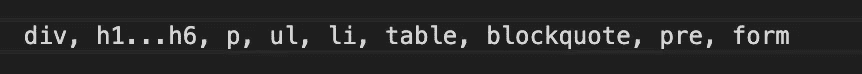

# 在用户界面代码中加入常识—第 1 部分(HTML)

> 原文：<https://medium.com/globant/putting-common-sense-in-your-ui-code-part-1-html-60b3aef4b002?source=collection_archive---------1----------------------->

## UI 开发最佳实践

如果你一开始不关注代码，你就是在用和形象中的樵夫一样的方式伤害自己。糟糕的代码最终会导致不可读和低效的代码，从长远来看这是很难管理的。

> 在你的代码中加入常识意味着使用一些基本的最佳实践，这将使代码更具可读性和可理解性。

在这一系列文章中，我们将看看这些 UI 开发的基本最佳实践，在这一篇文章中，我们将专门从 HTML 开始。

**1。**不要“分割”一切

即在需要时使用适当的语义标签。

**2。** **从不在内联元素中使用块元素**

对于上面例子中的嵌套结构，一定要记住用块级元素来包装内联元素。

下面是一个**内联**元素的列表:

并且**块级**元素是:

上面的例子还涵盖了另外一点:

**3。** **使用*alt*属性**(可选文本属性)

*   它用于对图像进行有意义的描述。
*   它为屏幕阅读器用户提供替代文本。
*   此外，当图像没有从服务器加载/移除时，它向用户提供关于图像的信息。

**4。**对**类**和 **id** 属性使用**正确且有意义的名称**

永远不要使用基于样式属性的命名约定，而是根据它的实际用途来命名类/id。在上面的例子中，我们可以使用更有意义的类名，如“alert”或“warning”来代替“red”。

**5。**高效使用**结构件**

*   使用从古怪模式中保存您的代码。
*   使用带有描述和关键字属性的标签来获得更好的搜索引擎优化。
*   使用<title>标签给你的页面起一个有意义的标题。</title>
*   使用语义标签，如页眉、页脚、节、h1… h6、侧边、导航，以获得更好的可访问性和可读性。

**6。**保持您的**视图将**与样式和脚本分开

*   永远不要使用内嵌样式。
*   永远不要使用内联/内部脚本。

使用外部。css 和。js 文件作为内联样式和脚本很难跟踪和管理。

**7。**尽量保持它的**简洁**

即在正确的地方使用正确的 HTML 元素。

# 下一部分即将推出…

# 感谢阅读。在下面评论你对这篇文章的想法！！😊