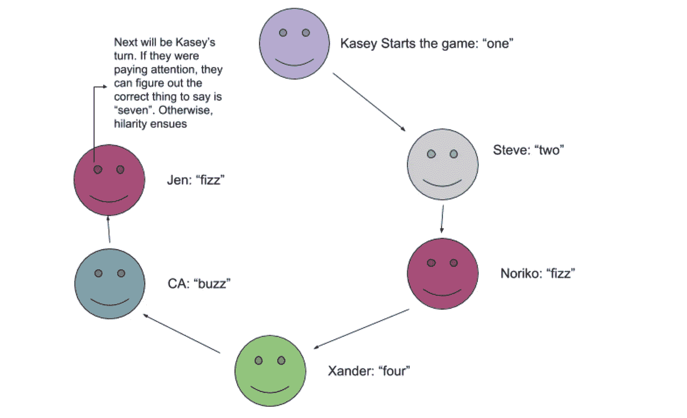

# 给你的 Python Fizz 注入更多活力

> 原文：<https://medium.com/capital-one-tech/putting-more-buzz-in-your-python-fizz-f93f5ca7584c?source=collection_archive---------5----------------------->

# 关于类型提示如何改进代码的四个过度设计的例子


类型提示分析，就像单元测试和静态代码分析一样，都是为了给人们一个适当的信心级别，让他们相信代码会像预期的那样工作。它们可以是 Python 程序的有用部分，也是我们用来建立代码整体质量的众多工具之一。

在这篇文章中，我想探索类型注释帮助编写更好的软件的不同方式。为了做到这一点，我需要解决一个问题。你可能从标题中猜到我要解决的问题:[嘶嘶作响的问题](https://en.wikipedia.org/wiki/Fizz_buzz)。好几次。准确地说是四次。方法不同，因此类型提示的种类也不同。

# 为什么是嘶嘶作响？

如果你没有听说过嘶嘶作响的问题，这是基于一个派对游戏。人们围坐成一圈。他们从“一”开始报数然后下一个人说，“两个。”到目前为止，一切顺利，对吧？现在是该规则的第一个例外。没有人说三的倍数，他们说“嘶嘶”。所以下一个人说“嘶嘶”，他们后面的人说“四”下一个例外是:没有人说 5 的倍数。相反，他们说“嗡嗡”所以下一个人说“嗡嗡”而不是“五”然后是“嘶嘶”接着是欢声笑语，因为没人记得嗡嗡声和嘶嘶声之后是哪个数字。最终有人发现是“七”然后是“八”，然后是“嘶嘶”和“嗡嗡”



The fizz-buzz game played with real people

关于为什么我们要过度设计这个问题的一些背景故事。有几年，我住在一艘帆船上。海上有很多可能出错的地方，失败的后果可能是可怕的。因此，许多水手都会同意，任何值得工程的东西都值得**过度工程**。

因此，在这篇文章中，我想把嘶嘶作响的问题重复四遍。这相对简单，因此，我们可以从多个角度来看待它。但是在我们开始过度设计这个问题之前，让我们先来谈谈工具。

在船上，我们使用绞盘把手来给我们杠杆作用，使我们越过带有重帆的绳索或带有重锚的链条。一个锚可能重 25 公斤，链条每米重 2.3 公斤。在 10 米深的地方抛锚，几乎是要提升的两倍；用手尝试是不安全的。在这种情况下，绞车是必不可少的，长绞车手柄非常重要。

现在回到编码。按照设计，Python 类型提示对我们代码的运行时行为几乎没有影响。它们大多被像 [mypy](https://mypy.readthedocs.io/en/stable/) 这样的工具使用。mypy 工具对代码和注释进行静态分析，以确认代码符合提示。

如果你还没有得到它，你会想要添加它。

```
python -m pip install mypy
```

我还将建议 Python 项目文件和文件夹的安排。不是每个人都喜欢这种安排，但我认为它对大多数项目来说效果很好。

```
Project
+-- src
    +-- fizzbuzz.py
+-- tests
    +-- test_fizzbuzz.py
+-- tox.ini
```

我将专注于使用 mypy 来检查源代码，所以我将悄悄地忽略这些测试。我将把这些留给读者作为练习。

在安装了 mypy 并设置了两个文件夹之后，这里是`fizzbuzz.py`的第一轮实现

```
print("1, 2, fizz, 4, buzz, fizz, 7, 8, fizz, buzz")
```

是的，那个剧本感觉像是作弊。而不是一步一步的游戏算法，它有一个九轮游戏的硬连线结果。它做类似于*的工作。测试是非常痛苦的，因为没有一个测试用例可以导入和测试的函数或类。没有自动化测试意味着它可能不工作。*

设置好之后，我们应该能够输入 mypy src 来检查这个小文件的类型注释。没有显式类型批注。这一行代码匹配内置`print()`函数的定义。因此，这一行代码对 mypy 来说看起来不错。

这是为 fizz-buzz 写你自己的解决方案的好时机。称之为 `***fizzbuzz1.py***` ***以区别于我最初不太好的例子。***

# 基本类型提示—低/无工程解决方案

为了有可测试的东西，将嘶嘶作响的问题分解成函数是有帮助的。这里有一个分解，似乎可以解决问题。**剧透预警** : *它有 bug*。

```
def fizz_buzz(n):
    if n % 3 == 0: return "Fizz"
    elif n % 5 == 0: return "Buzz"
    else: return nif __name__ == "__main__":
    for i in range(10):
        print(fizz_buzz(i))
```

这似乎适用于从 1 到 10 的数字。尽管有逻辑问题，让我们添加类型提示。如果你以前没见过它们，它们看起来像这样:

```
def fizz_buzz(n: int) -> str:
    if n % 3 == 0: return "Fizz"
    elif n % 5 == 0: return "Buzz"
    else: return n
```

注释预期类型的代码有两处更改:

*   在参数`n`后，有一个`: int`标注；提示是`n`应该是`int`类型的一个实例。
*   在函数参数列表后面，有一个`-> str`注释；提示是这个函数的返回值应该是一个`str`类型的实例。

虽然类型提示的某些方面可能更复杂，但这是使用注释的基本模型。为函数或方法的每个参数提供提示，以及每个函数或方法的结果。这似乎很好地涵盖了大量案例。

如上所述，该算法有一个缺陷。类型提示也有问题。

让我们先处理这些暗示。我们可以在`src`目录下运行`mypy`，并看到以下内容:

```
% mypy src
src/fizzbuzz2.py:4: error: Incompatible return value type (got "int", expected "str")
Found 1 error in 1 file (checked 2 source files)
```

一些人马上发现了这场冲突。类型注释说`fizz_buzz()`函数返回了一个`str`。酪其中一个`return`语句返回了一个整数值。

这导致了一个有趣的困境。我们可以问“哪个是对的？”当代码和注释发生冲突时，我们有两条路可以走，这取决于我们作为软件设计者的意图:

1.  **标注正确:**修复代码匹配标注。
2.  **代码正确:**修复标注，使其与代码匹配。

这种困境经常发生。真的很多。根据我的经验，差不多总是这样。

**让我们看看选项 1 —注释是正确的:修改代码以匹配注释。**
注释一直是正确的，但是代码并没有完全正确地实现它。下面是代码*应该是什么:*

```
def fizz_buzz(n: int) -> str:
    if n % 3 == 0:
        return "Fizz"
    elif n % 5 == 0: 
       return "Buzz"
    else: 
        return f"{n}"
```

我们已经修复了 return 语句，以创建与注释一致的字符串。我偏爱这条路，但它并不总是正确的。

**让我们看看选项 2 —代码是正确的:修复注释以匹配代码。**
注释没有正确反映代码。下面是注释*应该是*的样子:

```
from typing import Uniondef fizz_buzz(n: int) -> Union[str, int]:
    if n % 3 == 0:
        return "Fizz"
    elif n % 5 == 0:
        return "Buzz"
    else:
        return n
```

这引入了一个新的类型构造函数`Union`。这将构建一个复合类型，其中的对象可以是字符串或整数。这描述了该函数实现的结果。

Python 依赖[鸭子打字](https://docs.python.org/3/glossary.html?highlight=duck%20typing)::*如果它长得像鸭子，游起来像鸭子，叫起来像鸭子，那么它很可能就是鸭子。”这意味着大多数 Python 代码在类型方面是通用的，许多函数可以被描述为使用大量类型的联合。*

实际上，我们的应用程序代码倾向于一种或几种类型。为了阐明我们的意图，我们通常希望缩小可能类型的范围，并专注于真正重要的类型。在某种程度上，我们使用类型注释有意地将 Python 处理大量类型的能力放在一边，以便我们可以专注于与我们的应用程序相关的少数类型。

当我们把手放在船周围的各种绳索上时，水手们会做出许多细微的区别。我们区分床单，升降索，收帆索，码头线和地面滑车。是的，它们或多或少都是各种尺寸和颜色的绳索。在地面滑车的情况下，锚线也可能有一层泥。每一行都有特定的、通常是固定的应用。例如，在翻船时，我们可能需要放松床单。转弯时放松升降索会造成大混乱。放松码头线毫无意义。

同样，我们经常希望在应用程序中仔细区分函数允许的数据类型。出于这个原因，我建议避免`Union`定义的复杂性，并使用更窄的定义`def fizz_buzz(n: int) -> str:.`来固定函数

这并没有揭示算法问题。它不能，真的，因为我们没有考虑到数字 15。它既是“嘶嘶”又是“嗡嗡”我认为只有通过单元测试才能发现的 bug 和 mypy 发现的潜在 bug 之间的区别是非常重要的。为了解决这个问题，我们需要一些工具，包括 mypy。

# Python 的内置数据结构——一个过度设计的解决方案

让我们做一些过度工程，好吗？

我们希望积累数字和一组字符串之间的映射，而不是简单地打印数字、嘶嘶声或嗡嗡声。我们正在寻找创造如下的东西:

```
{1: set(), 2: set(), 3: {"Fizz"}, 4: set(), 5: {"Buzz"}, ...}
```

理想情况下，我们还会修复算法错误，并在结果中加入`15: {“Fizz”, “Buzz”}`。

这需要一些额外的类型构造函数。打字模块包括我们可以使用的`List, Set,`和`Dict`定义。总的来说，这是一个将整数映射到集合的字典。

我们可以从`Dict[int, Set]`开始描述这个。实际上，它实际上是`Set[str]`，因为集合将只包含字符串(或者为空。).这将我们引向一个如下所示的函数签名:

```
def fizz_buzz(n: int) -> Set[str]...
```

然后我们可以使用这个函数来构建映射，`Dict[int, Set[str]].`

## 在继续航行之前，请随意停下来写下你自己的想法。

这是我的解决方案:

```
def fizzy(n: int) -> Set[str]:
    if n % 3 == 0: 
        return {"Fizz"}
    return set()
def buzzy(n: int) -> Set[str]:
    if n % 5 == 0: 
        return {"Buzz"}
    return set()
def fizz_buzz(n: int) -> Set[str]:
    return fizzy(n) | buzzy(n)
if __name__ == "__main__":
    fb_map = {n: fizz_buzz(n) for n in range(10)}
    for n in fb_map:
        print(fb_map[n])
```

各功能一致。它们都接受一个整数参数，并创建一个正确的结果`Set[str]`。最终的映射使用字典理解来创建从整数到`fizz_buzz(n)`函数结果的映射。

当我们在这个文件上运行 mypy 时，我们会发现 mypy 有一个关于`fb_map`赋值的问题。虽然我们——作为代码的作者——非常确定这个映射可以被描述为`Dict[int, Set[str]]`,但是 mypy 并不乐意匆忙得出这个结论。

我们需要另一种类型注释机制。

```
fb_map: Dict[int, Set[str]] = {
    n: fizz_buzz(n) for n in range(10)}
```

我们在变量和`=`之间的赋值语句中加入了一个`: Dict[int, Set[str]]`。

这澄清了词典理解的意图。它给了 mypy 足够的优势来判断所有函数是否一致。

# 这不是有点复杂吗？

`fb_map: Dict[int, Set[str]]`赋值语句有点复杂，类型注释隐藏在已经很复杂的语句中。我们能简化这个吗？

**剧透预警:** *是。*

我们可以做的一件事是使用类型构造将复杂的定义分解成更简单的部分。

```
FBMap = Dict[int, Set[str]]
fb_map: FBMap = {n: fizz_buzz(n) for n in range(10)}
```

这展示了我们如何构建一个新的类型注释，并给它命名为`FBMap`。这个名字让我们简化了赋值语句，只使用了`FBMap`类型名而不是长类型表达式。

虽然这更简单，但这里有一些重复，这是不可取的。我们重复`Set[str]`很多次。我们需要吗？

**剧透预警:** *号*

考虑映射类型的分解。

```
FzBzState = Set[str]
FBMap = Dict[int, FzBzState]
```

我们已经将复杂系统`Set[str]`指定为一个名字`FzBzState`。在这种情况下，这不是一个巨大的简化。但是，Python 让我们可以构建非常复杂的结构，我们可能想要简化这些结构。想想字符串元组和整数元组的列表，或者其他同样令人困惑的东西。因为 Python 允许大量的复杂性，它可以帮助将这些复杂、令人困惑的东西分解成一些单独的定义。

这引发了进一步的反思。我不会提供所有的代码，而是总结如下:

```
FzBzState = Set[str]
def fizzy(n: int) -> FzBzState: ...
def buzzy(n: int) -> FzBzState: ...
def fizz_buzz(n: int) -> FzBzState: ...
FBMap = Dict[int, FzBzState]
```

这里的目的是确保所有的函数都创建了一个`FzBzState`对象，并且最终的映射对象将包括一个整数和一个`FzBzState`对象。我们可以看到—对于这个具体的实现— `**FzBzState**` 是一个`Set[str]`。有了这个一致的名称，就有可能考虑改变底层类型，以提高性能或提供更具表达性的对象定义。

将复杂类型分解成简单类型的想法非常吸引人。当我们面临船只维护的复杂问题时，将复杂的问题分解成我们可以独立解决的简单问题会有所帮助。


Over-engineered boat plumbing

例如，这是一张过于复杂的管道图片。还不清楚，但是五个独立的软管通过一个复杂的配件集合在一起。这需要简化，因为如果某处出现故障，这可能很难处理。

# 正向引用和循环——真正过度设计的解决方案

让我们通过引入类定义来真正解决这个问题。而不仅仅是旧的类定义。让我们介绍一下*相互依赖的*类定义。

我们将把一组数字的嘶嘶声或嗡嗡声分成两部分:

*   定义给定数字属性的类。
*   这些单个数字属性定义的集合。

**剧透预警:** *以下代码存在问题。*

**FBStatus** 类定义描述了一个数字，并以如下方式开始:

```
class FBStatus:
    def __init__(self, n: int, parent: FBMap) -> None:
        self.n = n
        self.parent = parent
        self.fb = str()
```

如果你没怎么用过类型注释，`__init__()`方法必须返回`None`。我们提供整体地图作为每个单独号码状态的一部分。我没有一个很好的理由来解释为什么这种关系是必不可少的，但是这种循环是复杂数据结构中的一种常见模式，在这种结构中，图的导航可以“向上”也可以“向下”工作。

需要更多的代码来正确地将值加载到`self.fb`集合中。一旦我们理清了基本的类定义，我们稍后将回到这个问题上来。

`FBMap`类定义描述了一组数字，如下所示:

```
class FBMap:
    def __init__(self. limit: int) -> None:
        self.domain = {
            n: FBStatus(n, self)
            for n in range(limit)
        }
```

映射的初始化创建了一个字典来将整数映射到`FBStatus`实例。

这有一个微妙的问题。以及其他一些不那么微妙的问题。

*   **在方法体内部**我们可以引用任何将成为局部或全局命名空间一部分的对象。方法体评估发生在所有的函数和类被定义之后。这意味着 Python 函数和类的定义通常可以是任意顺序的。我们经常选择一个顺序来帮助解释代码。
*   **在方法体之外(即在定义中)**在定义行中，我们只能引用先前在模块中定义的名字。这限制了定义的顺序，因此函数或方法定义只能引用以前定义的类或函数。

然而，Mypy 给了我们一种打破这种定义顺序规则的方法。我们可以提供一个字符串来代替类名。Mypy 将解析字符串，这将允许我们包含前向引用。这里有一个小变化，让我们先用对`FBMap`的前向引用来定义`FBStatus`。

```
class FBStatus:
    def __init__(self, n: int, parent: "FBMap") -> None:
        self.n = n
        self.parent = parent
        self.fb = set()
```

变化很小。我们用字符串`“FBMap”`替换了`FBMap`。然而，这还不是全部。一旦我们解决了这个问题，我们就可以继续这里的另外两个问题。

## 第一个问题——自我父母

`__init__()`方法的第一个问题是 self.parent 确实需要成为一个`weakref`。这超出了类型提示主题的范围，但是使用`weakref.ref(parent)`很有帮助。

## 第二个问题—设置 self.fb 集合元素

`__init__()`方法中的第二个问题是我们从未将`self.fb`的值设置为任何有用的值。我们想创造一套嘶嘶或嗡嗡声的属性。

让我们解决这两个问题，完成`self.fb`的初始化:

```
class FBStatus:
    def __init__(self, n: int, parent: "FBMap") -> None:
        self.n = n
        self.parent = weakref.ref(parent)
        self.fb = set()
        if n % 3 == 0: self.fb |= {"Fizz"}
        if n % 5 == 0: self.fb |= {"Buzz"}
```

这显示了我们如何将`self.fb`集合构建为几个可能值的并集。我们可以把“嘶嘶”加到布景中，或者把“嗡嗡”加到布景中，或者两者都加，或者不加。

## 第三，不是真正的问题——显示状态

虽然我们的类非常简单，但通常使用属性或方法来公开对象的当前状态。让我们再添加一个特性:从这个类的每个实例中提取有用摘要的属性。以下是完整的定义:

```
class FBStatus:
    def __init__(self, n: int, parent: "FBMap") -> None:
        self.n = n
        self.parent = weakref.ref(parent)
        self.fb = set()
        if n % 3 == 0: self.fb |= {"Fizz"}
        if n % 5 == 0: self.fb |= {"Buzz"} @property
    def fizz_buzz(self) -> Tuple[int, Set[str]]:
        return self.n, self.fb
```

这一特性将使我的 py 适合。为什么？我们有矛盾:

*   `fizz_buzz` 产权界定主张`self.fb`为`Set[str]`。
*   `__init__()`方法权利要求`self.fb`为`Set[Any]`。

正如我们上面提到的，我们已经暴露了代码和提示之间的冲突。通常代码是错误的，但有时提示是错误的。在这种情况下，一点额外的注释就可以解决问题。

最后看一下`FBStatus`的类定义。

```
class FBStatus:
    def __init__(self, n: int, parent: "FBMap") -> None:
        self.n = n
        self.parent = weakref.ref(parent)
        self.fb: Set[str] = set()
        if n % 3 == 0: self.fb |= {"Fizz"}
        if n % 5 == 0: self.fb |= {"Buzz"} @property
    def fizz_buzz(self) -> Tuple[int, Set[str]]:
        return self.n, self.fb
```

这个`FBStatus`类的定义为 mypy 提供了一个重要的线索:集合将只包含字符串。这个额外的定义解决了 mypy 看到的最初如何创建`self.fb`和如何在`fizz_buzz`属性中使用它之间的冲突。

“`FBMap`”字符串作为对`FBMap`类型的正向引用注释，让我想起了在船上使用“吊线”的方式。将新的升降索穿入 50 英尺长的桅杆是很棘手的。桅杆里面还有其他线路和电线。这是一根长长的铝管，所以我们看不到我们在做什么。然而，水手们对此有一个解决办法。我们从在旧升降索的末端系上一根轻绳开始。当我们拉下升降索时，那根轻的绳索跟着它绕过各种滑轮，穿过桅杆的黑暗凹处。我们把这个信使留在原地标记道路。当需要用一根新的、不那么磨损的绳索来替换升降索时，我们把新的升降索弯向传令兵，用它来拉着沉重的升降索穿过桅杆的黑暗凹处。

使用字符串作为类型提示类似于信使行。真正的类型最终会被定义。目前，有一个轻量级的占位符。

# 你怎么知道的？

有时，来自 mypy 的错误可能会令人困惑。对我来说，造成困惑的最常见原因是 mypy 错误与我对正在处理的代码的一个严格假设相冲突。我以为我知道我的意思。为什么我的 py 也看不到？

澄清假设错误程度的主要工具是`reveal_type()`“函数”。这有函数的语法，但不是真正的函数。mypy 用它来显示细节。

我们可以这样使用它:

```
class FBStatus:
    def __init__(self, n: int, parent: "FBMap") -> None:
        self.n = n
        self.parent = weakref.ref(parent)
        self.fb = set()
        reveal_type(self.fb)
        if n % 3 == 0: self.fb |= {"Fizz"}
        if n % 5 == 0: self.fb |= {"Buzz"} @property
    def fizz_buzz(self) -> Tuple[int, Set[str]]:
        return self.n, self.fb
```

我在这个例子中加入了一个`reveal_type(self.fb)`来展示它的样子。这是在运行 mypy 之前要做的事情。它必须被移除，因为有了它，你甚至不能运行单元测试。它可以帮助我们了解 mypy 对我们的代码有什么看法。

这就像在棘手的河流入口处发现一个浮标。全球定位系统很有趣，而且认为你知道自己在哪里也很好。没有什么比看到一个大的绿色旧罐头浮标漂浮在水中，或多或少在你希望的地方更好的了。一个有形的地标给我们提供了很多信心，让我们相信我们正在安全的深水中航行。

# 命名元组——另一个真正过度设计的解决方案

我想看看另一个可能的过度设计的解决方案来解决嘶嘶作响的问题。我们将从使用`typing.NamedTuple`实例来跟踪一个数字的活跃程度开始。它们可以内置类型提示，对于创建具有相当完整注释的应用程序非常有用。

首先是比老款`collections.namedtuple`酷多了的新款`typing.NamedTuple`。这里有一个例子:

```
from typing import NamedTuple, Optional, Setclass FB(NamedTuple):
    n: int
    fizz: Optional[str]
    buzz: Optional[str]
```

这是一个 Python 三元组，属性名为 n、fizz 和 buzz，用于元组中的项目和——奖金！—为每个项目键入注释。这比 Tuple[int，Optional[str]，Optional[str]]的未命名元组好一点，因为每个条目都有一个适当的属性名。最大的好处是提供了提示，这样 mypy 可以仔细检查代码。

`Optional[str]`是描述两种类型的并集的简便方法。这相当于`Union[str, None]`，反映了一种非常常见的 Python 编程实践。这说明了当没有有用的值时，None 通常被用作占位符。

我们可以使用这样的代码`fb6 = FB(6, “Fizz”, None)`来定义一个给定数字的属性。我们可以使用`fb6[0]`或`fb6.n`来获得数值，使用`fb6[1]`或`fb6.fizz`来获得数字的嘶嘶声。我喜欢命名属性而不是位置属性。

我们如何创建这些对象？我们需要某种工厂。这里有一个合适的函数:

```
def fizz_buzz(n: int) -> FB:
    return FB(
        n,
        "Fizz" if n % 3 == 0 else None,
        "Buzz" if n % 5 == 0 else None
    )
```

这将用一个数字和适当的属性构建`FB`元组。我喜欢这种解决方案，我们可以使用应用于不可变对象的函数。

然而，这与之前的定义并不完全一致。它在任何地方都没有使用`Set[str]`。我们可以把它作为一种属性添加进去:

```
class FB(NamedTuple):
    n: int
    fizz: Optional[str]
    buzz: Optional[str] @property
    def as_set(self) -> Set[str]:
        return {self.fizz, self.buzz} - {None}
```

我添加了一个`as_set`属性，将 fizz 和 buzz 值转换成一组字符串。注意`self.fizz`和`self.buzz`的值是`Optional[str]`。`str`和`None`的并集意味着它们可能有一个`None`值。我们真的不想在结果集中看到 None 对象，所以我们用集合减法显式地删除它。

然而，这导致了 mypy 的问题。集合的内容似乎是`Set[Optional[str]]`，与`Set[str]`的返回类型不匹配。这里的问题是 mypy 搞不清楚我们移除`None`对象的算法。一个人可以确信在结果集中不会有`None`对象，但是 mypy 没有这么聪明。

在某些地方，mypy 可以(并且确实)检测到从`Optional[str]`到`str`的转换。这些地方几乎总是包含一个明确的`if`陈述，很容易察觉和推理。

缺少一个明显的`if`语句，我们被迫用我们确信我们的算法产生的类型来标记结果。为此，我们需要`typing.cast()`函数:

```
class FB2(NamedTuple):
    n: int
    fizz: Optional[str]
    buzz: Optional[str] @property
    def as_set(self) -> Set[str]:
        return cast(Set[str], {self.fizz, self.buzz} - {None})
```

使用`**cast(Set[str], …)**` 告诉 mypy，表达式确实删除了`None`值，从看起来是`Set[Optional[str]]`的地方构建了一个`Set[str]`。

`cast()`函数本质上是一个没有运行时结果的注释。它可以帮助我澄清对我的 py 来说不太明显的表达。

对我来说，命名元组就像是用彩色编码的床单来控制船帆。与其让客人扔掉右舷的帆索，不如让他们捡起更薄的绿色绳索。更胖的绿色绳索是右舷扬基床单，现在还没被使用。这两个红色的绳子是左舷的，我们在抛锚后会用到它们。

我的船很复杂，这意味着我们不是在真正航行，除非我们在驾驶舱里堆了六张不同的纸。与命名元组的属性一样，每个属性都有清晰的名称是很重要的。

# 使用数据类——也真的，真的过度设计了

过度工程的最后一个例子是创建数据类的实例。这里有很大的灵活性，我将只举一个不太复杂的例子。

```
from dataclasses import dataclass, field
from typing import Set@dataclass
class FB:
    n: int
    fizz_buzz: Set[str] = field(init=False)

    def __post_init__(self) -> None:
        self.fizz_buzz = set()
        self.fizz_buzz |= {"Fizz"} if self.n % 3 == 0 else set()
        self.fizz_buzz |= {"Buzz"} if self.n % 5 == 0 else set()
```

这个`FB`类让我们使用类似`[FB(i) for i in range(15)]`的代码创建对象。我们设置了这个来展示数据类可用的多种初始化方法中的一些:

*   默认情况由`self.n`属性显示。核心`__init__()`加工是为我们打造的；当我们使用`FB(i)`时，这将设置`self.n`属性的值。
*   一种常见的替代情况是提供默认值。`self.fizz_buzz`属性不是`__init__()`参数的一部分，因为我们使用了赋值语句来提供默认值。`field(init=False)`是一种非常特殊的缺省值，不设置这个属性。一种无违约的违约。
*   在 `__init__()`设置了`self.n`属性值之后，我们提供了一个`__post_init__()`方法来设置`self.fizz_buzz`属性的值。

`__post_init__()`方法用于在类定义中提供 Fizz Buzz 规则的整洁封装。dataclass 让我们为类的属性提供类型提示。它让我们可以用多种方式初始化这些属性。

与用`typing.NamedTuple`创建的版本不同，`FB`类创建的对象是可变的，因此对 n 属性的更改会导致无效的对象。一些病态的东西，比如:

```
>>> fzbz = FB(6)
>>> fzbz.n = 7
```

是道德败坏，但有效的 Python。如果我们希望能够设置`n`属性，并且让`fizz_buzz`属性的值也发生变化，我们将需要创建可设置的属性。我将把这作为一个练习留给读者。

灵活的初始化选择使得数据类非常便于创建有状态对象。我们可以提供类型提示来反映属性值的域。对我来说，数据类的灵活性就像一艘船上有两个桅杆和五个帆:无论什么条件，都有一个帆的组合来提供安全、可控的航行。配置船帆需要一些工作，但可用的选择数量意味着结果通常会令人愉快。

# 结论

用打字提示给你的汽水注入更多的活力。

软件开发有很多可能出错的地方。我们会误解用户和他们的问题。我们可能会误解数据或适当的算法。我们可能有不太符合我们意图的代码，或者，我们的意图有点模糊。

我喜欢思考类型提示，并用它来通知代码和单元测试。我认为在试图编写构建或使用这些数据结构的代码之前，清楚地阐明需要什么样的结构是有帮助的。

我曾经和一些人交谈过，他们怀疑类型提示是否是多余的；由于单元测试确认了软件的工作，类型提示并没有告诉我们任何新的东西。我拒绝认为冗余是一个问题。

我认为类型提示确实告诉了我们一些新的东西。Python 的 duck typing 灵活性意味着许多错误可以通过一系列单元测试，而这些单元测试无法测试所有模糊的边缘情况。像`a+b` 这样的表达式适用于浮点、整数、字符串、列表、元组甚至字节。虽然测试预期类型很常见，但我们很少测试意外类型。mypy 的静态分析可以帮助缩小所考虑的类型的范围，并保证测试覆盖所有可能的情况。

对于同一项工作使用多种工具，我不能说有什么不好。我的船有四个独立的泵从舱底排水——两个电动的，两个手动的。当问题的后果很严重时，拥有多种工具似乎是明智的，每种工具都有不同的侧重点。如果我要编写高质量的软件，我希望使用尽可能多的工具来确保事情按我预期的方式运行。


A beautiful sunrise over the Atlantic Ocean

*最初发表于*[](https://www.capitalone.com/tech/software-engineering/fizz-buzz-python-type-hints/)**。**

**披露声明:2020 资本一。观点是作者个人的观点。除非本帖中另有说明，否则 Capital One 不隶属于所提及的任何公司，也不被这些公司认可。使用或展示的所有商标和其他知识产权是其各自所有者的财产。**