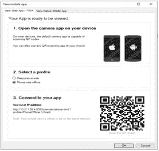

# PWA 及其在 Mendix 中的可用性

> 原文：<https://medium.com/mendix/pwa-and-its-usability-in-mendix-e09b82a2cc78?source=collection_archive---------0----------------------->

# 自从 Ajax 将静态页面转化为交互式动态用户体验以来，Web 开发已经发生了很大的变化。移动是推动这场革命的关键因素。我们使用移动设备的次数比台式电脑多，平均而言，移动用户花在本地应用上的时间比花在网络上的时间多。如果有人需要使用谷歌地图，作为一个本地应用程序访问它的好处超过了通过网络浏览器使用它。我们也知道其背后的原因，在主屏幕上显示它们，推送通知，以及其增加的可预测性在用户中获得了至高无上的地位。

但这并不意味着网络需要被忽视，我们必须完全转向原生应用。原生应用也有不好的一面，因为用户发现在空间、成本和存储方面存在困难。相比之下，手机用户每月访问 100 个网站。这就是 URL 的力量和网络的短暂性。

下图显示了本地和 web 应用程序在功能和范围方面的健壮性。

*Figure 1.1-Native Vs Web Apps*

现在，让我们考虑一下两者的利弊:

*   原生应用功能强大
*   网络应用是高度可及的

我在下面的图片中概述了更多的动机。

*Table 1.1-Listed Features-* *capability of Native and Web Applications*

## **什么是 PWA？**

如果我们需要一个结合了两者特性的应用程序，给用户带来原生的体验和网络的覆盖范围和安全性，那该怎么办？PWA 利用了两者的优点。它增加了用户体验，让用户感觉它是集成的，无需任何安装就能在设备主屏幕上获得一席之地。PWA 意味着从根本上提高您的端到端 UX 的质量。

在这篇博客中，我将介绍 PWA 的关键概念、使用的 pro 以及框架，最后是在 Mendix 中使用它的重要概念。所以，如果你正在研究这个概念，以及如何在 Mendix 平台中利用它，这个博客绝对适合你。

## **PWA 的演变及特点**

PWA 这个词在 2015 年出现，但对更好的移动 UI 的渴望并不是当代的。为了充分理解 PWA 标准的整个概念，我们需要探究其根源。

一般来说，PWA 是快速、可靠、集成和吸引人的，它具有以下特征。

**1。渐进式** -PWA 必须在任何设备上工作，并逐步增强，利用用户设备和浏览器上的任何可用功能。

**2。可发现的**——在搜索引擎中是可发现的。这是相对于原生应用的一个主要优势，原生应用在搜索能力上仍然落后于网站。

**3。可链接的**——作为从网站继承的另一个特征，一个设计良好的网站使用 URI 来指示应用程序的当前状态。这将使 web 应用程序能够在用户标记或共享应用程序的 URL 时保留或重新加载其状态。

**4。响应式**-渐进式网络适合设备的外形和屏幕尺寸

**5。类似应用程序的**-它看起来像一个本地应用程序，可以建立在应用程序外壳模型上，只需最少的页面刷新

**6。连接独立**-在低连接或离线区域工作(我们最喜欢的特性)

**7。移动应用程序用户更有可能重复使用他们的应用程序，而渐进式网络应用程序旨在通过推送通知等功能实现相同的目标**

**8。可安装的**-一个渐进式网络应用程序可以安装在设备的主屏幕上，使其随时可用

**9。新鲜的**-当新内容发布且用户连接到互联网时，该内容在应用程序中可用

**10。安全**——因为渐进式网络应用程序拥有更亲密的用户体验，而且因为所有网络请求都可以通过服务人员拦截，所以应用程序必须托管在 HTTPS 上，以防止中间人攻击

## **技术组件**

四个技术组件支持渐进式 web 应用程序功能。

**1)WEB 应用清单文件**

Web 应用清单——一个 [JSON 文件](https://www.copterlabs.com/json-what-it-is-how-it-works-how-to-use-it/)——是第一个赋予 progressive 应用原生外观和感觉的组件。通过清单，开发人员可以控制应用程序向用户显示的方式(即全屏模式，没有可见的 URL 栏)以及如何启动它。该文件允许开发人员为 web 应用程序的元数据找到一个集中的位置。该清单通常包含一个起始 URL、一个应用程序的全名和短名、图标链接以及图标的大小、类型和位置。开发者也可以为地址栏定义一个[闪屏](https://developers.google.com/web/updates/2015/10/splashscreen)和一个主题颜色。

*Fig 4.1-Google shows the features that Web App Manifest supports*

要应用这些设置，开发人员只需在所有网站页面标题中添加一个指向清单的链接。

**2)服务** **工人**

服务工作者是支持以下主要功能的另一个元素。

1.离线工作模式

2.背景同步

3.推送通知

它只在处理特定的事件时运行，并且它的生命周期很短。独立于 web 应用程序运行的 JS 文件将响应用户与应用程序的交互。

**3)应用外壳架构**

构建和维护 PWAs 需要将静态内容与动态内容分开。

*Fig 4.2 -Illustrates that the app shell is generally static, while the content can change*

因此，使用我们上面提到的应用程序外壳架构(这是 UI 的基础)是开发它们的唯一方法。应用程序外壳包含使应用程序在没有连接的情况下运行所需的核心设计元素。应用程序外壳方法特别适用于由一个页面和导航相对稳定或内容不变的应用程序组成的 JavaScript 密集型应用程序。

**4)传输层安全性(TLS)**

pwa 利用传输层安全(TLS)协议。TLS 是两个应用程序之间安全可靠的数据交换标准。数据的完整性要求通过 HTTPS 服务网站，并在服务器上安装 SSL 证书。

## **在 MENDIX 中启用 PWA 功能**

有办法创建 PWAs 及其重要的技术组件，其中它将由平台本身创建。Mendix 简化了 PWA 的创建，提供了上述功能作为导航配置文件本身的一部分。功能已添加到所有现有的 Web 配置文件中。此外，从 Mendix 版本 9 开始，添加了所有 web 配置文件的离线版本，以增强 PWA 功能。清单是由 Mendix 运行时自动生成的。部署到云时会自动生成服务工作者。可以在 deployment/web/service-worker . js 上找到，如下图所示。

*Fig 5.1-Service Worker File of a Sample Application*

## **离线导航配置文件**

通过从以下选项中选择一个导航配置文件，您可以创建需要互联网连接的离线 PWA 或 web 应用程序:

1.响应式 Web 脱机

2.电话网络离线

3.平板电脑网络离线

可以在导航配置文件中配置以下 PWA 功能

**允许“添加到主屏幕”提示**

这个选项可能会被要求添加到用户的主屏幕或桌面上，其行为会因浏览器而异。禁用此功能仍允许用户将应用程序添加到他们的主屏幕，但不会主动询问。

**发布为渐进式网络应用**

当检查并部署到云时，应用程序注册一个[服务工作者](https://developers.google.com/web/fundamentals/primers/service-workers)，这是 PWAs 的基础。离线导航配置文件启用了此选项。对于在线个人资料，它会给出一个关于差的互联网连接或没有互联网的自定义页面。它也可以通过将 offline.html 添加到主题文件夹来定制，并且它不应该通过网络加载任何其他资源，因为它在离线模式下被调用。

**预加载静态资源**

预加载发生在用户第一次访问应用程序时，这将使用户在导航应用程序时感觉更快。启用此选项会使应用程序在后台预加载一些静态内容，如小部件、页面和图像，这将提高性能。导航配置文件中可访问的所有页面和图像都由浏览器加载。然而，在开始阶段，它消耗更多的带宽和设备内部的存储。在离线配置文件中，此功能会自动启用，以允许应用程序完全离线运行。从安全角度来看，这种配置可能是不可取的，这取决于您的使用案例和需求。

# PWA 测试

为了能够全面测试 PWA 功能，该应用程序需要部署到云。这是因为服务人员仅在 HTTPS 的云中启用。

然而，PWA 也可以从机器(仿真器)或设备本身进行本地测试。

*Fig 7.1- Profiles that can be viewed in Mendix Platform (For machine level testing)*

也可以通过从设备扫描来查看，并且可以选择配置文件。这里将列出具有 web 浏览器功能的配置文件列表。

*Fig 7.2- Connecting Mendix PWA enabled App in device via scanning*

如果在装有 Parallels 的 Mac 上运行，请确保端口 8080(或您为应用程序配置的任何端口)被转发，并使用 Mac IP 而不是虚拟机的 IP。

Google Lighthouse 是一个可以用来衡量绩效的工具。Lighthouse 是一个开源的自动化工具，用于测量网页质量。它可以运行在任何网页上，公开或需要认证。谷歌灯塔审计网页的性能，可访问性和搜索引擎优化。

# 结论

我们已经分别看到了原生、web 和渐进式 web 应用程序的优点及其在 Mendix 中的应用。但都有自己在某些方面的局限性。选择取决于应用程序的用例及其要求。我希望这已经帮助你下定决心，这是最适合你的。如果你仍然不确定哪种方法适合你，下面的两个图表将会帮助你决定哪种配置文件适合你。

Fig 8.1- Native Vs. PWA

*Fig 8.2-Native, Web, PWA Comparison*

## 阅读更多信息:

*   [https://docs.mendix.com/refguide/progressive-web-app](https://docs.mendix.com/refguide/progressive-web-app)
*   https://www.mendix.com/mobile-architecture/
*   [https://www . mendix . com/evaluation-guide/app-capabilities/progressive-we B- apps/](https://www.mendix.com/evaluation-guide/app-capabilities/progressive-web-apps/)
*   [https://docs.mendix.com/releasenotes/studio-pro/9.0](https://docs.mendix.com/releasenotes/studio-pro/9.0)

*来自发布者-*

如果你喜欢这篇文章，你可以在我们的 [*媒体页面*](https://medium.com/mendix) *或我们自己的* [*社区博客网站*](https://developers.mendix.com/community-blog/) *找到更多类似的内容。*

*希望入门的创客可以注册一个* [*免费账号*](https://signup.mendix.com/link/signup/?source=direct) *，通过我们的* [*学苑*](https://academy.mendix.com/link/home) *获得即时学习。*

有兴趣加入我们的社区吗？你可以加入我们的 [*Slack 社区频道*](https://join.slack.com/t/mendixcommunity/shared_invite/zt-hwhwkcxu-~59ywyjqHlUHXmrw5heqpQ) *或者想更多参与的人，看看加入我们的* [*遇见 ups*](https://developers.mendix.com/meetups/#meetupsNearYou) *。*