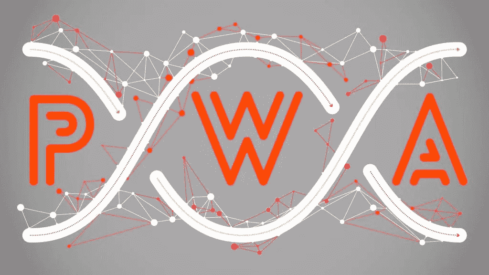
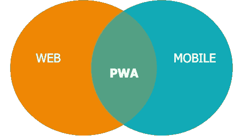
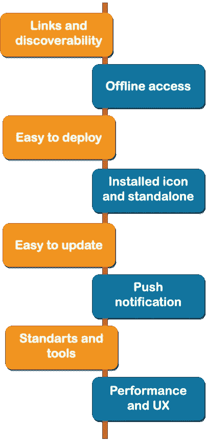
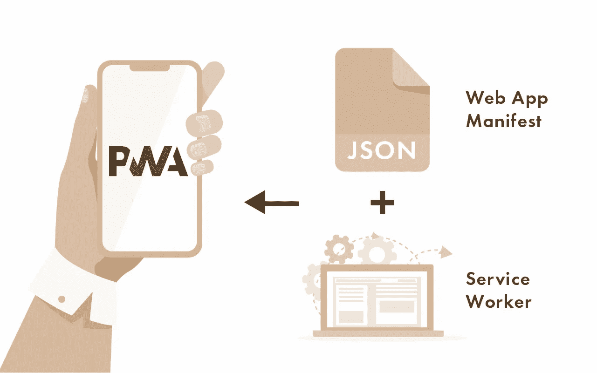
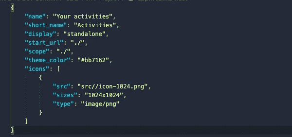
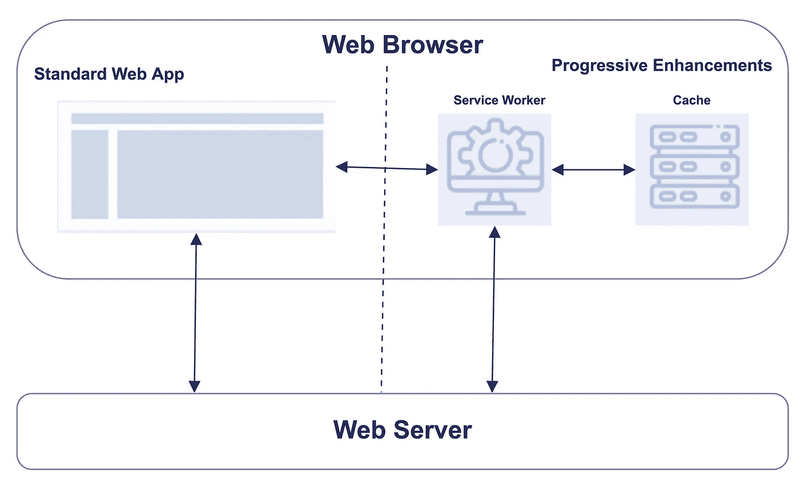
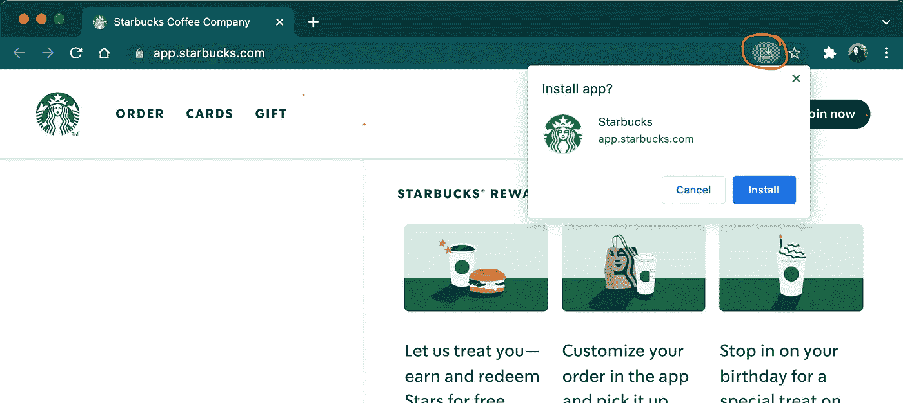
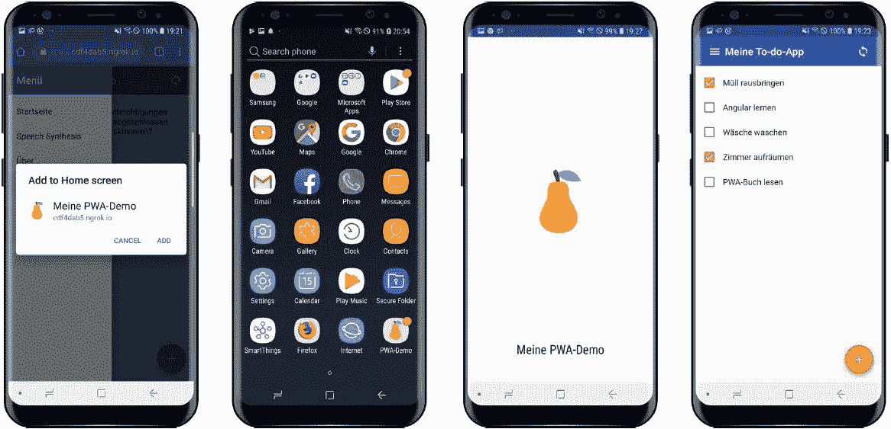
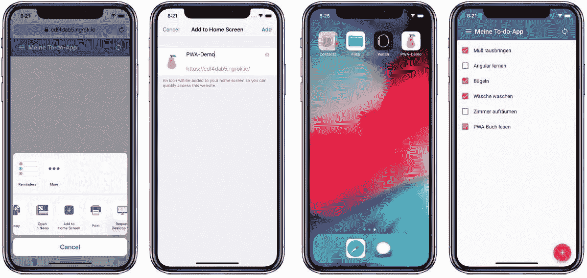
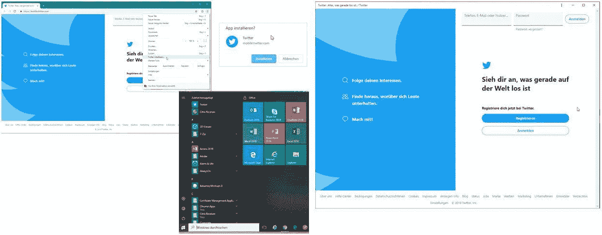

# PWA——结合移动和网络世界的精华

> 原文：<https://medium.com/quick-code/pwa-combining-the-bests-of-mobile-and-web-worlds-51d20d074a0?source=collection_archive---------3----------------------->

几年前我就听说过 ***渐进式网络应用*** 。我当时并没有对这个话题做太多的研究。我记得我曾经看过一篇文章，用类似这样的句子开始描述渐进式 Web 应用程序:“使用特殊编码技术开发的网站可以作为移动应用程序工作”。坦白地说，这句话，“特殊编码技术”的话明确地把我从那个话题上引开了。我记得我认为这可能需要不同的移动设备使用不同的编码语言。这种结构会带来太多的工作量，而且很难实施。

The DNA of Web and Mobile

上个月(2021 年 11 月)，我有机会参加了谷歌举办的 [Chrome Dev Summit](https://developer.chrome.com/devsummit/) 的一些学习休息室和研讨会。其中一个研讨会叫做“你的第一个渐进式网络应用”。根据我对其标题的理解，在本次研讨会的 3 小时时间内，我们将学习和开发一个可以作为移动应用程序工作的 web 应用程序，这意味着它可以安装在移动设备和操作系统上。我看不太可能，但还是报了名。然后我收到了一封注册确认邮件，上面说只需要 CSS、HTML 和 javascript 的基础知识就够了。但是，怎么会呢？这封邮件是说，除了最基本的网络技术，你不需要知道任何额外的东西。我对此更感兴趣，但在内心深处，我仍然认为他们会教授如何通过使用某种工具或第三方来捆绑 web 项目，并通过打包将其转换为本机应用程序。但是我大错特错了！

技术的重心是网络。将移动世界与网络无缝结合的最佳方式是渐进式网络应用。至少在更好的东西出来之前是最好的。🙂

> 注意:渐进式 Web 应用程序将以缩写 PWA 提及。

PWA 没有具体的技术定义。PWA 只是一个 web 应用程序，它使用一些渐进式扩展，在 web 平台中使用几个 web 浏览器 API 和功能。它更像是一套最佳实践和技术，允许您的用户在每个平台上使用相同的代码库，享受您的网站带来的出色的类似应用程序的体验。所以这不是说你有没有 PWA 更像是**你的网站或多或少是 PWA。**

Multiplatform support

渐进式网络应用程序是由谷歌作为一个名称引入的，被其他公司如 Firefox、Opera、微软、三星等采用。，并继续被使用。但当然不是苹果。即使苹果没有公开推广，pwa 也能在苹果设备上工作。实际上，这个想法是从苹果公司推出的独立应用程序中诞生的。后来，这个想法得到了加强，并以“渐进式网络应用”的名字变得更加流行。

# 移动和网络世界的精华

我喜欢使用这个例子的想法；数学的“两个集合的交集”。pwa 正是来自于网络和移动设备的交集，包含了每种设备的一些最佳特性。

***-来自网络世界-***

**链接和可发现性:**由于这是一个 web 应用程序，您可以使用链接在社交媒体平台上创建帖子，并分享您的应用程序的直接链接，您的应用程序也将在线提供，这意味着可以被搜索引擎发现。

**易于部署&更新:**在移动应用程序的部署和更新过程中工作量很大，是一个棘手的过程。然而，在 web 应用程序上部署要比移动应用程序容易得多。因为 web 应用程序意味着 web 服务器上有一些文件，以部署的名义唯一需要做的事情就是更新这些文件。为了能够部署移动应用程序，您需要遵循您要发布或更新应用程序的应用程序商店的步骤和限制，在应用程序商店上创建更改请求，并等待他们批准该更改请求(批准可能需要几个小时/几天)，即使您的部署顺利发布到应用程序商店，您的用户也需要去商店获取您共享的更新。

**标准和工具:**与常规的移动应用不同，PWAs 在 HTTPS 提供服务。因此，我们可以说，pwa 从网络世界获得了网络标准和工具的优势，并利用网络标准的力量确保了安全通信。

***-来自移动世界-***

**离线访问:**在移动原生应用中，即使没有互联网连接或可用的服务器，用户也能够启动和使用应用的一些部分(有时是全部)。离线访问正是产品负责人决定在 web 应用之外制作移动应用的原因。PWAs 为互联网访问受限的用户提供不间断的用户体验。

**已安装图标和单机:**就像手机 app 一样，PWAs 在移动设备的首页或桌面的应用列表上都有一个图标，安装后独立工作。

**推送通知:**推送通知也是移动世界的一个非常强大的功能。即使应用程序没有启动和运行，PWAs 也可以管理本地设备并向其发送通知。

**性能和 UX:** 移动应用的性能总是更好。因为移动应用程序在安装期间会在设备上存储非常大的数据。另外，当我们看一看调查结果时，很明显用户喜欢 UX 设计的移动应用程序胜过网络应用程序设计。

> 如果你正在使用谷歌浏览器，你一定在没有互联网连接的时候看到过这个页面。这种可爱但令人讨厌的恐龙叫做 Downasour。PWA 带来的最具突破性的东西是离线访问。所以我们告别了这种沮丧。

Google Chrome Downasour

# 没有互联网接入，网站如何运作？

本地应用可以在没有互联网连接的情况下打开，因为在下载和安装应用的过程中，应用的关键资源存储在设备中。这些资源可以根据您的移动应用程序的离线访问量来管理。这也正是 PWA 中发生的情况。

在我们深入了解细节和它的工作原理之前。最好解释一下 PWA 的面团里有什么。

pwa 不依赖于单个 API。有许多 web 技术可以用来创建渐进式 web 应用程序。

申请成为 PWA 的最低要求是:

1.  web 清单
2.  服务行业人员

这两个确保浏览器将解释这是一个 PWA，并为用户提供安装和提供其他 PWA 增强的能力。

# 清单文件

web app manifest 是一个 JSON 文本文件(通常命名为 *manifest.json* 或 *webmanifest.json* )。该文件包含下载和运行 PWA 的所有必要信息，就像本地应用程序一样。清单可以包含许多变量，所有变量都提供关于 PWA 本机行为的许多不同信息。

A basic manifest file example

# 服务行业人员

服务工作者是一个脚本，它允许管理缓存中的资产并拦截/控制来自 web 浏览器的网络请求。服务人员是用 JavaScript 写的。它是一个浏览器功能，它的作用不同于网站中常规的 JS 脚本，即。它无法访问 DOM。

The role of Service Worker

如图所示，标准 web 应用程序直接向 web 服务器发出请求，随着 web 的不断增强，服务人员充当 web 应用程序的网络代理。由于服务人员可以拦截网络请求并修改响应，因此在某种程度上，服务人员只需运行 **HTTPS** 即可确保其安全。

服务人员可以在后台同步数据、管理缓存、处理推送通知和拦截网络请求。事实上，他们还能够检查服务器的可用性，在缓存中存储内容，并将内容提供给 PWA 的 UI 部分。就像任何其他 web 工作者一样，服务工作者独立于 UI 上下文工作。

# **如何安装？**

由于 pwa 是多平台应用程序，因此根据您使用的设备和浏览器，有许多安装它们的方法。在 Chrome 中，如果你正在访问的应用程序是 PWA，你会在地址栏的右边看到一个小小的安装图标。在 iPhones 中，您只能使用 Safari 安装 PWA，打开工具栏菜单，然后点按“添加到主屏幕”按钮。

另外，你可以利用一些第三方把你的 PWA 变成一个可以发布在应用商店上的包。

Example of the installability of a PWA demo for Android on the home screen and splash Screen

Example of the installability of a PWA demo for iOS on the home screen and PWA runtime

Desktop Progressive Web Apps run in their own window, without tabs or an address bar

网上有很多很棒的 pwa。在接下来的几年里，这个数字只会越来越大。确保这项伟大的技术在你的雷达上！