# PyCharm 教程——用 PyCharm (IDE)编写 Python 代码的初学者指南

> 原文：<https://medium.com/edureka/pycharm-tutorial-d0ec9ce6fb60?source=collection_archive---------0----------------------->

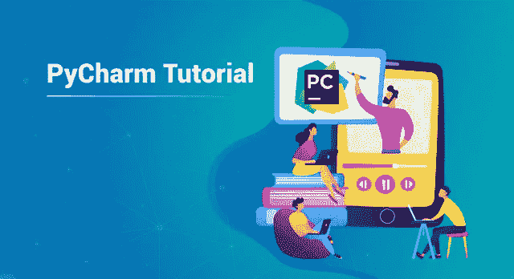

PyCharm Tutorial — Edureka

在当今快节奏的世界中，拥有超越其他程序员的优势可能是一件好事。利用 IDE 可以让程序员的生活变得非常轻松，并确保专注于推出更好的代码，而不用担心依赖性或许多其他因素。在这个 PyCharm 教程中，我将解释如何安装 PyCharm 和它非常酷的特性。

[Python](https://www.edureka.co/blog/python-tutorial?utm_source=medium&utm_medium=content-link&utm_campaign=pycharm-tutorial) 是一门极其流行的语言，使用非常广泛。在这篇 PyCharm 教程博客中，我将带您浏览以下主题:

*   什么是 IDE？
*   为什么需要 IDE？
*   Python 简介
*   Python 开发环境
*   PyCharm 简介
*   PyCharm 的重要工具和特性
*   PyCharm 实用演练
*   PyCharm 提示和技巧

让我们从了解 IDE 实际上是什么开始这篇文章。

# 什么是 IDE？

集成开发环境(IDE)是一种软件环境，用于使用编辑器和编译器等工具编写程序。由于各种原因，当用各种语言编码时，这可以被证明是一个非常有用的工具。

它是一个软件应用程序，结合了软件开发人员所需的所有功能和工具。它本质上是图形化的，这意味着它使用窗口和按钮等控件来显示信息和接受用户的输入。例如，工具可以包括:

*   **文本编辑器** —这是一个用于输入、排列和注释编程语言代码的窗口。
*   **一个项目编辑器**——这是一个窗口，列出了组成软件项目的所有文件。
*   **工具栏** —这是一组按钮，代表环境可以执行的功能。
*   **输出查看器** —这是一个窗口，显示环境在执行操作期间生成的任何消息。

使用 IDE 并不是一种强迫行为，但它让您的生活变得更加轻松，我相信当您读完这篇 PyCharm 教程博客后，您会同意这一点。

接下来，在本文中，让我们看看为什么我们需要使用 IDE。

# 为什么需要 IDE？

虽然您不一定需要 IDE 来编写程序，但是使用 IDE 所增加的功能非常有用。代码洞察是 IDE 所能提供的最有用的工具之一，它是程序解释所输入内容的能力。该程序可以改变文本颜色来表示不同的类、函数和变量。微软 Visual Studios 提供了一种叫做 IntelliSense 的东西，它也可以预测你正在键入什么，并为你完成你的话。其他 IDE 提供了一个类似的工具，叫做程序专有的东西。

集成开发环境的另一个特性是调试程序的能力。这可以说是部署一个成功的程序最重要的工具之一。测试至关重要，以确保您的用户不会遇到代码无法处理特定错误并导致程序崩溃的情况。调试使您能够运行整个程序，在指定的点停止代码以检查变量的值或其他需要的兴趣，以验证代码和函数是否按预期运行。

最后，IDE 提供的一些工具可以是资源管理和编译代码的能力。编写新程序时，通常会有许多不同的文件在特定的路径位置被引用，所以这些文件在正确的位置对程序的运行非常重要。使用 IDE 可以很容易地看到这些文件位置的可视化表示，并使用户更容易理解。

## **对 IDEs 的优势:**

*   **提高效率** —更快更省力的编码
*   **协作**——一群程序员可以很容易地在一个 IDE 中一起工作
*   **项目管理**——程序资源很容易

接下来，在这个 PyCharm 教程博客中，让我们快速介绍一下 Python。

# Python 简介

Python 是一种非常通用的语言。它有成千上万的库和模块可以使用。

就我个人而言，我认为与其他语言相比，使用 **Python** 非常有趣。它对初学者非常友好，这很重要，语法也很容易理解。作为一个初学者，当开始学习一门语言时，我认为这是非常重要的。

最重要的是，没有分号，对吗？

由于 [Python 及其大多数库](https://www.edureka.co/blog/python-libraries?utm_source=medium&utm_medium=content-link&utm_campaign=pycharm-tutorial)都是开源的，它在初创公司和行业中也获得了很大的吸引力。这无疑会在全球范围内带来数百万快乐的学习者。

所以你可能想知道为什么你应该考虑学习 **Python** 对吗？

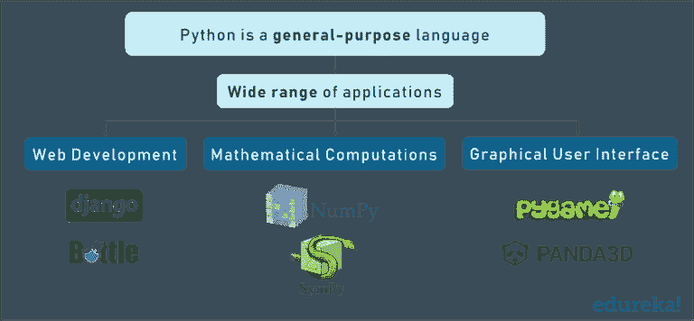

伙计们，它有如此广泛的应用，我不能把它都放在一个图像中！

从使用姜戈和瓶子的网络开发。使用 Numpy 进行数学计算，使用 Tkinter 设计自己的 GUI，使用 Pygame 制作自己的游戏等等。

在本文的下一部分，让我们看看所有可以用来编写 Python 代码的开发环境。

## **Python 开发环境**

Python 的另一个好处是有许多 ide 可供您使用。从 Eclipse、Notepad++到 Bluefish、Komodo 和 Vim，应有尽有。

看看下面的图片:

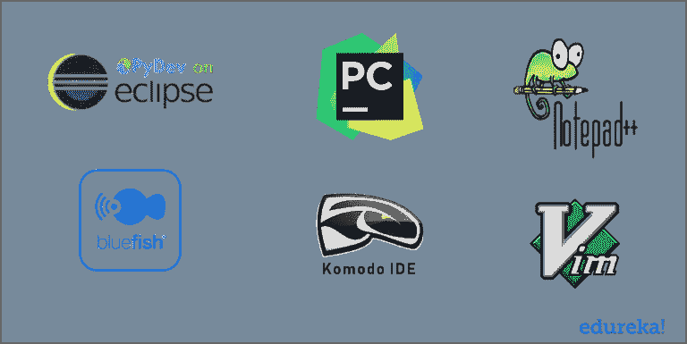

对这些 ide 的支持是巨大的，我的建议是你可以自己尝试一下，只要你觉得合适，就去使用它们。

在我看来，喜欢 IDE 就像喜欢冰激凌口味一样。你必须尝试一下，只有这样你才会意识到这是否适合你。

我个人倾向于 Pycharm，因为我喜欢它提供的每一个特性，在它里面编码的时候我感觉像在家里一样。

接下来，让我们看看 PyCharm 的简介。

# PyCharm 简介

如今，许多程序员选择 Python 来构建具有简洁、干净和可读代码库的软件应用程序。他们甚至可以通过利用大量的 Python 集成开发环境(ide)来加速定制软件应用程序的开发。


JetBrains 开发了 PyCharm 作为 Python 的跨平台 IDE。除了支持 Python 的 2.x 和 3.x 版本，PyCharm 还兼容 Windows、Linux 和 macOS。同时，PyCharm 提供的工具和特性可以帮助程序员快速高效地用 Python 编写各种软件应用。

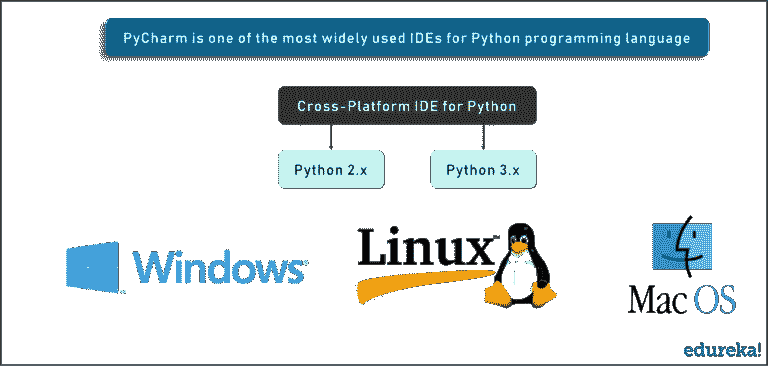

开发人员甚至可以根据他们的特定需求和偏好定制 PyCharm UI。此外，他们可以通过从 50 多个插件中选择来扩展 IDE，以满足复杂的项目需求。

PyCharm 是 Python 编程语言最广泛使用的 ide 之一。目前，Python IDE 正在被 Twitter、Pinterest、HP、Symantec 和 Groupon 等大型企业使用。


# 安装 PyCharm

安装 PyCharm 非常简单明了。使用此链接前往官方网站:【www.jetbrains.com/pycharm/download/#section=windows 

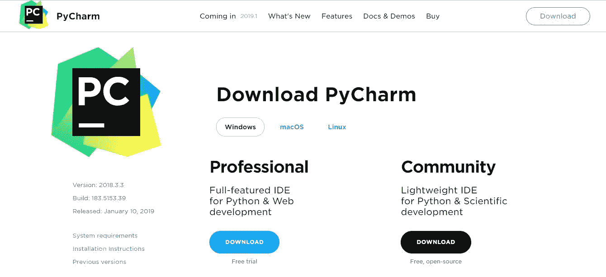

在这里，社区版是免费的，但对于专业版，你需要购买许可证。我将开发 PyCharm 社区版本，对于初学者和中级程序员来说，这已经足够了。但是如果你是一个专业的程序员，并且想完全利用 IDE，那么就用专业版吧。

在这篇文章的下一部分，让我们看看 PyCharm 的重要工具和特性。

# PyCharm 的重要特性和工具

PyCharm 为用户提供了许多特性和工具来简化编码过程。

以下是一些在竞争和易用性方面脱颖而出的主要功能:

*   代码编辑器
*   代码导航
*   重构
*   支持流行的网络技术
*   支持流行的 Python Web 框架
*   支持 Python 科学库

现在让我们来详细了解一下这些特性:

## 代码编辑器

PyCharm 提供的智能代码编辑器使程序员能够编写高质量的 Python 代码。该编辑器使程序员能够通过配色方案轻松阅读代码，自动在新行上插入缩进，选择合适的编码风格，并利用上下文感知的代码完成建议。

同时，程序员还可以使用编辑器将代码块扩展为表达式或逻辑块，利用代码片段，格式化代码库，识别错误和拼写错误，检测重复代码，以及自动生成代码。此外，编辑器使开发人员在编写代码时更容易分析代码和识别错误。

## 代码导航

PyCharm 提供的智能代码导航选项可以帮助程序员编辑和改进代码，而无需花费额外的时间和精力。IDE 使程序员更容易找到类、文件和符号，以及从引用中调用的定位声明。

用户甚至可以几乎立即在源代码、代码片段、UI 元素或用户操作中找到一个项目。他们可以进一步定位各种符号的用法，并在代码中设置书签。同时，开发人员甚至可以利用代码导航特性，在镜头模式下仔细检查代码。

## 重构

PyCharm 使开发人员更容易快速有效地实现局部和全局更改。开发人员甚至可以在编写普通 Python 代码和使用 Python 框架时利用 IDE 提供的重构选项。他们可以利用重命名和移动来重构文件、类、函数、方法、属性、参数和局部/全局变量。

同样，它们可以通过提取变量、字段、常量和参数来提高代码质量。同样，PyCharm 允许程序员通过 extract 方法分解更长的类和方法。

## 支持流行的网络技术

PyCharm 使程序员更容易用 Python 编写各种 web 应用程序，支持广泛使用的 web 技术，如 HTML、CSS、 [JavaScript](https://www.edureka.co/blog/what-is-javascript/?utm_source=medium&utm_medium=content-link&utm_campaign=pycharm-tutorial) 、TypeScript 和 CoffeeScript。web 开发人员可以使用 IDE 提供的实时编辑预览选项，在编辑器和浏览器中同时查看单个网页。

同时，IDE 提供的实时编辑功能使程序员能够在 web 浏览器上即时看到对代码所做的更改。PyCharm 还允许开发人员使用 JavaScript 调试器以及 CoffeeScript 和 TypeScript 编辑器。它甚至通过支持 AngularJS 和 NodeJS 简化了同构 web 应用程序开发。

## 支持流行的 Python Web 框架

除了支持常用的 web 技术，PyCharm 还为像 Django 这样健壮的 Python web 框架提供一流的支持。开发人员可以使用 IDE 来利用 Django 标签、过滤器、参数和模板变量的代码完成建议。此外，他们可以通过参考快速文档来收集关于标签和过滤器的附加信息。

Python IDE 甚至帮助 web 开发人员调试 Django 模板、格式化代码、验证代码和管理。py 控制台。同时，PyCharm 还支持广泛使用的 Python web 框架，如 Pyramid 和 Web2Py。它提供了特定于金字塔的代码完成和导航选项。同样，它允许 web 开发人员在使用 Web2Py 时利用代码完成和导航选项。

## 支持 Python 科学库

PyCharm 进一步帮助程序员在大数据和数据科学项目中更高效地使用 Python。它支持一些广泛使用的 Python 科学库——NumPy、Anaconda 和 Matplotlib。通过利用 IDE 提供的交互式图形、深入的代码洞察和数组查看器，开发人员可以高效地使用这些科学库。

他们甚至可以运行 PyCharm 提供的 REPL Python 控制台，以利用强大的功能，如动态语法检查和代码检查。同时，程序员还可以将 IDE 与 IPython Notebook 无缝集成，从而创建创新的解决方案，而无需投入额外的时间和精力。

现在让我们来谈谈让 PyCharm 占上风的不同工具:

*   数据库工具
*   可视调试器
*   内置终端
*   软件测试
*   远程开发能力

现在，让我们稍微详细地看一下其中的每一项。让我们从数据库工具开始:

***数据库工具***

除了支持各种 Python 库和框架之外，PyCharm 还允许开发人员使用许多关系数据库，包括 Oracle、SQL Server、MySQL 和 PostgreSQL。开发人员可以进一步使用 IDE 来运行查询、编辑 SQL 代码、浏览数据、更改表数据以及更改/分析模式。

PyCharm 进一步支持 SQLAlchemy 库，将 SQL 代码注入到用各种编程语言编写的代码中。IDE 的专业版进一步简化了开发人员通过数据网格高效处理大量数据的工作。

***可视化调试器***

IDE 提供的可视化调试器帮助程序员调试 Python、JavaScript 和 Django 代码。开发人员可以使用内联调试器直接在编辑器上查看实时调试数据。同样，他们可以同时调试多个 Python 进程，并绕过库单步调试代码。

PyCharm 还为每个测试脚本或调试器执行创建了一个可重用和可定制的配置。用户甚至可以选择通过集成可视调试器和远程解释器来简化远程调试。

***内置端子***

PyCharm 附带用于 Windows、Linux 和 macOS 的本地终端。内置的终端使程序员能够在不离开 IDE 的情况下继续编码和测试。此外，程序员可以使用 IDE 运行 Python 文件，并根据精确的项目需求配置定制的 Python 环境。

同时，他们可以直接在 IDE 中运行交互式 Python 或 Django consoled。该控制台提供了一些有用的功能，如代码完成、自动大括号匹配和动态语法更改。程序员甚至可以选择将控制台与本地和远程解释器集成在一起。

***软件测试***

像其他 ide 一样，PyCharm 也附带了一些特性和工具来简化 Python 应用程序测试。它允许开发人员通过流行的 Python 测试框架(如 Nose、Attest 和 Doctests)来执行单元测试。测试人员甚至可以选择运行单个或者多个测试文件和测试类。他们可以进一步将 IDE 与 Coverage.py 集成，以便在测试应用程序时测量代码覆盖率。

在测试多线程应用程序时，测试人员可以使用 IDE 提供的线程并发可视化选项来全面高效地控制应用程序。同时，PyCharm 通过实现行为驱动开发(BDD)使用户能够交付高质量的软件。

***远程开发能力***

PyCharm 允许开发人员连接各种机器并远程构建软件应用程序。程序员可以利用 IDE 提供的内置 SSH 控制台连接到机器，并通过 SSH 远程执行各种开发任务。他们甚至可以通过用远程解释器替换本地解释器，在远程环境中运行、调试和分析 Python 应用程序。

此外，PyCharm 使程序员能够通过一个健壮的工具(如 vagger)创建可复制的开发环境，并通过 [Docker](https://www.edureka.co/blog/docker-explained?utm_source=medium&utm_medium=content-link&utm_campaign=pycharm-tutorial) 简化分布式应用程序开发。用户甚至可以选择将 PyCharm 与问题跟踪系统无缝集成。

接下来，在这个 PyCharm 教程博客上，让我们看看如何实际使用 PyCharm。

# PyCharm 实用演练

知道它提供了什么就够了，现在让我们深入 Pycharm，我将带您浏览一下它的界面。

让我们从创建一个新项目开始。一打开它，PyCharm 就用下面的图片向您打招呼:


在这里，在左边，你可以查看我最近参与的所有项目。但是如果这是你第一次使用 PyCharm，那么左边的列不会包含任何内容。

创建一个新项目就像点击**创建新项目**标签一样简单。

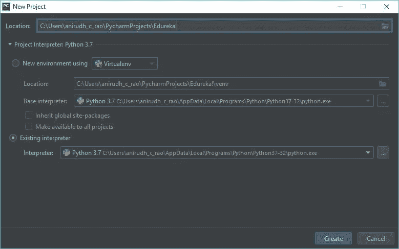

这张图片基本上帮助我们设置了 Python 解释器。但是，如果您的系统上没有安装 Python，这可能是空白的。

要安装 Python，请使用官方文档进行安装，或者按照如下所示的说明进行操作:


点击右边的小齿轮图标将显示以下页面:


在这里，如果没有单独安装 Python，可以使用系统解释器。一定要检查 Python 安装的版本，使其符合您的要求。

我安装了多个版本的 Python，但对于这个例子，我一直使用 Python 3.7，正如你从上图中看到的。

这一步之后基本上就是通过打开**文件- >创建- >暂存文件- > Python 文件**来创建一个暂存文件

一旦您完成了这个过程，PyCharm 将显示一个空白屏幕和一个草稿文件供您编写代码。

查看以下截图供您参考:

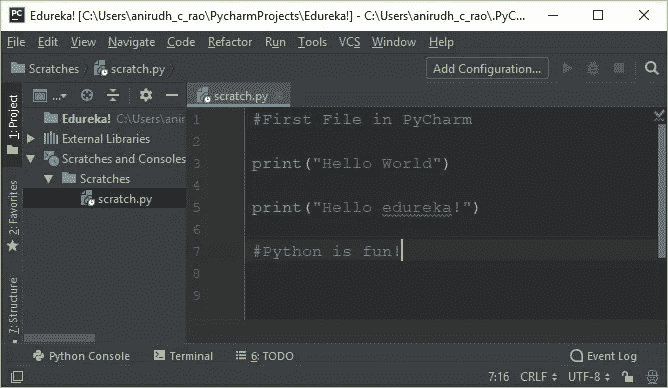

在这里，我打出了所有代码的黄金标准 hello world 程序！

但是，如果您需要执行这个程序，您必须向该程序添加一个有效的配置。

## **如何在 PyCharm 中给项目添加配置？**

看看下面的图片。这是从暂存文件屏幕点击**添加配置**的结果。

在这里，您应该向配置添加一个名称——在本例中，它是 **ConfigName** ,但是它可以是您要求的任何名称。

**脚本路径**表示暂存文件的路径，简单来说就是同一目录下的文件位置。

如前所述，我们可以在此时选择并设置**项目解释器**。

最后一步是点击**应用**并关闭窗口，配置被添加和设置。很简单，对吧？

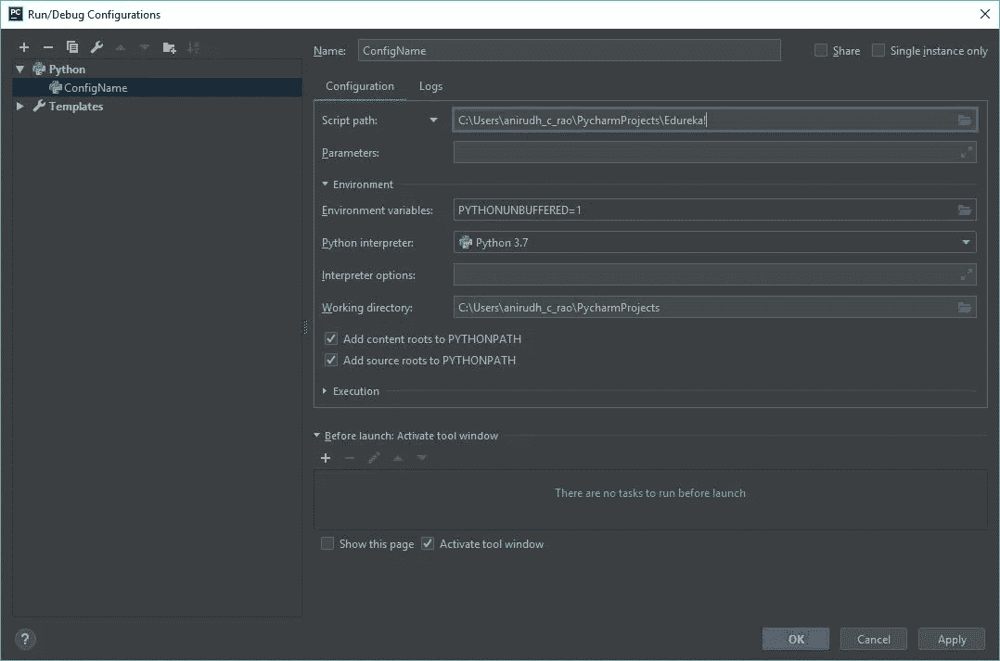

因此，在设置好配置之后，您就可以执行代码了。

让我们运行我们的示例并检查输出。

```
#First File in PyCharm

print("Hello World")
print("Hello edureka!")

#Python is fun!
```

现在，检查从 PyCharm 执行程序后的输出。

**输出:**

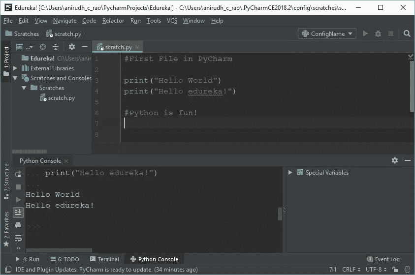

从上面的截图中可以看出，我们在 **Python 控制台中获得了正确的输出。**

## PyCharm 调试器

用 PyCharm 调试是一件容易的事情。要设置断点，您只需单击代码的左侧，就会出现一个点。

如下图所示。您可以根据需要设置任意数量的断点，并分解和执行代码。

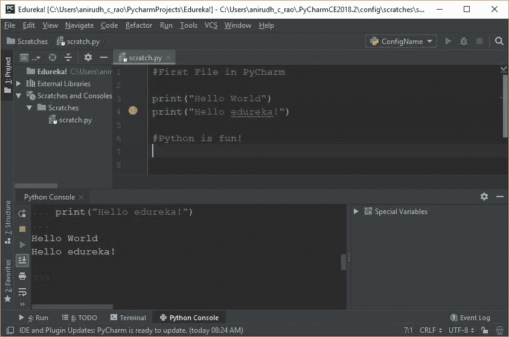

您还可以使用 **Watch** 选项来检查哪些值被输入到哪些变量中。这绝对是一个很大的优势，当与内联调试器一起使用时，它为任何程序员增加了巨大的优势。

总的来说，这有助于增加可读性和文档，同时使调试和测试过程变得非常容易。

接下来，在这篇 PyCharm 教程博客中，让我们看看一些简单的技巧和窍门，你可以在使用 PyCharm 时加以利用。

# PyCharm 提示和技巧

使用 PyCharm 编码时，您可以利用许多技巧和窍门。为了简单起见，我将保持它对初学者非常友好，这样你们大多数读者可以直接联系到内容。

## 复制代码行:

复制一行或一组行就像选择行然后按下 **Ctrl + D** 一样简单。这可确保在选择后立即将所选行复制到新行上。请注意，缩进将与原始行相同。

在 Ctrl + D 之前:


在 Ctrl + D 之后:

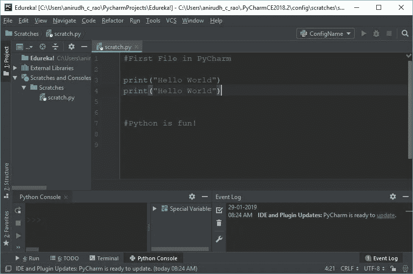

## 跟踪对文件的更改:

您可以使用键盘快捷键 **Alt + Shift + C.** 来跟踪和追溯对文件和整个项目的更改，这可以确保一定程度的可读性以及了解最近的更改，从而帮助您更清楚地了解项目的生命周期。

看看下面的图片:

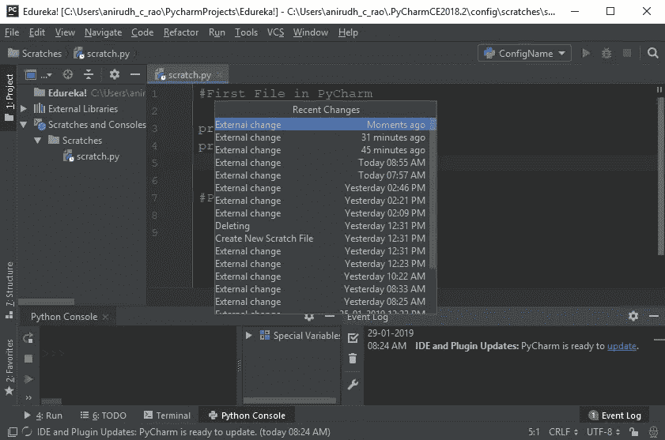

## 重构:

假设你有一个名为“x”的变量，你在程序中使用了大约 100 次，突然你决定“x”必须变成“y”。常规的方法是找到每个 x，然后用 y 来改变它，对吗？其实不是！

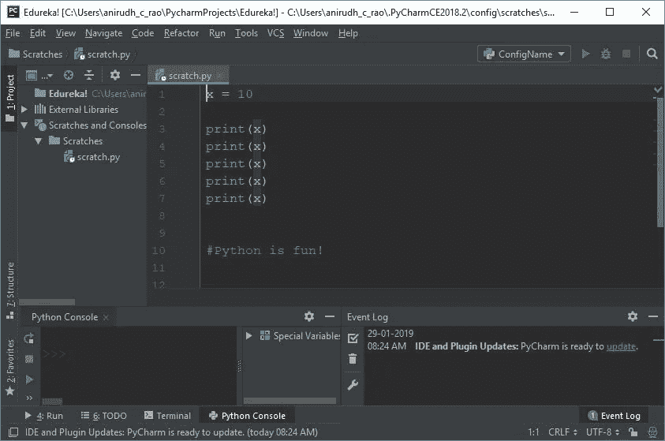

PyCharm 支持一种智能重构技术，在这种技术中，您只需要知道是否选择该变量并选择重构设置。如果您一次更改它，那么只需单击一下，该变量的所有出现都会更改。最大的优点是，这对于一定范围内的变量也非常适用。


这是在重构之后，只需点击一下鼠标就可以改变变量和范围内的一切。很大的优势，对吧？

## 智能打字:

类似于微软的 Visual Studio 中的 Intellisense，PyCharm 也支持智能类型。如果 IDE 有机会对您接下来可能键入的内容进行有效猜测，它可以确保您不必键入所有内容。

看看下面的图片:


## 列选择:

按住 Alt 键并滚动选择某段代码将只选择该特定列中的所有内容。这可用于更快的压痕或快速改变压痕。但是，它也用于编辑同一列中的多个语句，从而减少手动编辑的时间和工作量。

为了更清楚地了解选择，请查看下图:

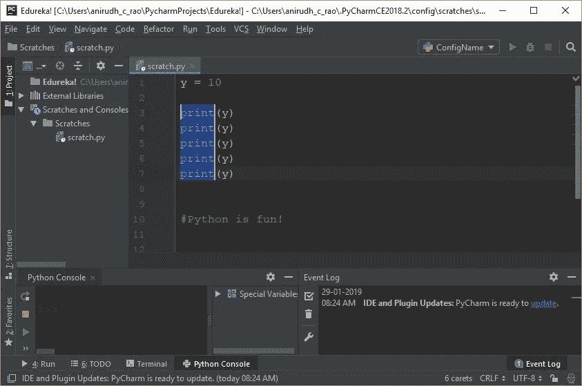

本 Pycharm 教程中讨论的概念应该有助于您使用 PyCharm 快速高效地构建 Python 代码。

当您试图使用 PyCharm IDE 创建一个 Python 程序时，这将非常方便，PyCharm IDE 为您提供了许多优势。这种优势将确保您可以在整体上更加专注于代码。这很可能是你掌握 Python 的第一步。

在阅读了 PyCharm 教程上的这篇博客后，我很确定你想了解更多关于 Python 的知识。如果你想查看更多关于人工智能、DevOps、道德黑客等市场最热门技术的文章，你可以参考 Edureka 的官方网站。

请留意本系列中的其他文章，它们将解释 Python 和数据科学的各个方面。

> 1. [Python 教程](/edureka/python-tutorial-be1b3d015745)
> 
> 2. [](/edureka/python-functions-f0cabca8c4a) [Python 编程语言](/edureka/python-programming-language-fc1015de7a6f)
> 
> 3. [Python 函数](/edureka/python-functions-f0cabca8c4a)
> 
> 4.[Python 中的文件处理](/edureka/file-handling-in-python-e0a6ff96ede9)
> 
> 5. [](/edureka/scikit-learn-machine-learning-7a2d92e4dd07) [Python Numpy 教程](/edureka/python-numpy-tutorial-89fb8b642c7d)
> 
> 6. [Scikit 学习机器学习](/edureka/scikit-learn-machine-learning-7a2d92e4dd07)
> 
> 7.[蟒蛇熊猫教程](/edureka/python-pandas-tutorial-c5055c61d12e)
> 
> 8. [Matplotlib 教程](/edureka/python-matplotlib-tutorial-15d148a7bfee)
> 
> 9. [Tkinter 教程](/edureka/tkinter-tutorial-f655d3f4c818)
> 
> 10.[请求教程](/edureka/python-requests-tutorial-30edabfa6a1c)
> 
> 11. [PyGame 教程](/edureka/pygame-tutorial-9874f7e5c0b4)
> 
> 12. [OpenCV 教程](/edureka/python-opencv-tutorial-5549bd4940e3)
> 
> 13.[用 Python 进行网页抓取](/edureka/web-scraping-with-python-d9e6506007bf)
> 
> 14.[机器学习教程](/edureka/machine-learning-tutorial-f2883412fba1)
> 
> 15.[Python 中从头开始的线性回归算法](/edureka/linear-regression-in-python-e66f869cb6ce)
> 
> 16.[用于数据科学的 Python](/edureka/learn-python-for-data-science-1f9f407943d3)
> 
> 17. [Python 正则表达式](/edureka/python-regex-regular-expression-tutorial-f2d17ffcf17e)
> 
> 18.[Python 中的循环](/edureka/loops-in-python-fc5b42e2f313)
> 
> 19. [Python 项目](/edureka/python-projects-1f401a555ca0)
> 
> 20.[机器学习项目](/edureka/machine-learning-projects-cb0130d0606f)
> 
> 21.[Python 中的数组](/edureka/arrays-in-python-14aecabec16e)
> 
> 22.[Python 中的集合](/edureka/sets-in-python-a16b410becf4)
> 
> 23.[Python 中的多线程](/edureka/what-is-mutithreading-19b6349dde0f)
> 
> 24. [Python 面试问题](/edureka/python-interview-questions-a22257bc309f)
> 
> 25. [Java vs Python](/edureka/java-vs-python-31d7433ed9d)
> 
> 26.[如何成为一名 Python 开发者？](/edureka/how-to-become-a-python-developer-462a0093f246)
> 
> 27. [Python Lambda 函数](/edureka/python-lambda-b84d68d449a0)
> 
> 28.[网飞如何使用 Python？](/edureka/how-netflix-uses-python-1e4deb2f8ca5)
> 
> 29.[Python 中什么是 Socket 编程](/edureka/socket-programming-python-bbac2d423bf9)
> 
> 30. [Python 数据库连接](/edureka/python-database-connection-b4f9b301947c)
> 
> 31. [Golang vs Python](/edureka/golang-vs-python-5ac32e1ef2)
> 
> 32. [Python Seaborn 教程](/edureka/python-seaborn-tutorial-646fdddff322)
> 
> 33. [Python 职业机会](/edureka/python-career-opportunities-a2500ce158de)

*原载于 2019 年 2 月 7 日*[*www.edureka.co*](https://www.edureka.co/blog/pycharm-tutorial)*。*