# 在 Python 中使用 PyGame 开发游戏

> 原文：<https://medium.com/edureka/pygame-tutorial-9874f7e5c0b4?source=collection_archive---------0----------------------->

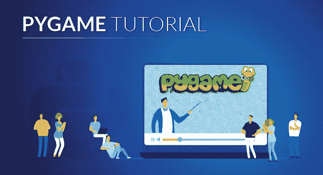

PyGame Tutorial - Edureka

PyGame 教程文章将重点介绍如何使用这个 Python 库构建简单的游戏。

以下是本文涵盖的主题:

1.  先决条件
2.  安装 PyGame
3.  简单的 PyGame 应用程序
4.  交互性
5.  添加功能
6.  添加图像
7.  使用声音
8.  几何图形
9.  字体和文本
10.  输入模型
11.  场景逻辑

# 先决条件

要制作一个你选择的游戏，有 3 个主要问题需要回答。它们如下:

1.  你想做什么样的游戏？
2.  你想用哪种语言编程？
3.  你想在什么样的平台上部署你的游戏？

大多数情况下，您可以回答这些问题中的每一个，并找到符合您需求的完美框架。其他时候，这可能是不可能的。例如，考虑一下，没有多少 HTML5 框架允许您编写一个可以构建的高性能 3D 游戏。

对于 PyGame，我们假设您对前 3 个问题给出了以下答案:

*   您想要创建的游戏是图形的，而不是 3D 的。
*   你想用 Python 编程。此外，您已经了解了一点 Python
*   您希望创建一个可以包装在独立可执行文件中的客户端应用程序。

因此，本文接下来让我们看看如何设置 PyGame。

# 安装 PyGame

安装 PyGame 非常简单明了。但首要前提是安装 Python 2.7。在 Windows 和 Linux 上安装 Python 非常容易和简单。

下一步是下载官方的 PyGame 安装程序，运行相应的文件，并按照屏幕上的说明操作。

安装很简单。只要照着做，默认设置被认为是好的。

我个人使用 [PyCharm](https://www.edureka.co/blog/pycharm-tutorial?utm_source=medium&utm_medium=content-link&utm_campaign=pygame-tutorial) 并在那里安装所有这些附加组件，并使用它来满足我的 Python 需求。只需使用您觉得合适的 IDE，并从它开始。

# 简单的 PyGame 应用程序

下面是一个使用 PyGame pipeline 构建的非常简单的应用程序。看看这个:

```
import pygame

pygame.init()
screen = pygame.display.set_mode((400, 300))
done = False

while not done:
        for event in pygame.event.get():
                if event.type == pygame.QUIT:
                        done = True

        pygame.display.flip()
```

在这里，您可以更好地理解语法:

> **导入 pygame** —这当然需要访问 pygame 框架。
> 
> **pygame.init()** —初始化 pygame 所需的所有模块。
> 
> **py game . display . set _ mode((width，height))** —这将启动一个所需大小的窗口。返回值是一个表面对象，它是您将在其上执行图形操作的对象。
> 
> **pygame.event.get()** —清空事件队列。如果你不调用这个，windows 消息将开始堆积，你的游戏在操作系统看来将变得没有反应。
> 
> pygame。退出 —这是当您单击窗口角落的关闭按钮时触发的事件类型。
> 
> **py game . display . flip()**—py game 是双缓冲的，所以它会交换缓冲区。你需要知道的是，为了让你对游戏屏幕的任何更新变得可见，这个调用是必需的。

那么当我们执行上面的代码时，输出是什么样的呢？它看起来像这样:

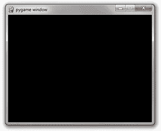

看起来很普通，对吧？让我们开始在屏幕上添加一些内容。我们可以从画一个长方形开始。这很简单，为此我们使用了 **pygame.draw.rect** 。

可以想象，这会画出一个长方形。它接受几个参数，包括要绘制的表面、颜色和矩形的坐标/尺寸。

```
# Add this somewhere after the event pumping and before the display.flip()
pygame.draw.rect(screen, (0, 128, 255), pygame.Rect(30, 30, 60, 60))
```

如您所见，有 3 个参数:

> 第一个参数是要绘制矩形的表面实例。
> 
> 第二个参数是(红、绿、蓝)元组，它表示要绘制的颜色。
> 
> 第三个论点是一个智力游戏。矩形实例。这个构造函数的参数是左上角的 x 和 y 坐标、宽度和高度。

那么，在添加了那小段代码之后，我们能看到什么呢？

这是输出结果:

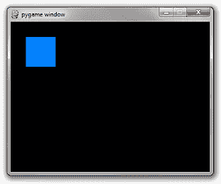

似乎还没什么新奇的。但我们总能从某个地方开始，对吧？

因此，接下来在这篇文章中，让我们看看如何才能使游戏更具互动性。

# 交互性

一个游戏的意义在于互动。现在，你唯一能与之互动的是关闭按钮。这不是一个非常有趣的游戏，对不对？所有用户输入事件都来自事件队列。只需在 for 循环中添加更多 if 语句来增加交互性。

在循环之前添加以下代码:

```
is_blue = True
```

修改矩形代码以有条件地选择颜色:

```
if is_blue: color = (0, 128, 255)
else: color = (255, 100, 0)
pygame.draw.rect(screen, color, pygame.Rect(30, 30, 60, 60))
```

最后，重要的一点。将下面的 if 语句添加到 for 循环中，添加顺序与其他 if 语句相同。

```
**if** event.type **==** pygame.KEYDOWN **and** event.key **==** pygame.K_SPACE:
    is_blue **=** **not** is_blue
```

所以按空格键会改变盒子的颜色。请参考下面的输出。

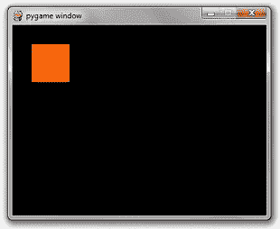

很简单，对吧？接下来，在这篇文章中，我们需要看看我们如何可以添加一些功能到游戏中。

# 添加功能

所以，我们的整个代码现在看起来像这样。请查看以下内容:

```
import pygame

pygame.init()
screen = pygame.display.set_mode((400, 300))
done = False
is_blue = True
x = 30
y = 30

while not done:
        for event in pygame.event.get():
                if event.type == pygame.QUIT:
                        done = True
                if event.type == pygame.KEYDOWN and event.key == pygame.K_SPACE:
                        is_blue = not is_blue

        pressed = pygame.key.get_pressed()
        if pressed[pygame.K_UP]: y -= 3
        if pressed[pygame.K_DOWN]: y += 3
        if pressed[pygame.K_LEFT]: x -= 3
        if pressed[pygame.K_RIGHT]: x += 3

        if is_blue: color = (0, 128, 255)
        else: color = (255, 100, 0)
        pygame.draw.rect(screen, color, pygame.Rect(x, y, 60, 60))

        pygame.display.flip()
```

让我们检查一下将矩形向右移动时的输出:

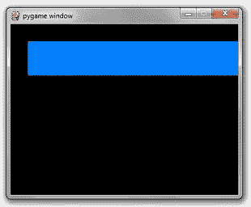

所以这不是我们所期待的，对吗？

有两件事是错的。

> 每次绘制矩形时，前一帧中的矩形都会保留在屏幕上。
> 
> 它移动得非常非常快。

对于第一种情况，你只需要在画矩形之前将屏幕重置为黑色。在 Surface 上有一个叫做 fill 的简单方法可以做到这一点。它接受一个 RGB 元组。

```
screen.fill((0, 0, 0))
```

其次，每一帧的时长是你超级花哨的电脑能做到的最短。帧速率需要被限制在相同的数量，例如每秒 60 帧。幸运的是，pygame.time 中有一个简单的名为 Clock 的类可以帮我们做到这一点。它有一个名为 tick 的方法，接受所需的 fps 速率。

```
clock = pygame.time.Clock()

...
while not done:

    ...

    # will block execution until 1/60 seconds have passed 
    # since the previous time clock.tick was called. 
    clock.tick(60)
```

将所有这些放在一起，您会得到:

```
import pygame

pygame.init()
screen = pygame.display.set_mode((400, 300))
done = False
is_blue = True
x = 30
y = 30

clock = pygame.time.Clock()

while not done:
        for event in pygame.event.get():
                if event.type == pygame.QUIT:
                        done = True
                if event.type == pygame.KEYDOWN and event.key == pygame.K_SPACE:
                        is_blue = not is_blue

        pressed = pygame.key.get_pressed()
        if pressed[pygame.K_UP]: y -= 3
        if pressed[pygame.K_DOWN]: y += 3
        if pressed[pygame.K_LEFT]: x -= 3
        if pressed[pygame.K_RIGHT]: x += 3

        screen.fill((0, 0, 0))
        if is_blue: color = (0, 128, 255)
        else: color = (255, 100, 0)
        pygame.draw.rect(screen, color, pygame.Rect(x, y, 60, 60))

        pygame.display.flip()
        clock.tick(60)
```

那么现在的输出是什么样的呢？参考下文。

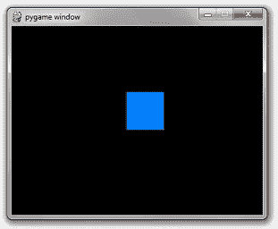

接下来在这篇文章中，我们将看到我们如何处理图像，以及如何将它们整合到我们的游戏中。

# 添加图像

您可以通过简单地调用带有宽度和高度元组的表面构造函数来实例化空白表面。

```
surface = pygame.Surface((100, 100))
```

这将创建一个 100 x 100 像素的空白 24 位 RGB 图像。默认颜色是黑色。在白色背景上 blit 这样的图像将导致以下结果:

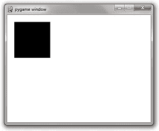

但是，如果需要 32 位 RGBA 图像，也可以在表面构造函数中包含一个可选参数。只需在代码中添加下面一行:

```
surface = pygame.Surface((100, 100), pygame.SRCALPHA)
```

这将创建一个初始化为透明的 100 x 100 的图像。在白色背景上渲染这样的图像将导致:

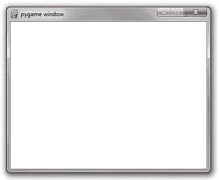

纯色图像和矩形不是很有趣。让我们使用一个图像文件:

考虑一个球的 PNG 图像。文件名为“ball.png”。这是图像，


要从文件中加载图像，只需简单调用 pygame.image.load()

检查以下语法:

```
image = pygame.image.load('ball.png')
```

取代了 pygame。使用上述代码的 Surface((100，100))代码将产生如下输出。

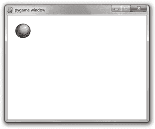

不要在游戏循环中对同一个图像重复使用 pygame.image.load。这不是一种有效的编码方式。最好的方法是只初始化一次，以后可以多次使用。

您可以做的最好的事情是在一个集中的位置创建一个从字符串到表面的字典。然后编写一个名为 get_image 的函数，它接受一个文件路径。如果图像已经被加载，那么它返回初始化的图像。

如果没有，它进行初始化。它的优点是速度快，而且在游戏逻辑的关键区域开始时，它消除了初始化图像的混乱。您还可以使用它来集中不同操作系统的目录分隔符的抽象。但是一段代码胜过千言万语。

以下是代码片段:

```
import pygame
import os

_image_library = {}
def get_image(path):
        global _image_library
        image = _image_library.get(path)
        if image == None:
                canonicalized_path = path.replace('/', os.sep).replace('\\', os.sep)
                image = pygame.image.load(canonicalized_path)
                _image_library[path] = image
        return image

pygame.init()
screen = pygame.display.set_mode((400, 300))
done = False
clock = pygame.time.Clock()

while not done:
        for event in pygame.event.get():
                if event.type == pygame.QUIT:
                        done = True

        screen.fill((255, 255, 255))

        screen.blit(get_image('ball.png'), (20, 20))

        pygame.display.flip()
        clock.tick(60)
```

**注意:** Windows 不区分文件名的大小写。所有其他主要的操作系统都是。如果你的文件叫做 ball.png，你使用 pygame.image.load('BALL。如果你用的是 windows，它就能工作。然而，当你把你的游戏给在 mac 或 Linux 上运行的人时，它将不能工作，并且可能以一个错误的输出结束。

接下来，让我们看看如何在游戏中实现音乐和音效。

# 声音和音乐

声音和音乐 API 相当简单。让我们从基础开始，然后我们可以从那里开始工作。

**放一次歌:**

```
pygame.mixer.music.load('foo.mp3')
pygame.mixer.music.play(0)
```

**无限播放一首歌:**

```
pygame.mixer.music.load('foo.mp3')
pygame.mixer.music.play(-1)
```

传入的数字是歌曲重复播放的次数。0 将播放一次。

**打电话不带号码就跟打电话带 0 一样。**

```
pygame.mixer.music.play() # play once
```

**排队听歌:**

```
pygame.mixer.music.queue('next_song.mp3')
```

**停止一首歌:**

```
pygame.mixer.music.stop()
```

stop 函数还会使队列中的所有条目无效。

**洗牌并重复:**

例如，如果您想从 5 首歌曲列表中随机播放，可以创建一个歌曲列表作为全局列表:

```
_songs = ['song_1.mp3', 'song_2.mp3', 'song_3.mp3', 'song_4.mp3', 'song_5.mp3']
```

**添加一个标志，指示当前正在播放的歌曲:**

```
_currently_playing_song = None
```

**编写一个函数，随机选择一首不同的歌曲，每次触发 SONG_END 事件时调用该函数:**

```
import random

def play_a_different_song():
    global _currently_playing_song, _songs
    next_song = random.choice(_songs)
    while next_song == _currently_playing_song:
        next_song = random.choice(_songs)
    _currently_playing_song = next_song
    pygame.mixer.music.load(next_song)
    pygame.mixer.music.play()
```

**或者您希望他们每次都以相同的顺序播放:**

```
def play_next_song():
    global _songs
    _songs = _songs[1:] + [_songs[0]] # move current song to the back of the list 
    pygame.mixer.music.load(_songs[0])
    pygame.mixer.music.play()
```

音乐 API 是非常集中的。然而，声音需要创建你必须抓住的声音对象。很像图像。**听起来有一种简单。play()方法，该方法将开始播放声音。**

```
effect = pygame.mixer.Sound('beep.wav')
effect.play()
```

因为您可能会犯冗余存储声音实例的错误，所以我建议创建一个声音库，就像图像库一样:

```
_sound_library = {}
def play_sound(path):
  global _sound_library
  sound = _sound_library.get(path)
  if sound == None:
    canonicalized_path = path.replace('/', os.sep).replace('\\', os.sep)
    sound = pygame.mixer.Sound(canonicalized_path)
    _sound_library[path] = sound
  sound.play()
```

还有更多的功能，但这真的是你所需要做的，是大多数游戏对你要求的 95%。

接下来，让我们看看如何在游戏中实现几何图形。

# 几何图形

就像混合器模块一样，绘图 API 非常简单，只需几个例子。

## **绘制矩形:**

```
pygame.draw.rect(surface, color, pygame.Rect(left, top, width, height))
```

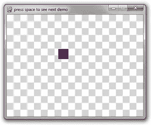

## **画圆:**

```
pygame.draw.circle(surface, color, (x, y), radius)
```

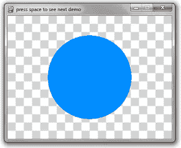

内置轮廓不好，真的不好！

这是你应该知道的第一个警告。PyGame 为圆形创建“更粗”轮廓的方法是绘制多个 1 像素的轮廓。理论上，这听起来不错，直到你看到结果:

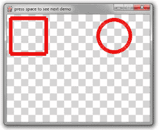

圆圈中有明显的像素间隙。更令人尴尬的是矩形，它在所需的厚度下使用了 4 个画线调用。这造成了奇怪的角落。

大多数绘图 API 调用的方法是传入一个可选的最后参数，即厚度。

```
# draw a rectangle 
pygame.draw.rect(surface, color, pygame.Rect(10, 10, 100, 100), 10)
# draw a circle 
pygame.draw.circle(surface, color, (300, 60), 50, 10)
```

**注意:**当你画多边形、矩形、圆形等的时候，用 1 个像素的厚度填充或者画出来。其他的都没有很好的实现。

## **可接受的轮廓:**

如果您必须绘制一个具有 10 像素厚的边框的矩形，那么您最好自己用 10 个 1 像素厚的矩形调用或者 4 个 10 像素厚的矩形调用来重新实现该逻辑。

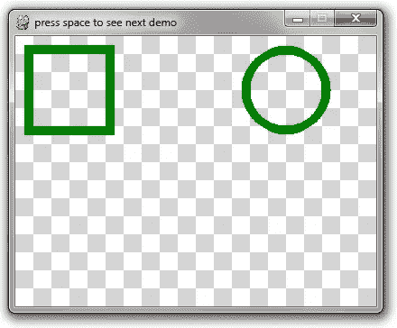

## **绘制多边形:**

这个 API 非常简单。点列表是多边形的 x-y 坐标元组列表。

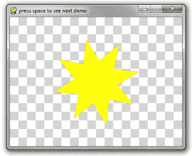

```
pygame.draw.polygon(surface, color, point_list)
```

## **画一条线:**

```
pygame.draw.line(surface, color, (startX, startY), (endX, endY), width)
```

参考下面令人惊叹的 3D 旋转线框立方体，它是用直线法和大量数学运算创建的:

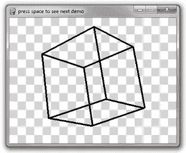

```
import pygame
import math
import time

# Ignore these 3 functions. Scroll down for the relevant code. 

def create_background(width, height):
        colors = [(255, 255, 255), (212, 212, 212)]
        background = pygame.Surface((width, height))
        tile_width = 20
        y = 0
        while y &lt; height:
                x = 0
                while x &lt; width:
                        row = y // tile_width
                        col = x // tile_width
                        pygame.draw.rect(
                                background, 
                                colors[(row + col) % 2],
                                pygame.Rect(x, y, tile_width, tile_width))
                        x += tile_width
                y += tile_width
        return background

def is_trying_to_quit(event):
        pressed_keys = pygame.key.get_pressed()
        alt_pressed = pressed_keys[pygame.K_LALT] or pressed_keys[pygame.K_RALT]
        x_button = event.type == pygame.QUIT
        altF4 = alt_pressed and event.type == pygame.KEYDOWN and event.key == pygame.K_F4
        escape = event.type == pygame.KEYDOWN and event.key == pygame.K_ESCAPE
        return x_button or altF4 or escape

def run_demos(width, height, fps):
        pygame.init()
        screen = pygame.display.set_mode((width, height))
        pygame.display.set_caption('press space to see next demo')
        background = create_background(width, height)
        clock = pygame.time.Clock()
        demos = [
                do_rectangle_demo,
                do_circle_demo,
                do_horrible_outlines,
                do_nice_outlines,
                do_polygon_demo,
                do_line_demo
                ]
        the_world_is_a_happy_place = 0
        while True:
                the_world_is_a_happy_place += 1
                for event in pygame.event.get():
                        if is_trying_to_quit(event):
                                return
                        if event.type == pygame.KEYDOWN and event.key == pygame.K_SPACE:
                                demos = demos[1:]
                screen.blit(background, (0, 0))
                if len(demos) == 0:
                        return
                demos[0](screen, the_world_is_a_happy_place)
                pygame.display.flip()
                clock.tick(fps)

# Everything above this line is irrelevant to this tutorial. 

def do_rectangle_demo(surface, counter):
        left = (counter // 2) % surface.get_width()
        top = (counter // 3) % surface.get_height()
        width = 30
        height = 30
        color = (128, 0, 128) # purple 

        # Draw a rectangle 
        pygame.draw.rect(surface, color, pygame.Rect(left, top, width, height))

def do_circle_demo(surface, counter):
        x = surface.get_width() // 2
        y = surface.get_height() // 2
        max_radius = min(x, y) * 4 // 5
        radius = abs(int(math.sin(counter * 3.14159 * 2 / 200) * max_radius)) + 1
        color = (0, 140, 255) # aquamarine 

        # Draw a circle 
        pygame.draw.circle(surface, color, (x, y), radius)

def do_horrible_outlines(surface, counter):
        color = (255, 0, 0) # red 

        # draw a rectangle 
        pygame.draw.rect(surface, color, pygame.Rect(10, 10, 100, 100), 10)

        # draw a circle 
        pygame.draw.circle(surface, color, (300, 60), 50, 10)

def do_nice_outlines(surface, counter):
        color = (0, 128, 0) # green 

        # draw a rectangle 
        pygame.draw.rect(surface, color, pygame.Rect(10, 10, 100, 10))
        pygame.draw.rect(surface, color, pygame.Rect(10, 10, 10, 100))
        pygame.draw.rect(surface, color, pygame.Rect(100, 10, 10, 100))
        pygame.draw.rect(surface, color, pygame.Rect(10, 100, 100, 10))

        # draw a circle 
        center_x = 300
        center_y = 60
        radius = 45
        iterations = 150
        for i in range(iterations):
                ang = i * 3.14159 * 2 / iterations
                dx = int(math.cos(ang) * radius)
                dy = int(math.sin(ang) * radius)
                x = center_x + dx
                y = center_y + dy
                pygame.draw.circle(surface, color, (x, y), 5)

def do_polygon_demo(surface, counter):
        color = (255, 255, 0) # yellow 

        num_points = 8
        point_list = []
        center_x = surface.get_width() // 2
        center_y = surface.get_height() // 2
        for i in range(num_points * 2):
                radius = 100
                if i % 2 == 0:
                        radius = radius // 2
                ang = i * 3.14159 / num_points + counter * 3.14159 / 60
                x = center_x + int(math.cos(ang) * radius)
                y = center_y + int(math.sin(ang) * radius)
                point_list.append((x, y))
        pygame.draw.polygon(surface, color, point_list)

def rotate_3d_points(points, angle_x, angle_y, angle_z):
        new_points = []
        for point in points:
                x = point[0]
                y = point[1]
                z = point[2]
                new_y = y * math.cos(angle_x) - z * math.sin(angle_x)
                new_z = y * math.sin(angle_x) + z * math.cos(angle_x)
                y = new_y
                # isn't math fun, kids? 
                z = new_z
                new_x = x * math.cos(angle_y) - z * math.sin(angle_y)
                new_z = x * math.sin(angle_y) + z * math.cos(angle_y)
                x = new_x
                z = new_z
                new_x = x * math.cos(angle_z) - y * math.sin(angle_z)
                new_y = x * math.sin(angle_z) + y * math.cos(angle_z)
                x = new_x
                y = new_y
                new_points.append([x, y, z])
        return new_points

def do_line_demo(surface, counter):
        color = (0, 0, 0) # black 
        cube_points = [
                [-1, -1, 1],
                [-1, 1, 1],
                [1, 1, 1],
                [1, -1, 1],
                [-1, -1, -1],
                [-1, 1, -1],
                [1, 1, -1],
                [1, -1, -1]]

        connections = [
                (0, 1),
                (1, 2),
                (2, 3),
                (3, 0),
                (4, 5),
                (5, 6),
                (6, 7),
                (7, 4),
                (0, 4),
                (1, 5),
                (2, 6),
                (3, 7)
                ]

        t = counter * 2 * 3.14159 / 60 # this angle is 1 rotation per second 

        # rotate about x axis every 2 seconds 
        # rotate about y axis every 4 seconds 
        # rotate about z axis every 6 seconds 
        points = rotate_3d_points(cube_points, t / 2, t / 4, t / 6)
        flattened_points = []
        for point in points:
                flattened_points.append(
                        (point[0] * (1 + 1.0 / (point[2] + 3)),
                         point[1] * (1 + 1.0 / (point[2] + 3))))

        for con in connections:
                p1 = flattened_points[con[0]]
                p2 = flattened_points[con[1]]
                x1 = p1[0] * 60 + 200
                y1 = p1[1] * 60 + 150
                x2 = p2[0] * 60 + 200
                y2 = p2[1] * 60 + 150

                # This is the only line that really matters 
                pygame.draw.line(surface, color, (x1, y1), (x2, y2), 4)

run_demos(400, 300, 60)
```

接下来，在这篇文章中，让我们看看如何使用字体和文本。

# 字体和文本

如果你正在寻找如何渲染文本的快速答案，这里有:

```
import pygame

pygame.init()
screen = pygame.display.set_mode((640, 480))
clock = pygame.time.Clock()
done = False

font = pygame.font.SysFont(&quot;comicsansms&quot;, 72)

text = font.render(&quot;Hello, World&quot;, True, (0, 128, 0))

while not done:
    for event in pygame.event.get():
        if event.type == pygame.QUIT:
            done = True
        if event.type == pygame.KEYDOWN and event.key == pygame.K_ESCAPE:
            done = True

    screen.fill((255, 255, 255))
    screen.blit(text,
        (320 - text.get_width() // 2, 240 - text.get_height() // 2))

    pygame.display.flip()
    clock.tick(60)
```

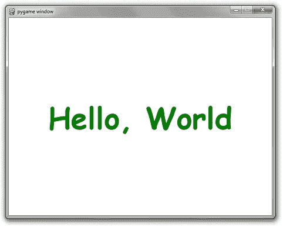

但是当然，这也有一些不理想的地方。

**规则#1:** 你永远不要假设用户的电脑上安装了某种字体。即使在 CSS 中，也有一种方法来定义要使用的字体层次。如果没有字体的最佳选择，将使用替代字体。你应该遵循同样的模式。幸运的是，PyGame 有办法枚举机器上所有可用的字体:

```
all_fonts = pygame.font.get_fonts()
```

另外，有一种方法可以实例化默认的系统字体:

```
font = pygame.font.Font(None, size)
```

或者，您可以在代码中包含一个字体文件的名称，而不是一个都没有，以保证完美字体的存在:

```
font = pygame.font.Font(&quot;myresources/fonts/Papyrus.ttf&quot;, 26)
```

使用上述任意组合，您可以编写一个更好的字体创建函数。例如，这里有一个函数，它接受一个字体名称、字体大小的列表，并将为列表中第一个可用的字体创建一个字体实例。如果没有可用的，它将使用默认的系统字体。

```
def make_font(fonts, size):
    available = pygame.font.get_fonts()
    # get_fonts() returns a list of lowercase spaceless font names 
    choices = map(lambda x:x.lower().replace(' ', ''), fonts)
    for choice in choices:
        if choice in available:
            return pygame.font.SysFont(choice, size)
    return pygame.font.Font(None, size)
```

您甚至可以通过按字体名称和大小缓存字体实例来进一步改进它。

```
_cached_fonts = {}
def get_font(font_preferences, size):
    global _cached_fonts
    key = str(font_preferences) + '|' + str(size)
    font = _cached_fonts.get(key, None)
    if font == None:
        font = make_font(font_preferences, size)
        _cached_fonts[key] = font
    return font
```

您可以更进一步，实际缓存呈现的文本本身。存储一个图像比渲染一个新图像更便宜，尤其是如果您计划让相同的文本在多个连续的帧中显示。是的。如果你想让它可读，这就是你的计划。

```
_cached_text = {}
def create_text(text, fonts, size, color):
    global _cached_text
    key = '|'.join(map(str, (fonts, size, color, text)))
    image = _cached_text.get(key, None)
    if image == None:
        font = get_font(fonts, size)
        image = font.render(text, True, color)
        _cached_text[key] = image
    return image
```

将所有这些放在一起，下面是“Hello，World”代码，但代码有所改进:

```
import pygame

def make_font(fonts, size):
    available = pygame.font.get_fonts()
    # get_fonts() returns a list of lowercase spaceless font names 
    choices = map(lambda x:x.lower().replace(' ', ''), fonts)
    for choice in choices:
        if choice in available:
            return pygame.font.SysFont(choice, size)
    return pygame.font.Font(None, size)

_cached_fonts = {}
def get_font(font_preferences, size):
    global _cached_fonts
    key = str(font_preferences) + '|' + str(size)
    font = _cached_fonts.get(key, None)
    if font == None:
        font = make_font(font_preferences, size)
        _cached_fonts[key] = font
    return font

_cached_text = {}
def create_text(text, fonts, size, color):
    global _cached_text
    key = '|'.join(map(str, (fonts, size, color, text)))
    image = _cached_text.get(key, None)
    if image == None:
        font = get_font(fonts, size)
        image = font.render(text, True, color)
        _cached_text[key] = image
    return image

pygame.init()
screen = pygame.display.set_mode((640, 480))
clock = pygame.time.Clock()
done = False

font_preferences = [
        &quot;Bizarre-Ass Font Sans Serif&quot;,
        &quot;They definitely dont have this installed Gothic&quot;,
        &quot;Papyrus&quot;,
        &quot;Comic Sans MS&quot;]

text = create_text(&quot;Hello, World&quot;, font_preferences, 72, (0, 128, 0))

while not done:
    for event in pygame.event.get():
        if event.type == pygame.QUIT:
            done = True
        if event.type == pygame.KEYDOWN and event.key == pygame.K_ESCAPE:
            done = True

    screen.fill((255, 255, 255))
    screen.blit(text,
        (320 - text.get_width() // 2, 240 - text.get_height() // 2))

    pygame.display.flip()
    clock.tick(60)
```

接下来，让我们看看如何考虑输入。

# 输入模型

有两种基本方法可以获得任何输入设备的状态。这些是检查事件队列或轮询。每次按下或释放一个键或按钮，或者移动鼠标，都会有一个事件添加到事件队列中。您必须通过调用 pygame.event.get()或 pygame.event.pump()清空每个帧的事件队列。

pygame.event.get()将返回自上次清空队列以来的所有事件的列表。处理这些事件的方式取决于事件本身的类型。可以通过读取 event.type 字段来检查事件的类型。几乎每种常见事件的例子都可以在下面的扩展代码示例中看到。还有更多类型，但它们相当罕见。

检查事件的另一种方法是轮询按键或按钮的状态。

**py game . key . get _ pressed()**—这将获得一个描述每个键盘按键状态的布尔值列表。

**pygame.mouse.get_pos()** —返回鼠标光标的坐标。如果鼠标没有在屏幕上移动，将返回(0，0)。

**py game . mouse . get _ pressed()**—和 pygame.key.get_pressed()一样，返回每个鼠标按键的状态。返回值是一个大小为 3 的元组，对应于左、中和右按钮。

这里有一个什么都有的小程序:

*   移动鼠标会在它后面画出一条轨迹。
*   按住 Ctrl 的同时按 W 将关闭窗口。Alt + F4 也一样。
*   按下关闭按钮将关闭窗口
*   按 r、g 或 b 键将使轨迹分别变成红色、绿色和蓝色。
*   按下鼠标左键会使轨迹变粗。
*   按下鼠标右键会使轨迹变细。

```
import pygame

def main():
    pygame.init()
    screen = pygame.display.set_mode((640, 480))
    clock = pygame.time.Clock()

    radius = 15
    x = 0
    y = 0
    mode = 'blue'
    points = []

    while True:

        pressed = pygame.key.get_pressed()

        alt_held = pressed[pygame.K_LALT] or pressed[pygame.K_RALT]
        ctrl_held = pressed[pygame.K_LCTRL] or pressed[pygame.K_RCTRL]

        for event in pygame.event.get():

            # determin if X was clicked, or Ctrl+W or Alt+F4 was used
            if event.type == pygame.QUIT:
                return
            if event.type == pygame.KEYDOWN:
                if event.key == pygame.K_w and ctrl_held:
                    return
                if event.key == pygame.K_F4 and alt_held:
                    return
                if event.key == pygame.K_ESCAPE:
                    return

                # determine if a letter key was pressed 
                if event.key == pygame.K_r:
                    mode = 'red'
                elif event.key == pygame.K_g:
                    mode = 'green'
                elif event.key == pygame.K_b:
                    mode = 'blue'

            if event.type == pygame.MOUSEBUTTONDOWN:
                if event.button == 1: # left click grows radius 
                    radius = min(200, radius + 1)
                elif event.button == 3: # right click shrinks radius
                    radius = max(1, radius - 1)

            if event.type == pygame.MOUSEMOTION:
                # if mouse moved, add point to list 
                position = event.pos
                points = points + [position]
                points = points[-256:]

        screen.fill((0, 0, 0))

        # draw all points 
        i = 0
        while i &lt; len(points) - 1:
            drawLineBetween(screen, i, points[i], points[i + 1], radius, mode)
            i += 1

        pygame.display.flip()

        clock.tick(60)

def drawLineBetween(screen, index, start, end, width, color_mode):
    c1 = max(0, min(255, 2 * index - 256))
    c2 = max(0, min(255, 2 * index))

    if color_mode == 'blue':
        color = (c1, c1, c2)
    elif color_mode == 'red':
        color = (c2, c1, c1)
    elif color_mode == 'green':
        color = (c1, c2, c1)

    dx = start[0] - end[0]
    dy = start[1] - end[1]
    iterations = max(abs(dx), abs(dy))

    for i in range(iterations):
        progress = 1.0 * i / iterations
        aprogress = 1 - progress
        x = int(aprogress * start[0] + progress * end[0])
        y = int(aprogress * start[1] + progress * end[1])
        pygame.draw.circle(screen, color, (x, y), width)

main()
```

最后，在本文中，我们需要检查一下所谓的集中式场景逻辑。

# 集中式场景逻辑

这本身并不是一个专门针对 PyGame 的教程。它更多的是好的软件设计概念的应用。这种做事模式在很多复杂的游戏中都很好地服务了我。

如果您不熟悉 Python 中的面向对象编程，现在就熟悉一下吧。

完成了吗？非常好。

以下是场景库的类定义:

```
class SceneBase:
def __init__(self):
self.next = self

def ProcessInput(self, events):
print(&quot;uh-oh, you didn't override this in the child class&quot;)

def Update(self):
print(&quot;uh-oh, you didn't override this in the child class&quot;)

def Render(self, screen):
print(&quot;uh-oh, you didn't override this in the child class&quot;)

def SwitchToScene(self, next_scene):
self.next = next_scene
```

当您覆盖这个类时，您有 3 个方法实现需要填充。

*   **ProcessInput** —该方法将接收自上一帧以来发生的所有事件。
*   **更新**——把你的游戏逻辑放在这里作为场景。
*   **渲染** —把你的渲染代码放在这里。它将接收主屏幕表面作为输入。

当然，这个类需要合适的装具来工作。下面是一个简单的示例程序:它启动 PyGame 管道，场景是空白的红色背景。当您按下回车键时，它会变成蓝色。

这段代码可能看起来有些多余，但是它也做了很多其他微妙的事情，同时将游戏逻辑的复杂性包含在一个时髦的 OO 模型中。一旦你开始给你的游戏增加更多的复杂性，这个模型将为你节省大量调试和修改代码的时间。

```
import pygame

def main():
    pygame.init()
    screen = pygame.display.set_mode((640, 480))
    clock = pygame.time.Clock()

    radius = 15
    x = 0
    y = 0
    mode = 'blue'
    points = []

    while True:

        pressed = pygame.key.get_pressed()

        alt_held = pressed[pygame.K_LALT] or pressed[pygame.K_RALT]
        ctrl_held = pressed[pygame.K_LCTRL] or pressed[pygame.K_RCTRL]

        for event in pygame.event.get():

            # determin if X was clicked, or Ctrl+W or Alt+F4 was used
            if event.type == pygame.QUIT:
                return
            if event.type == pygame.KEYDOWN:
                if event.key == pygame.K_w and ctrl_held:
                    return
                if event.key == pygame.K_F4 and alt_held:
                    return
                if event.key == pygame.K_ESCAPE:
                    return

                # determine if a letter key was pressed 
                if event.key == pygame.K_r:
                    mode = 'red'
                elif event.key == pygame.K_g:
                    mode = 'green'
                elif event.key == pygame.K_b:
                    mode = 'blue'

            if event.type == pygame.MOUSEBUTTONDOWN:
                if event.button == 1: # left click grows radius 
                    radius = min(200, radius + 1)
                elif event.button == 3: # right click shrinks radius
                    radius = max(1, radius - 1)

            if event.type == pygame.MOUSEMOTION:
                # if mouse moved, add point to list 
                position = event.pos
                points = points + [position]
                points = points[-256:]

        screen.fill((0, 0, 0))

        # draw all points 
        i = 0
        while i &lt; len(points) - 1:
            drawLineBetween(screen, i, points[i], points[i + 1], radius, mode)
            i += 1

        pygame.display.flip()

        clock.tick(60)

def drawLineBetween(screen, index, start, end, width, color_mode):
    c1 = max(0, min(255, 2 * index - 256))
    c2 = max(0, min(255, 2 * index))

    if color_mode == 'blue':
        color = (c1, c1, c2)
    elif color_mode == 'red':
        color = (c2, c1, c1)
    elif color_mode == 'green':
        color = (c1, c2, c1)

    dx = start[0] - end[0]
    dy = start[1] - end[1]
    iterations = max(abs(dx), abs(dy))

    for i in range(iterations):
        progress = 1.0 * i / iterations
        aprogress = 1 - progress
        x = int(aprogress * start[0] + progress * end[0])
        y = int(aprogress * start[1] + progress * end[1])
        pygame.draw.circle(screen, color, (x, y), width)

main()
```

我希望这个 PyGame 教程能帮助你开始学习 PyGame。如果你想查看更多关于人工智能、DevOps、道德黑客等市场最热门技术的文章，你可以参考 Edureka 的官方网站。

请留意本系列中的其他文章，它们将解释 Python 和数据科学的各个方面。

> 1. [Python 教程](/edureka/python-tutorial-be1b3d015745)
> 
> 2. [](/edureka/python-functions-f0cabca8c4a) [Python 编程语言](/edureka/python-programming-language-fc1015de7a6f)
> 
> 3. [Python 函数](/edureka/python-functions-f0cabca8c4a)
> 
> 4.[Python 中的文件处理](/edureka/file-handling-in-python-e0a6ff96ede9)
> 
> 5. [](/edureka/scikit-learn-machine-learning-7a2d92e4dd07) [Python Numpy 教程](/edureka/python-numpy-tutorial-89fb8b642c7d)
> 
> 6. [Scikit Learn 机器学习](/edureka/scikit-learn-machine-learning-7a2d92e4dd07)
> 
> 7.[蟒蛇熊猫教程](/edureka/python-pandas-tutorial-c5055c61d12e)
> 
> 8. [Matplotlib 教程](/edureka/python-matplotlib-tutorial-15d148a7bfee)
> 
> 9. [Tkinter 教程](/edureka/tkinter-tutorial-f655d3f4c818)
> 
> 10.[请求教程](/edureka/python-requests-tutorial-30edabfa6a1c)
> 
> 11. [OpenCV 教程](/edureka/python-opencv-tutorial-5549bd4940e3)
> 
> 12.[用 Python 进行网页抓取](/edureka/web-scraping-with-python-d9e6506007bf)
> 
> 13. [PyCharm 教程](/edureka/pycharm-tutorial-d0ec9ce6fb60)
> 
> 14.[机器学习教程](/edureka/machine-learning-tutorial-f2883412fba1)
> 
> 15.[Python 中从头开始的线性回归算法](/edureka/linear-regression-in-python-e66f869cb6ce)
> 
> 16.[用于数据科学的 Python](/edureka/learn-python-for-data-science-1f9f407943d3)
> 
> 17. [Python 正则表达式](/edureka/python-regex-regular-expression-tutorial-f2d17ffcf17e)
> 
> 18.[Python 中的循环](/edureka/loops-in-python-fc5b42e2f313)
> 
> 19. [Python 项目](/edureka/python-projects-1f401a555ca0)
> 
> 20.[机器学习项目](/edureka/machine-learning-projects-cb0130d0606f)
> 
> 21.[Python 中的数组](/edureka/arrays-in-python-14aecabec16e)
> 
> 22.[在 Python 中设置](/edureka/sets-in-python-a16b410becf4)
> 
> 23.[Python 中的多线程](/edureka/what-is-mutithreading-19b6349dde0f)
> 
> 24. [Python 面试问题](/edureka/python-interview-questions-a22257bc309f)
> 
> 25. [Java vs Python](/edureka/java-vs-python-31d7433ed9d)
> 
> 26.[如何成为一名 Python 开发者？](/edureka/how-to-become-a-python-developer-462a0093f246)
> 
> 27. [Python Lambda 函数](/edureka/python-lambda-b84d68d449a0)
> 
> 28.[网飞如何使用 Python？](/edureka/how-netflix-uses-python-1e4deb2f8ca5)
> 
> 29.[Python 中的套接字编程是什么](/edureka/socket-programming-python-bbac2d423bf9)
> 
> 30. [Python 数据库连接](/edureka/python-database-connection-b4f9b301947c)
> 
> 31. [Golang vs Python](/edureka/golang-vs-python-5ac32e1ef2)
> 
> 32. [Python Seaborn 教程](/edureka/python-seaborn-tutorial-646fdddff322)
> 
> 33. [Python 职业机会](/edureka/python-career-opportunities-a2500ce158de)
> 
> 34.[Python 中的机器学习分类器](/edureka/machine-learning-classifier-c02fbd8400c9)
> 
> 35. [Python Scikit-Learn 备忘单](/edureka/python-scikit-learn-cheat-sheet-9786382be9f5)
> 
> 36.[机器学习工具](/edureka/python-libraries-for-data-science-and-machine-learning-1c502744f277)
> 
> 37.[用于数据科学和机器学习的 Python 库](/edureka/python-libraries-for-data-science-and-machine-learning-1c502744f277)
> 
> 38.[Python 中的聊天机器人](/edureka/how-to-make-a-chatbot-in-python-b68fd390b219)
> 
> 39. [Python 集合](/edureka/collections-in-python-d0bc0ed8d938)
> 
> 40. [Python 模块](/edureka/python-modules-abb0145a5963)
> 
> 41. [Python 开发者技能](/edureka/python-developer-skills-371583a69be1)
> 
> 42.[哎呀面试问答](/edureka/oops-interview-questions-621fc922cdf4)
> 
> 43.[Python 开发者简历](/edureka/python-developer-resume-ded7799b4389)
> 
> 44.[Python 中的探索性数据分析](/edureka/exploratory-data-analysis-in-python-3ee69362a46e)
> 
> 45.[带 Python 的乌龟模块的贪吃蛇游戏](/edureka/python-turtle-module-361816449390)
> 
> 46. [Python 开发者工资](/edureka/python-developer-salary-ba2eff6a502e)
> 
> 47.[主成分分析](/edureka/principal-component-analysis-69d7a4babc96)
> 
> 48. [Python vs C++](/edureka/python-vs-cpp-c3ffbea01eec)
> 
> 49.[刺儿头教程](/edureka/scrapy-tutorial-5584517658fb)
> 
> 50. [Python SciPy](/edureka/scipy-tutorial-38723361ba4b)
> 
> 51.[最小二乘回归法](/edureka/least-square-regression-40b59cca8ea7)
> 
> 52. [Jupyter 笔记本小抄](/edureka/jupyter-notebook-cheat-sheet-88f60d1aca7)
> 
> 53. [Python 基础知识](/edureka/python-basics-f371d7fc0054)
> 
> 54. [Python 模式程序](/edureka/python-pattern-programs-75e1e764a42f)
> 
> 55.[Python 中的生成器](/edureka/generators-in-python-258f21e3d3ff)
> 
> 56. [Python 装饰器](/edureka/python-decorator-tutorial-bf7b21278564)
> 
> 57. [Python Spyder IDE](/edureka/spyder-ide-2a91caac4e46)
> 
> 58.[在 Python 中使用 Kivy 的移动应用](/edureka/kivy-tutorial-9a0f02fe53f5)
> 
> 59.[十大最佳学习书籍&练习 Python](/edureka/best-books-for-python-11137561beb7)
> 
> 60.[用 Python 实现机器人框架](/edureka/robot-framework-tutorial-f8a75ab23cfd)
> 
> 61.[使用 PyGame 的 Python 中的贪吃蛇游戏](/edureka/snake-game-with-pygame-497f1683eeaa)
> 
> 62. [Django 面试问答](/edureka/django-interview-questions-a4df7bfeb7e8)
> 
> 63.[十大 Python 应用](/edureka/python-applications-18b780d64f3b)
> 
> 64.[Python 中的散列表和散列表](/edureka/hash-tables-and-hashmaps-in-python-3bd7fc1b00b4)
> 
> 65. [Python 3.8](/edureka/whats-new-python-3-8-7d52cda747b)
> 
> 66. [Python Visual Studio](/edureka/python-visual-studio-cef3ad98a9e2)
> 
> 67.[Python 中的支持向量机](/edureka/support-vector-machine-in-python-539dca55c26a)

*原载于 2018 年 12 月 11 日*[*www.edureka.co*](https://www.edureka.co/blog/pygame-tutorial)*。*