# 通过 FIFA 世界杯和超级英雄数据集学习 PySpark 数据帧

> 原文：<https://medium.com/edureka/pyspark-dataframe-tutorial-9335f3d09b4?source=collection_archive---------5----------------------->


PySpark Dataframes Tutorial — Edureka

Dataframes 是当今业界的一个时髦词。人们倾向于将它与用于[数据分析](https://www.edureka.co/blog/what-is-data-analytics?utm_source=medium&utm_medium=content-link&utm_campaign=pyspark-dataframe-tutorial)的流行语言一起使用，如 Python、Scala 和 r。那么，为什么每个人都在如此频繁地使用它呢？让我们用文章来理解这一点。在本文中，我将讨论以下主题:

*   什么是数据帧？
*   为什么我们需要数据框架？
*   数据帧的特征
*   PySpark 数据帧源
*   数据帧创建
*   Pyspark 数据帧与 FIFA 世界杯和超级英雄数据集

# 什么是数据帧？

数据帧通常指本质上是表格的数据结构。它表示行，每一行都由许多观察值组成。行可以有多种数据格式(**异构**，而列可以有相同数据类型的数据(**同构**)。除数据外，数据帧通常还包含一些元数据；例如，列名和行名。

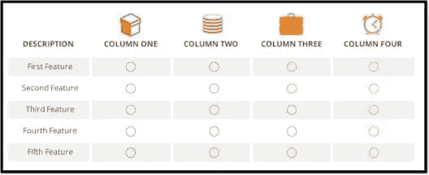

我们可以说数据帧什么也不是，只是二维数据结构，类似于 SQL 表或电子表格。现在让我们继续这篇文章，并理解我们到底为什么需要 Pyspark Dataframe？

# 为什么我们需要数据帧？

## **1。处理结构化和半结构化数据**


数据帧被设计用来处理**大量结构化和半结构化数据**。Spark 数据帧中的观察结果组织在命名列下，这有助于 Apache Spark 理解数据帧的模式。这有助于优化这些查询的执行计划。它还可以处理**千兆字节**的数据。

## **2。切片和切块**


数据框架 API 通常支持精细的数据切片方法。它包括按名称或编号“选择”行、列和单元格，过滤出行等操作。统计数据通常非常混乱，包含大量缺失值、错误值和范围违规。因此，数据帧的一个至关重要的特性是对丢失数据的显式管理。

## **3。数据来源**


DataFrame 支持多种数据格式和数据源，我们将在本文后面讨论这一点。他们可以从各种来源获取数据。

## **4。支持多种语言**


它有对不同语言的 API 支持，如 Python、R、Scala、Java，这使得它更容易被具有不同编程背景的人使用。

# 数据帧的特征


*   数据帧在本质上是分布式的 T21，这使得它成为容错和高度可用的数据结构。
*   **惰性求值**是一种求值策略，它保留表达式的求值，直到需要它的值。避免了重复评估。Spark 中的惰性求值意味着直到一个动作被触发，执行才会开始。在 Spark 中，当 Spark 转换发生时，就会出现懒惰评估的情况。
*   数据帧在本质上是不可变的**。我说的不可变是指它是一个在被创建后其状态**不能被修改**的对象。但是我们可以通过应用某种转换来转换它的值，就像在 RDDs 中一样。**

# **PySpark 数据帧源**

**Pyspark 中的数据帧可以通过多种方式创建:**

**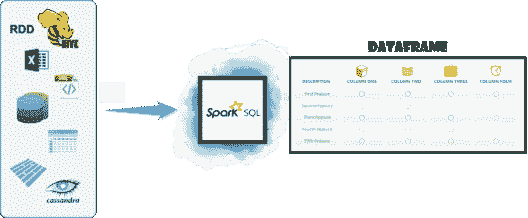**

**数据可以通过 **CSV、JSON、XML** 或 Parquet 文件加载。也可以使用现有的 **RDD** 并通过任何其他数据库来创建，如 [**Hive**](https://www.edureka.co/blog/hive-tutorial?utm_source=medium&utm_medium=content-link&utm_campaign=pyspark-dataframe-tutorial) 或 **Cassandra** 等。它还可以从 [HDFS](https://www.edureka.co/blog/hdfs-tutorial?utm_source=medium&utm_medium=content-link&utm_campaign=pyspark-dataframe-tutorial) 或本地文件系统接收数据。**

# **数据帧创建**

**让我们继续阅读本文，了解如何创建数据帧。**

**我们将创建雇员和部门实例。**

```
from pyspark.sql import *

Employee = Row("firstName", "lastName", "email", "salary")

employee1 = Employee('Basher', 'armbrust', '[bash@edureka.co](mailto:bash@edureka.co)', 100000)
employee2 = Employee('Daniel', 'meng', '[daniel@stanford.edu](mailto:daniel@stanford.edu)', 120000 )
employee3 = Employee('Muriel', None, '[muriel@waterloo.edu](mailto:muriel@waterloo.edu)', 140000 )
employee4 = Employee('Rachel', 'wendell', '[rach_3@edureka.co](mailto:rach_3@edureka.co)', 160000 )
employee5 = Employee('Zach', 'galifianakis', '[zach_g@edureka.co](mailto:zach_g@edureka.co)', 160000 )

print(Employee[0])

print(employee3)

department1 = Row(id='123456', name='HR')
department2 = Row(id='789012', name='OPS')
department3 = Row(id='345678', name='FN')
department4 = Row(id='901234', name='DEV')
```

**接下来，我们将从雇员和部门创建一个 DepartmentWithEmployees 实例**

```
departmentWithEmployees1 = Row(department=department1, employees=[employee1, employee2, employee5]) departmentWithEmployees2 = Row(department=department2, employees=[employee3, employee4]) departmentWithEmployees3 = Row(department=department3, employees=[employee1, employee4, employee3]) departmentWithEmployees4 = Row(department=department4, employees=[employee2, employee3])
```

**让我们从行列表中创建我们的数据帧**

```
departmentWithEmployees1 = Row(department=department1, employees=[employee1, employee2, employee5])
departmentWithEmployees2 = Row(department=department2, employees=[employee3, employee4])
departmentWithEmployees3 = Row(department=department3, employees=[employee1, employee4, employee3])
departmentWithEmployees4 = Row(department=department4, employees=[employee2, employee3])
```

# **Pyspark 数据帧示例 1: FIFA 世界杯数据集**

**在这里，我们已经采取了国际足联世界杯球员数据集。我们将把 CSV 格式的数据加载到数据帧中，然后我们将了解可以在该数据帧上执行的不同转换和操作。**

****

## **从 CSV 文件中读取数据**

**让我们从 CSV 文件加载数据。这里我们将使用 **spark.read.csv** 方法将数据加载到数据帧 fifa_df 中。实际方法是**spark . read . format【CSV/JSON】**。**

```
fifa_df = spark.read.csv("path-of-file/fifa_players.csv", inferSchema = True, header = True) 
fifa_df.show()
```

**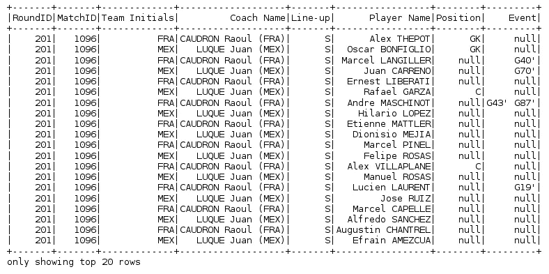**

## **数据帧的模式**

**来看看 ie 的模式。dataframe 的结构，我们将使用 **printSchema** 方法。这将为我们提供数据帧中的不同列，以及该特定列的数据类型和可空条件。**

```
fifa_df.printSchema()
```

**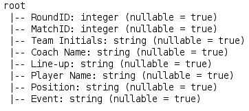**

## **列名和计数(行和列)**

**当我们想要查看特定数据帧的名称以及行数和列数时，我们使用以下方法。**

```
fifa_df.columns //Column Names 
fifa_df.count() // Row Count 
len(fifa_df.columns) //Column Count
```

**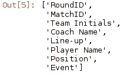**

```
37784 
8
```

## **描述特定的列**

**如果我们想要查看数据帧中任何特定列的摘要，我们使用 **describe** 方法。这个方法给出给定列的统计摘要，如果没有指定，它提供数据帧的统计摘要。**

```
fifa_df.describe('Coach Name').show() fifa_df.describe('Position').show()
```

**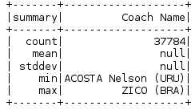****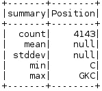**

## **选择多列**

**如果我们想从数据帧中选择特定的列，我们使用**选择**方法。**

```
fifa_df.select('Player Name','Coach Name').show()
```

**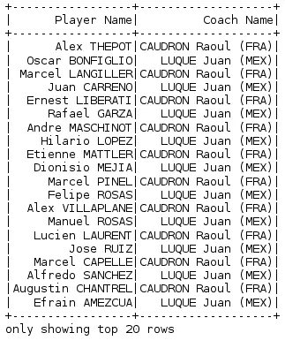**

## **选择不同的多列**

```
fifa_df.select('Player Name','Coach Name').distinct().show()
```

**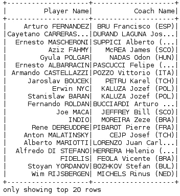**

## **过滤数据**

**为了过滤数据，根据指定的条件，我们使用**过滤器**命令。这里，我们根据匹配 ID 必须等于 1096 的条件过滤数据帧，然后计算过滤后的输出中有多少记录/行。**

```
fifa_df.filter(fifa_df.MatchID=='1096').show() fifa_df.filter(fifa_df.MatchID=='1096').count() //to get the count
```

**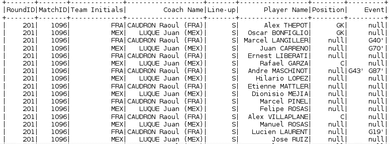**

## **过滤数据(多参数)**

**我们可以根据多个条件(AND 或 or)过滤数据**

```
fifa_df.filter((fifa_df.Position=='C') && (fifa_df.Event=="G40'")).show()
```

**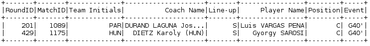**

## **数据排序(排序依据)**

**为了对数据进行排序，我们使用了 **OrderBy** 方法。默认情况下，它按升序排序，但我们也可以将其更改为降序。**

```
fifa_df.orderBy(fifa_df.MatchID).show()
```

**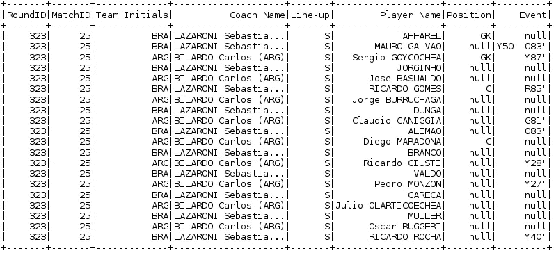**

# **PySpark 数据帧示例 2:超级英雄数据集**

****

## **加载数据**

**这里，我们将以与前面相同的方式加载数据。**

```
Superhero_df = spark.read.csv("path-of file/superheros.csv", inferSchema = True, header = True) 
Superhero_df.show(10)
```

**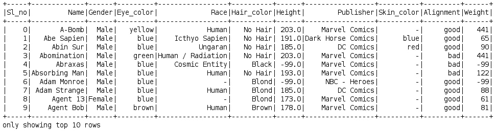**

## **过滤数据**

```
Superhero_df.filter(Superhero_df.Gender == 'Male').count() //Male Heros Count 
Superhero_df.filter(Superhero_df.Gender == 'Female').count() //Female Heros Count
```

## **将数据分组**

****GroupBy** 用于根据指定的列对数据帧进行分组。这里，我们根据列竞争对数据帧进行分组，然后使用 **count** 函数，我们可以找到特定竞争的计数。**

```
Race_df = Superhero_df.groupby("Race")\
.count()\
.show()
```

**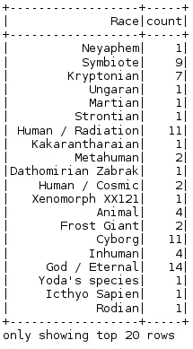**

## **执行 SQL 查询**

**我们还可以将 sql 查询直接传递给任何数据帧，因为我们需要使用 **registerTempTable** 方法从数据帧创建一个表，然后使用 **sqlContext.sql()** 传递 SQL 查询。**

```
Superhero_df.registerTempTable('superhero_table')
sqlContext.sql('select * from superhero_table').show()
```

****

```
sqlContext.sql(‘select distinct(Eye_color) from superhero_table’).show()
```

**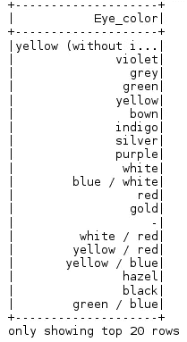**

```
sqlContext.sql('select distinct(Eye_color) from superhero_table').count()
```

**23**

```
sqlContext.sql(‘select max(Weight) from superhero_table’).show()
```

**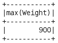**

**如果你想查看更多关于人工智能、DevOps、道德黑客等市场最热门技术的文章，那么你可以参考 [Edureka 的官方网站。](https://www.edureka.co/blog/?utm_source=medium&utm_medium=content-link&utm_campaign=pyspark-dataframe-tutorial)**

**请留意本系列中的其他文章，它们将解释 PySpark 的各个方面。**

> **1. [PySpark 教程](/edureka/pyspark-tutorial-87d41dab9657)**
> 
> **2.PySpark 的 RDDs**
> 
> **3. [PySpark MLlib 教程](/edureka/pyspark-mllib-tutorial-759391dbb08a)**
> 
> **4. [PySpark 编程](/edureka/pyspark-programming-e007e68fbccb)**