# 使用 PySpark MLlib 进行客户流失预测

> 原文：<https://medium.com/edureka/pyspark-mllib-tutorial-759391dbb08a?source=collection_archive---------6----------------------->


机器学习经历了许多最近的发展，正变得日益流行。包括计算机科学、数学和管理在内的所有领域的人们都在各种项目中使用机器学习来寻找数据中隐藏的信息。Apache Spark 使用其 MLlib 库跳入 Python 的机器学习游戏只是时间问题。因此，在这个 PySpark MLlib 教程中，我将讨论以下主题:

*   什么是机器学习？
*   PySpark MLlib 是什么？
*   机器学习(Python)工业用例
*   机器学习生命周期
*   PySpark MLlib 特性和算法
*   使用 PySpark MLlib 查找黑客
*   使用 PySpark MLlib 进行客户流失预测

# 什么是机器学习？

机器学习是一种自动建立分析模型的数据分析方法。使用从数据中迭代学习的算法，机器学习允许计算机**找到隐藏的洞察力**，而无需显式编程去哪里寻找。它专注于开发计算机程序，这些程序可以让 T2 在接触到新数据时自学成长和变化。机器学习使用这些数据来检测数据集中的模式，并相应地调整程序操作。

大多数处理大量数据的行业都认识到了机器学习技术的价值。通过从这些数据中收集见解(通常是实时的),组织能够更高效地工作，或者获得超越竞争对手的优势。

现在你已经对什么是机器学习有了一个简单的概念，让我们继续这篇文章，了解什么是 MLlib，它有什么特性？

# PySpark MLlib 是什么？

PySpark MLlib 是一个机器学习库。它是 PySpark 核心上的一个包装器，使用机器学习算法进行数据分析。它适用于分布式系统，并且是可扩展的。我们可以在 PySpark MLlib 中找到分类、聚类、线性回归和其他机器学习算法的实现。

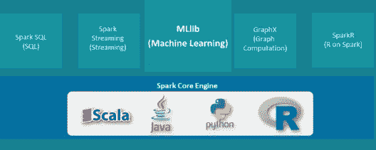

# 机器学习(Python)工业用例

[机器学习算法](https://www.edureka.co/blog/machine-learning-algorithms?utm_source=medium&utm_medium=content-link&utm_campaign=pyspark-mllib-tutorial)，应用和平台正在帮助制造商寻找新的商业模式，微调产品质量，优化生产运作到车间层面。所以让我们继续我们的文章，了解各个行业是如何使用机器学习的。

## **政府:**


公共安全和公共事业等政府机构对机器学习有着特殊的需求。他们用它来进行人脸检测、安全和欺诈检测。公共部门机构正在将机器学习用于政府计划，以获得对政策数据的重要见解。

## **营销与电子商务:**


网上购物的数量正在稳步增长，这使得公司能够收集整个客户体验的详细数据。根据以前的购买情况推荐你可能喜欢的商品的网站正在使用机器学习来分析你的购买历史，并推广你感兴趣的其他商品。

## **运输:**


分析数据以识别模式和趋势是运输行业的关键，这依赖于使**路线更有效**和预测潜在问题以增加盈利能力。公司使用 ML 来实现高效的拼车市场，识别可疑或欺诈账户，建议最佳的上车点和下车点。

## **金融:**


今天，机器学习已经在金融生态系统的许多阶段发挥了不可或缺的作用，从批准贷款到管理资产，再到评估风险。银行和金融行业的其他业务使用机器学习技术来**防止欺诈。**

## **医疗保健:**


由于可穿戴设备和传感器的出现，机器学习是医疗保健行业的一个快速发展趋势，这些设备和传感器可以使用数据来实时评估患者的健康状况。**谷歌**开发了一种机器学习算法，帮助识别乳房 x 光照片上的癌性肿瘤。**斯坦福**正在使用深度学习算法识别皮肤癌。

既然你对什么是机器学习以及它在行业中的各个领域有了概念，让我们继续我们的文章，并了解典型的机器学习生命周期是什么样子的。

# 机器学习生命周期

典型的机器学习周期主要包括两个阶段:

*   培养
*   测试

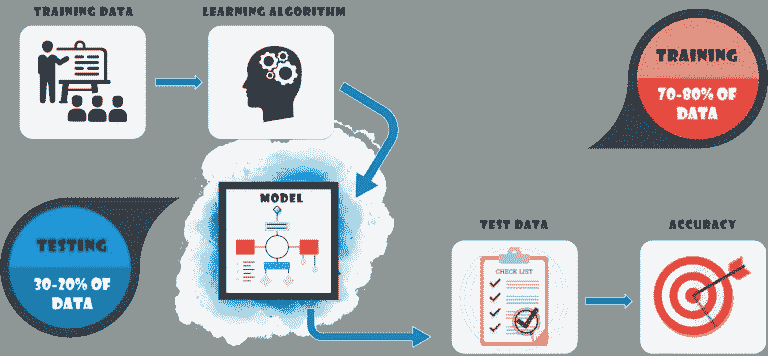

在机器学习中，我们基本上试图创建一个模型来预测测试数据。因此，我们用训练数据来拟合模型，用测试数据来检验模型。生成的模型用来预测未知的结果，称为测试集。正如您所指出的，数据集分为训练集和测试集，以便通过对其进行训练和测试来检查准确性和精确度。

1.  **训练集**:这里有完整的训练数据集。你可以提取特征和训练来适应模型等等。
2.  **测试集**:这里，一旦获得模型，就可以使用在训练集上获得的模型进行预测。

现在，您对典型的机器学习生命周期的工作原理有了一个概念，让我们继续我们关于 MLlib 特性及其支持的各种语言的文章。

# MLlib 功能和算法

我们知道 PySpark 适合迭代算法。使用迭代算法，许多机器学习算法已经在 PySpark MLlib 中实现。除了 PySpark 的效率和可伸缩性，PySpark MLlib APIs 非常用户友好。


# 使用 MLlib 查找黑客

一家公司的系统遭到黑客攻击，大量数据被盗。幸运的是，黑客用来连接的每个会话的元数据都被记录下来，可供我们使用。有 3 个潜在的黑客，甚至更多。

黑客们的一个普遍做法是权衡工作。这意味着黑客攻击的次数大致相同。所以这里我们要用聚类来找出黑客的数量。


## 初始化 Spark 会话

首先，我们需要初始化 spark 会话。

```
from pyspark.sql import SparkSession 
spark = SparkSession.builder.appName('find_hacker').getOrCreate()
```

## 导入 KMeans 库并加载数据集

我们将使用 Kmeans 算法进行分析，为此，我们需要导入 Kmeans 库，然后我们将使用 **spark.read** 方法加载数据集。

```
from pyspark.ml.clustering import KMeans 
dataset = spark.read.csv("file:///home/edureka/Downloads/hack_data.csv",header=True,inferSchema=True)
```

## 检索的数据的架构

让我们看一下数据的模式，以便更好地理解我们正在处理的内容。

```
dataset.printSchema()
```

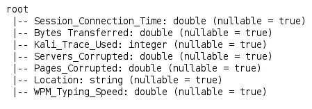

## 导入 VectorAssembler 并创建我们的特征

我们必须使用 VectorAssembler 函数将数据转换为一列，其中数据帧的每一行都包含一个特征向量。为了创建我们的集群，我们需要选择列，然后基于这些列创建我们的 features 列。这里我们使用的是列:

*   会话连接时间
*   传输的字节数
*   Kali_Trace_Used
*   服务器 _ 损坏
*   页面 _ 损坏
*   WPM _ 打字 _ 速度:每分钟字数

```
from pyspark.ml.linalg import Vectors
from pyspark.ml.feature import VectorAssembler

feat_cols = ['Session_Connection_Time', 'Bytes Transferred', 'Kali_Trace_Used',
'Servers_Corrupted', 'Pages_Corrupted','WPM_Typing_Speed']

vec_assembler = VectorAssembler(inputCols = feat_cols, outputCol='features')

final_data = vec_assembler.transform(dataset)
```

## 导入 StandardScaler 库并创建 Scaler

通过计算训练集中样本的相关统计数据，对每个特征独立进行居中和缩放。然后，使用变换方法存储平均值和标准偏差，以便在以后的数据中使用。

数据集的标准化是许多机器学习评估器的共同要求:如果单个特征看起来或多或少不像标准的正态分布数据，它们可能表现不好。

```
from pyspark.ml.feature import StandardScaler 
scaler = StandardScaler(inputCol="features", outputCol="scaledFeatures", withStd=True, withMean=False)
```

## 计算汇总统计数据

让我们通过安装标准缩放器来计算汇总统计数据。然后归一化每个特征，使其具有单位标准偏差。

```
scalerModel = scaler.fit(final_data)

cluster_final_data = scalerModel.transform(final_data)

kmeans3 = KMeans(featuresCol='scaledFeatures',k=3)
kmeans2 = KMeans(featuresCol='scaledFeatures',k=2)
```

## 构建 KMeans 模型并计算 WSSE(在一组平方误差内)

我们必须首先建立我们的模型。然后将所需的聚类数传递给算法。然后我们在设定的误差平方和(WSSSE)内进行计算。我们使用从这些数据中得出的值来判断我们是有 2 个还是 3 个黑客。

```
model_k3 = kmeans3.fit(cluster_final_data)
model_k2 = kmeans2.fit(cluster_final_data)

wssse_k3 = model_k3.computeCost(cluster_final_data)
wssse_k2 = model_k2.computeCost(cluster_final_data)

print("With K=3")
print("Within Set Sum of Squared Errors = " + str(wssse_k3))
print('--'*30)
print("With K=2")
print("Within Set Sum of Squared Errors = " + str(wssse_k2))
```

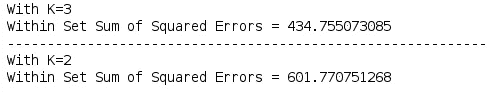

## 检查肘点(WSSSE)

我们将检查 WSSSE 的值 2 到 8，看看我们是否在列表中有一个肘。

```
for k in range(2,9):
kmeans = KMeans(featuresCol='scaledFeatures',k=k)
model = kmeans.fit(cluster_final_data)
wssse = model.computeCost(cluster_final_data)
print("With K={}".format(k))
print("Within Set Sum of Squared Errors = " + str(wssse))
print('--'*30)
```

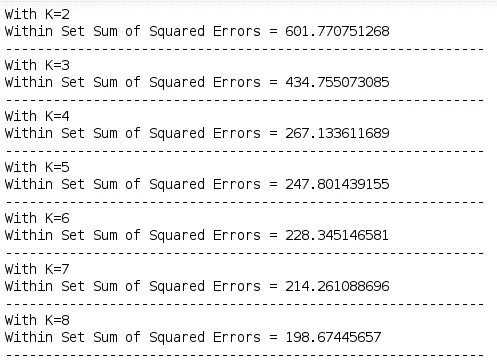

这里我们可以看到，WSSSE 的值在不断减少，我们没有肘。所以 K 的值很可能是 2 而不是 3。让我们继续这个 PySpark MLlib 教程，得出结论。

## 黑客数量的最终检查

让我们根据黑客攻击的数量来找出有多少黑客参与其中。

```
model_k3.transform(cluster_final_data).groupBy('prediction').count().show()
```

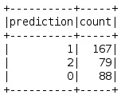

```
model_k2.transform(cluster_final_data).groupBy('prediction').count().show()
```

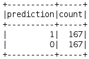

这里我们可以看到，对于 3 名黑客，我们的模型分别产生了 167、79 和 88 次攻击。这是不可能的，因为黑客通常在他们之间分配任务。在我们的模型中，K =2，我们得到 167 次黑客攻击。因此，只有 2 名黑客参与其中。

让我们继续我们的文章，解决许多公司面临的另一个问题。客户流失。

# 基于 MLlib 的客户流失预测

客户流失预测是一项大业务。它通过预测哪些客户可能会取消某项服务的订购来最大限度地减少客户流失。虽然最初用于电信行业，但现在已经成为银行、ISP、保险公司和其他垂直行业的普遍做法。

预测过程在很大程度上是由数据驱动的，并且经常利用先进的机器学习技术。在这里，我们将了解通常使用哪些类型的客户数据，对数据进行一些初步分析，并生成流失预测模型——所有这些都使用 PySpark 及其机器学习框架。


一家营销机构有许多客户使用他们的服务为客户/顾客网站制作广告。他们已经注意到他们有相当多的客户流失。他们现在基本上随机分配客户经理，但希望您创建一个机器学习模型，帮助预测哪些客户将流失(停止购买他们的服务)，以便他们可以正确分配最有风险的客户流失客户经理。幸运的是，他们有一些历史资料。

那么，你能帮助他们吗？

## 加载库

让我们加载所需的库。这里我们将使用逻辑回归。

```
from pyspark.ml.classification import LogisticRegression
```

## 读取训练和测试数据

让我们加载训练数据和测试数据(用于测试目的的输入数据)

```
input_data=spark.read.csv('file:///home/edureka/Downloads/customer_churn.csv',header=True,inferSchema=True)

test_data=spark.read.csv('file:///home/edureka/Downloads/new_customers.csv',header=True,inferSchema=True)
```

## 数据模式

我们将查看数据的模式，以便更好地理解我们正在处理的内容。

```
input_data.printSchema() //training data
```

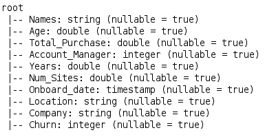

这里我们有列搅动。让我们看看测试数据的模式。

```
test_data.printSchema() //testing data
```

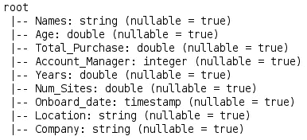

## 使用矢量汇编器

```
from pyspark.ml.linalg import Vectors
from pyspark.ml.feature import VectorAssembler

assembler=VectorAssembler(inputCols=['Age','Total_Purchase','Account_Manager','Years','Num_Sites'],outputCol='features')

output_data=assembler.transform(input_data)
```

## 输出数据的模式

让我们看看输出数据的模式。

```
output_data.printSchema()
```

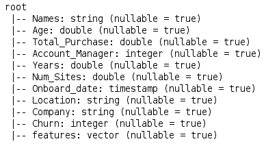

正如你们所看到的，我们在这里有一个功能栏，分类将基于它进行。

## 对数据使用逻辑回归

```
final_data=output_data.select('features','churn')         //creating final data with only 2 columns

train,test=final_data.randomSplit([0.7,0.3])          //splitting data

model=LogisticRegression(labelCol='churn')           //creating model

model=model.fit(train)        //fitting model on training dataset

summary=model.summary

summary.predictions.describe().show()         //summary of the predictions on training data
```

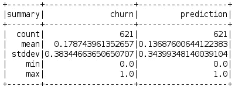

## 导入 BinaryClassificationEvaluator 库并测试

二元分类器的评估比较了分配二元属性的两种方法，其中一种通常是标准方法，另一种正在研究中。有许多度量可用于测量分类器或预测器的性能；由于不同的目标，不同的领域对具体指标有不同的偏好。

```
from pyspark.ml.evaluation import BinaryClassificationEvaluator predictions=model.evaluate(test)
```

接下来，我们将创建一个赋值器，并使用二元分类赋值器来预测流失。

```
evaluator=BinaryClassificationEvaluator(rawPredictionCol='prediction',labelCol='churn')

evaluator.evaluate(predictions.predictions)

model1=LogisticRegression(labelCol='churn')
model1=model1.fit(final_data)

test_data=assembler.transform(test_data)
```

## 查找结果

现在，我们将使用该模型来评估新数据

```
results=model1.transform(test_data) results.select('Company','prediction').show()
```

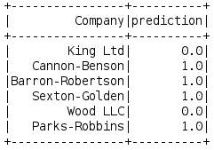

因此，在这里我们可以看到可能离开组织的潜在客户，通过这一分析，我们来到本文的结尾。

我希望你喜欢这篇文章。如果你正在读这篇文章，那么恭喜你！你不再是 PySpark MLlib 的新手。现在就在您系统上尝试这些简单的例子。

如果你想查看更多关于人工智能、DevOps、道德黑客等市场最热门技术的文章，你可以参考 Edureka 的官方网站。

请留意本系列中的其他文章，它们将解释 PySpark 的各个方面。

> 1. [PySpark 教程](/edureka/pyspark-tutorial-87d41dab9657)
> 
> 2. [PySpark Dataframe 教程](/edureka/pyspark-dataframe-tutorial-9335f3d09b4)
> 
> 3.[py spark 中的 RDDs】](/edureka/pyspark-rdd-ef9edd060a25)
> 
> 4. [PySpark 编程](/edureka/pyspark-programming-e007e68fbccb)

*原载于 2018 年 7 月 24 日*[*www.edureka.co*](https://www.edureka.co/blog/pyspark-mllib-tutorial/)*。*