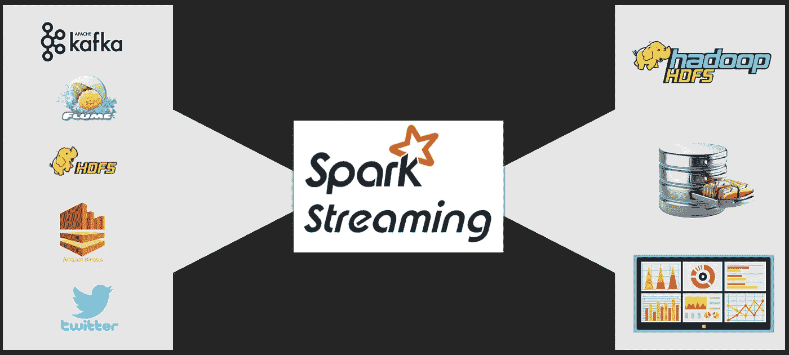
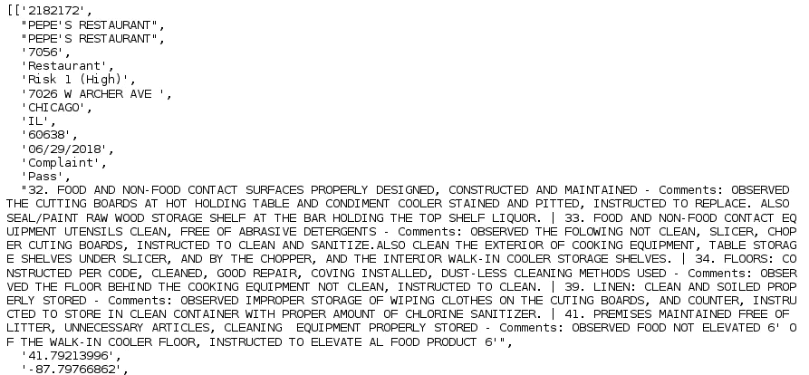
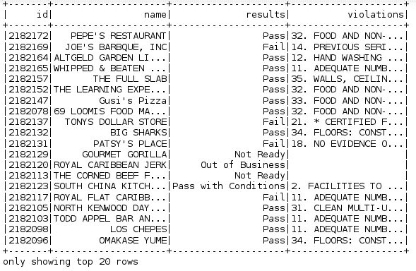
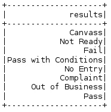
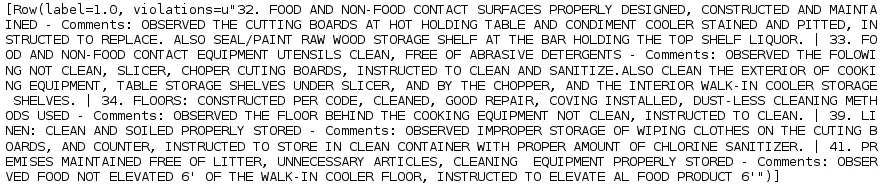
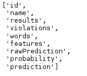
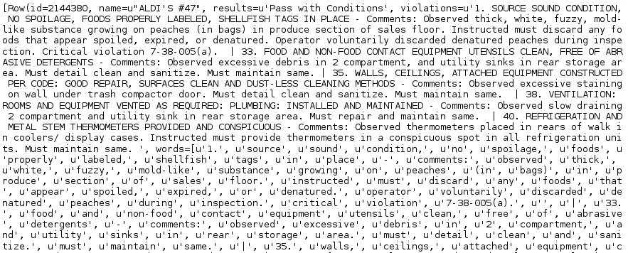
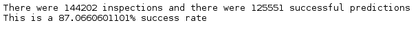

# PySpark 编程——速度与简单的结合

> 原文：<https://medium.com/edureka/pyspark-programming-e007e68fbccb?source=collection_archive---------0----------------------->


PySpark Programming - Edureka

Python 和 Apache Spark 是分析行业最热门的流行语。Apache Spark 是一个流行的开源框架，它确保以闪电般的速度处理数据，并支持各种语言，如 Scala、Python、Java 和 r。然后，它归结为您的语言偏好和工作范围。通过这篇 PySpark 编程文章，我将讨论 Spark 和 Python，以展示 Python 如何利用 Apache Spark 的功能。


在我们开始 PySpark 编程之旅之前，让我列出我将在本文中涉及的主题:

*   什么是 PySpark
*   RDDs
*   数据帧
*   PySpark SQL
*   PySpark 流
*   机器学习(MLlib)

因此，让我们从列表中的第一个主题开始，即 PySpark 编程。

# PySpark 编程

PySpark 是 Apache Spark 和 Python 的合作。

Apache Spark 是一个开源的集群计算框架，围绕速度、易用性和流分析而构建，而 **Python** 是一种通用的高级编程语言。它提供了广泛的库，主要用于机器学习和实时流分析。

换句话说，它是一个用于 Spark 的 Python API，允许您利用 Python 的简单性和 Apache Spark 的强大功能来驯服大数据。


您可能想知道，既然有其他语言可用，为什么我选择 Python 来使用 Spark。为了回答这个问题，我列出了 Python 的一些优势:

*   Python 非常容易学习和实现。
*   它提供了简单而全面的 API。
*   使用 Python，代码的可读性、维护性和熟悉性都要好得多。
*   它为数据可视化提供了各种选项，使用 Scala 或 Java 很难做到这一点。
*   Python 附带了大量的库，如 numpy、pandas、scikit-learn、seaborn、matplotlib 等。
*   它得到了一个庞大而活跃的社区的支持。

# 弹性分布式数据集

[rdd](https://www.edureka.co/blog/pyspark-rdd?utm_source=medium&utm_medium=content-link&utm_campaign=pyspark-programming)是任何 Spark 应用的构建模块。RDDs 代表:

*   ***弹性:*** 容错，能够在故障时重建数据。
*   ***分布式:*** 数据分布在一个集群中的多个节点上。
*   ***数据集:*** 带有值的分区数据的集合。

它是分布式集合上的抽象数据层。它本质上是不可变的，并且遵循*惰性转换*。

使用 rdd，您可以执行两种类型的操作:

1.  转换:这些操作被用来创建一个新的 RDD。
2.  **动作:**这些操作被应用到一个 RDD 上，以指示 Apache Spark 应用计算并将结果传递回驱动程序。

# 数据帧

PySpark 中的 Dataframe 是结构化或半结构化数据的分布式集合。Dataframe 中的数据存储在命名列下的行中，这类似于关系数据库表或 excel 表。

它还与 RDD 有一些共同的属性，比如本质上不可变，遵循惰性求值，以及本质上是分布式的。它支持多种格式，如 JSON、CSV、TXT 等等。此外，您可以从现有的 rdd 或通过编程指定模式来加载它。

# PySpark SQL

PySpark SQL 是 PySpark 核心之上的一个高级抽象模块。它主要用于处理结构化和半结构化数据集。它还提供了一个优化的 API，可以从包含不同文件格式的各种数据源中读取数据。因此，使用 PySpark，您可以通过使用 SQL 和 HiveQL 来处理数据。由于这个特性，PySpark SQL 在数据库程序员和 Apache Hive 用户中慢慢流行起来。

# PySpark 流

PySpark 流是一个可扩展的容错系统，遵循 RDD 批处理范式。它基本上以小批量或批量间隔操作，范围从 500 毫秒到更大的间隔窗口。

在这种情况下，Spark Streaming 从诸如 [Apache Flume](https://www.edureka.co/blog/apache-flume-tutorial?utm_source=medium&utm_medium=content-link&utm_campaign=pyspark-programming) 、Kinesis、Kafka、TCP sockets 等来源接收连续的输入数据流。然后，这些流式数据根据*批处理间隔*在内部分解成多个更小的批处理，并转发给 Spark 引擎。Spark Engine 使用复杂的算法处理这些数据批次，这些算法用 map、reduce、join 和 window 等高级函数表示。处理完成后，处理后的批处理将被推送到数据库、文件系统和实时仪表板。


Spark 流的关键抽象是离散化流(d Stream)。数据流建立在 rdd 之上，便于 Spark 开发人员在 rdd 和批处理的相同环境中工作，以解决数据流问题。此外，Spark Streaming 还集成了 MLlib、SQL、DataFrames 和 GraphX，拓宽了您的功能范围。作为一个高级 API，Spark Streaming 为有状态操作提供了容错的"*恰好一次"*语义。

> ***注意*** *:“恰好一次”语义意味着事件将被流应用中的所有操作符“恰好一次”处理，即使发生任何故障。*

下图显示了火花流的基本组件。



正如您所看到的，数据从各种来源(如 Kafka、Flume、Twitter、ZeroMQ、Kinesis 或 TCP sockets 等等)被接收到 Spark 流中。此外，这些数据还使用复杂的算法进行处理，这些算法用 map、reduce、join 和 window 等高级函数表示。最后，这些经过处理的数据被推送到各种文件系统、数据库和实时控制面板，以供进一步利用。

我希望这能让您清楚地了解 PySpark 流是如何工作的。现在让我们继续这篇 PySpark 编程文章的最后一个但也是最吸引人的主题，即机器学习。

# 机器学习

众所周知，Python 是一种成熟的语言，多年来一直被大量用于数据科学和机器学习。在 PySpark 中，机器学习是通过一个名为 MLlib(机器学习库)的 Python 库来实现的。它只不过是 PySpark 核心上的一个包装器，使用分类、聚类、线性回归等机器学习算法来执行数据分析。

使用 PySpark 进行机器学习的一个诱人的特性是，它可以在分布式系统上工作，并且高度可伸缩。

MLlib 公开了 PySpark 的三个核心机器学习功能:

1.  **数据准备:** It **提供各种功能，如提取、转换、选择、散列等。**
2.  **机器学习算法:**利用一些流行的高级回归、分类、聚类算法进行机器学习。
3.  **实用工具:**拥有卡方检验、描述统计、线性代数、模型评估方法等统计方法。

我来给你演示一下如何通过逻辑回归使用*分类*实现机器学习。

在这里，我将对芝加哥市的食品检测数据进行简单的预测分析。

```
##Importing the required libraries
from pyspark.ml import Pipeline
from pyspark.ml.classification import LogisticRegression
from pyspark.ml.feature import HashingTF, Tokenizer
from pyspark.sql import Row
from pyspark.sql.functions import UserDefinedFunction
from pyspark.sql.types import *

##creating a RDD by importing and parsing the input data
def csvParse(s):
import csv
from StringIO import StringIO
sio = StringIO(s)
value = csv.reader(sio).next()
sio.close()
return value

food_inspections = sc.textFile('file:////home/edureka/Downloads/Food_Inspections_Chicago_data.csv')\
.map(csvParse)

##Display data format
food_inspections.take(1)
```



```
#Structuring the data
schema = StructType([
StructField("id", IntegerType(), False),
StructField("name", StringType(), False),
StructField("results", StringType(), False),
StructField("violations", StringType(), True)])
#creating a dataframe and a temporary table (Results) required for the predictive analysis. 
##sqlContext is used to perform transformations on structured data
ins_df = spark.createDataFrame(food_inspections.map(lambda l: (int(l[0]), l[1], l[12], l[13])) , schema)
ins_df.registerTempTable('Count_Results')
ins_df.show()
```



```
##Let's now understand our dataset
#show the distinct values in the results column
result_data = ins_df.select('results').distinct().show()
```



```
##converting the existing dataframe into a new dataframe 
###each inspection is represented as a label-violations pair. 
####Here 0.0 represents a failure, 1.0 represents a success, and -1.0 represents some results besides those two
def label_Results(s):
if s == 'Fail':
return 0.0
elif s == 'Pass with Conditions' or s == 'Pass':
return 1.0
else:
return -1.0
ins_label = UserDefinedFunction(label_Results, DoubleType())
labeled_Data = ins_df.select(ins_label(ins_df.results).alias('label'), ins_df.violations).where('label >= 0')
labeled_Data.take(1)
```



```
##Creating a logistic regression model from the input dataframe
tokenizer = Tokenizer(inputCol="violations", outputCol="words")
hashingTF = HashingTF(inputCol=tokenizer.getOutputCol(), outputCol="features")
lr = LogisticRegression(maxIter=10, regParam=0.01)
pipeline = Pipeline(stages=[tokenizer, hashingTF, lr])
model = pipeline.fit(labeled_Data)
## Evaluating with Test Data

test_Data = sc.textFile('file:////home/edureka/Downloads/Food_Inspections_test.csv')\
.map(csvParse) \
.map(lambda l: (int(l[0]), l[1], l[12], l[13]))
test_df = spark.createDataFrame(test_Data, schema).where("results = 'Fail' OR results = 'Pass' OR results = 'Pass with Conditions'")
predict_Df = model.transform(test_df)
predict_Df.registerTempTable('Predictions')
predict_Df.columns
```



```
## Printing 1st row
predict_Df.take(1)
```



```
## Predicting the final result
numOfSuccess = predict_Df.where("""(prediction = 0 AND results = 'Fail') OR
(prediction = 1 AND (results = 'Pass' OR
results = 'Pass with Conditions'))""").count()
numOfInspections = predict_Df.count()
print "There were", numOfInspections, "inspections and there were", numOfSuccess, "successful predictions"
print "This is a", str((float(numOfSuccess) / float(numOfInspections)) * 100) + "%", "success rate"
```



至此，我们结束了这篇关于 PySpark 编程的博客。希望它有助于增加你的知识价值。

如果你想查看更多关于人工智能、DevOps、道德黑客等市场最热门技术的文章，那么你可以参考 [Edureka 的官方网站。](https://www.edureka.co/blog/?utm_source=medium&utm_medium=content-link&utm_campaign=pyspark-programming)

请留意本系列中的其他文章，它们将解释 PySpark 的各个方面。

> 1. [PySpark 教程](/edureka/pyspark-tutorial-87d41dab9657)
> 
> 2. [PySpark 数据帧教程](/edureka/pyspark-dataframe-tutorial-9335f3d09b4)
> 
> 3.[py spark 中的 rdd](/edureka/pyspark-rdd-ef9edd060a25)
> 
> 4. [PySpark MLlib 教程](/edureka/pyspark-mllib-tutorial-759391dbb08a)

*原载于 2018 年 8 月 14 日*[*【www.edureka.co】*](https://www.edureka.co/blog/pyspark-programming/)*。*