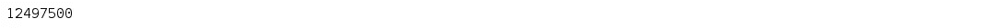

# PySpark RDD 综合指南

> 原文：<https://medium.com/edureka/pyspark-rdd-ef9edd060a25?source=collection_archive---------0----------------------->


PySpark RDD Tutorial — Edureka

谈到大数据分析，Apache Spark 是最好的框架之一。这项强大的技术刚与一种简单而高效的语言如 [Python](https://www.edureka.co/blog/python-tutorial?utm_source=medium&utm_medium=content-link&utm_campaign=pyspark-rdd) 集成，就给了我们一个极其方便易用的 API，叫做 PySpark。在本文中，我将介绍 PySpark 的*构建模块*之一，称为**弹性分布式数据集**，或者更通俗地称为 **PySpark RDD** 。

学完本 PySpark RDD 教程后，您将对以下主题有所了解:

*   为什么是 RDDs？
*   什么是 PySpark RDDs？
*   rdd 的特点
*   派斯帕克的 RDD 行动
*   PySpark RDD 用例

# 为什么是 RDDs？

迭代分布式计算，即在多个作业上处理数据需要在它们之间重用和共享数据。在 rdd 出现之前，像 Hadoop 这样的框架在处理多个操作/任务时面临困难。此外，还需要一个稳定的分布式中间数据存储，比如 HDFS 或亚马逊 S3。这些用于**数据共享的媒介**有助于执行各种计算，如逻辑回归、K 均值聚类、页面排名算法、特别查询等。但是没有什么是免费的，数据共享会导致数据处理速度变慢，因为需要多次 I/O 操作，比如复制和序列化。这种情况描述如下:


因此，需要一种能够通过数据共享克服多个 I/O 操作的问题并减少其数量的东西。这就是 rdd**与图片完全吻合的地方。**

# 什么是 PySpark RDDs？

*弹性分布式数据集(RDDs)是一种分布式内存抽象，帮助程序员在大型集群上以容错方式执行内存计算。*

rdd 被认为是 PySpark 的 ***主干。它是基本的无模式数据结构的先驱之一，可以处理结构化和非结构化数据。内存数据共享使 RDDs **比网络和磁盘共享快 10-100 倍****。*****

****

**现在你可能想知道它的工作原理。嗯，RDD 中的数据是根据一个键分割成块的。rdd 具有很高的弹性，也就是说，当相同的数据块在多个执行器节点上复制时，它们能够从任何问题中快速恢复。因此，即使一个执行器节点失败，另一个仍将处理数据。这允许您通过利用多个节点的能力，非常快速地对数据集执行函数计算。**

****

**此外，一旦你创建了一个 RDD，它就变成了不可改变的。我所说的不可变的意思是，一个对象的状态在它被创建后不能被修改，但是它们肯定可以被转换。**

**在阅读本文之前，让我先介绍一些 PySpark 更有趣的特性。**

# **rdd 的特点**

****

1.  *****内存计算*** *:* 它将性能提高了一个数量级。**
2.  *****惰性评估****:*rdd 中的所有转换都是惰性的，即不立即计算结果。**
3.  *****容错*** *:* RDDs 跟踪数据沿袭信息，自动重建丢失的数据。**
4.  *****不变性*** *:* 数据可以随时创建或检索，一旦定义，其值不可更改。**
5.  *****分区*** *:* 它是 PySpark RDD 中并行的基本单位。**
6.  *****持久性*** *:* 用户可以重用 PySpark RDDs，并为其选择存储策略。**
7.  *****粗粒度操作*** *:* 这些操作通过 map 或 filter 或 group by 操作应用于数据集中的所有元素。**

**在本文的下一部分，我将向您介绍 PySpark RDDs 提供的各种操作。**

# **派斯帕克的 RDD 行动**

**RDD 支持两种类型的操作，即:**

## *****变换*** *:***

**这些是应用于 RDD 以创建新 RDD 的操作。转换遵循**惰性评估**的原则(这意味着直到一个动作被触发，执行才会开始)。这允许您在任何时候通过调用数据上的操作来执行操作。rdd 提供的一些转换是:**

*   **地图**
*   **平面地图**
*   **过滤器**
*   **明显的**
*   **reduceByKey**
*   **映射分区**
*   **排序比**

## *****动作*** *:***

**动作是在 RDD 上应用的操作，用于指示 Apache Spark 应用计算并将结果传递回驱动程序。一些行动包括:**

*   **收集**
*   **收藏地图**
*   **减少**
*   **计数键/计数值**
*   **拿**
*   **第一**

**让我来帮你在 PySpark 中创建一个 RDD，并对其应用一些操作。**

## **创建和显示 RDD**

```
myRDD = sc.parallelize([('JK', 22), ('V', 24), ('Jimin',24), ('RM', 25), ('J-Hope', 25), ('Suga', 26), ('Jin', 27)]) 
myRDD.take(7)
```

****

## **从文本文件中读取数据并显示前 4 个元素**

```
New_RDD = sc.textFile("file:///home/edureka/Desktop/Sample") New_RDD.take(4)
```

****

## **更改分区的最小数量并将数据从字符串列表映射到列表列表**

```
CSV_RDD = (sc.textFile("file:///home/edureka/Downloads/fifa_players.csv", minPartitions= 4).map(lambda element: element.split("\t"))) CSV_RDD.take(3)
```

****

## **计算 RDD 的总行数**

```
CSV_RDD.count()
```

****

## **创建一个函数将数据转换成小写并拆分它**

```
def Func(lines):
lines = lines.lower()
lines = lines.split()
return lines
Split_rdd = New_RDD.map(Func)
Split_rdd.take(5)
```

****

## **使用扁平化数据创建新的 RDD，并从整个 RDD 中过滤掉“停用词”**

```
stopwords = ['a','all','the','as','is','am','an','and','be','been','from','had','I','I’d','why','with']
RDD = New_RDD.flatMap(Func)
RDD1 = RDD.filter(lambda x: x not in stopwords)
RDD1.take(4)
```

****

## **过滤以“c”开头的单词**

```
import re
filteredRDD = RDD.filter(lambda x: x.startswith('c'))
filteredRDD.distinct().take(50)
```

****

## **按关键字对数据进行分组，然后进行排序**

```
rdd_mapped = RDD.map(lambda x: (x,1))
rdd_grouped = rdd_mapped.groupByKey()
rdd_frequency = rdd_grouped.mapValues(sum).map(lambda x: (x[1],x[0])).sortByKey(False)
rdd_frequency.take(10)
```

****

## **用键-值对创建 rdd**

```
a = sc.parallelize([('a',2),('b',3)]) 
b = sc.parallelize([('a',9),('b',7),('c',10)])
```

## ****在 rdd 上执行 Join 操作****

```
c = a.join(b) 
c.collect()
```

****

## **创建 RDD 并执行 lambda 函数以获取 RDD 中元素的总和**

```
num_rdd = sc.parallelize(range(1,5000))
num_rdd.reduce(lambda x,y: x+y)
```

****

## **使用 ReduceByKey 转换减少数据**

```
data_keydata_key = sc.parallelize([('a', 4),('b', 3),('c', 2),('a', 8),('d', 2),('b', 1),('d', 3)],4) data_keydata_key.reduceByKey(lambda x, y: x + y).collect()
```

****

## **将数据保存在文本文件中**

```
RDD3.saveAsTextFile("file:///home/edureka/Desktop/newoutput.txt")
```

## **基于关键字对数据进行排序**

```
test = [('a', 1), ('b', 2), ('1', 3), ('d', 4), ('2', 5)] sc.parallelize(test).sortByKey(True, 1).collect()
```

****

## **执行集合运算**

```
##Creating two new RDDs 
rdd_a = sc.parallelize([1,2,3,4]) 
rdd_b = sc.parallelize([3,4,5,6])
```

*   ****路口****

```
rdd_a.intersection(rdd_b).collect()
```

****

*   ****减法****

```
rdd_a.subtract(rdd_b).collect()
```

****

*   ****笛卡尔****

```
rdd_a.cartesian(rdd_b).collect()
```

****

*   ****工会****

```
rdd_a.union(rdd_b).collect()
```

****

**我希望您现在已经熟悉 PySpark RDDs 了。因此，让我们深入研究一下，看看如何使用这些 rdd 来解决现实生活中的用例。**

# **PySpark RDD 用例**

****

## **问题陈述**

**你必须根据图示的网页系统来计算一组网页的网页排名。下面是我们系统中的四个网页，亚马逊、谷歌、维基百科和 YouTube。为了便于访问，我们分别将其命名为 a、b、c 和 d。这里，网页' a '有到网页 b、c 和 d 的出站链接。类似地，网页' b '有到网页 d 和 c 的出站链接。网页' c '有到网页 b 的出站链接，网页' d '有到网页 a 和 c 的出站链接。**

****

## **解决办法**

**为了解决这个问题，我们将实现由谢尔盖·布林和拉里·佩奇开发的页面排序算法。该算法有助于确定特定网页在一组网页中的排名。页面排名越高，它在搜索结果列表中的位置就越高。因此，将具有更大的相关性。**

**对页面排名的贡献由以下公式给出:**

****

**让我来给你分析一下:**

****PRt+1(Pi)** =网站的页面排名**

****PRt(Pj)** =入站链接的页面排名**

****C(Pj)** =该页面上的链接数量**

**在我们的问题陈述中，显示了网页‘a’具有三个出站链接。所以根据算法，页面 a 对页面 d 的页面排名的贡献是 PR(a) / 3。现在我们必须计算页面 b 对页面 d 的贡献。页面 b 有两个出站链接:第一个到页面 c，第二个到页面 d。因此，页面 b 的贡献是 PR(b) / 2。**

**因此，页面 d 的页面等级将被更新如下，其中 s 被称为阻尼因子:**

**PR(d) = 1 — s + s × (PR(a)/3 + PR(b)/2)**

**现在让我们使用 PySpark RDDs 来执行它。**

```
##Creating Nested Lists of Web Pages with Outbound Links
pageLinks = [['a', ['b','c','d']],
['c', ['b']],['b', ['d','c']],['d', ['a','c']]]

##Initializing Rank #1 to all the webpages
pageRanks = [['a',1],['c',1],['b',1],['d',1]]

##Defining the number of iterations for running the page rank
###It will return the contribution to the page rank for the list of URIs
def rankContribution(uris, rank):
numberOfUris = len(uris)
rankContribution = float(rank) / numberOfUris
newrank =[]
for uri in uris:
newrank.append((uri, rankContribution))
return newrank

##Creating paired RDDs of link data
pageLinksRDD = sc.parallelize(pageLinks, 2)
pageLinksRDD.collect()
```

****

```
##Creating the paired RDD of our rank data 
pageRanksRDD = sc.parallelize(pageRanks, 2)
pageRanksRDD.collect()
```

****

```
##Defining the number of iterations and the damping factor, s
numIter = 20
s = 0.85

##Creating a Loop for Updating Page Rank
for i in range(numIter):
linksRank = pageLinksRDD.join(pageRanksRDD)
contributedRDD = linksRank.flatMap(lambda x : rankContribution(x[1][0],x[1][1]))
sumRanks = contributedRDD.reduceByKey(lambda v1,v2 : v1+v2)
pageRanksRDD = sumRanks.map(lambda x : (x[0],(1-s)+s*x[1]))

pageRanksRDD.collect()
```

****

**这给我们的结果是，***‘c’具有最高的页面等级，其次是‘a’、‘d’和‘b’***。**

**就这样，我们结束了这个 PySpark RDD。希望它有助于增加你的知识价值。**

**如果你想查看更多关于人工智能、DevOps、道德黑客等市场最热门技术的文章，你可以参考 Edureka 的官方网站。**

**请留意本系列中的其他文章，它们将解释 PySpark 的各个方面。**

> **1. [PySpark 教程](/edureka/pyspark-tutorial-87d41dab9657)**
> 
> **2. [PySpark Dataframe 教程](/edureka/pyspark-dataframe-tutorial-9335f3d09b4)**
> 
> **3. [PySpark MLlib 教程](/edureka/pyspark-mllib-tutorial-759391dbb08a)**
> 
> **4. [PySpark 编程](/edureka/pyspark-programming-e007e68fbccb)**

***原载于 2018 年 8 月 10 日*[*www.edureka.co*](https://www.edureka.co/blog/pyspark-rdd/)*。***