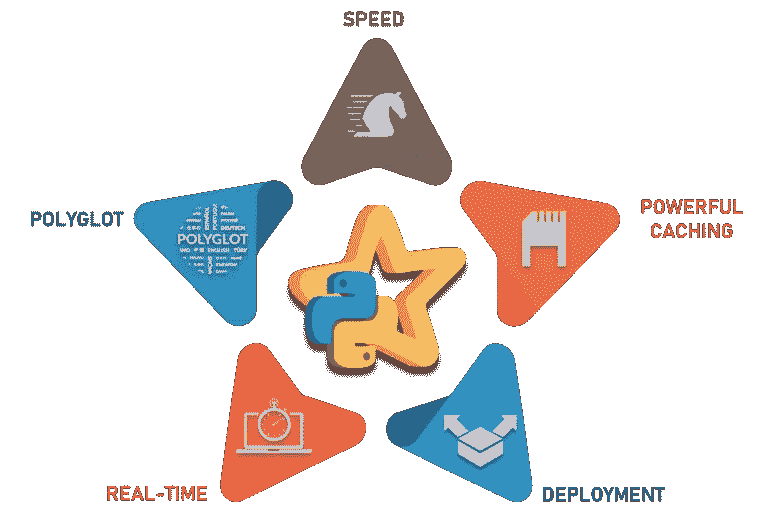
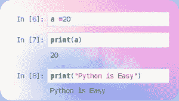
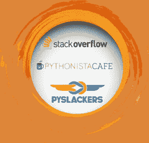
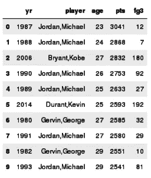
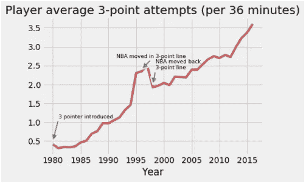
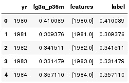
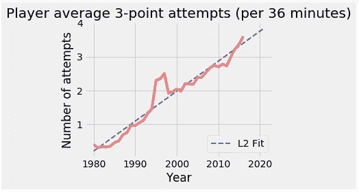

# PySpark 教程——使用 Python 学习 Apache Spark

> 原文：<https://medium.com/edureka/pyspark-tutorial-87d41dab9657?source=collection_archive---------0----------------------->


PySpark Tutorial — Edureka

在一个数据以如此惊人的速度产生的世界里，在正确的时间对数据进行正确的分析是非常有用的。实时处理大数据并执行分析的最令人惊叹的框架之一是 [Apache Spark](https://www.edureka.co/blog/spark-tutorial?utm_source=medium&utm_medium=content-link&utm_campaign=pyspark-tutorial) 。总之，*Python for Spark* 或 PySpark 是最受欢迎的认证课程之一，让 Scala for Spark 望尘莫及。因此，在本文中，我将讨论以下主题:

*   PySpark 是什么？
*   业内的 PySpark
*   为什么选择 Python？
*   火花 RDDs
*   使用 PySpark 进行机器学习

# PySpark 是什么？

Apache Spark 是一个快速集群计算框架，用于处理、查询和分析大数据。基于内存计算，它比其他几个大数据框架有优势。



最初用 Scala 编程语言编写，开源社区开发了一个惊人的工具，为 Apache Spark 支持 Python。PySpark 通过它的库 **Py4j 帮助数据科学家与 Apache Spark 和 Python 中的 rdd 接口。【PySpark 有许多特性使其成为比其他框架更好的框架:**

*   **速度:**比传统大规模数据处理框架快 100 倍
*   **强大的缓存:**简单的编程层提供了强大的缓存和磁盘持久性功能
*   **部署:**可以通过 Mesos、Hadoop via Yarn 或者 Spark 自己的集群管理器进行部署
*   **实时:**实时计算&由于内存计算，延迟较低
*   **Polyglot:** 支持 Scala、Java、Python 和 R 编程

让我们继续我们的文章，看看 Spark 在行业中的应用。

# 业内的 PySpark

每个[行业都围绕着大数据](https://www.edureka.co/blog/big-data-applications-revolutionizing-various-domains?utm_source=medium&utm_medium=content-link&utm_campaign=pyspark-tutorial)，哪里有大数据，哪里就有分析。所以让我们来看看 Apache Spark 被应用的各个行业。


媒体是向在线流媒体发展的最大行业之一。**网飞**使用 Apache Spark 进行实时流处理，为其客户提供个性化的在线推荐。它每天处理 4500 亿个流向服务器端应用程序的事件。


**金融**是 Apache Spark 的实时处理发挥重要作用的另一个领域。银行正在使用 Spark 访问和分析社交媒体档案，以获得洞察力，帮助他们为**信用风险评估**、定向广告和客户细分做出正确的商业决策。**使用 Spark 后，客户流失**也有所减少。**欺诈检测**是 Spark 参与的机器学习中应用最广泛的领域之一。


**医疗保健**提供商正在使用 Apache Spark**分析患者记录**以及过去的临床数据，以确定哪些患者在出院后可能面临健康问题。Apache Spark 用于**基因组测序**以减少处理基因组数据所需的时间。


**零售和电子商务**如果不使用分析和有针对性的广告，人们很难想象这个行业会如何发展。当今最大的电子商务平台之一**阿里巴巴**运行着一些世界上最大的 Spark 作业，以分析数 Pb 的数据。阿里巴巴在图像数据中执行**特征提取**。**易贝**利用 Apache Spark 提供**针对性优惠**，提升客户体验，优化整体性能。


**旅游**行业也用阿帕奇 Spark。帮助用户计划完美旅行的领先旅游网站猫途鹰正在使用 Apache Spark 加速其个性化客户推荐。猫途鹰使用 apache spark 向数百万旅行者提供建议，方法是**比较数百个网站**为其客户找到最佳酒店价格。

本 PySpark 教程的一个重要方面是理解我们为什么需要使用 Python？为什么不是 Java，Scala 或者 R？

# 为什么选择 Python？

对于程序员来说，Python 相对来说更容易学习，因为它的语法和标准库。此外，它是一种动态类型语言，这意味着 rdd 可以保存多种类型的对象。



**大量的库:** Scala 没有足够的数据科学工具和像 Python 这样的库来进行机器学习和自然语言处理。此外，Scala 缺乏良好的可视化和本地数据转换。


巨大的社区支持: Python 有一个全球社区，有数百万开发者，他们在数千个虚拟和物理位置进行在线和离线交互。



本 PySpark 教程中最重要的主题之一是 rdd 的使用。让我们了解一下什么是 rdd

# 火花 RDDs

当谈到迭代分布式计算时，即在计算中通过多个作业处理数据时，我们需要在多个作业之间重用或共享数据。像 Hadoop 这样的早期框架在处理多种操作/作业时存在问题，比如

*   将数据存储在中间存储器中，如 HDFS
*   多个 I/O 作业会降低计算速度
*   复制和序列化，这反过来又会使过程变得更慢

rdd 试图通过支持容错分布式内存计算来解决所有问题。RDD 是弹性分布式数据集的缩写。 RDD 是一种分布式内存抽象，允许程序员以容错方式在大型集群上执行内存计算。它们是在一组机器上分区的**只读对象集合**，如果一个分区丢失，可以重建这些对象。在 rdd 上执行多种操作:

*   **转换:**转换从现有的数据集创建一个新的数据集。懒惰评估
*   **动作:** Spark 仅在 RDDs 上调用动作时强制执行计算

让我们了解一些转换、动作和功能

## **读取文件并显示前 n 个元素:**

```
rdd = sc.textFile("file:///home/edureka/Desktop/Sample") 
rdd.take(n)
```

**输出:**

```
[u'Deforestation is arising as the main environmental and social issue which has now taken the form of more than a powerful demon. ',
 u'We must know about the causes, effects and ways to solve the problems arisen because of the deforestation. ',
 u'We have provided many paragraphs, long and short essay on deforestation in order to help your kids and children to get aware about the problem as well as get participated in the essay writing competition in the school or outside the school. ',
 u'You can select any deforestation essay given below according to the class standard. ',
 u'Deforestation is arising as the major global problem to the society and environment.']
```

## **转换为小写并拆分:(小写并拆分)**

```
def Func(lines):
lines = lines.lower()
lines = lines.split()
return lines
rdd1 = rdd.map(Func)

rdd1.take(5)
```

**输出:**

```
[[u'deforestation',
  u'is',
  u'arising',
  u'as',
  u'the',
  u'main',
  u'environmental',
  u'and',
  u'social',
  u'issue',
  u'which',
  u'has',
  u'now',
  u'taken',
.....
.
.
.
]
```

## **删除停用词:(过滤器)**

```
stop_words = ['a','all','the','as','is','am','an','and','be','been','from','had','I','I’d','why','with']
rdd2 = rdd1.filter(lambda z: z not in stop_words)
rdd2.take(10)
```

**输出:**

```
[u'deforestation',
 u'arising',
 u'main',
 u'environmental',
 u'social',
 u'issue',
 u'which',
 u'has',
 u'now',
 u'taken']
```

## **从 1 到 500 的数字之和:(减少)**

```
sum_rdd = sc.parallelize(range(1,500))
sum_rdd.reduce(lambda x,y: x+y)
```

**输出:**

```
124750
```

# 使用 PySpark 进行机器学习

继续我们的文章，我们来分析一些篮球数据，做一些未来预测。所以，这里我们要用的是自 **1980** 【三分球引入年】以来 NBA 所有球员的篮球数据。


## **数据加载:**

```
df = spark.read.option('header','true')\
.option('inferSchema','true')
.csv("file:///home/edureka/Downloads/season_totals.csv")
```

## **打印栏目:**

```
print(df.columns)
```

**输出:**

```
['_c0', 'player', 'pos', 'age', 'team_id', 'g', 'gs', 'mp', 'fg', 'fga', 'fg_pct', 'fg3', 'fg3a', 'fg3_pct', 'fg2', 'fg2a', 'fg2_pct', 'efg_pct', 'ft', 'fta', 'ft_pct', 'orb', 'drb', 'trb', 'ast', 'stl', 'blk', 'tov', 'pf', 'pts', 'yr']
```

## **球员排序(OrderBy)和托班达斯:**

在这里，我们根据一个赛季的得分对球员进行分类。

```
df.orderBy('pts',ascending = False).limit(10).toPandas()[['yr','player','age','pts','fg3']]
```

**输出:**



## **使用 DSL 和 matplotlib:**

这里我们分析的是在 **36 分钟**的时限内**每个赛季的平均 3 分出手次数**【这个区间对应于一场休息充分的近似完整的 NBA 比赛】。我们使用三分球投篮次数(fg3a)和上场时间(mp)来计算这一指标，然后使用 **matlplotlib** 来绘制结果。

```
from pyspark.sql.functions import col
fga_py = df.groupBy('yr')\
.agg({'mp' : 'sum', 'fg3a' : 'sum'})
.select(col('yr'), (36*col('sum(fg3a)')/col('sum(mp)')).alias('fg3a_p36m'))\
.orderBy('yr')

from matplotlib import pyplot as plt
import seaborn as sns
plt.style.use('fivethirtyeight')

_df = fga_py.toPandas()
plt.plot(_df.yr,_df.fg3a_p36m, color = '#CD5C5C')
plt.xlabel('Year')
_=plt.title('Player average 3-point attempts (per 36 minutes)')
plt.annotate('3 pointer introduced', xy=(1980, .5), xytext=(1981, 1.1), fontsize = 9,
arrowprops=dict(facecolor='grey', shrink=0, linewidth = 2))
plt.annotate('NBA moved in 3-point line', xy=(1996, 2.4), xytext=(1991.5, 2.7), fontsize = 9,
arrowprops=dict(facecolor='grey', shrink=0, linewidth = 2))
plt.annotate('NBA moved back\n3-point line', xy=(1998, 2.), xytext=(1998.5, 2.4), fontsize = 9, arrowprops=dict(facecolor='grey', shrink=0, linewidth = 2))
```

**输出:**



## **线性回归和向量汇编:**

我们可以用一个线性回归模型来拟合这条曲线，以模拟未来 5 年的投篮次数。我们必须使用 VectorAssembler 函数将数据转换为单个列。这是 MLlib 中线性回归 API 的一个**需求**。

```
from pyspark.ml.feature import VectorAssembler
t = VectorAssembler(inputCols=['yr'], outputCol = 'features')
training = t.transform(fga_py)\
.withColumn('yr',fga_py.yr)\
.withColumn('label',fga_py.fg3a_p36m)
training.toPandas().head()
```

**输出:**



## **建筑模型:**

然后，我们使用转换后的数据构建线性回归模型对象。

```
from pyspark.ml.regression import LinearRegression 
lr = LinearRegression(maxIter=10)
model = lr.fit(training)
```

## **将训练好的模型应用到数据集:**

我们将经过训练的模型对象模型应用于原始训练集以及未来 5 年的数据

```
from pyspark.sql.types import Row

# apply model for the 1979-80 season thru 2020-21 season
training_yrs = training.select('yr').rdd.map(lambda x: x[0]).collect()
training_y = training.select('fg3a_p36m').rdd.map(lambda x: x[0]).collect()
prediction_yrs = [2017, 2018, 2019, 2020, 2021]
all_yrs = training_yrs + prediction_yrs

# built testing DataFrame
test_rdd = sc.parallelize(all_yrs)
row = Row('yr')&amp;amp;lt
all_years_features = t.transform(test_rdd.map(row).toDF())

# apply linear regression model
df_results = model.transform(all_years_features).toPandas()
```

## **绘制最终预测:**

然后，我们可以绘制我们的结果，并将图形保存在指定的位置。

```
plt.plot(df_results.yr,df_results.prediction, linewidth = 2, linestyle = '--',color = '#224df7', label = 'L2 Fit')
plt.plot(training_yrs, training_y, color = '#f08080', label = None)
plt.xlabel('Year')
plt.ylabel('Number of attempts')
plt.legend(loc = 4)
_=plt.title('Player average 3-point attempts (per 36 minutes)')
plt.tight_layout()
plt.savefig("/home/edureka/Downloads/Images/REGRESSION.png")
```

**输出:**



有了这个图表，我们就到了这篇文章的结尾。

就这样了，伙计们！

我希望你们在这篇文章中了解了什么是 Pyspark，为什么 Python 最适合于 Spark，RDDs 和 PySpark 的机器学习。恭喜你，你不再是 PySpark 的新手了。

如果你想查看更多关于人工智能、DevOps、道德黑客等市场最热门技术的文章，那么你可以参考 [Edureka 的官方网站](https://www.edureka.co/blog/?utm_source=medium&utm_medium=content-link&utm_campaign=pyspark-tutorial)。

请留意本系列中的其他文章，它们将解释 PySpark 的各个方面。

> 1. [PySpark 数据帧教程](/edureka/pyspark-dataframe-tutorial-9335f3d09b4)
> 
> 2.[py spark 中的 rdd](/edureka/pyspark-rdd-ef9edd060a25)
> 
> 3. [PySpark MLlib 教程](/edureka/pyspark-mllib-tutorial-759391dbb08a)
> 
> 4. [PySpark 编程](/edureka/pyspark-programming-e007e68fbccb)

*原载于 2018 年 6 月 28 日*[*www.edureka.co*](https://www.edureka.co/blog/pyspark-tutorial/)*。*