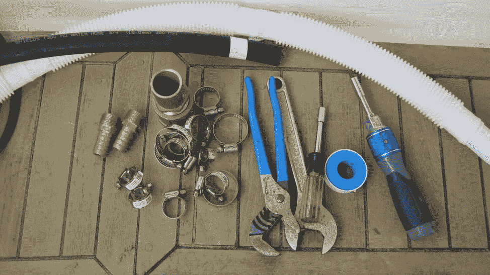

# Python 2 补救和海上问题

> 原文：<https://medium.com/capital-one-tech/python-2-remediation-and-problems-at-sea-a58e805d6468?source=collection_archive---------5----------------------->

## Python 2.7 日落之后，你的应用会被抛弃吗？

> 我以前住在帆船上。⛵️
> 
> 听起来很浪漫，对吧？💌
> 
> 日落。🌄
> 
> 热带岛屿。🏝

船上的生活还包括处理一系列正在磨损的事情。海洋是美丽的。抛锚时的轻微摇晃是令人愉快的。但是，组件上的循环负载最终也会导致疲劳。海洋生物的一些好的特征也有潜伏在水面下的怪物。出海意味着你进入了食物链，你不是顶端捕食者。最可怕的海怪是藤壶和藻类，它们从你的船进入水中的那一刻起就开始攻击你的基础设施——你的船。

# ***这和 Python 有什么关系？***

> *Python 2 很像我船上电池的破旧充电系统。成功了。大部分是。岸上电源充电器嗡嗡作响，声音很大，变得很热。它使用了一个大的二极管组来避免交流发电机短路，这种技术会导致效率低下。这一切都必须取消，因为给船充电非常慢，而且是建立在古老的技术上。*

对于许多用户来说，Python 2 的修补工作正在进行中。我想谈谈一些边缘案例。具体来说，当 Python 2 不再受到积极支持时，我想提出“孤立”Python 软件的问题作为一个潜在的问题。

> *在帆船上，柴油机被称为辅助推进系统。如果你只是简单地用它来进出滑道，问题可以被忽略。在一艘制造精良的船上，大多数东西都有备份，如果一个系统出现故障，另一个仍能工作。例如，当我们住在巴哈马群岛时，一只牡蛎长得太大了，前向水槽都不能用了。问题不大，但意味着要用厨房的水槽洗手。*

然而，Python 2 比充满重型变压器和其他 20 世纪 80 年代技术的电池充电器更微妙。目前，Python 2 的问题都是未来可能出现的潜在问题。当一个技术栈没有主动管理时，那么没有人会注意那些潜在的问题。心态"*它没有坏，所以我们不要试图修复它"*心态可以接管，并创造更长期的问题。

> 修理船上的电池充电器是一系列解决问题的练习。我是说简单的解决问题。问一些问题，比如“那可怕的嗡嗡声是什么？”以及“为什么我们开车时电池不充电？”迫使我们更换充电器、交流发电机、二极管、电线、安全开关，然后通过增加太阳能电池板进行升级。

然而，Python 2 目前还不像我的老式电池充电器那样坏。没有一个简单的测试可以揭示 Python 2 的一个明显问题，这个问题会导致它无法使用。又慢又古怪。但是到了 2020 年 1 月，Python 2 的状态可能会从令人担忧迅速升级为潜在的安全噩梦。

> 有时候我想到 Python 2 就像我想到柴油发动机的油管一样。这是一个从燃油泵到二级过滤器的短铜管。它安全可靠地工作了几十年。一天晚上，我的工作人员叫醒我，告诉我他们闻到了燃烧的柴油味。从安全可靠到危险灾难的转变是突然而可怕的。

Python 2 具有广泛的应用范围:

*   它是 Mac OS X 和一些 Linux 发行版的一部分。
*   你可能有一个别人给你的方便的脚本来帮助自动化一些无聊的东西。
*   您可能在企业环境中使用小型部门应用程序。也许它运行在一个本地服务器上，并且已经工作了很多年。也许作者几年前就离开了公司，你知道有人可以在出现问题时重启应用程序。
*   您可能在云中部署了一个大型支持组织的企业应用程序。
*   你可能是一个依赖于用 Python 2 编写的服务的企业的一部分。

这些只是一些建议，您可能会发现 Python 在使用中。Python 的使用非常广泛，在它出现的各种场合中有大量细微的区别。

# 从 Python 2 导航到 Python 3 的障碍

对于一些 Python 2 用例，很清楚它在哪里被使用，被谁使用。较大的企业——尤其是构建自己的软件的技术型公司——将拥有应用程序支持人员，他们可以报告 Python 2 的使用情况，并负责制定补救计划。

在撰写本文时，Python 2 的寿命只剩下 7 周左右。取决于你什么时候读，剩下的时间可能会更少。Python 2 的倒计时钟(【https://pythonclock.org/】T2)帮助提醒每个人即将到来的最后期限。

> 在一个大组织中使用这个时钟会感觉像帆船比赛:有一个确定的路线要遵循，你需要让你的船尽可能快和有效地绕过所有的标记。管理到 Python 2 的转换就像是作为一艘赛艇的船长，看着船员为一次机动准备船帆；一切准备就绪后，她呼叫*“舵手李”，*，船平稳地转向新的航向。整个操作是人、技术、风和水之间的完美协调。

这是因为 Python 代码作为战略资产被积极地管理。

但是…

小船水手呢？如果一个组继承了一个显然没有使用 Python 2 的应用程序呢？如果一个应用程序显然根本没有使用 Python 呢？毕竟，web 服务应该隐藏它们所有的实现细节，桌面应用程序可以包含一个“冻结的”Python 2 映像。

还有…

拥有大量代码的大型科技公司怎么办？那么装满代码的 Git 存储库车队会怎么样呢？这些代码可能依赖于 Python 2，也可能不依赖于 Python 2。

问题是相似的:它们都涉及我们称之为“孤儿”的代码。开发人员没有在代码生命中扮演积极的角色。应用程序掌握在最终用户或运营人员手中，他们的任务是保持应用程序运行，而不是修复它。这类似于船主不确定他们的不锈钢索具组件是 316 级不锈钢还是不太可靠的 304 级不锈钢。当建造者不在时，所有者怎么能确定安装了什么？在某些情况下，他们无法确定，需要更换零件。

> 我想把这个叫做**规则 27** 代码。这遵循了国际碰撞规则(COLREGS)对“不受指挥或机动能力受限的船只”的规定没有船长负责技术堆栈。没有人主动将应用程序引向 Python 3 的安全水域。然而，这导致了一个糟糕的混合隐喻。我开始把 Python 比作船帆和引擎，现在我把它比作安全导航。我的编辑不会同意的，所以我还是坚持用“孤儿”

我们的应用程序是由一堆部件构建而成的，其中一些部件没有得到知识渊博的工程师的积极支持。当我们没有造船的时候，我们做什么来避免问题？我们怎么能确定我们会保持安全和良好的状态呢？对于不是软件(或海军)架构师的人，我有一些建议。

# 应用清单

我和一些人一起航行，他们在自己的小船上赢得了一场又一场的比赛，但却很难在更大的船上打结。他们对航海有着深刻而发自内心的理解，但对操纵一艘 21 吨重、有五面帆的船却知之甚少。在类似的模式中，我们可能是软件的用户，这些软件不是我们构建的，但需要理解和使用。

创建应用程序清单是一个潜在的令人困惑的步骤。在某些情况下，一个人知道他们正在使用的所有应用程序——电子表格、网络服务、桌面应用程序——各种工具是不同的，他们可以轻松地列举一个列表。然而，其他人并没有把他们的头埋在技术里，对他们来说点击这里或那里都是一样的。这些人经常需要寻求帮助来完成一个有用的清单。

现在，我将对了解他们的技术堆栈的人和不关注面向计算机的细节的人进行彻底的刻板区分。

如果你不迷恋电脑，这两个步骤是:

*   “刷新您的所有桌面应用程序”，以及
*   "从你的网络供应商那里获取技术细节，包括他们的 Python 补救计划."

当你不确定一个桌面应用来自哪里，或者——也许——你正在使用的桌面应用有一个复杂的背景故事，这应该会引起怀疑。地平线上有乌云。你需要你信任的人给你一个好的解释。

没有太多的时间来获得答案和制定具体的计划来升级软件。最好采取措施预防问题。快速行动至关重要。

上面列出的两个步骤对于更深入了解他们的技术堆栈的人来说可能太肤浅了。

# 寻找 Python 2

在孤立的库、应用程序或 web 服务器中查找 Python 2 代码可能很困难。该代码不在有效维护中。没有我们可以依靠的柴油发动机机械师来换油、给电池充电和更换燃油滤清器。这通常是因为我们是柴油机机械师，尽管使用了 Python 2，但我们的任务是保持一些 web 服务器的运行。

Python 2 和 Python 3 之间有一些语法差异——很小。压力最大的是`**print**`声明。然而。一个 app 可以使用`**from __future__ import print_function**`并用 Python 3 **print()** 函数替换 Python 2 `**print**`语句。

还有一些其他的语法区别，但是许多应用程序可能没有这些问题。例如，语句`**except Exception, name:**`语法是 Python 2 特有的，但可能永远不会出现。标准库中的许多函数都发生了变化，但是应用程序可能不会使用任何 Python-2 特有的函数。

Python 2 和 Python 3 的相似性意味着没有明显的、简单的“运行这个并找出代码需要什么 Python”的工具。有一些迹象表明，但是对 Python 2 的唯一真正的测试是——嗯——对 Python 3 进行艰苦的测试，看看它是否会崩溃。记住这条规则:**编写在 Python 2 和 Python 3 中都可以工作的代码是可能的。**

一般的方法是这样的:

## **1。弄清楚如何运行应用程序。**

一些应用程序包括自述文件或其他文档，告诉你运行一个`**python the_app.py**`命令。在其他情况下，可能有一个运行应用程序的 shell 脚本。部署在云中的应用程序可能有构建云服务器和启动应用程序的脚本。

AWS Lambdas 和一些可双击的桌面应用程序可以捆绑 Python。应用程序运行的方式没有构建它所用的 Python 映像重要。

在某些情况下，双击一个图标可能依赖于扩展之间的一些 OS 级绑定(比如**)。py** )和应用(像`**C:\python\python.exe**.`)在其他情况下，文件中可以有一个“shebang line”。它可能会说`**#!/bin/env python2.7**`。

## 2.**弄清楚它用的是哪种 Python。**

可能需要一些挖掘来找到启动应用程序的`**python**`命令。外壳脚本可能有多个层次。命令运行的上下文可能很难辨别。可能有必要在一个 shell 脚本中包含`**echo $PATH**`和`**which python**`命令，以弄清楚到底是什么在运行 Python 应用程序。

当一个应用程序与 Python 的副本捆绑在一起时，构建应用程序的脚本将是比任何 shell 命令都更重要的资源。

## 3.**弄清楚怎么考。**

这可能很难。有些应用程序没有任何类型的测试。其他应用程序将有一个`**tests**`目录，并将使用`**tox**`(或`**nox**`)工具在各种环境中执行测试。这可能会转化为更严肃的工程工作，以找出如何模拟数据库来测试复杂的孤立应用程序。

这三个步骤感觉很像在帆船上猛拉一根线，看看它连接的是什么。在一艘管理良好的赛艇中，这些线通常是用颜色标记的。在一艘比赛预算不那么慷慨的船上，线可能都是相同的颜色，很难弄清楚线的作用。

# 补救

一旦我们确定使用的是 Python 版本，我们就为补救步骤做好了准备:

## **1。如有必要，编写测试。**

这可能小到为应用程序导入模块并运行模块中的一个函数的单个微小测试。或者创建模块中定义的某个类的实例。强制导入模块的测试是一个很好的起点。

## 2.**用 Python 3 测试。**

理想情况下，这意味着完全使用`**tox**`(或`**nox**`)来运行 Python 3 中的测试套件。在某些情况下，使用`**pytest**`或`**python3 -m unittest**`足以确认事情将会工作。

## 3.**修好坏掉的东西。**

这些修复往往属于以下几种情况:

*   在一些罕见的情况下，一个编写良好的应用程序或库会有`**__future__**`导入，并且会在 Python 3 中运行，没有进一步的改变。
*   在某些情况下，一个应用程序将依赖于`**six**`包，并将同时在 Python2 和 Python3 中运行。
*   在大多数情况下，`**2to3**`工具可用于创建修订版。这个工具是 Python 2.7 的第一部分，并且优雅地涵盖了许多许多常见的情况。
*   在某些情况下，`**2to3**`工具可以工作，但是还需要其他的改变，是时候重写了。这是你一直在等待的机会。
*   在极少数情况下，重写的应用程序不会通过一套全面的单元测试。虽然令人沮丧，但发现这一点是件好事。转换后未能通过单元测试通常意味着一些细微的、特定于版本的代码本来就不应该存在。差异的一个来源可能是除法运算符语义的变化。在 Python 2 中，`**355/113 == 3**`。这不再是真的了。在 Python 3 中，`**355/113 == approx(3.141593)**`，使用`**pytest.approx()**`函数。
*   在极少数情况下，`**2to3**`工具不能处理代码。如果代码对于普通工具来说过于晦涩难懂，那么很可能需要重写。

是的。这是工作。Python 2 和 3 之间的变化并不小。毕竟，这是对应用程序底层动力装置的一次深刻变革。对我来说，转换到 Python 3 就像为我的船做了两个新的船首帆:我们有了更多的动力，对我们的航行有了更多的控制。最初的船帆并没有完全碎掉，但它们不可能撑过风暴。获得新帆的一部分包括改变索具，这也使船在条件从“有趣”转变为“运动”并开始趋向“可怕”时更容易操纵。

大型、可见、主动维护的企业级应用程序的大部分工作要么已经完成，要么正在进行中。这是一种“孤立”的技术，它带来了一系列较小的障碍。

孤立的技术总是令人沮丧。需要旧操作系统的应用程序，或者仍然基于过时硬件的网络是许多潜在问题的根源。旧的 Python 2.7 解释器可能会成为一个有用的应用程序中未打补丁的安全漏洞。

我船上的旧充电系统？全部更换。从岸上电源充电，太阳能电池板，新的交流发电机工作得很好。破烂的头帆？在我们出问题之前就被替换了。不锈钢链板？全部换成 316 级不锈钢。

这让我们想到了坏掉的冰箱:我们把它扔掉了。它有 300 磅重，有大量复杂的零件用来冷冻冰淇淋。升级到 Python 3 的过程可能会涉及一些分类。有些应用程序在过去可能看起来很重要，但并没有真正创造出显著的价值。删除旧软件，并改变手动程序，进行一些集成，或进行一些增强，作为替换它的方法，可能更有效。

漏油的油管呢？我们完全没有预见到这个问题。它已经存在了几十年。因为其他东西都是船形的，所以当绳索被磨穿时，我们设法到达了安全的地方。后来，在一个舒适的锚地，我们和我们船的引擎部件供应商进行了一次有趣的争论——他们不认为有任何 20 世纪 80 年代的带有刚性燃料管线的引擎仍在使用。他们确信有人已经用新软管替换了旧管子。

一个仍然运行 Python 2 的应用程序或 web 服务就像我的旧引擎，有一条青铜色的燃料管道，等着被磨穿。你可以希望不会有问题。醒来时发现海洋中有一股可怕的气味。或者，你可以更换 Python 2，快乐而成功地驶向下一个热带岛屿目的地。

# 有关系的

[Bash—用 Python](/capital-one-tech/bashing-the-bash-replacing-shell-scripts-with-python-d8d201bc0989?source=false---------0)
[代替 Shell 脚本 Spec to Gherkin to Code —一个基于 Swagger 和 OAS 的接力游戏](/capital-one-tech/spec-to-gherkin-to-code-902e346bb9aa?source=false---------2)
[宇宙的热寂和更快的算法使用 Python Dict 和 Set](/capital-one-tech/heat-death-of-the-universe-and-faster-algorithms-using-python-dict-and-set-f31517e7fa76?source=false---------4)
[数据库设计变蓝调—在 Python 的 Key 中表演](/capital-one-tech/schema-migration-blues-python-79fd552758bb?source=false---------6)

*披露声明:2019 首创一。观点是作者个人的观点。除非本帖中另有说明，否则 Capital One 不隶属于所提及的任何公司，也不被这些公司认可。使用或展示的所有商标和其他知识产权是其各自所有者的财产。*