# 如何安装和设置 Python Anaconda——分步指南

> 原文：<https://medium.com/edureka/python-anaconda-tutorial-fa3fa4708f?source=collection_archive---------4----------------------->

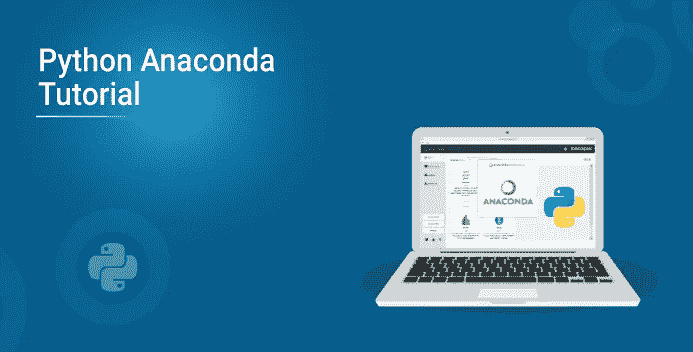

Anaconda 是面向未来数据科学家、IT 专业人员和商业领袖的数据科学平台。它是 Python、R 等的发行版。拥有 300 多个数据科学包，它成为任何项目的最佳平台之一。在这篇 python anaconda 教程中，我们将讨论如何使用 anaconda 进行 python 编程。以下是本博客讨论的主题:

1.  蟒蛇简介

2.安装和设置

3.如何在 Anaconda 中安装 Python 库？

4.巨蟒领航员

5.用例

*   Python 基础
*   分析学
*   机器学习和人工智能

# 蟒蛇简介

Anaconda 是 python 和 r 的开源发行版，用于数据科学、机器学习、深度学习等。有了 300 多个用于数据科学的库，对于任何程序员来说，使用 anaconda 进行数据科学研究都是相当理想的。


Anaconda 有助于简化包管理和部署。Anaconda 附带了各种各样的工具，可以使用各种机器学习和人工智能算法轻松地从各种来源收集数据。它有助于获得一个易于管理的环境设置，只需单击一个按钮就可以部署任何项目。

现在我们知道了 anaconda 是什么，让我们试着理解如何安装 anaconda 并建立一个在我们的系统上工作的环境。

# 安装和设置

去 https://www.anaconda.com/distribution/.安装蟒蛇

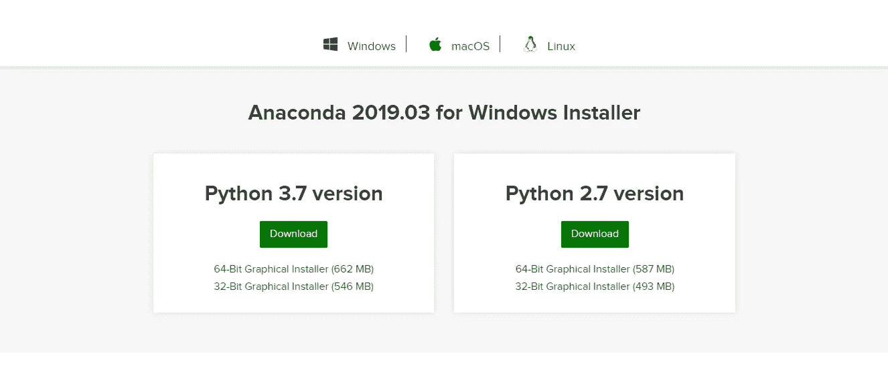

选择一个适合你的版本，点击下载。完成下载后，打开设置。

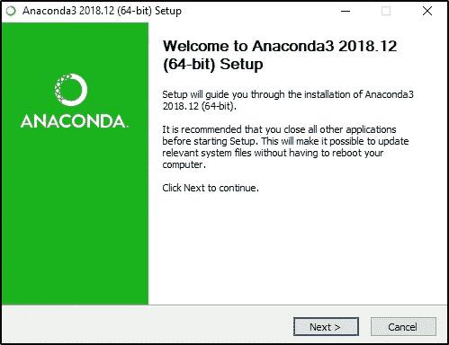

按照设置中的说明进行操作。不要忘记点击 add anaconda 到我的 path 环境变量。安装完成后，您将看到一个如下图所示的窗口。

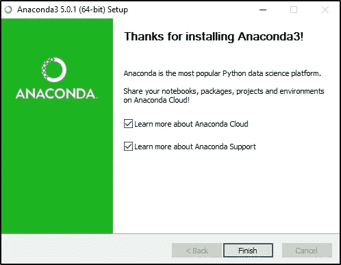

安装完成后，打开 anaconda 提示符，键入 jupyter notebook。

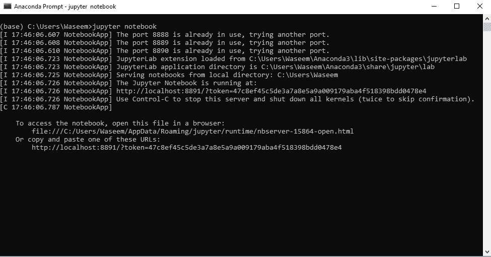

您将看到一个如下图所示的窗口。

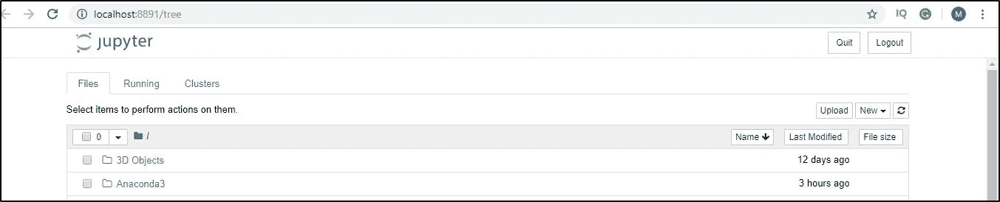

现在我们已经知道了如何为 python 使用 anaconda，让我们看看如何在 anaconda 中为任何项目安装各种库。

# 如何在 Anaconda 中安装 Python 库？

打开 anaconda 提示符并检查库是否已经安装。

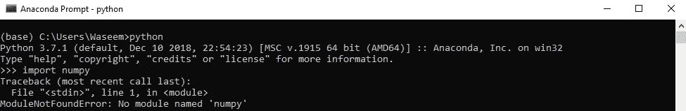

由于没有名为 numpy 的模块，我们将运行以下命令来安装 numpy。

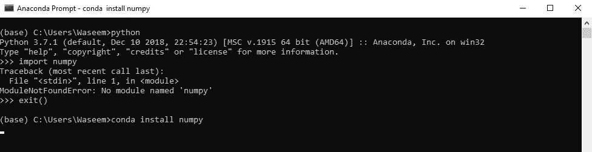

完成安装后，您将看到如图所示的窗口。

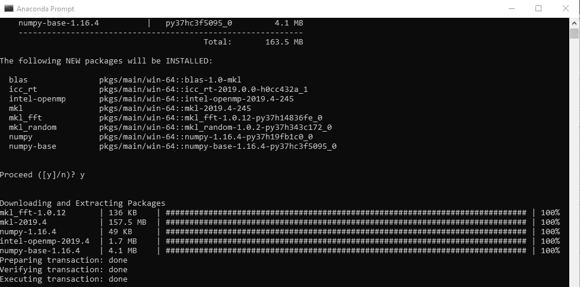

一旦你安装了一个库，只需再次尝试导入模块以确保安全。

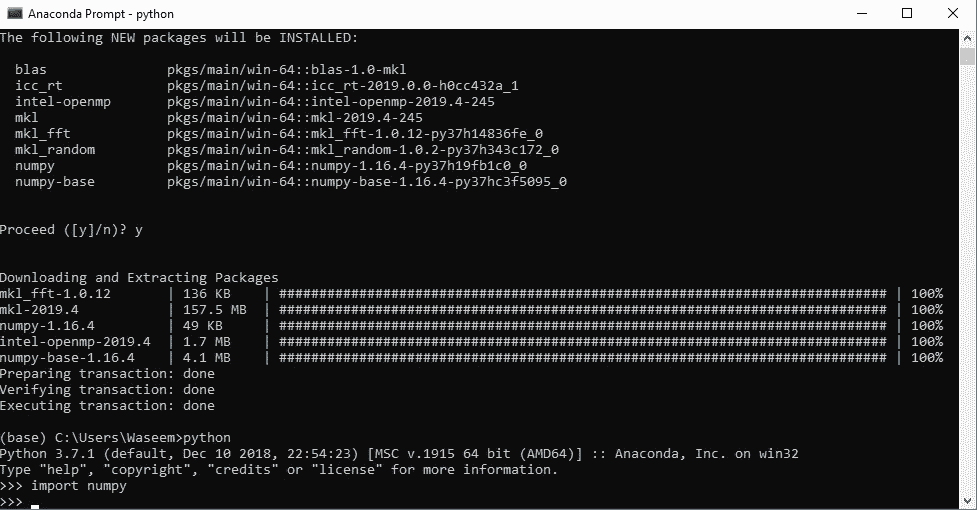

如您所见，我们在开始时没有遇到任何错误，所以这就是我们如何在 anaconda 中安装各种库。

# 巨蟒领航员

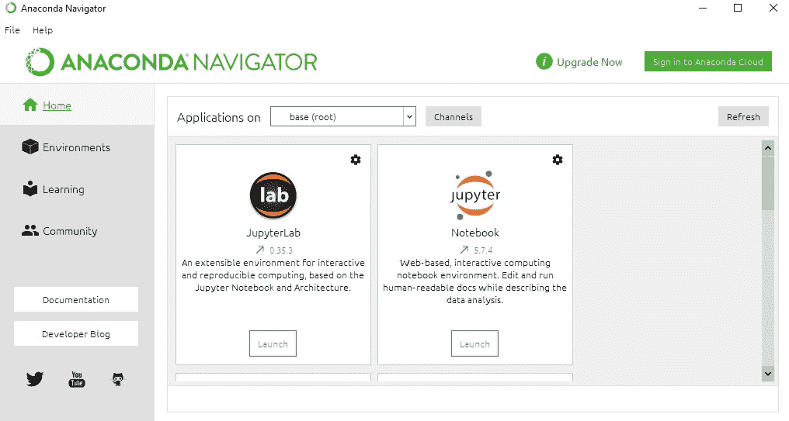

Anaconda Navigator 是 Anaconda 发行版附带的一个桌面 GUI。它允许我们启动应用程序和管理 conda 包、环境，而无需使用命令行命令。

# 用例— Python 基础知识

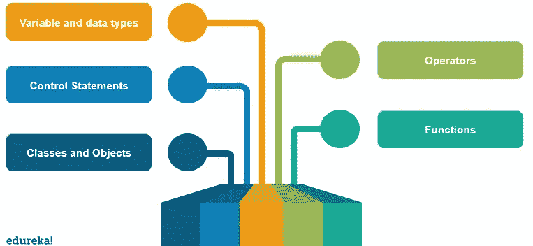

## 变量和数据类型

变量和数据类型是任何编程语言的组成部分。Python 有 6 种数据类型，具体取决于它们拥有的属性。列表、字典、集合、元组，是 python 编程语言中数据类型的集合。

以下示例展示了如何在 python 中使用变量和数据类型。

```
#variable declaration
name **=** "Edureka"
f **=** 1991
print("python was founded in"  , f)
#data types
a **=** [1,2,3,4,5,6,7]
b **=** {1 : 'edureka' , 2: 'python'}
c **=** (1,2,3,4,5)
d **=** {1,2,3,4,5}
print("the list is" , a)
print("the dictionary is" , b)
print("the tuple is" , c)
print("the set is " , d)
```

## 经营者

Python 中的运算符用于值或变量之间的运算。python 中有 7 种类型的运算符。

*   赋值运算符
*   算术运算符
*   逻辑算子
*   比较运算符
*   逐位运算符
*   隶属算子
*   恒等运算符

下面是一个在 python 中使用一些运算符的示例。

```
a **=** 10
b **=** 15
#arithmetic operator
print(a **+** b)
print(a **-** b)
print(a ***** b)
#assignment operator
a **+=** 10
print(a)
#comparison operator
#a != 10
#b == a
#logical operator
a > b **and** a > 10
#this will return true if both the statements are true.
```

## 控制语句

像 [if，else](https://www.edureka.co/blog/if-else-in-python/) ，break，continue 这样的语句被用作控制语句，以获得对执行的控制，从而获得最佳结果。我们可以在 python 的各种循环中使用这些语句来控制结果。下面的例子展示了我们如何使用控制和条件语句。

```
name **=** 'edureka'
**for** i **in** name:
    **if** i **==** 'a':
       **break
    else**:
   print(i)
```

## 功能

Python 函数以一种有效的方式提供了代码的可重用性，我们可以为问题语句编写逻辑，并运行一些参数来获得最优的解决方案。下面是一个我们如何在 python 中使用函数的例子。

```
**def** func(a):
    **return** a ****** a
res **=** func(10)
print(res)
```

## 类别和对象

因为 python 支持面向对象的编程，所以我们也可以使用类和对象。下面是一个我们如何在 python 中使用类和对象的例子。

```
**class** Parent:
      **def** func(self):
          print('this is parent')
**class** Child(Parent):
      **def** func1(self):
          print('this is child')
ob **=** new Child()
ob.func()
```

这些是 python 中的一些基本概念。现在讨论 anaconda 中更大的包支持，我们可以使用很多库。让我们看看如何使用 python anaconda 进行数据分析。

# 用例—分析

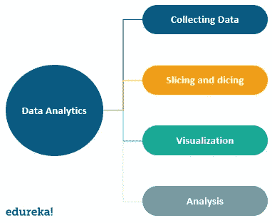

这些是数据分析中涉及的某些步骤。让我们看看 anaconda 中的数据分析是如何工作的，以及我们可以使用的各种库。

## 收集数据

数据的收集就像在程序中加载一个 CSV 文件一样简单。然后，我们可以利用相关数据来分析数据中的特定实例或条目。下面是在程序中加载 CSV 数据的代码。

```
**import** pandas as pd
**import** numpy as np
**import** matplotlib.pyplot as plt
**import** seaborn as sns
df  **=** pd.read_csv('filename.csv')
print(df.head(5))
```

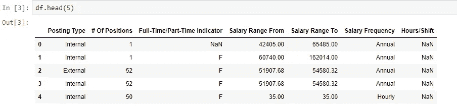

## 切片和切块

在我们将数据集加载到程序中之后，我们必须对数据进行一些修改，例如删除空值和不必要的字段，这些可能会导致分析中的歧义。

下面是一个我们如何根据需求过滤数据的例子。

```
print(df.isnull().sum())
#this will give the sum of all the null values in the dataset.
df1 **=** df.dropna(axis**=**0 , how**=** 'any')
#this will drop rows with null values.
```

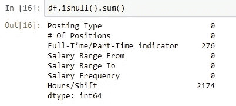

我们也可以删除空值。

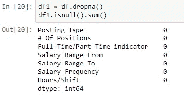

## **箱线图**

```
sns.boxplot(x**=**df['Salary Range From'])
sns.boxplot(x**=**df['Salary Range To'])
```

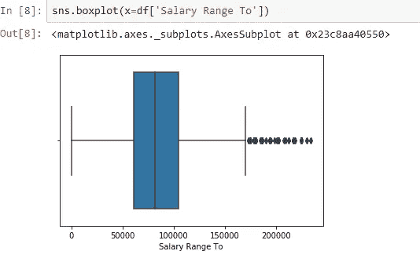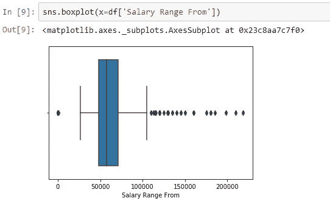

## 散点图

```
**import** matplotlib.pyplot as plt
fig, ax **=** plt.subplots(figsize**=**(16,8))
ax.scatter(df['Salary Range From'] , df['Salary Range To'])
ax.set_xlabel('Salary Range From')
ax.set_ylabel('Salary Range TO')
plt.show()
```

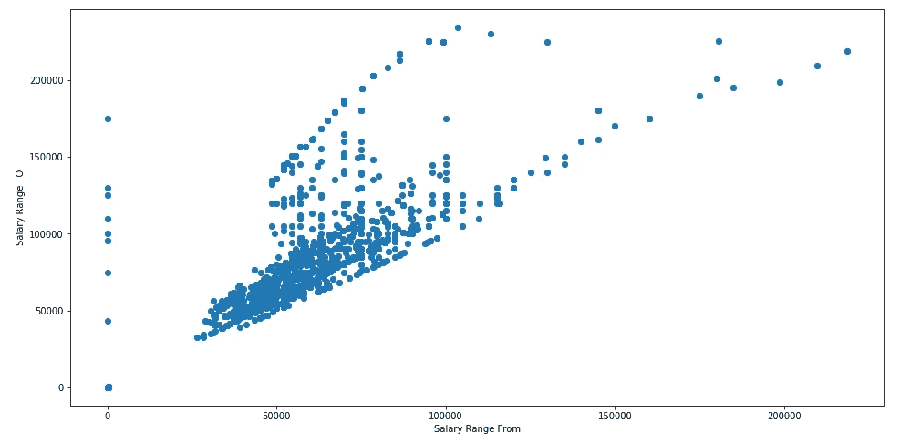

## 形象化

一旦我们根据需求更改了数据，就有必要对这些数据进行分析。这样做的一种方法是将结果可视化。更好的可视化表示有助于数据投影的优化分析。

下面是一个可视化数据的示例。

```
sns.countplot(x= "Full-Time/Part-Time indicator" , data= df) sns.countplot(x="Full-Time/Part-Time indicator" , hue="Salary Frequency" , data= df) sns.countplot(hue="Full-Time/Part-Time indicator", x="Posting Type" ,data= df) df["Salary Range From"].plot.hist() df["Salary Range To"].plot.hist()
```

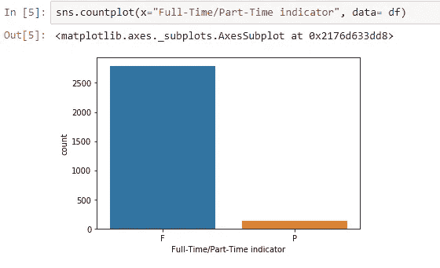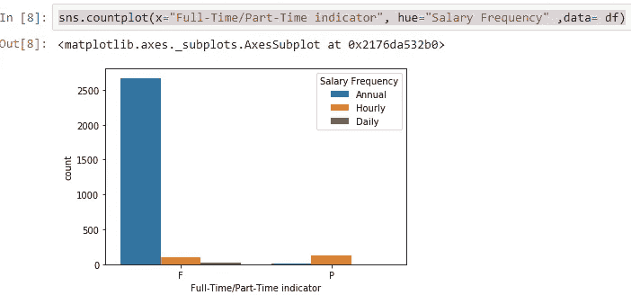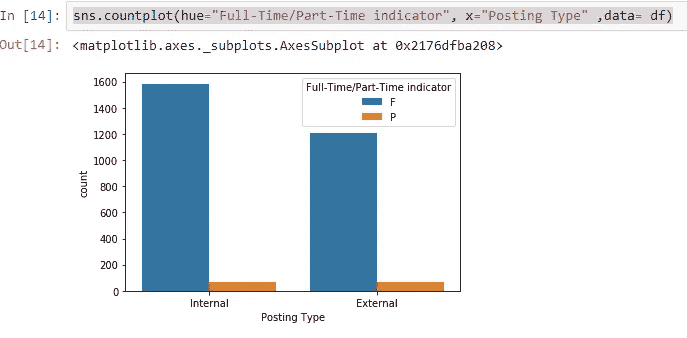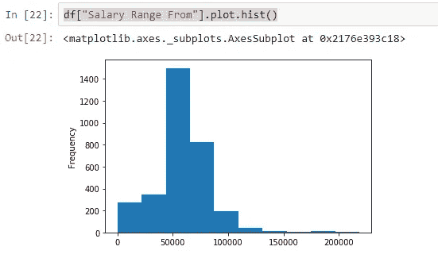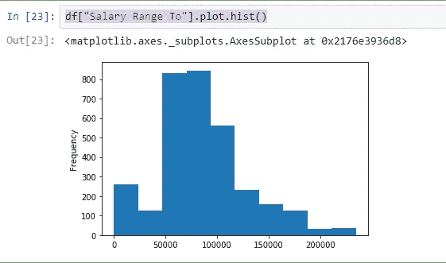

```
**import** matplotlib.pyplot as plt
fig **=** plt.figure(figsize **=** (10,10))
ax **=** fig.gca()
sns.heatmap(df1.corr(), annot**=**True, fmt**=**".2f")
plt.title("Correlation",fontsize**=**5)
plt.show()
```

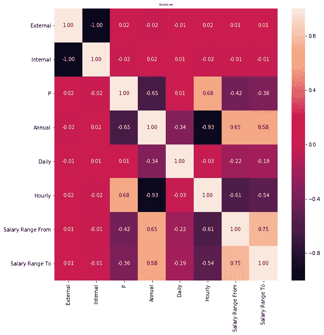

## 分析

可视化之后，我们可以通过各种图表进行分析。假设我们正在处理工作数据，通过查看一个区域中特定工作的可视化表示，我们可以得出特定领域中的工作数量。

根据以上分析，我们可以假设以下结果

*   与全职工作相比，数据集中兼职工作的数量非常少。
*   兼职工作不到 500 份，全职工作超过 2500 份。
*   基于这种分析，我们可以建立一个预测模型。

在这篇 python anaconda 教程中，我们已经了解了如何使用涵盖 python 基础、数据分析和机器学习的用例为 python 设置 anaconda。如果你想查看更多关于人工智能、DevOps、道德黑客等市场最热门技术的文章，你可以参考 Edureka 的官方网站。

请留意本系列中的其他文章，它们将解释 Python 和数据科学的各个方面。

> *1。*[*Python 中的机器学习分类器*](/edureka/machine-learning-classifier-c02fbd8400c9)
> 
> *2。*[*Python Scikit-Learn Cheat Sheet*](/edureka/python-scikit-learn-cheat-sheet-9786382be9f5)
> 
> *3。* [*机器学习工具*](/edureka/python-libraries-for-data-science-and-machine-learning-1c502744f277)
> 
> *4。* [*用于数据科学和机器学习的 Python 库*](/edureka/python-libraries-for-data-science-and-machine-learning-1c502744f277)
> 
> *5。*[*Python 中的聊天机器人*](/edureka/how-to-make-a-chatbot-in-python-b68fd390b219)
> 
> *6。* [*Python 集合*](/edureka/collections-in-python-d0bc0ed8d938)
> 
> *7。* [*Python 模块*](/edureka/python-modules-abb0145a5963)
> 
> *8。* [*Python 开发者技能*](/edureka/python-developer-skills-371583a69be1)
> 
> *9。* [*哎呀面试问答*](/edureka/oops-interview-questions-621fc922cdf4)
> 
> *10。*[*Python 开发者简历*](/edureka/python-developer-resume-ded7799b4389)
> 
> *11。*[*Python 中的探索性数据分析*](/edureka/exploratory-data-analysis-in-python-3ee69362a46e)
> 
> 12。 [*蛇与 Python 的游戏*](/edureka/python-turtle-module-361816449390)
> 
> *13。* [*Python 开发者工资*](/edureka/python-developer-salary-ba2eff6a502e)
> 
> *14。* [*主成分分析*](/edureka/principal-component-analysis-69d7a4babc96)
> 
> 15。[*Python vs c++*](/edureka/python-vs-cpp-c3ffbea01eec)
> 
> 16。 [*刺儿头教程*](/edureka/scrapy-tutorial-5584517658fb)
> 
> 17。[*Python SciPy*](/edureka/scipy-tutorial-38723361ba4b)
> 
> *18。* [*最小二乘回归法*](/edureka/least-square-regression-40b59cca8ea7)
> 
> *19。* [*Jupyter 笔记本小抄*](/edureka/jupyter-notebook-cheat-sheet-88f60d1aca7)
> 
> 20。 [*Python 基础知识*](/edureka/python-basics-f371d7fc0054)
> 
> *21。* [*Python 模式程序*](/edureka/python-pattern-programs-75e1e764a42f)
> 
> *22。*[*Python 中的*](/edureka/generators-in-python-258f21e3d3ff) 生成器
> 
> *23。* [*Python 装饰器*](/edureka/python-decorator-tutorial-bf7b21278564)
> 
> *24。*[](/edureka/spyder-ide-2a91caac4e46)*[*什么是 Python 中的套接字编程*](/edureka/socket-programming-python-bbac2d423bf9)*
> 
> **25。*[*Python 中使用 Kivy 的移动应用*](/edureka/kivy-tutorial-9a0f02fe53f5)*
> 
> **26。* [*十大最佳学习书籍&练习 Python*](/edureka/best-books-for-python-11137561beb7)*
> 
> **27。* [*机器人框架与 Python*](/edureka/robot-framework-tutorial-f8a75ab23cfd)*
> 
> **28。*[*Python 中的贪吃蛇游戏*](/edureka/snake-game-with-pygame-497f1683eeaa)*
> 
> **29。* [*Django 面试问答*](/edureka/django-interview-questions-a4df7bfeb7e8)*
> 
> *三十岁。 [*十大 Python 应用*](/edureka/python-applications-18b780d64f3b)*
> 
> **31。*[*Python 中的哈希表和哈希表*](/edureka/hash-tables-and-hashmaps-in-python-3bd7fc1b00b4)*
> 
> **32。*[*Python 3.8*](/edureka/whats-new-python-3-8-7d52cda747b)*
> 
> *33。 [*支持向量机*](/edureka/support-vector-machine-in-python-539dca55c26a)*
> 
> **三十四。* [*Python 教程*](/edureka/python-tutorial-be1b3d015745)*
> 
> *35。[*Python Spyder*](/edureka/spyder-ide-2a91caac4e46)*

**原载于 2019 年 7 月 29 日 https://www.edureka.co*[](https://www.edureka.co/blog/python-anaconda-tutorial/)**。***