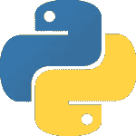

# 现实世界中你需要知道的 10 大 Python 应用

> 原文：<https://medium.com/edureka/python-applications-18b780d64f3b?source=collection_archive---------1----------------------->

Python Applications — Edureka

动态类型、内置数据结构、强大的库、框架、社区支持仅仅是 Python 成为快速开发各种应用程序的吸引人的语言的部分原因。在本文中，我们将看到 Python 在应用程序开发方面的一些优势。

Python 应用程序的这篇文章将涵盖以下主题:

1.  Python 简介
2.  Python 应用程序

*   Web 开发
*   游戏开发
*   机器学习和人工智能
*   数据科学和数据可视化
*   桌面 GUI
*   网页抓取应用程序
*   商业应用
*   音频和视频应用
*   CAD 应用
*   嵌入式应用

# Python 简介

Python 是免费的，学习起来也很简单。其主要特点是**高级**、**动态**、**类型化**、**解释**。这使得调试错误变得容易，并鼓励应用程序原型的快速开发，将自己标记为用于编码的语言。 [Python](https://www.edureka.co/blog/python-programming-language) 由 **Guido Van Rossum** 于 1989 年开发，强调*干*(不要重复自己)原则和*可读性*。

说完这些，让我们直接进入 Python 应用程序。:)

# Python 应用程序

Python 支持**跨平台操作系统**，这使得用它构建应用程序更加方便。一些全球知名的应用程序，如 YouTube、BitTorrent、DropBox 等。使用 Python 来实现它们的功能。

## 1.Web 开发

Python 可以用来快速制作网络应用程序。这是为什么呢？这是因为 Python 用来创建这些应用程序的框架。有*公共后端逻辑*参与制作这些框架和许多库，可以帮助集成协议，如 HTTPS、FTP、SSL 等。甚至帮助处理 JSON、XML、电子邮件等等。

一些最著名的框架是 Django，Flask，Pyramid。为什么要使用框架？他们提供的 ***扩展性******便利性*** 相比从零开始开发一个网站是无与伦比的。

## 2.游戏开发

Python 也用于互动游戏的开发。有一些库，比如 PySoy，它是一个支持 Python 3 的 3D 游戏引擎，PyGame 提供了一些功能和一个用于游戏开发的库。游戏如文明-四，迪斯尼卡通镇在线，织女星罢工等。都是用 Python 构建的。

## 3.机器学习和人工智能

机器学习和人工智能是热门话题，因为它们为未来带来了最有前途的职业。我们让计算机通过存储的数据基于过去的经验进行学习，或者更好的是，创建让计算机自己学习的算法。大多数人都选择的编程语言？是 Python。为什么？用已经存在的**库**支持这些域，比如 Pandas、Scikit-Learn、NumPy 等等。

学习算法，使用库，你就有了问题的解决方案。就这么简单。但是，如果你想走硬核的道路，你可以设计自己的代码，产生一个更好的解决方案，这仍然比其他语言容易得多。

## 4.数据科学和数据可视化

如果你知道如何提取相关信息，数据就是*金钱*，这些信息可以帮助你承担适当的风险并增加利润。您研究您拥有的数据，执行操作并提取所需的信息。像熊猫、NumPy 这样的图书馆可以帮助你提取信息。

你甚至可以将 Matplotlib、Seaborn 等数据库可视化，这对**绘制图表**和更多的事情很有帮助。这就是 Python 为您提供的成为数据科学家的机会。

## 5.桌面 GUI

Python 可以用来编程**桌面应用**。它提供了可用于开发用户界面的 Tkinter 库。还有一些其他有用的工具包，比如 wxWidgets、Kivy、PYQT，可以用来在多种平台上创建应用程序。

你可以从创建简单的应用程序开始，比如计算器、待办事项应用程序，然后继续创建更复杂的应用程序。

## 6.网页抓取应用程序

Python 可以用来从网站中提取大量数据，这些数据可以在各种现实世界的过程中有所帮助，例如价格比较、工作列表、研究和开发等等。

Python 有一个名为 BeautifulSoup 的库，可以用来提取这样的数据并相应地使用。这里有一个完整的使用 Python 学习 Web 抓取的指南。

## 7.商业应用

业务应用程序不同于我们通常的应用程序，包括电子商务、ERP 等领域。他们需要可伸缩、可扩展和易读的应用程序，而 Python 为我们提供了所有这些特性。像 Tryton 这样的平台可以用来开发这样的业务应用程序。

## **8。音频和视频应用**

Python 可以用来开发能够执行多任务和输出媒体的应用程序。视频和音频应用程序(如 TimPlayer、Cplay)是使用 Python 库开发的，与其他媒体播放器相比，它们提供了更好的稳定性和性能。

## 9.CAD 应用

计算机辅助设计是一个非常复杂的应用程序，因为要处理很多事情。对象和它们的表示，函数只是这类事情的冰山一角。Python 也使这变得简单，CAD 最著名的应用是 Fandango。

## 10.嵌入式应用

Python 是基于 C 的，这意味着它可以用来为嵌入式应用程序创建嵌入式 C 软件。这有助于我们在能够计算 Python 的较小设备上执行更高级别的应用程序。

最著名的嵌入式应用可能是 Raspberry Pi，它使用 Python 进行计算。它可以用作计算机，或者像简单的嵌入式板一样执行高级计算。

Python 有各种各样可以使用它的应用。无论你从事什么领域，Python 都是有回报的。所以我希望你已经理解了 Python 应用程序，以及是什么让 Python 有别于其他编程语言。

如果你想查看更多关于人工智能、DevOps、道德黑客等市场最热门技术的文章，你可以参考 Edureka 的官方网站。

请留意本系列中的其他文章，它们将解释 Python 和数据科学的各个方面。

> 1.[Python 中的机器学习分类器](/edureka/machine-learning-classifier-c02fbd8400c9)
> 
> 2.[Python Scikit-Learn Cheat Sheet](/edureka/python-scikit-learn-cheat-sheet-9786382be9f5)
> 
> 3.[机器学习工具](/edureka/python-libraries-for-data-science-and-machine-learning-1c502744f277)
> 
> 4.[用于数据科学和机器学习的 Python 库](/edureka/python-libraries-for-data-science-and-machine-learning-1c502744f277)
> 
> 5.[Python 中的聊天机器人](/edureka/how-to-make-a-chatbot-in-python-b68fd390b219)
> 
> 6. [Python 集合](/edureka/collections-in-python-d0bc0ed8d938)
> 
> 7. [Python 模块](/edureka/python-modules-abb0145a5963)
> 
> 8. [Python 开发者技能](/edureka/python-developer-skills-371583a69be1)
> 
> 9.[哎呀面试问答](/edureka/oops-interview-questions-621fc922cdf4)
> 
> 10.一个 Python 开发者的简历
> 
> 11.[Python 中的探索性数据分析](/edureka/exploratory-data-analysis-in-python-3ee69362a46e)
> 
> 12.[带 Python 的乌龟模块的贪吃蛇游戏](/edureka/python-turtle-module-361816449390)
> 
> 13. [Python 开发者工资](/edureka/python-developer-salary-ba2eff6a502e)
> 
> 14.[主成分分析](/edureka/principal-component-analysis-69d7a4babc96)
> 
> 15. [Python vs C++](/edureka/python-vs-cpp-c3ffbea01eec)
> 
> 16.[刺儿头教程](/edureka/scrapy-tutorial-5584517658fb)
> 
> 17. [Python SciPy](/edureka/scipy-tutorial-38723361ba4b)
> 
> 18.[最小二乘回归法](/edureka/least-square-regression-40b59cca8ea7)
> 
> 19. [Jupyter 笔记本备忘单](/edureka/jupyter-notebook-cheat-sheet-88f60d1aca7)
> 
> 20. [Python 基础知识](/edureka/python-basics-f371d7fc0054)
> 
> 21. [Python 模式程序](/edureka/python-pattern-programs-75e1e764a42f)
> 
> 22.[Python 中的生成器](/edureka/generators-in-python-258f21e3d3ff)
> 
> 23. [Python 装饰师](/edureka/python-decorator-tutorial-bf7b21278564)
> 
> 24. [Python Spyder IDE](/edureka/spyder-ide-2a91caac4e46)
> 
> 25.[在 Python 中使用 Kivy 的移动应用](/edureka/kivy-tutorial-9a0f02fe53f5)
> 
> 26.[十大最佳学习书籍&练习 Python](/edureka/best-books-for-python-11137561beb7)
> 
> 27.[用 Python 实现机器人框架](/edureka/robot-framework-tutorial-f8a75ab23cfd)
> 
> 28.[使用 PyGame 的 Python 中的贪吃蛇游戏](/edureka/snake-game-with-pygame-497f1683eeaa)
> 
> 29. [Django 面试问答](/edureka/django-interview-questions-a4df7bfeb7e8)
> 
> 30.[Python 中什么是套接字编程](/edureka/socket-programming-python-bbac2d423bf9)
> 
> 31.[Python 中的哈希表和哈希表](/edureka/hash-tables-and-hashmaps-in-python-3bd7fc1b00b4)
> 
> 32. [Python 3.8](/edureka/whats-new-python-3-8-7d52cda747b)
> 
> 33.[支持向量机](/edureka/support-vector-machine-in-python-539dca55c26a)
> 
> 34. [Python 教程](/edureka/python-tutorial-be1b3d015745)

*原载于 2019 年 10 月 10 日*[*https://www.edureka.co*](https://www.edureka.co/blog/python-applications/)*。*