# Python 基础:是什么让 Python 如此强大？

> 原文：<https://medium.com/edureka/python-basics-f371d7fc0054?source=collection_archive---------1----------------------->

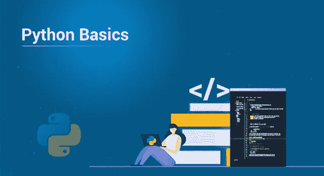

Python，你听说过它，想知道这种语言有什么特别之处。随着**机器学习**和**人工智能**的崛起，已经无法摆脱。你可能会问自己，**Python 好学吗？**我来告诉你，**其实是**！我在这里帮助您开始学习 Python 基础知识。

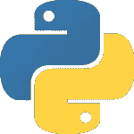

本博客将为您介绍:

*   Python 是什么？
*   Python 的特性
*   跳转到 Python 基础

1.  评论
2.  变量
3.  数据类型

*   类型变换

4.经营者

5.命名空间和范围

*   流控制

1.  if，elif，else
2.  for，while，嵌套循环

*   文件处理
*   Python 的糟糕之处

让我们开始吧。

# Python 是什么？

Python 简单来说就是一种**高级动态编程语言**被**解释**。Python 之父吉多·范·罗苏姆在开发它的时候有一个简单的目标，**代码简单、易读、开源。**在 Stack Overflow 于 2018 年开展的一项调查中，Python 被列为第三大最突出的语言，其次是 JavaScript 和 Java，这证明了它是最具增长性的语言。

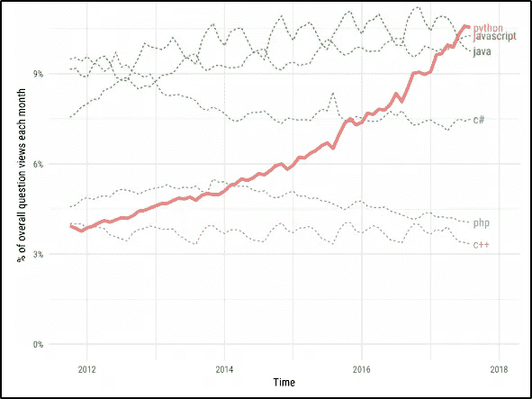

# Python 的特性

Python 是目前我最喜欢的语言，因为它的简单性、强大的库和可读性。你可能是一个老派的程序员，也可能是一个编程新手，Python 是最好的入门方式！

Python 是目前我最喜欢的语言，因为它的简单性、强大的库和可读性。你可能是一个老学校的程序员或可能是一个完全新的编程，是最好的入门方式！

Python 提供了下列功能:

*   简单:少考虑语言的语法，多考虑代码。
*   开源:一种强大的语言，每个人都可以根据需要自由使用和修改。
*   **可移植性:** Python 代码可以被共享，并且它会按照预期的方式工作。无缝便捷。
*   **可嵌入&可扩展:** Python 内部可以有其他语言的片段来执行某些功能。
*   **被解释:**大内存任务和其他繁重的 CPU 任务的烦恼都由 Python 自己来处理，让您只担心编码。
*   **海量库:**数据科学 Python 有你涵盖。Web 开发？Python 仍然为您提供了保护。一直都是。
*   **面向对象:**对象有助于将复杂的现实生活中的问题分解成可以编码和求解的解决方案。

总结一下，Python 有**简单的语法**，有**可读的**，有**巨大的社区支持**。你现在可能会问，如果你懂 Python，你能做什么？嗯，你有很多选择。

*   数据科学家
*   机器学习和人工智能
*   物联网
*   Web 开发
*   数据可视化
*   自动化

现在，当你知道 Python 有如此惊人的特性集时，为什么我们不从 Python 基础开始呢？

# 跳转到 Python 基础

为了开始学习 Python 基础知识，你需要首先在你的系统中安装 Python，对吗？所以让我们现在就开始吧！你应该知道，现在大多数的 **Linux** 和 **Unix** 发行版都自带 Python 版本。要进行自我设置，您可以遵循此**分步指南**。

设置完成后，您需要创建您的第一个项目。请遵循以下步骤:

*   创建**项目**并输入名称，点击**创建**。
*   **右击项目文件夹上的**，使用新建- >文件- > Python 文件创建一个 **python 文件**，输入文件名

你完了。您已经设置了文件，开始使用 Python 进行[编码。开始编码你兴奋吗？我们开始吧。首先也是最重要的是“你好世界”节目。](https://www.edureka.co/blog/python-programming-language)

```
print('Hello World, Welcome to edureka!')
```

**输出**:你好世界，欢迎来到 edureka！

这就是你的第一个程序。从语法上你可以看出，它非常容易理解。让我们转到 Python 基础知识中的注释。

# Python 中的注释

Python 中的单行注释是使用#符号完成的，而多行注释则使用“.”。如果你想了解更多关于**评论**的内容，可以看看这本羽翼丰满的指南。一旦你知道了 Python 基础中的注释，让我们跳到 Python 基础中的变量。

# 变量

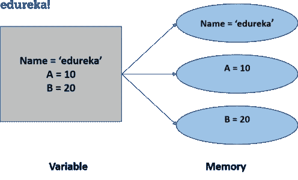

简单来说变量就是**内存空间**，在这里你可以存储**数据**或者**值**。但是 Python 中的问题是，变量不需要像其他语言那样在使用前声明。**数据类型**被**自动赋给变量**。如果输入整数，数据类型将被指定为整数。你输入一个[字符串](https://www.edureka.co/blog/what-is-string-in-python/)，变量被赋予一个字符串数据类型。你明白了。这使得 Python **成为动态类型语言**。使用赋值运算符(=)为变量赋值。

```
a = 'Welcome to edureka!'
b = 123
c = 3.142
print(a, b, c)
```

**输出**:欢迎来到 edureka！你可以看到我给这些变量赋值的方式。这就是在 Python 中给变量赋值的方式。如果你想知道，是的，你可以在一个打印语句中打印多个变量。现在让我们回顾一下 Python 基础中的数据类型。

# Python 中的数据类型

数据类型基本上是**语言支持**的**数据**，这样有助于定义现实生活中的数据，如工资、员工姓名等。可能性是无限的。数据类型如下所示:

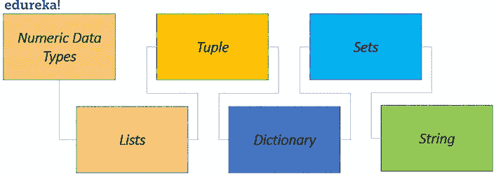

## 数字数据类型

顾名思义，这是为了在变量中存储数值数据类型。你要知道它们是**不可变**的，意思是变量中的具体数据是不能改变的。

有 3 种数字数据类型:

*   **Integer:** 这跟你可以在变量中存储整数值一样简单。例:a = 10。
*   **Float:** Float 保存实数，用十进制表示，有时甚至用科学符号表示，用 E 或 E 表示 10 的幂(2.5e2 = 2.5 x 102 = 250)。例:10.24。
*   **复数:**它们的形式是 a + bj，其中 a 和 b 是浮点数，J 代表-1 的平方根(这是一个虚数)。例如:10+6j。

```
a = 10 
b= 3.142 
c = 10+6j
```

既然您已经理解了各种数值数据类型，那么您就可以理解如何将一种数据类型转换成另一种数据类型了。

## 类型变换

类型转换是从一种数据类型到另一种数据类型的转换，当我们开始编程以获得问题的解决方案时，这真的很有帮助。让我们用例子来理解。

```
a = 10 
b = 3.142 
c = 10+6j 
print(int(b), float(a), str(c))
```

**输出** : 10.0 3 '10+6j'
你可以理解，通过上面的代码片段进行类型转换。“a”为整数，“b”为浮点数，“c”为复数。您使用 Python 中内置的 float()、int()、str()方法，这有助于我们转换它们。当你进入现实世界的例子时，类型转换可能真的很重要。

一个简单的情况是，你需要计算一家公司雇员的工资，这些工资应该是浮点格式的，但它们以字符串格式提供给我们。因此，为了使我们的工作更容易，您只需使用类型转换，将工资字符串转换为 float，然后继续我们的工作。现在让我们转向 Python 基础知识中的列表数据类型。

## 列表

用简单的话来说，List 可以被认为是在它们之中，也就是说，**数组**存在于其他语言中，但是它们可以在同一个 list 中有**不同的元素和不同的数据类型。列表是**可变的**，这意味着你可以改变列表中可用的数据。**

对于那些不知道数组是什么的人来说，您可以通过想象一个可以按照您需要的方式保存数据的机架来理解它。稍后，您可以通过调用数据存储的位置来访问数据，在编程语言中，该位置称为**索引**。使用 a=list()方法或使用 a=[]来定义列表，其中“a”是列表的名称。

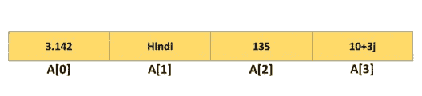

从上图中可以看到，存储在列表中的数据以及与存储在列表中的数据相关的索引。注意 **Python 中的索引总是以‘0’开头**。现在，您可以转到列表可能的操作。

列表操作如下表所示。

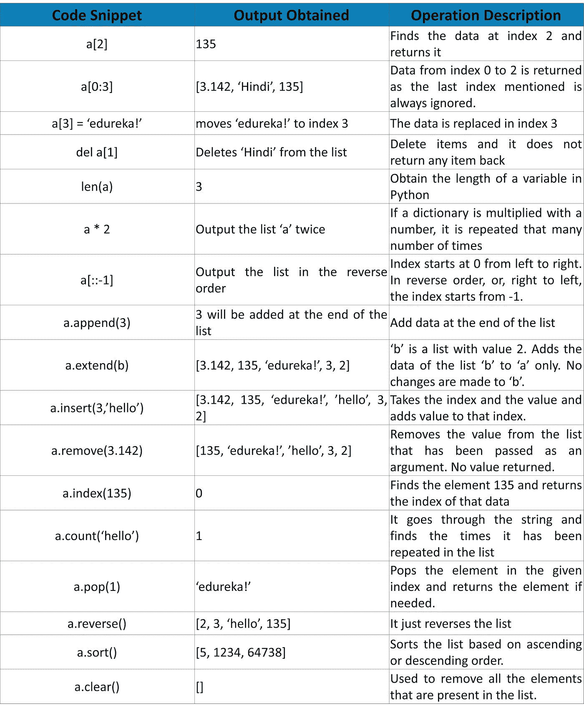

现在您已经理解了各种列表函数，让我们转到理解 Python 基础中的元组。

## 元组

Python 中的元组是。这意味着一旦声明了元组，就不能添加、删除或更新元组。就这么简单。这使得**与列表**相同。只需要记住一点，元组是不变的，比列表快得多，因为它们是常量。

操作类似于列表，但是涉及到更新、删除、添加，这些操作不起作用。Python 中的元组被写成 a=()或 a=tuple()，其中“a”是元组的名称。

```
a = ('List', 'Dictionary', 'Tuple', 'Integer', 'Float') 
print(a)
```

**输出** = ('List '，' Dictionary '，' Tuple '，' Integer '，' Float ')

这基本上包含了元组所需的大部分内容，因为只有在需要一个具有常量值的列表的情况下才使用它们，因此使用元组。让我们转到 Python 基础中的字典。

# 词典

当你有一个真实世界的例子在身边时，字典是最容易理解的。最容易理解的例子是电话簿。想象一下电话簿，并理解其中存在的各个领域。您可以想到姓名、电话、电子邮件和其他字段。将*名称*视为**键**，将您输入的**名称**视为**值**。同样，以*电话*为**键**，*以**值**输入数据*。这就是字典。它是一个保存**键、值**对的结构。

使用 a=dict()或使用={}编写字典，其中 a 是字典。该键可以是字符串或整数，后跟“:”和该键的值。

```
MyPhoneBook = { 'Name' : [ 'Akash', 'Ankita' ] ,
'Phone' : [ '12345', '12354' ] ,
'E-Mail' : [ '[akash@rail.com](mailto:akash@rail.com)', '[ankita@rail.com](mailto:ankita@rail.com)' ]}
print (MyPhoneBook)
```

**输出** : {“姓名”:[“Akash”，“Ankita”],“电话”:[“12345”，“12354”],“电子邮件”:[“Akash @ rail . com”，“Ankita @ rail . com”]}

## **查阅词典要素**

您可以看到，键是姓名、电话和电子邮件，每个键都有 2 个值。当您打印字典时，会打印关键字和值。现在，如果您只想获取特定键的值，您可以执行以下操作。这叫做访问字典的元素。

```
print(MyPhoneBook['E-Mail'])
```

**输出**:【'akash@rail.com','ankita@rail.com'】

## **字典操作**

您现在可能对 Python Basics 中的字典有了更好的理解。因此，让我们转到 Python 基础博客中的集合。

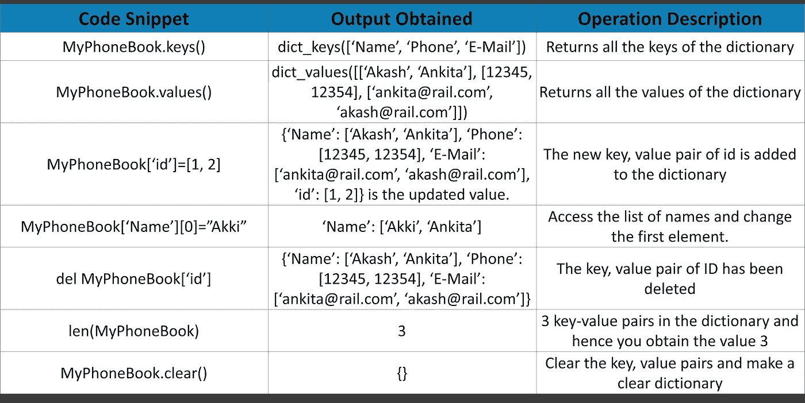

# 设置

一个集合基本上就是一个集合。你可以看到，即使集合“a”中有相似的元素，它仍然只被打印一次，因为**是元素或项目的无序集合。元素是集合，是独特元素的集合。**独一无二的**中套。在 Python 中，它们写在用逗号**分隔的**花括号**和**中。**

```
a = {1, 2, 3, 4, 4, 4} 
b = {3, 4, 5, 6} 
print(a,b)
```

**输出** : {1，2，3，4} {3，4，5，6}

## **成套操作**

集合很容易理解，所以让我们转到 Python Basics 中的字符串。

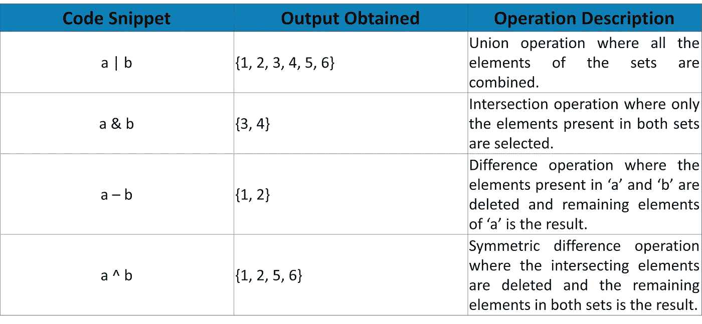

# 用线串

Python 中的字符串是最常用的数据类型，尤其是因为它们对我们人类来说更容易交互。它们是字面上的单词和字母，在使用方式和上下文中有一定的意义。Python 在公园外很受欢迎，因为它与字符串有如此强大的集成。字符串用一个**单引号**(' ')或**双引号**(" ")括起来。字符串是**不可变的**意味着字符串中的数据不能在特定的索引处改变。

Python 对字符串的操作可以显示为:

**注意:这里我用的字符串是:mystsr ="edureka！是我的地方"**

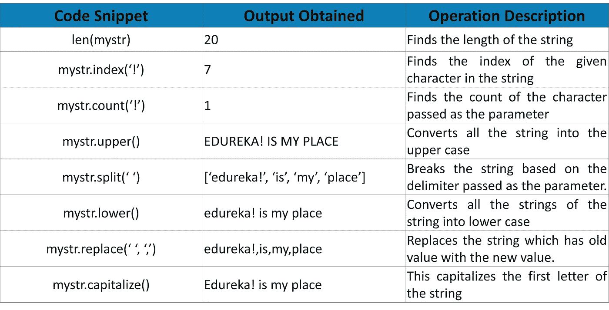

这些只是几个可用的功能，如果你搜索它，你可以找到更多。

## 在字符串中拼接

拼接是**将字符串**分解成你想要的格式或方式。

这基本上总结了 Python 中的数据类型。我希望你能很好地理解这一点，如果你有任何疑问，请留下评论，我会尽快回复你。

现在让我们转到 Python 基础中的运算符。

# Python 中的运算符

操作符是**构造**，你用它来**操作**数据**以便你能得出某种解决方案给我们。一个简单的例子是，如果有两个朋友，每个人有 70 卢比，你想知道他们每个人的总数，你会把钱加起来。在 Python 中，使用+运算符将值相加，其总和为 140，这是问题的解决方案。**

Python 有一个运算符列表，可以分为:

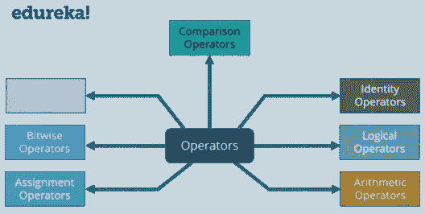

让我们继续前进，仔细理解每一个操作符。

**注意:变量被称为操作数，出现在操作符的左边和右边。例:**

```
a=10 
b=20 
a+b
```

这里‘a’和‘b’是操作数，+是运算符。

## 算术运算符

它们用于对数据执行**算术运算**。

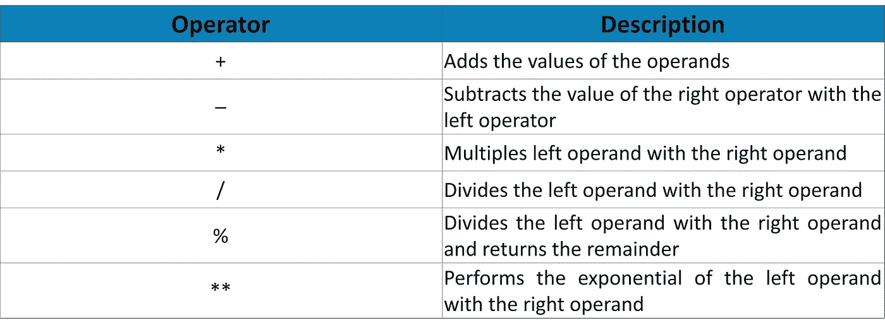

下面的代码片段将帮助您更好地理解它。

```
a = 2 
b = 3 
print(a+b, a-b, a*b, a/b, a%b, a**b, end=',')
```

**输出** : 5，-1，6，0.66666666666666，2，8

一旦你理解了 Python 基础中的算术运算符，让我们转到赋值运算符。

## 赋值运算符

顾名思义，这些用于**给变量**赋值。就这么简单。

各种赋值运算符包括:

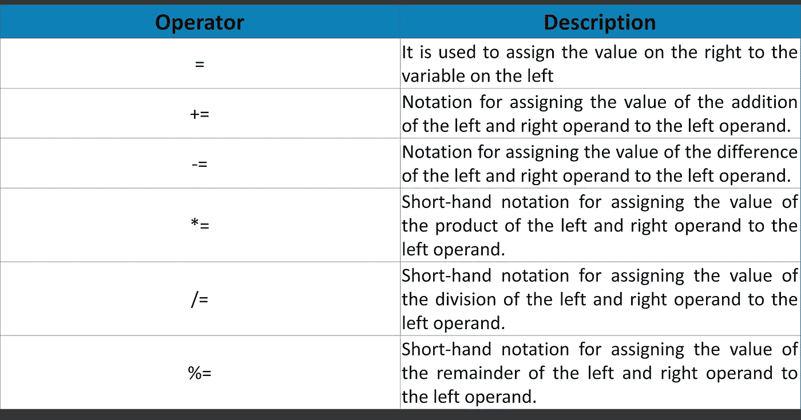

在这篇 Python 基础知识的博客中，让我们继续讨论比较运算符。

## 比较运算符

这些运算符用于**引出左右操作数之间的关系**并导出您需要的解决方案。简单的说，你用它们来做比较。根据这些值的条件是真还是假，这些运算符获得的输出将是真或假。

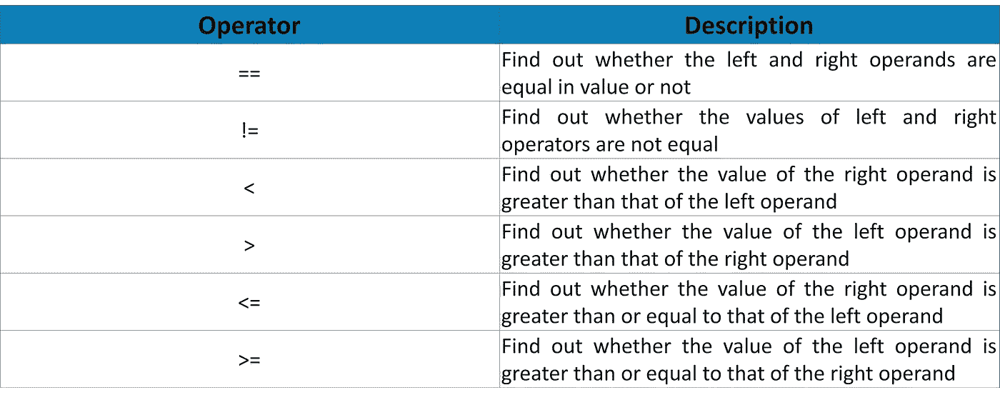

你可以在下面的例子中看到它们的工作原理:

```
a = 21
b = 10
if a == b:
    print ( 'a is equal to b' )
if a != b
    print ( 'a is not equal to b' )
if a < b:
    print ( 'a is less than b' )
if a > b: 
    print ( 'a is greater than b' ) 
if a <= b: 
    print ( 'a is either less than or equal to b' ) 
if a >= b:
    print ( 'a is either greater than or equal to b' )
```

**输出:**
a 不等于 b
a 大于 b
a 大于或等于 b

让我们继续学习 Python 基础知识中的按位运算符。

## 按位运算符

要理解这些算符，你需要理解比特的**理论**。这些运算符用于**直接操作位**。

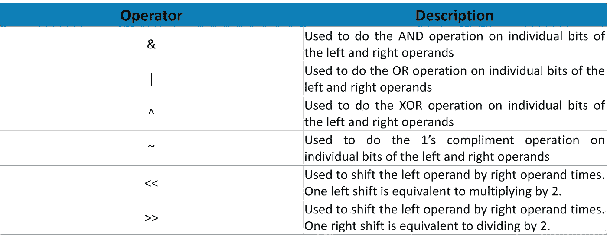

这个最好自己在电脑上练习一下。继续学习 Python 基础中的逻辑运算符。

## 逻辑运算符

这些用于从操作数中获得某个**逻辑**。我们有 3 个操作数。

*   **和**(如果左右操作数都为真，则为真)
*   **或**(如果任一操作数为真，则为真)
*   **而非**(给出传递的操作数的相反值)

```
a = True 
b = False 
print(a and b, a or b, not a)
```

**输出:**假真假

转到 Python 基础中的成员运算符。

## 成员运算符

这些用于测试某个特定变量或值**是否存在于列表、字典、元组、集合等中。**

这些操作符是:

*   中的**(如果在序列中找到值或变量，则为真)**
*   **不在**中(如果在序列中找不到该值，则为真)

```
a = [1, 2, 3, 4]
if 5 in a:
    print('Yes!')
if 5 not in a:
    print('No!')
```

**输出**:否！

让我们跳到 Python 基础中的标识运算符。

## 恒等运算符

这些运算符用于**检查值**，变量**是否与**相同。就这么简单。

这些操作符是:

*   为(如果它们相同，则为真)
*   不是(如果它们不相同，则为真)

```
a = 5
b = 5
if a is b:
    print('Similar')
if a is not b:
    print('Not Similar!')
```

对于 Python 的操作者来说，这就差不多结束了。

# 命名空间和范围

你记得 Python 中的一切都是对象，对吗？那么，Python 如何知道你试图访问的是什么呢？想象这样一种情况，你有两个同名的函数。你仍然可以调用你需要的函数。这怎么可能呢？这就是命名空间的用处。

命名空间是 Python 用来给我们代码中的所有对象分配唯一名称的系统。如果你想知道，对象可以是变量和方法。Python 通过维护一个字典结构来命名空间。其中*名称充当键*，而*对象或变量充当结构*中的值。现在你会想什么是名字？

a 只是你用来命名和访问对象的一种方式。这些名称用作访问您分配给它们的值的参考。

**例** : a=5，b='edureka！'

如果我想访问值“edureka！”我可以简单地用' b '调用变量名，这样我就可以访问' edureka！'。这些是名字。您甚至可以指定方法名并相应地调用它们。

```
import math
square_root = math.sqrt
print('The square root is ',square_root(9))
```

**输出**:根为 3.0

命名空间适用于作用域。**作用域**是函数/变量/值在它们所属的函数或类内的*有效性。Python **内置函数**命名空间**覆盖了 Python** 的所有其他作用域。print()和 id()等功能。即使没有任何进口也可以使用，可以在任何地方使用。在它们下面是**全局**和**局部**命名空间。让我在下面的代码片段中解释一下作用域和命名空间:*

```
def add():
    x = 3
    y = 2
    def add2():
        p, q, r = 3, 4, 5
        print('Inside add2 printing sum of 3 numbers:'(p+q+r))
    add2()
    print('The values of p, q, r are :', p, q, r)
    print('Inside the add printing sum of 2 numbers:'(x+y))
add()
```

从上面的代码可以看出，我已经用 add()和 add2()的名字声明了两个函数。您有了 add()的定义，然后调用 add()方法。在 add()中，你调用 add2()，这样你就能得到 12 的输出，因为 3+4+5 是 12。但是一旦从 add2()中出来，p，q，r 的作用域就终止了，这意味着只有在 add2()中，p，q，r 才是可访问和可用的。因为你现在在 add()中，没有 p，q，r，所以你得到错误，执行停止。

从下图中可以更好地理解作用域和命名空间。**内置范围**覆盖了所有 Python，使它们*在需要的时候*可用。**全局范围**覆盖所有正在执行的*程序*。**局部范围**覆盖了程序中正在执行的所有*方法*。这基本上就是 Python 中的命名空间。让我们继续学习 Python 基础中的流控制。

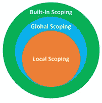

# Python 中的流控制和调节

您知道代码在任何语言中都是按顺序运行的，但是如果您想要**打破这种流程**，以便您能够**添加逻辑并重复某些语句**，以便您的代码减少并能够获得具有更少和更智能代码的**解决方案**呢？毕竟，这就是编码。寻找问题的逻辑和解决方案，这可以使用 Python 中的循环和条件语句来完成。

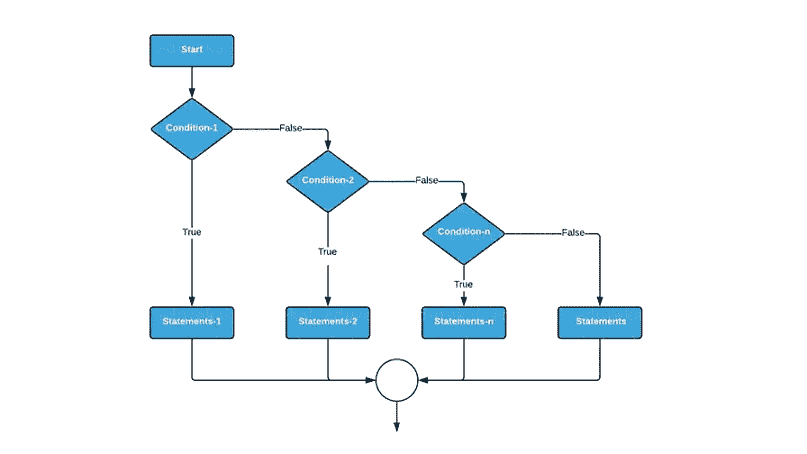

条件语句只有在满足**某个条件**时**才执行**，否则**跳过**到满足条件的地方。Python 中的条件语句是 **if、elif 和 else。**

**语法:**

```
if condition:
    statement
elif condition:
    statement
else:
    statement
```

这意味着，如果一个条件得到满足，做一些事情。否则遍历剩余的 elif 条件，最后如果不满足任何条件，则执行 Else 块。甚至可以在 if-else 块中嵌套 if-else 语句。

```
a = 10
b = 15
if a == b: 
    print ( 'They are equal' ) 
elif a > b: 
    print ( 'a is larger' ) 
else : 
    print ( 'b is larger' )
```

**输出** : b 较大

理解了条件语句后，让我们转到循环。在某些情况下，您可能希望一次又一次地执行某些语句来获得解决方案，或者您可以应用一些逻辑，以便只使用 2 到 3 行代码就可以执行某种类似的语句。这就是在 Python 中使用**循环的地方。**

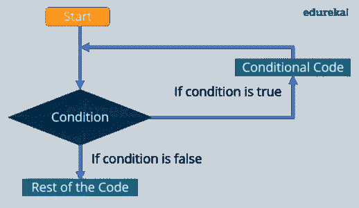

循环可以分为两种。

*   **有限:**这种循环一直工作到满足某个条件
*   **无限:**这种循环无限工作，永不停止。

Python 或任何其他语言中的循环必须测试条件，它们可以在语句之前或之后完成。它们被称为:

*   **预测试循环:**首先测试条件，然后执行语句
*   **后测试循环:**语句至少执行一次，然后检查条件。

Python 中有两种循环:

*   **为**
*   **而**

让我们用下面的语法和代码片段来理解每一个循环。

**For Loops:** 这些循环用于针对给定的**条件**执行**某组语句**，并持续到条件失败。你知道你需要执行 for 循环的次数**和**。

**语法:**

```
for variable in range: statements
```

代码片段如下:

```
basket_of_fruits= ['apple', 'orange', 'pineapple', 'banana']
for fruit in basket_of_fruits:
    print(fruit, end=',')
```

**产量**:苹果、橘子、菠萝、香蕉

这就是 Python 中 for 循环的工作方式。让我们继续学习 Python 基础知识中的 while 循环。

**While 循环:** While 循环与 for 循环一样**，除了你可能不知道结束条件。For 循环条件已知但 [**而**](https://www.edureka.co/blog/while-loop-in-python/) **循环条件**可能不知道。**

**语法:**

```
while condition: 
     statements
```

代码片段如下:

```
second = 10
while second >= 0: 
    print(second, end='->')
    second-=1
print('Blastoff!')
```

**输出**:10->9->8->7->6->5->4->3->2->1->升空！

这就是 while 循环的工作方式。

稍后你会有**嵌套循环**，其中你**将一个循环嵌入到另一个循环中。下面的代码应该能让你有所了解。**

```
count = 1
for i in range(10):
    print(str(i) * i)
    for j in range(0, i):
        count = count+1
```

**输出:**

1

22

333

4444

55555

666666

777777

88888888

999999999

您有第一个 for 循环，它打印数字的字符串。另一个 for 循环将数字加 1，然后执行这些循环，直到满足条件。这就是 for 循环的工作方式。这就结束了我们关于循环和条件的讨论。继续学习 Python 基础中的文件处理。

# 用 Python 处理文件

Python 有内置函数，你可以使用这些函数来**处理文件**，比如**从文件**中读取和**向文件**中写入 **数据** **。当使用 open()函数调用一个文件时，会返回一个**文件对象**,然后您可以对其进行读、写、修改等操作。**

处理文件的流程如下:

*   **使用 Open()函数打开**文件
*   对文件对象执行**操作**
*   **使用 Close()函数关闭**文件，以避免对文件造成任何损坏

**语法:**

```
File_object = open('filename','r')
```

其中模式是您希望与文件交互的方式。如果没有传递任何模式变量，则默认模式为读取模式。

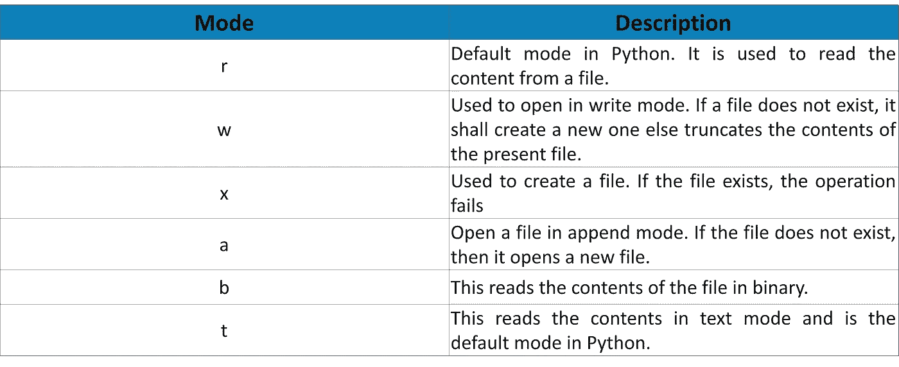

**例子:**

```
file = open('mytxt','w')
string = ' --Welcome to edureka!-- '
for i in range(5):
    file.write(string)
file.close()
```

**输出**:-欢迎来到 edureka！欢迎来到爱德华卡。欢迎来到爱德华卡。欢迎来到爱德华卡。欢迎来到爱德华卡。-在 mytxt 文件中

您可以继续尝试更多的文件。让我们转到博客的最后一个话题。对象和类。这两者密切相关。

# 面向对象的程序设计系统(Object-Oriented Programming System)

旧的编程语言的结构使得代码的任何模块都可以访问**数据**。这可能导致**潜在的安全问题**导致开发人员转向**面向对象编程**，这可以帮助我们在代码中模拟真实世界的例子，从而获得更好的解决方案。

理解 OOPS 有 4 个重要的概念。它们是:

*   **继承:**继承允许我们**从父类中派生属性和方法**，并根据需要修改它们。最简单的例子是汽车，它描述了汽车的结构，这个类可以被派生来描述跑车、轿车等等。
*   **封装:**封装是**将数据和对象绑定在一起**，这样其他对象和类就不会访问数据。Python 有私有、受保护和公共类型，它们的名字暗示了它们的作用。Python 使用“_”或“__”来指定私有或受保护的关键字。
*   **多态性:**这允许我们为各种类型的数据提供一个**通用接口。可以有相似的函数名，但传递给它们的数据不同。**
*   抽象可以用于**抽象:通过建模适合问题的类**来简化复杂的现实。

我希望你喜欢阅读这篇文章，并理解 Python 的基础知识。如果你想查看更多关于人工智能、DevOps、道德黑客等市场最热门技术的文章，你可以参考 Edureka 的官方网站。

请留意本系列中的其他文章，它们将解释 Python 和数据科学的各个方面。

> 1 *。*[Python 中的机器学习分类器](/edureka/machine-learning-classifier-c02fbd8400c9)
> 
> 2. [Python Scikit-Learn 备忘单](/edureka/python-scikit-learn-cheat-sheet-9786382be9f5)
> 
> 3.[机器学习工具](/edureka/python-libraries-for-data-science-and-machine-learning-1c502744f277)
> 
> 4.[用于数据科学和机器学习的 Python 库](/edureka/python-libraries-for-data-science-and-machine-learning-1c502744f277)
> 
> 5.[Python 中的聊天机器人](/edureka/how-to-make-a-chatbot-in-python-b68fd390b219)
> 
> 6. [Python 集合](/edureka/collections-in-python-d0bc0ed8d938)
> 
> 7. [Python 模块](/edureka/python-modules-abb0145a5963)
> 
> 8. [Python 开发者技能](/edureka/python-developer-skills-371583a69be1)
> 
> 9.[哎呀面试问答](/edureka/oops-interview-questions-621fc922cdf4)
> 
> 10.[Python 开发者简历](/edureka/python-developer-resume-ded7799b4389)
> 
> 11.[Python 中的探索性数据分析](/edureka/exploratory-data-analysis-in-python-3ee69362a46e)
> 
> 12.[带 Python 的乌龟模块的贪吃蛇游戏](/edureka/python-turtle-module-361816449390)
> 
> 13. [Python 开发者工资](/edureka/python-developer-salary-ba2eff6a502e)
> 
> 14.[主成分分析](/edureka/principal-component-analysis-69d7a4babc96)
> 
> 15. [Python vs C++](/edureka/python-vs-cpp-c3ffbea01eec)
> 
> 16.[刺儿头教程](/edureka/scrapy-tutorial-5584517658fb)
> 
> 17. [Python SciPy](/edureka/scipy-tutorial-38723361ba4b)
> 
> 18.[最小二乘回归法](/edureka/least-square-regression-40b59cca8ea7)
> 
> 19. [Jupyter 笔记本小抄](/edureka/jupyter-notebook-cheat-sheet-88f60d1aca7)
> 
> 20.[用 Python 进行网页抓取](/edureka/web-scraping-with-python-d9e6506007bf)
> 
> 21. [Python 模式程序](/edureka/python-pattern-programs-75e1e764a42f)
> 
> 22.[Python 中的发电机](/edureka/generators-in-python-258f21e3d3ff)
> 
> 23. [Python 装饰器](/edureka/python-decorator-tutorial-bf7b21278564)
> 
> 24. [Python Spyder IDE](/edureka/spyder-ide-2a91caac4e46)
> 
> 25.[在 Python 中使用 Kivy 的移动应用](/edureka/kivy-tutorial-9a0f02fe53f5)
> 
> 26.[十大最佳学习书籍&练习 Python](/edureka/best-books-for-python-11137561beb7)
> 
> 27.[用 Python 实现的机器人框架](/edureka/robot-framework-tutorial-f8a75ab23cfd)
> 
> 28.[使用 PyGame 的 Python 中的贪吃蛇游戏](/edureka/snake-game-with-pygame-497f1683eeaa)
> 
> 29. [Django 面试问答](/edureka/django-interview-questions-a4df7bfeb7e8)
> 
> 30.[十大 Python 应用](/edureka/python-applications-18b780d64f3b)
> 
> 31.[Python 中的哈希表和哈希表](/edureka/hash-tables-and-hashmaps-in-python-3bd7fc1b00b4)
> 
> 32. [Python 3.8](/edureka/whats-new-python-3-8-7d52cda747b)
> 
> 33.[支持向量机](/edureka/support-vector-machine-in-python-539dca55c26a)
> 
> 34. [Python 教程](/edureka/python-tutorial-be1b3d015745)

*原载于 2019 年 9 月 9 日*[*https://www.edureka.co*](https://www.edureka.co/blog/python-basics/)*。*