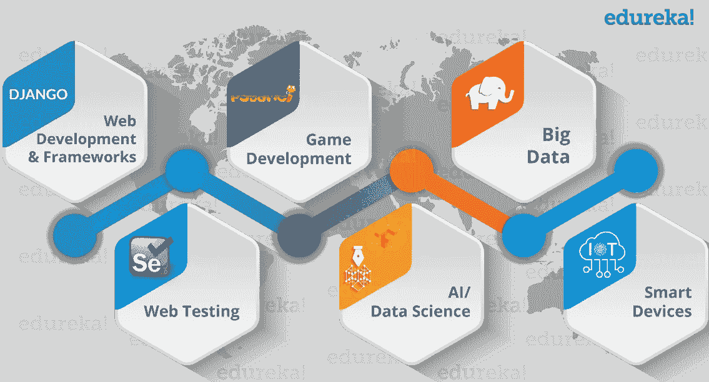
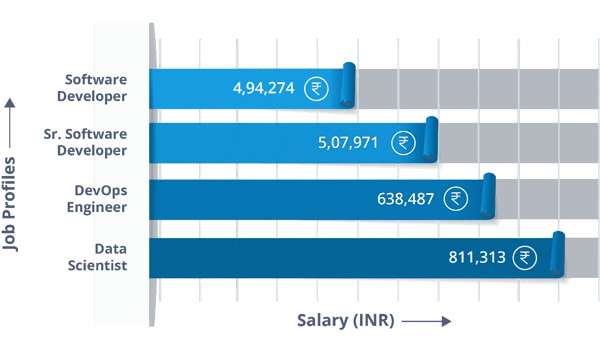
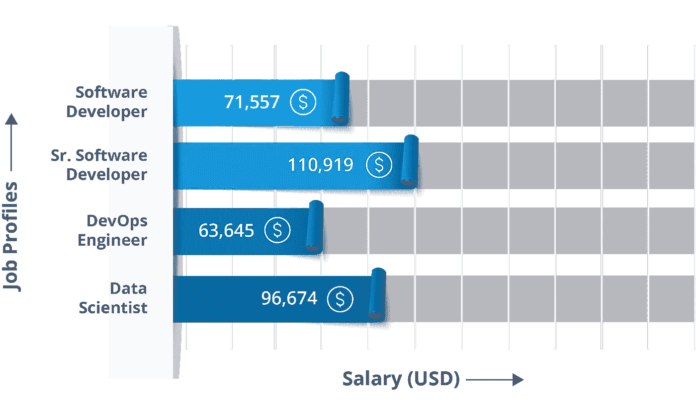
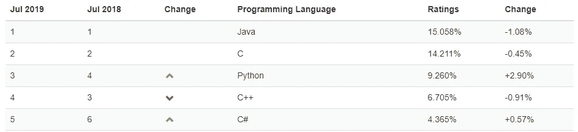

# Python 职业机会——Python 编程的职业指南

> 原文：<https://medium.com/edureka/python-career-opportunities-a2500ce158de?source=collection_archive---------0----------------------->

Python Career Opportunities — Edureka

在这个瞬息万变的世界里，Python 的流行似乎永远不会停止。 ***Python 认证*** 是整个编程领域最抢手的技能之一。但你有没有想过，这样做真的值得吗？如果是，它会带你去哪里？除了这些，还有一些其他的问题可能会困扰你。在这篇文章中，我将回答所有关于 **Python 职业机会**和**它带给你的成长**的问题。

Python 作为一种编程语言，学习起来既容易又简单。Python 以其简单易读的语法和易于编译的特性将开发时间缩短了一半。此外，它还有大量支持数据分析、操作和可视化的库。因此，它已经发展成为最受欢迎的语言，并被认为是专业人士的**、**和**、**。今天，我们将讨论 Python 程序员可以获得的各种 Python 职业机会。

# Python 职业机会

倾向于好奇和动手是可取的，因为 Python 要求我们弄脏自己的手，并喜欢摆弄系统的错误和其他问题。

一项独立的第三方调查发现，Python 编程语言目前是全球数据科学家最受欢迎的语言。IEEE 证实了这一说法，它通过流行度来跟踪编程语言。根据他们的说法，Python 是 2018 年最受欢迎的编程语言之一。不仅如此，Python 还在不同的领域找到了它的应用，如下图所示。

在印度和世界其他国家，令人担忧的技能差距正促使企业将目光投向来自成本更高的国家的人才。《印度时报》最近的一篇文章写道:“印度最大的软件公司之一正面临着严峻的形势”。它赢得了 2 亿澳元(卢比。120 亿美元)的合同，为一家大型美国银行开发应用商店，但没有足够数量的程序员可以用 Python(最适合这项工作的语言)编写代码。最终，它向美国的一群自由 Python 程序员支付了三倍的费用，并学到了一门以英国电视喜剧系列片 **Monty Python 命名的语言的重要性的宝贵一课！**

幸运的是，现在这种情况正在改变，开发人员意识到有必要将 Python 加入他们的简历，这既是为了更快的编程，也是为了有利可图的全球职业生涯。

# Python 工作简介

*   软件工程师
*   Python 开发者
*   研究分析师
*   数据分析师
*   数据科学家
*   软件开发人员

# Python 工资

到 2017 年底，Python 交付了一些令人印象深刻的数字。最近的一项 Indeed.com 调查也显示，在美国至少有 68，196 个 Python 职位，薪水数字呈指数增长。

根据 Payscale.com 的说法，下面是描绘**和 [**美国**](https://www.payscale.com/research/US/Skill=Python/Salary) 的 Python 平均工资的图表。**

****

****Job Profiles IND — Python Career — Edureka****

****

****Job Profiles US— Python Career — Edureka****

# ****Python 编程的普及****

**Python 编程的受欢迎程度正在稳步上升，Python 的就业机会也是如此。**

**根据跟踪编程语言流行程度的 [TIOBE](https://www.tiobe.com/tiobe-index/) 编程社区指数，Python 仅在去年一年就跃升一位，在该指数中**排名** **第三**！**

****

**令人印象深刻的是，世界上有 41 个大型组织在很短的时间内采用 Python 作为他们的主要编程语言。一些大玩家，如 Quora、脸书、YouTube、SlideShare、Dropbox、Pinterest、Reddit 和网飞，他们的大部分新代码都是用 Python 编写的。在开发者的世界里，这是一个公开的秘密:Google 已经采用 Python 作为它的二级编码语言，并承诺在它的新产品中更多地使用它。**

**如果你想查看更多关于人工智能、DevOps、道德黑客等市场最热门技术的文章，那么你可以参考 [Edureka 的官方网站。](https://www.edureka.co/blog/?utm_source=medium&utm_medium=content-link&utm_campaign=python-career-opportunities-your-guide-to-a-career-in-python-programming)**

**请留意本系列中的其他文章，它们将解释 Python 和数据科学的各个方面。**

> **1. [Python 教程](/edureka/python-tutorial-be1b3d015745)**
> 
> **2. [Python 编程语言](/edureka/python-programming-language-fc1015de7a6f)**
> 
> **3. [Python 函数](/edureka/python-functions-f0cabca8c4a)**
> 
> **4.[Python 中的文件处理](/edureka/file-handling-in-python-e0a6ff96ede9)**
> 
> **5. [Python Numpy 教程](/edureka/python-numpy-tutorial-89fb8b642c7d)**
> 
> **6. [Scikit 学习机器学习](/edureka/scikit-learn-machine-learning-7a2d92e4dd07)**
> 
> **7. [Python 熊猫教程](/edureka/python-pandas-tutorial-c5055c61d12e)**
> 
> **8. [Matplotlib 教程](/edureka/python-matplotlib-tutorial-15d148a7bfee)**
> 
> **9. [Tkinter 教程](/edureka/tkinter-tutorial-f655d3f4c818)**
> 
> **10.[请求教程](/edureka/python-requests-tutorial-30edabfa6a1c)**
> 
> **11. [PyGame 教程](/edureka/pygame-tutorial-9874f7e5c0b4)**
> 
> **12. [OpenCV 教程](/edureka/python-opencv-tutorial-5549bd4940e3)**
> 
> **13.[用 Python 进行网页抓取](/edureka/web-scraping-with-python-d9e6506007bf)**
> 
> **14. [PyCharm 教程](/edureka/pycharm-tutorial-d0ec9ce6fb60)**
> 
> **15.[机器学习教程](/edureka/machine-learning-tutorial-f2883412fba1)**
> 
> **16.[Python 中从头开始的线性回归算法](/edureka/linear-regression-in-python-e66f869cb6ce)**
> 
> **17.[面向数据科学的 Python](/edureka/learn-python-for-data-science-1f9f407943d3)**
> 
> **18.[Python 中的循环](/edureka/loops-in-python-fc5b42e2f313)**
> 
> **19. [Python 正则表达式](/edureka/python-regex-regular-expression-tutorial-f2d17ffcf17e)**
> 
> **20. [Python 项目](/edureka/python-projects-1f401a555ca0)**
> 
> **21.[机器学习项目](/edureka/machine-learning-projects-cb0130d0606f)**
> 
> **22.[Python 中的数组](/edureka/arrays-in-python-14aecabec16e)**
> 
> **23.[在 Python 中设置](/edureka/sets-in-python-a16b410becf4)**
> 
> **24.[Python 中的多线程](/edureka/what-is-mutithreading-19b6349dde0f)**
> 
> **25. [Python 面试问题](/edureka/python-interview-questions-a22257bc309f)**
> 
> **26. [Java vs Python](/edureka/java-vs-python-31d7433ed9d)**
> 
> **27.[如何成为一名 Python 开发者？](/edureka/how-to-become-a-python-developer-462a0093f246)**
> 
> **28. [Python Lambda 函数](/edureka/python-lambda-b84d68d449a0)**
> 
> **29.[网飞如何使用 Python？](/edureka/how-netflix-uses-python-1e4deb2f8ca5)**
> 
> **30.[Python 中的套接字编程是什么](/edureka/socket-programming-python-bbac2d423bf9)**
> 
> **31. [Python 数据库连接](/edureka/python-database-connection-b4f9b301947c)**
> 
> **32. [Golang vs Python](/edureka/golang-vs-python-5ac32e1ef2)**
> 
> **33. [Python Seaborn 教程](/edureka/python-seaborn-tutorial-646fdddff322)**

***原载于 2016 年 2 月 8 日*[*【https://www.edureka.co】*](https://www.edureka.co/blog/python-career-opportunities-your-guide-to-a-career-in-python-programming)*。***