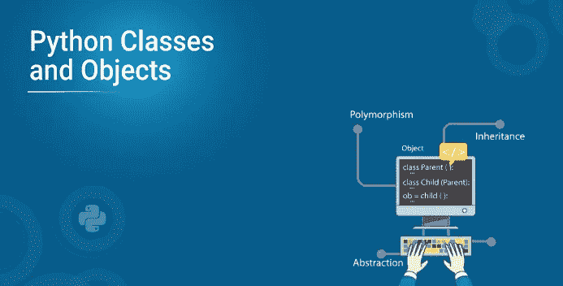
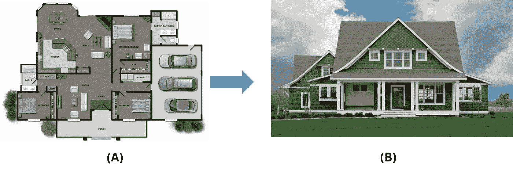
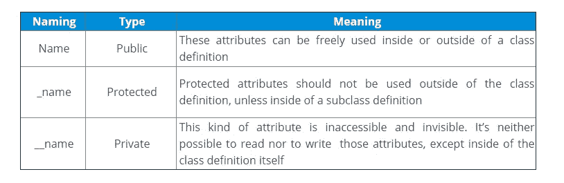
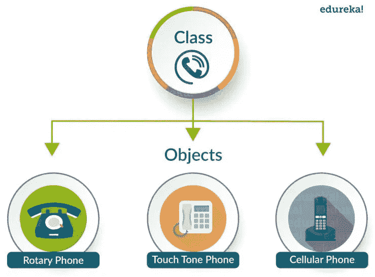
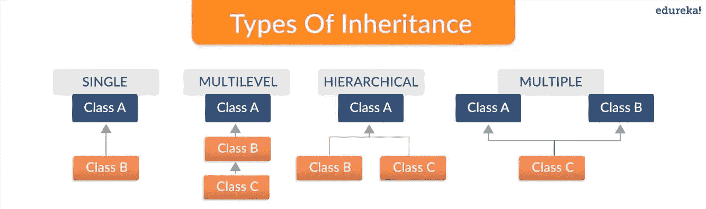

# Python 类和对象——面向对象编程

> 原文：<https://medium.com/edureka/python-classes-cfcde3df3988?source=collection_archive---------0----------------------->



在 Stack Overflow 预测到 2019 年，Python 将在活跃开发者方面超过其他语言之后，对认证 Python 开发者的需求只增不减。Python 遵循面向对象的编程范式。它处理声明 python 类，从它们创建对象，以及与用户交互。在面向对象的语言中，程序被分解成自包含的对象，或者你可以说分解成几个小程序。每个对象代表应用程序的不同部分，它们之间可以相互通信。在这个 python 类博客中，你将按以下顺序理解类和对象的各个方面:

1.什么是 Python 类？

2.类中的方法和属性

3.什么是对象？

4.哎呀概念:

*   遗产
*   多态性
*   抽象

让我们开始吧。:-)

python 中的类是创建特定对象的蓝图。它让你以一种特殊的方式构建你的软件。这就出现了一个问题如何？类允许我们以一种易于重用的方式对数据和函数进行逻辑分组，如果需要的话，还可以在此基础上进行构建。考虑下图。



在第一个图像(A)中，它代表了一个可以被认为是**级**的房子的蓝图。使用相同的蓝图，我们可以创建几个房子，这些可以被视为**对象**。使用一个类，你可以给你的程序增加一致性，这样它们就能以一种更干净有效的方式被使用。属性是通过点符号访问的数据成员(类变量和实例变量)和方法。

*   **类变量**是由一个类的所有不同对象/实例共享的变量。
*   **实例变量**是每个实例独有的变量。它是在方法内部定义的，只属于类的当前实例。
*   **方法**也被称为函数，在类中定义，描述对象的行为。

现在，让我们继续，看看它在 PyCharm 中是如何工作的。首先，看一下 python 类的语法。

```
class Class_name:
statement-1
. 
. 
statement-N
```

这里，“*class”*语句创建了一个新的类定义。在 python 中，类名紧跟在关键字" *class"* 之后，后面跟一个冒号。要在 python 中创建一个类，请考虑以下示例:

```
**class** employee:
**pass** #no attributes and methods
emp_1**=**employee()
emp_2**=**employee()
#instance variable can be created manually
emp_1.first**=**'aayushi'
emp_1.last**=**'Johari'
emp_1.email**=**'aayushi@edureka.co'
emp_1.pay**=**10000emp_2.first**=**'test'
emp_2.last**=**'abc'
emp_2.email**=**'test@company.com'
emp_2.pay**=**10000
print(emp_1.email)
print(emp_2.email)
```

**输出**--

```
aayushi@edureka.co
test@company.com
```

现在，如果我们不想手动设置这些变量。你会看到很多代码，而且很容易出错。所以为了使它自动化，我们可以使用“init”方法。为此，让我们理解 python 类中的方法和属性到底是什么。

# Python 类中的方法和属性

现在创建一个没有某些功能的类是不完整的。因此，可以通过设置各种属性来定义功能，这些属性充当与这些属性相关的数据和功能的容器。python 中的函数也被称为**方法**。说到 ***init*** *方法*，它是一个特殊的函数，每当实例化该类的一个新对象时都会被调用。你可以把它看作一个初始化方法，或者如果你来自任何其他面向对象的编程背景，比如 C++、Java 等，你可以把它看作构造函数。现在，当我们在一个类中设置一个方法时，它们会自动接收实例。让我们继续使用 python 类，并使用该方法接受名字、姓氏和薪水。

```
**class** employee:
**def** __init__(self, first, last, sal):
self.fname**=**first
self.lname**=**last
self.sal**=**sal
self.email**=**first **+** '.' **+** last **+** '@company.com'emp_1**=**employee('aayushi','johari',350000)
emp_2**=**employee('test','test',100000)
print(emp_1.email)
print(emp_2.email)
```

现在，在我们的“init”方法中，我们已经设置了这些实例变量(self，first，last，sal)。Self 是一个实例，这意味着每当我们编写 self.fname=first 时，它与 emp_1.first='aayushi '相同。然后，我们创建了 employee 类的实例，可以在其中传递 init 方法中指定的值。此方法将实例作为参数。不是手动做，现在会自动**做**。

接下来，我们希望能够执行某种动作。为此，我们将在这个类中添加一个**方法**。假设我希望该功能显示雇员的全名。因此，让我们实施这一做法。

```
**class** employee:
**def** __init__(self, first, last, sal):
self.fname**=**first
self.lname**=**last
self.sal**=**sal
self.email**=**first **+** '.' **+** last **+** '@company.com'**def** fullname(self):
**return** '{}{}'.format(self.fname,self.lname)
emp_1**=**employee('aayushi','johari',350000)
emp_2**=**employee('test','test',100000)
print(emp_1.email)
print(emp_2.email)
print(emp_1.fullname())
print(emp_2.fullname())
```

输出–

```
aayushi.johari@company.com
 test.test@company.com
 aayushijohari
 testtest
```

正如你在上面看到的，我在一个类中创建了一个名为“全名”的方法。因此 python 类中的每个方法都自动将实例作为第一个参数。现在，在这个方法中，我已经编写了逻辑来打印全名并返回它，而不是 emp_1 的名字和姓氏。接下来，我使用了“self ”,这样它就可以和所有的实例一起工作了。因此，为了每次都打印这个，我们使用一个**方法**。

继续讨论 Python 类，有一些变量在一个类的所有实例之间共享。这些被称为**类变量**。对于每个实例，实例变量可以是唯一的，如名称、电子邮件、sal 等。复杂？我们用一个例子来理解这个。参考下面的代码，找出每年的工资增长。

```
**class** employee:
perc_raise **=**1.05
**def** __init__(self, first, last, sal):
self.fname**=**first
self.lname**=**last
self.sal**=**sal
self.email**=**first **+** '.' **+** last **+** '@company.com'
**def** fullname(self):
**return** '{}{}'.format(self.fname,self.lname)
**def** apply_raise(self):
self.sal**=**int(self.sal*****1.05)
emp_1**=**employee('aayushi','johari',350000)
emp_2**=**employee('test','test',100000)
print(emp_1.sal)
emp_1.apply_raise()
print(emp_1.sal)
```

输出–

```
350000
 367500
```

正如你在上面看到的，我已经先打印了工资，然后应用了 1.5%的增长。为了访问这些类变量，我们需要通过类或类的实例来访问它们。现在，让我们理解 python 类中的各种属性。

# Python 类中的属性

Python 中的 Attributes 定义了对象、元素或文件的属性。有两种类型的属性:

*   **内置类属性:**Python 类中有各种内置属性。比如 _dict_、_doc_、_name _ 等。让我举一个同样的例子，我想查看 employee1 的所有键值对。为此，您可以简单地编写以下包含类命名空间的语句:

**打印(emp_1。__dict__)**

*   执行之后，您将得到如下输出:{'fname': 'aayushi '，' lname': 'johari '，' sal': 350000，' email ':' aayushi . johari @ company . com ' }
*   **用户定义的属性**:属性是在类定义里面创建的。我们可以动态地为一个类的现有实例创建新的属性。属性也可以绑定到类名。

接下来，我们有 **public、protected、**和 **private** 属性。我们来详细了解一下:



接下来，让我们了解 python 类中最重要的组件，即对象。

# Python 类中的对象是什么？

正如我们上面讨论的，一个对象可以用来访问不同的属性。它用于创建类的实例。实例是在运行时创建的类的对象。



给你一个快速的概述，一个物体基本上就是你周围看到的一切。狗是动物类的客体，我是人类类的客体。同样，同一个 phone 类可以有不同的对象。这非常类似于我们已经讨论过的函数调用。让我们用一个例子来理解这一点:

```
**class** MyClass:
**def** func(self):
print('Hello')# create a new MyClass
ob **=** MyClass()
ob.func()
```

继续学习 python 类，让我们理解各种 OOPs 概念。

# 哎呀概念

OOPs 指的是 Python 中的面向对象编程。Python 不是完全面向对象的，因为它包含一些过程函数。现在，您一定想知道过程式编程和面向对象编程之间的区别。为了澄清你的疑问，在过程化编程中，整个代码被写成一个长过程，即使它可能包含函数和子例程。这是不可管理的，因为数据和逻辑混杂在一起。但是当我们谈论面向对象编程时，程序被分割成自包含的对象或几个迷你程序。每个对象代表应用程序的不同部分，它们有自己的数据和逻辑来相互通信。例如，一个网站有不同的对象，如图像、视频等。
面向对象编程包括 Python 类、对象、继承、多态、抽象等概念。下面我们来详细了解一下这些话题。

## Python 类:继承

继承允许我们从基类/父类继承属性和方法。这很有用，因为我们可以创建子类并从父类获得所有功能。然后，我们可以在不影响父类的情况下覆盖和添加新功能。我们用一个例子来理解一下父类和子类的概念。

1.父类(超类或基类)

2.子类(子类或派生类)

继承属性的类被称为**子**类，而属性被继承的类被称为**父**类。

继承指的是创建包含其父类专门化的**子类**的能力。它又分为四种类型，即单级、多级、多级和多级继承。请参考下图，以便更好地理解。



让我们继续学习 python 类，并理解继承是如何有用的。

比方说，我想为雇员类型创建类。我将创建“开发人员”和“经理”作为子类，因为开发人员和经理都有姓名、电子邮件和工资，所有这些功能都将存在于雇员类中。因此，我们可以简单地通过继承 employee 来重用代码，而不是复制子类的代码。

```
**class** employee:num_employee**=**0raise_amount**=**1.04**def** __init__(self, first, last, sal):self.first**=**firstself.last**=**lastself.sal**=**salself.email**=**first **+** '.' **+** last **+** '@company.com'employee.num_employee**+=**1**def** fullname (self):**return** '{} {}'.format(self.first, self.last)**def** apply_raise (self):self.sal**=**int(self.sal ***** raise_amount)**class** developer(employee):**pass**emp_1**=**developer('aayushi', 'johari', 1000000)print(emp_1.email)**Output** - aayushi.johari@company.com
```

正如您在上面的输出中所看到的，employee 类的所有细节都可以在 developer 类中找到。现在如果我想把一个开发者的 raise_amount 改成 10%呢？让我们看看实际上是如何做到的。

```
**class** employee:num_employee**=**0raise_amount**=**1.04**def** __init__(self, first, last, sal):self.first**=**firstself.last**=**lastself.sal**=**salself.email**=**first **+** '.' **+** last **+** '@company.com'employee.num_employee**+=**1**def** fullname (self):**return** '{} {}'.format(self.first, self.last)**def** apply_raise (self):self.sal**=**int(self.sal***** raise_amount)**class** developer(employee):raise_amount **=** 1.10emp_1**=**developer('aayushi', 'johari', 1000000)print(emp_1.raise_amount)
```

正如您所看到的，它已经将工资增长百分比从 4%更新为 10%。现在，如果我想再添加一个属性，比如说在我们的 init 方法中添加一种编程语言，但它不存在于我们的父类中。对此有什么解决办法吗？是啊！我们可以复制整个雇员逻辑并这样做，但这将再次增加代码的大小。为了避免这种情况，让我们考虑下面的代码:

```
**class** employee:num_employee**=**0raise_amount**=**1.04**def** __init__(self, first, last, sal):self.first**=**firstself.last**=**lastself.sal**=**salself.email**=**first **+** '.' **+** last **+** '@company.com'employee.num_employee**+=**1**def** fullname (self):**return** '{} {}'.format(self.first, self.last)**def** apply_raise (self):self.sal**=**int(self.sal***** raise_amount)**class** developer(employee):raise_amount **=** 1.10**def** __init__(self, first, last, sal, prog_lang):super().__init__(first, last, sal)self.prog_lang**=**prog_langemp_1**=**developer('aayushi', 'johari', 1000000, 'python')print(emp_1.prog_lang)
```

因此，只需一点点代码，我就做出了改变。我用过 super。__init__(first，last，pay)，它从基类继承属性。总之，继承用于重用代码并降低程序的复杂性。

# Python 类:多态性

计算机科学中的多态性是指为不同的底层形式提供相同接口的能力。实际上，多态性意味着如果 B 类继承了 A 类，它不必继承 A 类的所有东西，它可以做一些 A 类不同的事情。它在处理继承时最常用。Python 是隐式多态的，它有能力重载标准操作符，这样它们就可以根据上下文有适当的行为。

让我们用一个例子来理解:

```
**class** Animal:**def** __init__(self,name):self.name**=**name**def** talk(self):**pass****class** Dog(Animal):**def** talk(self):print('Woof')**class** Cat(Animal):**def** talk(self):print('MEOW!')c**=** Cat('kitty')c.talk()d**=**Dog(Animal)d.talk()
```

输出–

```
Meow!
Woof
```

接下来，让我们转向另一个面向对象的编程概念，即抽象。

# Python 类:抽象

抽象是用来通过建模适合问题的类来简化复杂的现实。这里，我们有一个不能被实例化的抽象类。这意味着您不能为这些类创建对象或实例。它只能用于继承你称为基类的某些功能。因此，您可以继承功能，但同时，您不能创建这个特定类的实例。下面用一个例子来理解抽象类的概念:

```
**from** abc **import** ABC, abstractmethod**class** Employee(ABC):@abstractmethod**def** calculate_salary(self,sal):**pass****class** Developer(Employee):**def** calculate_salary(self,sal):finalsalary**=** sal*****1.10**return**  finalsalaryemp_1 **=** Developer()print(emp_1.calculate_salary(10000))
```

输出–

```
11000.0
```

正如您在上面的输出中看到的，我们将基本工资提高了 10%，即现在的工资是 11000。现在，如果你真的继续创建一个“Employee”类的对象，它会抛出一个错误，因为 python 不允许你创建一个抽象类的对象。但是使用继承，您实际上可以继承属性并执行各自的任务。

所以，伙计们，简而言之，这都是关于 python 类和对象的。我们已经介绍了 python 类、对象和 Python 中各种面向对象概念的所有基础知识，所以您现在可以开始练习了。我希望你们喜欢阅读这篇关于“Python 类”的博客，并且清楚我上面讨论的每一个方面。在 python 课程之后，我会为 sci-kit 学习库和数组写更多关于 Python 的博客。敬请期待！

如果你想查看更多关于人工智能、DevOps、道德黑客等市场最热门技术的文章，你可以参考 Edureka 的官方网站。

请留意本系列中的其他文章，它们将解释 Python 和数据科学的各个方面。

> *1。*[*Python 中的机器学习分类器*](/edureka/machine-learning-classifier-c02fbd8400c9)
> 
> *2。*[*Python Scikit-Learn Cheat Sheet*](/edureka/python-scikit-learn-cheat-sheet-9786382be9f5)
> 
> *3。* [*机器学习工具*](/edureka/python-libraries-for-data-science-and-machine-learning-1c502744f277)
> 
> *4。* [*用于数据科学和机器学习的 Python 库*](/edureka/python-libraries-for-data-science-and-machine-learning-1c502744f277)
> 
> *5。*[*Python 中的聊天机器人*](/edureka/how-to-make-a-chatbot-in-python-b68fd390b219)
> 
> *6。* [*Python 集合*](/edureka/collections-in-python-d0bc0ed8d938)
> 
> *7。* [*Python 模块*](/edureka/python-modules-abb0145a5963)
> 
> *8。* [*Python 开发者技能*](/edureka/python-developer-skills-371583a69be1)
> 
> *9。* [*哎呀面试问答*](/edureka/oops-interview-questions-621fc922cdf4)
> 
> *10。* [*一个 Python 开发者的简历*](/edureka/python-developer-resume-ded7799b4389)
> 
> *11。*[*Python 中的探索性数据分析*](/edureka/exploratory-data-analysis-in-python-3ee69362a46e)
> 
> 12。 [*蛇与蟒蛇的游戏*](/edureka/python-turtle-module-361816449390)
> 
> *13。* [*Python 开发者工资*](/edureka/python-developer-salary-ba2eff6a502e)
> 
> *14。* [*主成分分析*](/edureka/principal-component-analysis-69d7a4babc96)
> 
> *15。*[*Python vs c++*](/edureka/python-vs-cpp-c3ffbea01eec)
> 
> *16。* [*刺儿头教程*](/edureka/scrapy-tutorial-5584517658fb)
> 
> *17。*[*Python SciPy*](/edureka/scipy-tutorial-38723361ba4b)
> 
> *18。* [*最小二乘回归法*](/edureka/least-square-regression-40b59cca8ea7)
> 
> *19。* [*Jupyter 笔记本小抄*](/edureka/jupyter-notebook-cheat-sheet-88f60d1aca7)
> 
> *20。* [*Python 基础知识*](/edureka/python-basics-f371d7fc0054)
> 
> *21。* [*Python 模式程序*](/edureka/python-pattern-programs-75e1e764a42f)
> 
> *22。* [*用 Python 进行网页抓取*](/edureka/web-scraping-with-python-d9e6506007bf)
> 
> *23。* [*Python 装饰器*](/edureka/python-decorator-tutorial-bf7b21278564)
> 
> *24。*[*Python Spyder IDE*](/edureka/spyder-ide-2a91caac4e46)
> 
> *25。*[*Python 中使用 Kivy 的移动应用*](/edureka/kivy-tutorial-9a0f02fe53f5)
> 
> *26。* [*十大最佳学习书籍&练习 Python*](/edureka/best-books-for-python-11137561beb7)
> 
> *27。* [*机器人框架与 Python*](/edureka/robot-framework-tutorial-f8a75ab23cfd)
> 
> 28。[*Python 中的贪吃蛇游戏*](/edureka/snake-game-with-pygame-497f1683eeaa)
> 
> *29。* [*Django 面试问答*](/edureka/django-interview-questions-a4df7bfeb7e8)
> 
> 30。 [*十大 Python 应用*](/edureka/python-applications-18b780d64f3b)
> 
> 31。[*Python 中的哈希表和哈希表*](/edureka/hash-tables-and-hashmaps-in-python-3bd7fc1b00b4)
> 
> *32。*[*Python 3.8*](/edureka/whats-new-python-3-8-7d52cda747b)
> 
> 33。 [*支持向量机*](/edureka/support-vector-machine-in-python-539dca55c26a)
> 
> *34。* [*Python 教程*](/edureka/python-tutorial-be1b3d015745)

*原载于 2017 年 12 月 26 日*[*https://www.edureka.co*](https://www.edureka.co/blog/python-class/)*。*